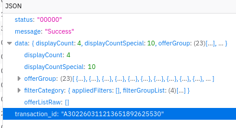

Goals : make a api and ui on page telkomsel-client

hit api url : curl 'https://tdw.telkomsel.com/api/offers/filtered-offers/v7' \

and payload : 
  --data-raw '{"html":false,"isGrouping":true,"filteredby":"boid|ML2_BP_11","isPrepaid":true,"groupByFlashDeals":true,"offersversion":"WEB-V7"}'

dan response nya :
{"status":"00000","message":"Success","data":{"displayCount":4,"displayCountSpecial":10,"offerGroup":[{"name":"SERU Ramadhan","order":1,"offer":[{"id":"3a70b5ea8c715654c0634c16c0d97fcc","name":"Seru Mudik","shortdesc":"PREPAID","longdesc":"<ul><li>Bebas Biaya berlangganan Vidio Gold 7 Hari.</li><li>Bebas Biaya berlangganan Muslim Pro 7 Hari.</li></ul>","terms":"<ol><li>Harga sudah termasuk PPN.</li><li>Pembelian paket dapat dilakukan sebanyak 5x.</li><li>Pembelian hanya dapat dilakukan selama periode program.</li><li>Pastikan pembelian paket berhasil dengan menerima SMS notifikasi pembelian berhasil.</li><li>Syarat dan ketentuan promo ini merupakan ketentuan dari Telkomsel dan dapat berubah sewaktu-waktu untuk disesuaikan dengan kebijakan sehubungan dengan promo ini.</li><li>Untuk informasi lebih lanjut dapat menghubungi Call Center: 188.</li></ol>","highlight":"data","businessproduct":"Seru Mudik","businessproductid":"2f3a8ea6f0e9292e02cfff5dd1e5e96e","price":"50000","fee":"","product_type":"","productlength":"7 Days","offerpriority":"5055","featuredproduct":"","autorenewal":"purchase","campaignoffer":"false","category":"Internet","subcategory":"SERU Ramadhan","subcategorydesc":"SERU Ramadhan","provisioningsystem":"TC","originalprice":"","tcashspecialflag":"false","promotionalflag":"","relevantroamingcountry":"","reservation_keyword":"00131366","adn_mt":"3636","eligible_payment_methods":["BLU_DD","TSEL_POIN","INDOMARET","BNI_DD","BCA_DD","DOKU_WALLET","XENDIT_WALLET","RSEMONEY","BNI_VA","DKI_VA","XENDIT_INVOICES","MCP_VA","FINNET_CC","QRIS","GOPAY","BALANCE","TSEL_WALLET","SHOPEEPAY","OMNICHANNEL","INDODANA","MUAMALAT_VA","BRI_DD","BCA_VA","OVO","LINKAJA_QRIS","MUAMALAT_DD","BLU","AKULAKU","ALFAMART","RSSTOCK","QRIS_LA","FINNET_WALLET","MANDIRI_DD","QRIS_SP","JENIUS","LINKAJA_APP","BSI_VA","LINKAJA_WCO","DIGIPOS","BTN_VA","CREDIT_CARD","DANA","TSEL_PAYLATER","ALLO","KREDIVO","VIRTUAL_ACCOUNT","BRI_VA","FINNET_VA","MCP_CC"],"productfamily":{"id":"Data","name":"Data","shortdesc":"Data","longdesc":"Data"},"bonus":[{"name":"Muslim Pro","shortdesc":"","longdesc":"","validity":"1 Days","consumptiontime":"","quota":"7 day","subclass":"music muslimpro","highlight":"true","viral":"false","class":"other"},{"name":"Vidio Gold","shortdesc":"","longdesc":"","validity":"1 Days","consumptiontime":"","quota":"7 day","subclass":"video vidio gold hb","highlight":"true","viral":"false","class":"other"},{"name":"Internet","shortdesc":"","longdesc":"","validity":"7 Days","consumptiontime":"","quota":"20 GB","subclass":"data allnet","highlight":"true","viral":"false","class":"data"}],"prices":[{"amount":"50000","paymentmethod":"AIRTIME","pricedescription":"","pricecommercialname":"50rb","fee_amount":"0"}],"offer_end_date":"2026-03-29T00:00:00+07:00","highlighted_payment_method":"BALANCE","price_commercial_name":"50rb","mapping_rule_commercial_name":"20GB/7hr","taxonomy":{"id":"ML4_BP_116405","menu":[{"id":"ML3_BP_1152"}]},"_id":"00131366","shareUrl":"","addOnState":{"checked":false},"isLoan":false,"isRoaming":false,"highlightvalue":"20 GB","activationText":"payment.package_button_activate_purchase","isSubscribe":false,"toBeSubscribedTo":false,"attributeOffer":{"backgroundImage":"https://tdwcontent.telkomsel.com/s3fs-public/images/cards/large/offer_card_default_1.jpeg","colorBadge":"#EFEFFF","daysLeft":0,"text":"new_dashboard_for_you_best_deal_text","badge":[{"colorBadge":"#ED0226","colorBadge2":"#FF5722","text":"new_dashboard_for_you_best_deal_text","icon":"new_dashboard_for_you_best_deal_image"}],"icon":"new_dashboard_for_you_best_deal_image"},"highlightedList":[{"text":"20 GB Utama","backgroundColorCard":"#EFF1F4","backgroundColorDetail":"#FAFAFB"},{"text":"Muslim Pro 7 day","backgroundColorCard":"#EFF1F4","backgroundColorDetail":"#FAFAFB"},{"text":"Vidio Gold 7 day","backgroundColorCard":"#EFF1F4","backgroundColorDetail":"#FAFAFB"}],"specialRewardsDesc":"","offerEndDate":-1,"generalTag":[]},{"id":"172c80adf4fc54e849f45f1d0f173e87","name":"HOT PROMO","shortdesc":"PREPAID","longdesc":"<ol><li>Hot Promo dapat digunakan di seluruh jaringan 2G/3G/4G/5G Telkomsel sesuai masa aktif paket.</li><li>Hot Promo terdiri dari kuota utama dan kuota lokal yang dapat digunakan selama 24 jam.</li></ol>","terms":"<ol><li>Paket hanya berlaku untuk pemakaian dalam negeri (tidak berlaku untuk pemakaian luar negeri).</li><li>Jumlah kuota yang didapatkan menyesuaikan lokasi tempat pelanggan membeli paket.</li><li>Setelah melewati kuota yang disediakan, pelanggan akan dikenakan tarif normal.</li><li>Kuota paket tidak akan terakumulasi.</li><li>Harga paket sewaktu-waktu dapat berubah sesuai dengan kebijakan yang ditetapkan oleh Telkomsel.</li><li>Harga sudah termasuk PPN.</li><li>Pastikan pembelian paket berhasil dengan menerima SMS notifikasi pembelian paket berhasil. Untuk cek sisa kuota dapat melalui *888# atau *363# (menu cek kuota) dan di Aplikasi MyTelkomsel.</li></ol>","highlight":"data","businessproduct":"HOT PROMO","businessproductid":"236b14c186f86fd4c3cd73bd5689ed1d","price":"70000","fee":"","product_type":"","productlength":"28 Days","offerpriority":"5061","featuredproduct":"","autorenewal":"purchase","campaignoffer":"false","category":"Internet","subcategory":"SERU Ramadhan","subcategorydesc":"SERU Ramadhan","provisioningsystem":"TC","originalprice":"","tcashspecialflag":"false","promotionalflag":"Best Deal","relevantroamingcountry":"","reservation_keyword":"00084606","adn_mt":"3636","eligible_payment_methods":["BLU_DD","TSEL_POIN","INDOMARET","BNI_DD","BCA_DD","DOKU_WALLET","XENDIT_WALLET","RSEMONEY","BNI_VA","DKI_VA","XENDIT_INVOICES","MCP_VA","FINNET_CC","QRIS","GOPAY","BALANCE","TSEL_WALLET","SHOPEEPAY","OMNICHANNEL","INDODANA","MUAMALAT_VA","BRI_DD","BCA_VA","OVO","LINKAJA_QRIS","MUAMALAT_DD","BLU","AKULAKU","ALFAMART","RSSTOCK","URP","QRIS_LA","FINNET_WALLET","MANDIRI_DD","QRIS_SP","JENIUS","LINKAJA_APP","BSI_VA","LINKAJA_WCO","DIGIPOS","BTN_VA","CREDIT_CARD","DANA","TSEL_PAYLATER","ALLO","KREDIVO","VIRTUAL_ACCOUNT","BRI_VA","FINNET_VA","MCP_CC"],"productfamily":{"id":"BOOSTER","name":"BOOSTER","shortdesc":"BOOSTER","longdesc":"BOOSTER"},"bonus":[{"name":"Voice All Operator","shortdesc":"","longdesc":"","validity":"28 Days","consumptiontime":"","quota":"300 minute","subclass":"voice allopr","highlight":"true","viral":"false","class":"voice"},{"name":"Prime Video Mobile","shortdesc":"","longdesc":"","validity":"30 Days","consumptiontime":"","quota":"30 day","subclass":"video amazon prime video mm","highlight":"true","viral":"false","class":"other"},{"name":"Internet","shortdesc":"","longdesc":"","validity":"28 Days","consumptiontime":"","quota":"23 GB","subclass":"data allnet","highlight":"true","viral":"false","class":"data"},{"name":"Vision+ Premium","shortdesc":"","longdesc":"","validity":"30 Days","consumptiontime":"","quota":"30 day","subclass":"video vision+ premium","highlight":"true","viral":"false","class":"other"},{"name":"WeTV","shortdesc":"","longdesc":"","validity":"30 Days","consumptiontime":"","quota":"30 day","subclass":"video wetv mm","highlight":"true","viral":"false","class":"other"}],"prices":[{"amount":"70000","paymentmethod":"AIRTIME","pricedescription":"","pricecommercialname":"70rb","fee_amount":"0"}],"offer_end_date":"2070-12-30T00:00:00+07:00","highlighted_payment_method":"BALANCE","price_commercial_name":"70rb","mapping_rule_commercial_name":"23GB/300mnt/28hr","taxonomy":{"id":"ML4_BP_116421","menu":[{"id":"ML3_BP_1152"}]},"_id":"00084606","shareUrl":"","addOnState":{"checked":false},"isLoan":false,"isRoaming":false,"highlightvalue":"23 GB","activationText":"payment.package_button_activate_purchase","isSubscribe":false,"toBeSubscribedTo":false,"attributeOffer":{"backgroundImage":"https://tdwcontent.telkomsel.com/s3fs-public/images/cards/large/offer_card_default_1.jpeg","colorBadge":"#EFEFFF","daysLeft":0,"text":"new_dashboard_for_you_best_deal_text","badge":[{"colorBadge":"#ED0226","colorBadge2":"#FF5722","text":"new_dashboard_for_you_best_deal_text","icon":"new_dashboard_for_you_best_deal_image"}],"icon":"new_dashboard_for_you_best_deal_image"},"highlightedList":[{"text":"23 GB Utama","backgroundColorCard":"#EFF1F4","backgroundColorDetail":"#FAFAFB"},{"text":"Voice All Operator","backgroundColorCard":"#EFF1F4","backgroundColorDetail":"#FAFAFB"},{"text":"Prime Video Mobile 30 day","backgroundColorCard":"#EFF1F4","backgroundColorDetail":"#FAFAFB"},{"text":"Vision+ Premium 30 day","backgroundColorCard":"#EFF1F4","backgroundColorDetail":"#FAFAFB"},{"text":"WeTV 30 day","backgroundColorCard":"#EFF1F4","backgroundColorDetail":"#FAFAFB"}],"specialRewardsDesc":"","offerEndDate":-1,"generalTag":[]},{"id":"4d866eba0b4861a3e53fc7f6d9f015dd","name":"HOT PROMO","shortdesc":"PREPAID","longdesc":"<ol><li>Hot Promo dapat digunakan di seluruh jaringan 2G/3G/4G/5G Telkomsel sesuai masa aktif paket.</li><li>Hot Promo terdiri dari kuota utama dan kuota lokal yang dapat digunakan selama 24 jam.</li></ol>","terms":"<ol><li>Paket hanya berlaku untuk pemakaian dalam negeri (tidak berlaku untuk pemakaian luar negeri).</li><li>Jumlah kuota yang didapatkan menyesuaikan lokasi tempat pelanggan membeli paket.</li><li>Setelah melewati kuota yang disediakan, pelanggan akan dikenakan tarif normal.</li><li>Kuota paket tidak akan terakumulasi.</li><li>Harga paket sewaktu-waktu dapat berubah sesuai dengan kebijakan yang ditetapkan oleh Telkomsel.</li><li>Harga sudah termasuk PPN.</li><li>Pastikan pembelian paket berhasil dengan menerima SMS notifikasi pembelian paket berhasil. Untuk cek sisa kuota dapat melalui *888# atau *363# (menu cek kuota) dan di Aplikasi MyTelkomsel.</li></ol>","highlight":"data","businessproduct":"HOT PROMO","businessproductid":"2a06b68b1da24161b34980457b6c61a1","price":"90000","fee":"","product_type":"","productlength":"28 Days","offerpriority":"5062","featuredproduct":"","autorenewal":"purchase","campaignoffer":"false","category":"Internet","subcategory":"SERU Ramadhan","subcategorydesc":"SERU Ramadhan","provisioningsystem":"TC","originalprice":"","tcashspecialflag":"false","promotionalflag":"Best Deal","relevantroamingcountry":"","reservation_keyword":"00084607","adn_mt":"3636","eligible_payment_methods":["BLU_DD","TSEL_POIN","INDOMARET","BNI_DD","BCA_DD","DOKU_WALLET","XENDIT_WALLET","RSEMONEY","BNI_VA","DKI_VA","XENDIT_INVOICES","MCP_VA","FINNET_CC","QRIS","GOPAY","BALANCE","TSEL_WALLET","SHOPEEPAY","OMNICHANNEL","INDODANA","MUAMALAT_VA","BRI_DD","BCA_VA","OVO","LINKAJA_QRIS","MUAMALAT_DD","BLU","AKULAKU","ALFAMART","RSSTOCK","URP","QRIS_LA","FINNET_WALLET","MANDIRI_DD","QRIS_SP","JENIUS","LINKAJA_APP","BSI_VA","LINKAJA_WCO","DIGIPOS","BTN_VA","CREDIT_CARD","DANA","TSEL_PAYLATER","ALLO","KREDIVO","VIRTUAL_ACCOUNT","BRI_VA","FINNET_VA","MCP_CC"],"productfamily":{"id":"BOOSTER","name":"BOOSTER","shortdesc":"BOOSTER","longdesc":"BOOSTER"},"bonus":[{"name":"Voice All Operator","shortdesc":"","longdesc":"","validity":"28 Days","consumptiontime":"","quota":"300 minute","subclass":"voice allopr","highlight":"true","viral":"false","class":"voice"},{"name":"Prime Video Mobile","shortdesc":"","longdesc":"","validity":"30 Days","consumptiontime":"","quota":"30 day","subclass":"video amazon prime video mm","highlight":"true","viral":"false","class":"other"},{"name":"Internet","shortdesc":"","longdesc":"","validity":"28 Days","consumptiontime":"","quota":"35 GB","subclass":"data allnet","highlight":"true","viral":"false","class":"data"},{"name":"Vision+ Premium","shortdesc":"","longdesc":"","validity":"30 Days","consumptiontime":"","quota":"30 day","subclass":"video vision+ premium","highlight":"true","viral":"false","class":"other"},{"name":"WeTV","shortdesc":"","longdesc":"","validity":"30 Days","consumptiontime":"","quota":"30 day","subclass":"video wetv mm","highlight":"true","viral":"false","class":"other"}],"prices":[{"amount":"90000","paymentmethod":"AIRTIME","pricedescription":"","pricecommercialname":"90rb","fee_amount":"0"}],"offer_end_date":"2070-12-30T00:00:00+07:00","highlighted_payment_method":"BALANCE","price_commercial_name":"90rb","mapping_rule_commercial_name":"35GB/300mnt/28hr","taxonomy":{"id":"ML4_BP_116422","menu":[{"id":"ML3_BP_1152"}]},"_id":"00084607","shareUrl":"","addOnState":{"checked":false},"isLoan":false,"isRoaming":false,"highlightvalue":"35 GB","activationText":"payment.package_button_activate_purchase","isSubscribe":false,"toBeSubscribedTo":false,"attributeOffer":{"backgroundImage":"https://tdwcontent.telkomsel.com/s3fs-public/images/cards/large/offer_card_default_1.jpeg","colorBadge":"#EFEFFF","daysLeft":0,"text":"new_dashboard_for_you_best_deal_text","badge":[{"colorBadge":"#ED0226","colorBadge2":"#FF5722","text":"new_dashboard_for_you_best_deal_text","icon":"new_dashboard_for_you_best_deal_image"}],"icon":"new_dashboard_for_you_best_deal_image"},"highlightedList":[{"text":"35 GB Utama","backgroundColorCard":"#EFF1F4","backgroundColorDetail":"#FAFAFB"},{"text":"Voice All Operator","backgroundColorCard":"#EFF1F4","backgroundColorDetail":"#FAFAFB"},{"text":"Prime Video Mobile 30 day","backgroundColorCard":"#EFF1F4","backgroundColorDetail":"#FAFAFB"},{"text":"Vision+ Premium 30 day","backgroundColorCard":"#EFF1F4","backgroundColorDetail":"#FAFAFB"},{"text":"WeTV 30 day","backgroundColorCard":"#EFF1F4","backgroundColorDetail":"#FAFAFB"}],"specialRewardsDesc":"","offerEndDate":-1,"generalTag":[]}],"isGroupDeal":true,"offerEndDate":-1,"isPaketDarurat":false,"id":"GENERAL-GROUP","subcategory":"","icon":"","image":"","background":"shop_new_revamp_recommended_inet_general_background","cta":"","colors":{"background1":"#ED0226","background2":"#FDA22B","text":"#B90024"}},{"name":"Hot Promo","order":2,"offer":[{"id":"e514c7cbc92e628bcd4fe3331389c0fd","name":"HOT PROMO","shortdesc":"PREPAID DATA","longdesc":"<ol><li>Hot Promo dapat digunakan di seluruh jaringan 2G/3G/4G/5G Telkomsel sesuai masa aktif paket.</li><li>Hot Promo terdiri dari kuota utama yang dapat digunakan selama 24 jam.</li></ol>","terms":"<ol><li>Paket hanya berlaku untuk pemakaian dalam negeri (tidak berlaku untuk pemakaian luar negeri).</li><li>Jumlah kuota yang didapatkan menyesuaikan lokasi tempat pelanggan membeli paket.</li><li>Setelah melewati kuota yang disediakan, pelanggan akan dikenakan tarif normal.</li><li>Kuota paket tidak akan terakumulasi.</li><li>Harga paket sewaktu-waktu dapat berubah sesuai dengan kebijakan yang ditetapkan oleh Telkomsel.</li><li>Harga sudah termasuk PPN.</li><li>Pastikan pembelian paket berhasil dengan menerima SMS notifikasi pembelian paket berhasil. Untuk cek sisa kuota dapat melalui *888# atau *363# (menu cek kuota) dan di Aplikasi MyTelkomsel.</li></ol>","highlight":"data","businessproduct":"HOT PROMO","businessproductid":"a615c7e8b4311139496dc5afdb2ba4cb","price":"50000","fee":"","product_type":"","productlength":"28 Days","offerpriority":"30091","featuredproduct":"","autorenewal":"purchase","campaignoffer":"false","category":"Internet","subcategory":"Hot Promo","subcategorydesc":"Hot Promo","provisioningsystem":"TC","originalprice":"","tcashspecialflag":"false","promotionalflag":"Best Deal","relevantroamingcountry":"","reservation_keyword":"00084605","adn_mt":"3636","eligible_payment_methods":["BLU_DD","TSEL_POIN","INDOMARET","BNI_DD","BCA_DD","DOKU_WALLET","XENDIT_WALLET","RSEMONEY","BNI_VA","DKI_VA","XENDIT_INVOICES","MCP_VA","FINNET_CC","QRIS","GOPAY","BALANCE","TSEL_WALLET","SHOPEEPAY","OMNICHANNEL","INDODANA","MUAMALAT_VA","BRI_DD","BCA_VA","OVO","LINKAJA_QRIS","MUAMALAT_DD","BLU","AKULAKU","ALFAMART","RSSTOCK","URP","QRIS_LA","FINNET_WALLET","MANDIRI_DD","QRIS_SP","JENIUS","LINKAJA_APP","BSI_VA","LINKAJA_WCO","DIGIPOS","BTN_VA","CREDIT_CARD","DANA","TSEL_PAYLATER","ALLO","KREDIVO","VIRTUAL_ACCOUNT","BRI_VA","FINNET_VA","MCP_CC"],"productfamily":{"id":"BOOSTER","name":"BOOSTER","shortdesc":"BOOSTER","longdesc":"BOOSTER"},"subset_product_menu":"ML2_TOPPING_91","bonus":[{"name":"Voice All Operator","shortdesc":"","longdesc":"","validity":"28 Days","consumptiontime":"","quota":"300 minute","subclass":"voice allopr","highlight":"true","viral":"false","class":"voice"},{"name":"Prime Video Mobile","shortdesc":"","longdesc":"","validity":"30 Days","consumptiontime":"","quota":"30 day","subclass":"video amazon prime video mm","highlight":"true","viral":"false","class":"other"},{"name":"Vision+ Premium","shortdesc":"","longdesc":"","validity":"30 Days","consumptiontime":"","quota":"30 day","subclass":"video vision+ premium","highlight":"true","viral":"false","class":"other"},{"name":"WeTV","shortdesc":"","longdesc":"","validity":"30 Days","consumptiontime":"","quota":"30 day","subclass":"video wetv mm","highlight":"true","viral":"false","class":"other"},{"name":"Internet","shortdesc":"","longdesc":"","validity":"28 Days","consumptiontime":"","quota":"13 GB","subclass":"data allnet","highlight":"true","viral":"false","class":"data"}],"prices":[{"amount":"50000","paymentmethod":"AIRTIME","pricedescription":"","pricecommercialname":"50rb","fee_amount":"0"}],"offer_end_date":"2070-12-31T00:00:00+07:00","highlighted_payment_method":"BALANCE","price_commercial_name":"50rb","mapping_rule_commercial_name":"13GB/300mnt/28hr","taxonomy":{"id":"ML4_BP_107117","menu":[{"id":"ML3_BP_1155"}]},"_id":"00084605","shareUrl":"","addOnState":{"checked":false},"isLoan":false,"isRoaming":false,"highlightvalue":"13 GB","activationText":"payment.package_button_activate_purchase","isSubscribe":false,"toBeSubscribedTo":false,"attributeOffer":{"backgroundImage":"https://tdwcontent.telkomsel.com/s3fs-public/images/cards/large/offer_card_default_1.jpeg","colorBadge":"#EFEFFF","daysLeft":0,"text":"new_dashboard_for_you_best_deal_text","badge":[{"colorBadge":"#ED0226","colorBadge2":"#FF5722","text":"new_dashboard_for_you_best_deal_text","icon":"new_dashboard_for_you_best_deal_image"}],"icon":"new_dashboard_for_you_best_deal_image"},"highlightedList":[{"text":"13 GB Utama","backgroundColorCard":"#EFF1F4","backgroundColorDetail":"#FAFAFB"},{"text":"Voice All Operator","backgroundColorCard":"#EFF1F4","backgroundColorDetail":"#FAFAFB"},{"text":"Prime Video Mobile 30 day","backgroundColorCard":"#EFF1F4","backgroundColorDetail":"#FAFAFB"},{"text":"Vision+ Premium 30 day","backgroundColorCard":"#EFF1F4","backgroundColorDetail":"#FAFAFB"},{"text":"WeTV 30 day","backgroundColorCard":"#EFF1F4","backgroundColorDetail":"#FAFAFB"}],"specialRewardsDesc":"","offerEndDate":-1,"generalTag":[]},{"id":"172c80adf4fc54e849f45f1d0f173e87","name":"HOT PROMO","shortdesc":"PREPAID DATA","longdesc":"<ol><li>Hot Promo dapat digunakan di seluruh jaringan 2G/3G/4G/5G Telkomsel sesuai masa aktif paket.</li><li>Hot Promo terdiri dari kuota utama yang dapat digunakan selama 24 jam.</li></ol>","terms":"<ol><li>Paket hanya berlaku untuk pemakaian dalam negeri (tidak berlaku untuk pemakaian luar negeri).</li><li>Jumlah kuota yang didapatkan menyesuaikan lokasi tempat pelanggan membeli paket.</li><li>Setelah melewati kuota yang disediakan, pelanggan akan dikenakan tarif normal.</li><li>Kuota paket tidak akan terakumulasi.</li><li>Harga paket sewaktu-waktu dapat berubah sesuai dengan kebijakan yang ditetapkan oleh Telkomsel.</li><li>Harga sudah termasuk PPN.</li><li>Pastikan pembelian paket berhasil dengan menerima SMS notifikasi pembelian paket berhasil. Untuk cek sisa kuota dapat melalui *888# atau *363# (menu cek kuota) dan di Aplikasi MyTelkomsel.</li></ol>","highlight":"data","businessproduct":"HOT PROMO","businessproductid":"89145b7660360876d68845721c671919","price":"70000","fee":"","product_type":"","productlength":"28 Days","offerpriority":"30092","featuredproduct":"","autorenewal":"purchase","campaignoffer":"false","category":"Internet","subcategory":"Hot Promo","subcategorydesc":"Hot Promo","provisioningsystem":"TC","originalprice":"","tcashspecialflag":"false","promotionalflag":"Best Deal","relevantroamingcountry":"","reservation_keyword":"00084606","adn_mt":"3636","eligible_payment_methods":["BLU_DD","TSEL_POIN","INDOMARET","BNI_DD","BCA_DD","DOKU_WALLET","XENDIT_WALLET","RSEMONEY","BNI_VA","DKI_VA","XENDIT_INVOICES","MCP_VA","FINNET_CC","QRIS","GOPAY","BALANCE","TSEL_WALLET","SHOPEEPAY","OMNICHANNEL","INDODANA","MUAMALAT_VA","BRI_DD","BCA_VA","OVO","LINKAJA_QRIS","MUAMALAT_DD","BLU","AKULAKU","ALFAMART","RSSTOCK","URP","QRIS_LA","FINNET_WALLET","MANDIRI_DD","QRIS_SP","JENIUS","LINKAJA_APP","BSI_VA","LINKAJA_WCO","DIGIPOS","BTN_VA","CREDIT_CARD","DANA","TSEL_PAYLATER","ALLO","KREDIVO","VIRTUAL_ACCOUNT","BRI_VA","FINNET_VA","MCP_CC"],"productfamily":{"id":"BOOSTER","name":"BOOSTER","shortdesc":"BOOSTER","longdesc":"BOOSTER"},"subset_product_menu":"ML2_TOPPING_94","bonus":[{"name":"Voice All Operator","shortdesc":"","longdesc":"","validity":"28 Days","consumptiontime":"","quota":"300 minute","subclass":"voice allopr","highlight":"true","viral":"false","class":"voice"},{"name":"Prime Video Mobile","shortdesc":"","longdesc":"","validity":"30 Days","consumptiontime":"","quota":"30 day","subclass":"video amazon prime video mm","highlight":"true","viral":"false","class":"other"},{"name":"Internet","shortdesc":"","longdesc":"","validity":"28 Days","consumptiontime":"","quota":"23 GB","subclass":"data allnet","highlight":"true","viral":"false","class":"data"},{"name":"Vision+ Premium","shortdesc":"","longdesc":"","validity":"30 Days","consumptiontime":"","quota":"30 day","subclass":"video vision+ premium","highlight":"true","viral":"false","class":"other"},{"name":"WeTV","shortdesc":"","longdesc":"","validity":"30 Days","consumptiontime":"","quota":"30 day","subclass":"video wetv mm","highlight":"true","viral":"false","class":"other"}],"prices":[{"amount":"70000","paymentmethod":"AIRTIME","pricedescription":"","pricecommercialname":"70rb","fee_amount":"0"}],"offer_end_date":"2070-12-31T00:00:00+07:00","highlighted_payment_method":"BALANCE","price_commercial_name":"70rb","mapping_rule_commercial_name":"23GB/300mnt/28hr","taxonomy":{"id":"ML4_BP_107118","menu":[{"id":"ML3_BP_1155"}]},"_id":"00084606","shareUrl":"","addOnState":{"checked":false},"isLoan":false,"isRoaming":false,"highlightvalue":"23 GB","activationText":"payment.package_button_activate_purchase","isSubscribe":false,"toBeSubscribedTo":false,"attributeOffer":{"backgroundImage":"https://tdwcontent.telkomsel.com/s3fs-public/images/cards/large/offer_card_default_1.jpeg","colorBadge":"#EFEFFF","daysLeft":0,"text":"new_dashboard_for_you_best_deal_text","badge":[{"colorBadge":"#ED0226","colorBadge2":"#FF5722","text":"new_dashboard_for_you_best_deal_text","icon":"new_dashboard_for_you_best_deal_image"}],"icon":"new_dashboard_for_you_best_deal_image"},"highlightedList":[{"text":"23 GB Utama","backgroundColorCard":"#EFF1F4","backgroundColorDetail":"#FAFAFB"},{"text":"Voice All Operator","backgroundColorCard":"#EFF1F4","backgroundColorDetail":"#FAFAFB"},{"text":"Prime Video Mobile 30 day","backgroundColorCard":"#EFF1F4","backgroundColorDetail":"#FAFAFB"},{"text":"Vision+ Premium 30 day","backgroundColorCard":"#EFF1F4","backgroundColorDetail":"#FAFAFB"},{"text":"WeTV 30 day","backgroundColorCard":"#EFF1F4","backgroundColorDetail":"#FAFAFB"}],"specialRewardsDesc":"","offerEndDate":-1,"generalTag":[]},{"id":"4d866eba0b4861a3e53fc7f6d9f015dd","name":"HOT PROMO","shortdesc":"PREPAID DATA","longdesc":"<ol><li>Hot Promo dapat digunakan di seluruh jaringan 2G/3G/4G/5G Telkomsel sesuai masa aktif paket.</li><li>Hot Promo terdiri dari kuota utama yang dapat digunakan selama 24 jam.</li></ol>","terms":"<ol><li>Paket hanya berlaku untuk pemakaian dalam negeri (tidak berlaku untuk pemakaian luar negeri).</li><li>Jumlah kuota yang didapatkan menyesuaikan lokasi tempat pelanggan membeli paket.</li><li>Setelah melewati kuota yang disediakan, pelanggan akan dikenakan tarif normal.</li><li>Kuota paket tidak akan terakumulasi.</li><li>Harga paket sewaktu-waktu dapat berubah sesuai dengan kebijakan yang ditetapkan oleh Telkomsel.</li><li>Harga sudah termasuk PPN.</li><li>Pastikan pembelian paket berhasil dengan menerima SMS notifikasi pembelian paket berhasil. Untuk cek sisa kuota dapat melalui *888# atau *363# (menu cek kuota) dan di Aplikasi MyTelkomsel.</li></ol>","highlight":"data","businessproduct":"HOT PROMO","businessproductid":"adffd91cd9dac47f6cef16dcf76ebb0e","price":"90000","fee":"","product_type":"","productlength":"28 Days","offerpriority":"30093","featuredproduct":"","autorenewal":"purchase","campaignoffer":"false","category":"Internet","subcategory":"Hot Promo","subcategorydesc":"Hot Promo","provisioningsystem":"TC","originalprice":"","tcashspecialflag":"false","promotionalflag":"Best Deal","relevantroamingcountry":"","reservation_keyword":"00084607","adn_mt":"3636","eligible_payment_methods":["BLU_DD","TSEL_POIN","INDOMARET","BNI_DD","BCA_DD","DOKU_WALLET","XENDIT_WALLET","RSEMONEY","BNI_VA","DKI_VA","XENDIT_INVOICES","MCP_VA","FINNET_CC","QRIS","GOPAY","BALANCE","TSEL_WALLET","SHOPEEPAY","OMNICHANNEL","INDODANA","MUAMALAT_VA","BRI_DD","BCA_VA","OVO","LINKAJA_QRIS","MUAMALAT_DD","BLU","AKULAKU","ALFAMART","RSSTOCK","URP","QRIS_LA","FINNET_WALLET","MANDIRI_DD","QRIS_SP","JENIUS","LINKAJA_APP","BSI_VA","LINKAJA_WCO","DIGIPOS","BTN_VA","CREDIT_CARD","DANA","TSEL_PAYLATER","ALLO","KREDIVO","VIRTUAL_ACCOUNT","BRI_VA","FINNET_VA","MCP_CC"],"productfamily":{"id":"BOOSTER","name":"BOOSTER","shortdesc":"BOOSTER","longdesc":"BOOSTER"},"subset_product_menu":"ML2_TOPPING_94","bonus":[{"name":"Voice All Operator","shortdesc":"","longdesc":"","validity":"28 Days","consumptiontime":"","quota":"300 minute","subclass":"voice allopr","highlight":"true","viral":"false","class":"voice"},{"name":"Prime Video Mobile","shortdesc":"","longdesc":"","validity":"30 Days","consumptiontime":"","quota":"30 day","subclass":"video amazon prime video mm","highlight":"true","viral":"false","class":"other"},{"name":"Internet","shortdesc":"","longdesc":"","validity":"28 Days","consumptiontime":"","quota":"35 GB","subclass":"data allnet","highlight":"true","viral":"false","class":"data"},{"name":"Vision+ Premium","shortdesc":"","longdesc":"","validity":"30 Days","consumptiontime":"","quota":"30 day","subclass":"video vision+ premium","highlight":"true","viral":"false","class":"other"},{"name":"WeTV","shortdesc":"","longdesc":"","validity":"30 Days","consumptiontime":"","quota":"30 day","subclass":"video wetv mm","highlight":"true","viral":"false","class":"other"}],"prices":[{"amount":"90000","paymentmethod":"AIRTIME","pricedescription":"","pricecommercialname":"90rb","fee_amount":"0"}],"offer_end_date":"2070-12-31T00:00:00+07:00","highlighted_payment_method":"BALANCE","price_commercial_name":"90rb","mapping_rule_commercial_name":"35GB/300mnt/28hr","taxonomy":{"id":"ML4_BP_107119","menu":[{"id":"ML3_BP_1155"}]},"_id":"00084607","shareUrl":"","addOnState":{"checked":false},"isLoan":false,"isRoaming":false,"highlightvalue":"35 GB","activationText":"payment.package_button_activate_purchase","isSubscribe":false,"toBeSubscribedTo":false,"attributeOffer":{"backgroundImage":"https://tdwcontent.telkomsel.com/s3fs-public/images/cards/large/offer_card_default_1.jpeg","colorBadge":"#EFEFFF","daysLeft":0,"text":"new_dashboard_for_you_best_deal_text","badge":[{"colorBadge":"#ED0226","colorBadge2":"#FF5722","text":"new_dashboard_for_you_best_deal_text","icon":"new_dashboard_for_you_best_deal_image"}],"icon":"new_dashboard_for_you_best_deal_image"},"highlightedList":[{"text":"35 GB Utama","backgroundColorCard":"#EFF1F4","backgroundColorDetail":"#FAFAFB"},{"text":"Voice All Operator","backgroundColorCard":"#EFF1F4","backgroundColorDetail":"#FAFAFB"},{"text":"Prime Video Mobile 30 day","backgroundColorCard":"#EFF1F4","backgroundColorDetail":"#FAFAFB"},{"text":"Vision+ Premium 30 day","backgroundColorCard":"#EFF1F4","backgroundColorDetail":"#FAFAFB"},{"text":"WeTV 30 day","backgroundColorCard":"#EFF1F4","backgroundColorDetail":"#FAFAFB"}],"specialRewardsDesc":"","offerEndDate":-1,"generalTag":[]},{"id":"b463986b7bf880fc6866574f281472ec","name":"HOT PROMO","shortdesc":"PREPAID DATA","longdesc":"<ol><li>Hot Promo dapat digunakan di seluruh jaringan 2G/3G/4G/5G Telkomsel sesuai masa aktif paket.</li><li>Hot Promo terdiri dari kuota utama yang dapat digunakan selama 24 jam.</li></ol>","terms":"<ol><li>Paket hanya berlaku untuk pemakaian dalam negeri (tidak berlaku untuk pemakaian luar negeri).</li><li>Jumlah kuota yang didapatkan menyesuaikan lokasi tempat pelanggan membeli paket.</li><li>Setelah melewati kuota yang disediakan, pelanggan akan dikenakan tarif normal.</li><li>Kuota paket tidak akan terakumulasi.</li><li>Harga paket sewaktu-waktu dapat berubah sesuai dengan kebijakan yang ditetapkan oleh Telkomsel.</li><li>Harga sudah termasuk PPN.</li><li>Pastikan pembelian paket berhasil dengan menerima SMS notifikasi pembelian paket berhasil. Untuk cek sisa kuota dapat melalui *888# atau *363# (menu cek kuota) dan di Aplikasi MyTelkomsel.</li></ol>","highlight":"data","businessproduct":"HOT PROMO","businessproductid":"1960a9bb3e0197c5e390222b0130d4c9","price":"35000","fee":"","product_type":"","productlength":"28 Days","offerpriority":"30094","featuredproduct":"","autorenewal":"purchase","campaignoffer":"false","category":"Internet","subcategory":"Hot Promo","subcategorydesc":"Hot Promo","provisioningsystem":"TC","originalprice":"","tcashspecialflag":"false","promotionalflag":"Best Deal","relevantroamingcountry":"","reservation_keyword":"00084604","adn_mt":"3636","eligible_payment_methods":["BLU_DD","TSEL_POIN","INDOMARET","BNI_DD","BCA_DD","DOKU_WALLET","XENDIT_WALLET","RSEMONEY","BNI_VA","DKI_VA","XENDIT_INVOICES","MCP_VA","FINNET_CC","QRIS","GOPAY","BALANCE","TSEL_WALLET","SHOPEEPAY","OMNICHANNEL","INDODANA","MUAMALAT_VA","BRI_DD","BCA_VA","OVO","LINKAJA_QRIS","MUAMALAT_DD","BLU","AKULAKU","ALFAMART","RSSTOCK","URP","LOAN","QRIS_LA","FINNET_WALLET","MANDIRI_DD","QRIS_SP","JENIUS","LINKAJA_APP","BSI_VA","LINKAJA_WCO","DIGIPOS","BTN_VA","CREDIT_CARD","DANA","TSEL_PAYLATER","ALLO","KREDIVO","VIRTUAL_ACCOUNT","BRI_VA","FINNET_VA","MCP_CC"],"productfamily":{"id":"BOOSTER","name":"BOOSTER","shortdesc":"BOOSTER","longdesc":"BOOSTER"},"subset_product_menu":"ML2_TOPPING_91","bonus":[{"name":"Voice All Operator","shortdesc":"","longdesc":"","validity":"28 Days","consumptiontime":"","quota":"300 minute","subclass":"voice allopr","highlight":"true","viral":"false","class":"voice"},{"name":"Internet","shortdesc":"","longdesc":"","validity":"28 Days","consumptiontime":"","quota":"7 GB","subclass":"data allnet","highlight":"true","viral":"false","class":"data"},{"name":"Prime Video Mobile","shortdesc":"","longdesc":"","validity":"30 Days","consumptiontime":"","quota":"30 day","subclass":"video amazon prime video mm","highlight":"true","viral":"false","class":"other"},{"name":"Vision+ Premium","shortdesc":"","longdesc":"","validity":"30 Days","consumptiontime":"","quota":"30 day","subclass":"video vision+ premium","highlight":"true","viral":"false","class":"other"},{"name":"WeTV","shortdesc":"","longdesc":"","validity":"30 Days","consumptiontime":"","quota":"30 day","subclass":"video wetv mm","highlight":"true","viral":"false","class":"other"}],"prices":[{"amount":"35000","paymentmethod":"AIRTIME","pricedescription":"","pricecommercialname":"35rb","fee_amount":"0"}],"offer_end_date":"2070-12-31T00:00:00+07:00","highlighted_payment_method":"BALANCE","price_commercial_name":"35rb","mapping_rule_commercial_name":"7GB/300mnt/28hr","taxonomy":{"id":"ML4_BP_107120","menu":[{"id":"ML3_BP_1155"}]},"_id":"00084604","shareUrl":"","addOnState":{"checked":false},"isLoan":false,"isRoaming":false,"highlightvalue":"7 GB","activationText":"payment.package_button_activate_purchase","isSubscribe":false,"toBeSubscribedTo":false,"attributeOffer":{"backgroundImage":"https://tdwcontent.telkomsel.com/s3fs-public/images/cards/large/offer_card_default_1.jpeg","colorBadge":"#EFEFFF","daysLeft":0,"text":"new_dashboard_for_you_best_deal_text","badge":[{"colorBadge":"#ED0226","colorBadge2":"#FF5722","text":"new_dashboard_for_you_best_deal_text","icon":"new_dashboard_for_you_best_deal_image"}],"icon":"new_dashboard_for_you_best_deal_image"},"highlightedList":[{"text":"7 GB Utama","backgroundColorCard":"#EFF1F4","backgroundColorDetail":"#FAFAFB"},{"text":"Voice All Operator","backgroundColorCard":"#EFF1F4","backgroundColorDetail":"#FAFAFB"},{"text":"Prime Video Mobile 30 day","backgroundColorCard":"#EFF1F4","backgroundColorDetail":"#FAFAFB"},{"text":"Vision+ Premium 30 day","backgroundColorCard":"#EFF1F4","backgroundColorDetail":"#FAFAFB"},{"text":"WeTV 30 day","backgroundColorCard":"#EFF1F4","backgroundColorDetail":"#FAFAFB"}],"specialRewardsDesc":"","offerEndDate":-1,"generalTag":[]},{"id":"1ef095da6ea42fcb81665fe56f0ac20f","name":"HOT PROMO","shortdesc":"PREPAID DATA","longdesc":"<ol><li>Hot Promo dapat digunakan di seluruh jaringan 2G/3G/4G/5G Telkomsel sesuai masa aktif paket.</li><li>Hot Promo terdiri dari kuota utama yang dapat digunakan selama 24 jam.</li></ol>","terms":"<ol><li>Paket hanya berlaku untuk pemakaian dalam negeri (tidak berlaku untuk pemakaian luar negeri).</li><li>Jumlah kuota yang didapatkan menyesuaikan lokasi tempat pelanggan membeli paket.</li><li>Setelah melewati kuota yang disediakan, pelanggan akan dikenakan tarif normal.</li><li>Kuota paket tidak akan terakumulasi.</li><li>Harga paket sewaktu-waktu dapat berubah sesuai dengan kebijakan yang ditetapkan oleh Telkomsel.</li><li>Harga sudah termasuk PPN.</li><li>Pastikan pembelian paket berhasil dengan menerima SMS notifikasi pembelian paket berhasil. Untuk cek sisa kuota dapat melalui *888# atau *363# (menu cek kuota) dan di Aplikasi MyTelkomsel.</li></ol>","highlight":"data","businessproduct":"HOT PROMO","businessproductid":"a6adacf5b55842e9c23ad9a43b2e5b41","price":"40000","fee":"","product_type":"","productlength":"14 Days","offerpriority":"30095","featuredproduct":"","autorenewal":"purchase","campaignoffer":"false","category":"Internet","subcategory":"Hot Promo","subcategorydesc":"Hot Promo","provisioningsystem":"TC","originalprice":"","tcashspecialflag":"false","promotionalflag":"Best Deal","relevantroamingcountry":"","reservation_keyword":"00072508","adn_mt":"3636","eligible_payment_methods":["BLU_DD","TSEL_POIN","INDOMARET","BNI_DD","BCA_DD","DOKU_WALLET","XENDIT_WALLET","RSEMONEY","BNI_VA","DKI_VA","XENDIT_INVOICES","MCP_VA","FINNET_CC","QRIS","GOPAY","BALANCE","TSEL_WALLET","SHOPEEPAY","OMNICHANNEL","INDODANA","MUAMALAT_VA","BRI_DD","BCA_VA","OVO","LINKAJA_QRIS","MUAMALAT_DD","BLU","AKULAKU","ALFAMART","RSSTOCK","URP","QRIS_LA","FINNET_WALLET","MANDIRI_DD","QRIS_SP","JENIUS","LINKAJA_APP","BSI_VA","LINKAJA_WCO","DIGIPOS","BTN_VA","CREDIT_CARD","DANA","TSEL_PAYLATER","ALLO","KREDIVO","VIRTUAL_ACCOUNT","BRI_VA","FINNET_VA","MCP_CC"],"productfamily":{"id":"BOOSTER","name":"BOOSTER","shortdesc":"BOOSTER","longdesc":"BOOSTER"},"bonus":[{"name":"Internet","shortdesc":"","longdesc":"","validity":"14 Days","consumptiontime":"","quota":"15 GB","subclass":"data allnet","highlight":"true","viral":"false","class":"data"},{"name":"Voice All Operator","shortdesc":"","longdesc":"","validity":"14 Days","consumptiontime":"","quota":"200 minute","subclass":"voice allopr","highlight":"true","viral":"false","class":"voice"}],"prices":[{"amount":"40000","paymentmethod":"AIRTIME","pricedescription":"","pricecommercialname":"40rb","fee_amount":"0"}],"offer_end_date":"2070-12-31T00:00:00+07:00","highlighted_payment_method":"BALANCE","price_commercial_name":"40rb","mapping_rule_commercial_name":"15GB/200mnt/14hr","taxonomy":{"id":"ML4_BP_125101","menu":[{"id":"ML3_BP_1155"}]},"_id":"00072508","shareUrl":"","addOnState":{"checked":false},"isLoan":false,"isRoaming":false,"highlightvalue":"15 GB","activationText":"payment.package_button_activate_purchase","isSubscribe":false,"toBeSubscribedTo":false,"attributeOffer":{"backgroundImage":"https://tdwcontent.telkomsel.com/s3fs-public/images/cards/large/offer_card_default_1.jpeg","colorBadge":"#EFEFFF","daysLeft":0,"text":"new_dashboard_for_you_best_deal_text","badge":[{"colorBadge":"#ED0226","colorBadge2":"#FF5722","text":"new_dashboard_for_you_best_deal_text","icon":"new_dashboard_for_you_best_deal_image"}],"icon":"new_dashboard_for_you_best_deal_image"},"highlightedList":[{"text":"15 GB Utama","backgroundColorCard":"#EFF1F4","backgroundColorDetail":"#FAFAFB"},{"text":"Voice All Operator","backgroundColorCard":"#EFF1F4","backgroundColorDetail":"#FAFAFB"}],"specialRewardsDesc":"","offerEndDate":-1,"generalTag":[]},{"id":"e9c76e2f70aa0f32eef6bc1852c5cd06","name":"HOT PROMO","shortdesc":"PREPAID DATA","longdesc":"<ol><li>Hot Promo dapat digunakan di seluruh jaringan 2G/3G/4G/5G Telkomsel sesuai masa aktif paket.</li><li>Hot Promo terdiri dari kuota utama yang dapat digunakan selama 24 jam.</li></ol>","terms":"<ol><li>Paket hanya berlaku untuk pemakaian dalam negeri (tidak berlaku untuk pemakaian luar negeri).</li><li>Jumlah kuota yang didapatkan menyesuaikan lokasi tempat pelanggan membeli paket.</li><li>Setelah melewati kuota yang disediakan, pelanggan akan dikenakan tarif normal.</li><li>Kuota paket tidak akan terakumulasi.</li><li>Harga paket sewaktu-waktu dapat berubah sesuai dengan kebijakan yang ditetapkan oleh Telkomsel.</li><li>Harga sudah termasuk PPN.</li><li>Pastikan pembelian paket berhasil dengan menerima SMS notifikasi pembelian paket berhasil. Untuk cek sisa kuota dapat melalui *888# atau *363# (menu cek kuota) dan di Aplikasi MyTelkomsel.</li></ol>","highlight":"data","businessproduct":"HOT PROMO","businessproductid":"97edac95140a66637fe07c0d923ce39f","price":"32000","fee":"","product_type":"","productlength":"14 Days","offerpriority":"30096","featuredproduct":"","autorenewal":"purchase","campaignoffer":"false","category":"Internet","subcategory":"Hot Promo","subcategorydesc":"Hot Promo","provisioningsystem":"TC","originalprice":"","tcashspecialflag":"false","promotionalflag":"Best Deal","relevantroamingcountry":"","reservation_keyword":"00118750","adn_mt":"3636","eligible_payment_methods":["BLU_DD","TSEL_POIN","INDOMARET","BNI_DD","BCA_DD","DOKU_WALLET","XENDIT_WALLET","RSEMONEY","BNI_VA","DKI_VA","XENDIT_INVOICES","MCP_VA","FINNET_CC","QRIS","GOPAY","BALANCE","TSEL_WALLET","SHOPEEPAY","OMNICHANNEL","INDODANA","MUAMALAT_VA","BRI_DD","BCA_VA","OVO","LINKAJA_QRIS","MUAMALAT_DD","BLU","AKULAKU","ALFAMART","RSSTOCK","URP","QRIS_LA","FINNET_WALLET","MANDIRI_DD","QRIS_SP","JENIUS","LINKAJA_APP","BSI_VA","LINKAJA_WCO","DIGIPOS","BTN_VA","CREDIT_CARD","DANA","TSEL_PAYLATER","ALLO","KREDIVO","VIRTUAL_ACCOUNT","BRI_VA","FINNET_VA","MCP_CC"],"productfamily":{"id":"BOOSTER","name":"BOOSTER","shortdesc":"BOOSTER","longdesc":"BOOSTER"},"bonus":[{"name":"Internet","shortdesc":"","longdesc":"","validity":"14 Days","consumptiontime":"","quota":"8 GB","subclass":"data allnet","highlight":"true","viral":"false","class":"data"},{"name":"Voice All Operator","shortdesc":"","longdesc":"","validity":"14 Days","consumptiontime":"","quota":"200 minute","subclass":"voice allopr","highlight":"true","viral":"false","class":"voice"}],"prices":[{"amount":"32000","paymentmethod":"AIRTIME","pricedescription":"","pricecommercialname":"32rb","fee_amount":"0"}],"offer_end_date":"2070-12-31T00:00:00+07:00","highlighted_payment_method":"BALANCE","price_commercial_name":"32rb","mapping_rule_commercial_name":"8GB/200mnt/14hr","taxonomy":{"id":"ML4_BP_107112","menu":[{"id":"ML3_BP_1155"}]},"_id":"00118750","shareUrl":"","addOnState":{"checked":false},"isLoan":false,"isRoaming":false,"highlightvalue":"8 GB","activationText":"payment.package_button_activate_purchase","isSubscribe":false,"toBeSubscribedTo":false,"attributeOffer":{"backgroundImage":"https://tdwcontent.telkomsel.com/s3fs-public/images/cards/large/offer_card_default_1.jpeg","colorBadge":"#EFEFFF","daysLeft":0,"text":"new_dashboard_for_you_best_deal_text","badge":[{"colorBadge":"#ED0226","colorBadge2":"#FF5722","text":"new_dashboard_for_you_best_deal_text","icon":"new_dashboard_for_you_best_deal_image"}],"icon":"new_dashboard_for_you_best_deal_image"},"highlightedList":[{"text":"8 GB Utama","backgroundColorCard":"#EFF1F4","backgroundColorDetail":"#FAFAFB"},{"text":"Voice All Operator","backgroundColorCard":"#EFF1F4","backgroundColorDetail":"#FAFAFB"}],"specialRewardsDesc":"","offerEndDate":-1,"generalTag":[]},{"id":"8d44302a7339406fafadde0af8c3cf91","name":"HOT PROMO","shortdesc":"PREPAID DATA","longdesc":"<ol><li>Hot Promo dapat digunakan di seluruh jaringan 2G/3G/4G/5G Telkomsel sesuai masa aktif paket.</li><li>Hot Promo terdiri dari kuota utama yang dapat digunakan selama 24 jam.</li></ol>","terms":"<ol><li>Paket hanya berlaku untuk pemakaian dalam negeri (tidak berlaku untuk pemakaian luar negeri).</li><li>Jumlah kuota yang didapatkan menyesuaikan lokasi tempat pelanggan membeli paket.</li><li>Setelah melewati kuota yang disediakan, pelanggan akan dikenakan tarif normal.</li><li>Kuota paket tidak akan terakumulasi.</li><li>Harga paket sewaktu-waktu dapat berubah sesuai dengan kebijakan yang ditetapkan oleh Telkomsel.</li><li>Harga sudah termasuk PPN.</li><li>Pastikan pembelian paket berhasil dengan menerima SMS notifikasi pembelian paket berhasil. Untuk cek sisa kuota dapat melalui *888# atau *363# (menu cek kuota) dan di Aplikasi MyTelkomsel.</li></ol>","highlight":"data","businessproduct":"HOT PROMO","businessproductid":"abca7dce9f6955da79295487d49a8af8","price":"25000","fee":"","product_type":"","productlength":"7 Days","offerpriority":"30097","featuredproduct":"","autorenewal":"purchase","campaignoffer":"false","category":"Internet","subcategory":"Hot Promo","subcategorydesc":"Hot Promo","provisioningsystem":"TC","originalprice":"","tcashspecialflag":"false","promotionalflag":"Best Deal","relevantroamingcountry":"","reservation_keyword":"00099093","adn_mt":"3636","eligible_payment_methods":["BLU_DD","TSEL_POIN","INDOMARET","BNI_DD","BCA_DD","DOKU_WALLET","XENDIT_WALLET","RSEMONEY","BNI_VA","DKI_VA","XENDIT_INVOICES","MCP_VA","FINNET_CC","QRIS","GOPAY","BALANCE","TSEL_WALLET","SHOPEEPAY","OMNICHANNEL","INDODANA","MUAMALAT_VA","BRI_DD","BCA_VA","OVO","LINKAJA_QRIS","MUAMALAT_DD","BLU","AKULAKU","ALFAMART","RSSTOCK","URP","LOAN","QRIS_LA","FINNET_WALLET","MANDIRI_DD","QRIS_SP","JENIUS","LINKAJA_APP","BSI_VA","LINKAJA_WCO","DIGIPOS","BTN_VA","CREDIT_CARD","DANA","TSEL_PAYLATER","ALLO","KREDIVO","VIRTUAL_ACCOUNT","BRI_VA","FINNET_VA","MCP_CC"],"productfamily":{"id":"BOOSTER","name":"BOOSTER","shortdesc":"BOOSTER","longdesc":"BOOSTER"},"subset_product_menu":"ML2_TOPPING_34","bonus":[{"name":"Voice All Operator","shortdesc":"","longdesc":"","validity":"7 Days","consumptiontime":"","quota":"100 minute","subclass":"voice allopr","highlight":"true","viral":"false","class":"voice"},{"name":"Internet","shortdesc":"","longdesc":"","validity":"7 Days","consumptiontime":"","quota":"10 GB","subclass":"data allnet","highlight":"true","viral":"false","class":"data"}],"prices":[{"amount":"25000","paymentmethod":"AIRTIME","pricedescription":"","pricecommercialname":"25rb","fee_amount":"0"}],"offer_end_date":"2070-12-31T00:00:00+07:00","highlighted_payment_method":"BALANCE","price_commercial_name":"25rb","mapping_rule_commercial_name":"10GB/100mnt/7hr","taxonomy":{"id":"ML4_BP_107114","menu":[{"id":"ML3_BP_1155"}]},"_id":"00099093","shareUrl":"","addOnState":{"checked":false},"isLoan":false,"isRoaming":false,"highlightvalue":"10 GB","activationText":"payment.package_button_activate_purchase","isSubscribe":false,"toBeSubscribedTo":false,"attributeOffer":{"backgroundImage":"https://tdwcontent.telkomsel.com/s3fs-public/images/cards/large/offer_card_default_1.jpeg","colorBadge":"#EFEFFF","daysLeft":0,"text":"new_dashboard_for_you_best_deal_text","badge":[{"colorBadge":"#ED0226","colorBadge2":"#FF5722","text":"new_dashboard_for_you_best_deal_text","icon":"new_dashboard_for_you_best_deal_image"}],"icon":"new_dashboard_for_you_best_deal_image"},"highlightedList":[{"text":"10 GB Utama","backgroundColorCard":"#EFF1F4","backgroundColorDetail":"#FAFAFB"},{"text":"Voice All Operator","backgroundColorCard":"#EFF1F4","backgroundColorDetail":"#FAFAFB"}],"specialRewardsDesc":"","offerEndDate":-1,"generalTag":[]},{"id":"1d19bff61410055613e44dbc1e5ad5a6","name":"HOT PROMO","shortdesc":"PREPAID DATA","longdesc":"<ol><li>Hot Promo dapat digunakan di seluruh jaringan 2G/3G/4G/5G Telkomsel sesuai masa aktif paket.</li><li>Hot Promo terdiri dari kuota utama yang dapat digunakan selama 24 jam.</li></ol>","terms":"<ol><li>Paket hanya berlaku untuk pemakaian dalam negeri (tidak berlaku untuk pemakaian luar negeri).</li><li>Jumlah kuota yang didapatkan menyesuaikan lokasi tempat pelanggan membeli paket.</li><li>Setelah melewati kuota yang disediakan, pelanggan akan dikenakan tarif normal.</li><li>Kuota paket tidak akan terakumulasi.</li><li>Harga paket sewaktu-waktu dapat berubah sesuai dengan kebijakan yang ditetapkan oleh Telkomsel.</li><li>Harga sudah termasuk PPN.</li><li>Pastikan pembelian paket berhasil dengan menerima SMS notifikasi pembelian paket berhasil. Untuk cek sisa kuota dapat melalui *888# atau *363# (menu cek kuota) dan di Aplikasi MyTelkomsel.</li></ol>","highlight":"data","businessproduct":"HOT PROMO","businessproductid":"9b06b542ab3a51024b9d1c93ae298573","price":"15000","fee":"","product_type":"","productlength":"5 Days","offerpriority":"30098","featuredproduct":"","autorenewal":"purchase","campaignoffer":"false","category":"Internet","subcategory":"Hot Promo","subcategorydesc":"Hot Promo","provisioningsystem":"TC","originalprice":"","tcashspecialflag":"false","promotionalflag":"","relevantroamingcountry":"","reservation_keyword":"00108453","adn_mt":"3636","eligible_payment_methods":["BLU_DD","TSEL_POIN","INDOMARET","BNI_DD","BCA_DD","DOKU_WALLET","XENDIT_WALLET","RSEMONEY","BNI_VA","DKI_VA","XENDIT_INVOICES","MCP_VA","FINNET_CC","QRIS","GOPAY","BALANCE","TSEL_WALLET","SHOPEEPAY","OMNICHANNEL","INDODANA","MUAMALAT_VA","BRI_DD","BCA_VA","OVO","LINKAJA_QRIS","MUAMALAT_DD","BLU","AKULAKU","ALFAMART","RSSTOCK","URP","QRIS_LA","FINNET_WALLET","MANDIRI_DD","QRIS_SP","JENIUS","LINKAJA_APP","BSI_VA","LINKAJA_WCO","DIGIPOS","BTN_VA","CREDIT_CARD","DANA","TSEL_PAYLATER","ALLO","KREDIVO","VIRTUAL_ACCOUNT","BRI_VA","FINNET_VA","MCP_CC"],"productfamily":{"id":"BOOSTER","name":"BOOSTER","shortdesc":"BOOSTER","longdesc":"BOOSTER"},"bonus":[{"name":"Internet","shortdesc":"","longdesc":"","validity":"5 Days","consumptiontime":"","quota":"3 GB","subclass":"data allnet","highlight":"true","viral":"false","class":"data"},{"name":"Voice All Operator","shortdesc":"","longdesc":"","validity":"5 Days","consumptiontime":"","quota":"100 minute","subclass":"voice allopr","highlight":"true","viral":"false","class":"voice"}],"prices":[{"amount":"15000","paymentmethod":"AIRTIME","pricedescription":"","pricecommercialname":"15rb","fee_amount":"0"}],"offer_end_date":"2070-12-31T00:00:00+07:00","highlighted_payment_method":"BALANCE","price_commercial_name":"15rb","mapping_rule_commercial_name":"3GB/100mnt/5hr","taxonomy":{"id":"ML4_BP_107115","menu":[{"id":"ML3_BP_1155"}]},"_id":"00108453","shareUrl":"","addOnState":{"checked":false},"isLoan":false,"isRoaming":false,"highlightvalue":"3 GB","activationText":"payment.package_button_activate_purchase","isSubscribe":false,"toBeSubscribedTo":false,"attributeOffer":{"backgroundImage":"https://tdwcontent.telkomsel.com/s3fs-public/images/cards/large/offer_card_default_1.jpeg","colorBadge":"#EFEFFF","daysLeft":0,"text":"new_dashboard_for_you_best_deal_text","badge":[{"colorBadge":"#ED0226","colorBadge2":"#FF5722","text":"new_dashboard_for_you_best_deal_text","icon":"new_dashboard_for_you_best_deal_image"}],"icon":"new_dashboard_for_you_best_deal_image"},"highlightedList":[{"text":"3 GB Utama","backgroundColorCard":"#EFF1F4","backgroundColorDetail":"#FAFAFB"},{"text":"Voice All Operator","backgroundColorCard":"#EFF1F4","backgroundColorDetail":"#FAFAFB"}],"specialRewardsDesc":"","offerEndDate":-1,"generalTag":[]}],"isGroupDeal":true,"offerEndDate":-1,"isPaketDarurat":false,"id":"GENERAL-GROUP","subcategory":"","icon":"","image":"","background":"shop_new_revamp_recommended_inet_general_background","cta":"","colors":{"background1":"#ED0226","background2":"#FDA22B","text":"#B90024"}},{"name":"Super Seru Promo","order":3,"offer":[{"id":"a704578f68de4e4994a560ac95008b6e","name":"Super Seru","shortdesc":"PREPAID","longdesc":"
Paket Internet Super Seru berlaku di seluruh jaringan.
","terms":"<ol><li>Paket hanya berlaku untuk pemakaian dalam negeri (tidak berlaku untuk pemakaian luar negeri).</li><li>Jumlah kuota yang didapatkan menyesuaikan lokasi tempat pelanggan membeli paket.</li><li>Setelah melewati kuota yang disediakan, pelanggan akan dikenakan tarif normal.</li><li>Kuota paket tidak akan terakumulasi.</li><li>Harga paket sewaktu-waktu dapat berubah sesuai dengan kebijakan yang ditetapkan oleh Telkomsel.</li><li>Harga sudah termasuk PPN.</li><li>Pastikan pembelian paket berhasil dengan menerima SMS notifikasi pembelian paket berhasil. Untuk cek sisa kuota dapat melalui *888# atau *363# (menu cek kuota) dan di Aplikasi MyTelkomsel.</li></ol>","highlight":"data","businessproduct":"Super Seru","businessproductid":"fe4cc917bbe2554e75bfffe074a9fcfe","price":"35000","fee":"","product_type":"","productlength":"28 Days","offerpriority":"49991","featuredproduct":"","autorenewal":"purchase","campaignoffer":"false","category":"Internet","subcategory":"Super Seru Promo","subcategorydesc":"Super Seru Promo","provisioningsystem":"TC","originalprice":"","tcashspecialflag":"false","promotionalflag":"Best Deal","relevantroamingcountry":"","reservation_keyword":"00110941","adn_mt":"3636","eligible_payment_methods":["BLU_DD","TSEL_POIN","INDOMARET","BNI_DD","BCA_DD","DOKU_WALLET","XENDIT_WALLET","RSEMONEY","BNI_VA","DKI_VA","XENDIT_INVOICES","MCP_VA","FINNET_CC","QRIS","GOPAY","BALANCE","TSEL_WALLET","SHOPEEPAY","OMNICHANNEL","INDODANA","MUAMALAT_VA","BRI_DD","BCA_VA","OVO","LINKAJA_QRIS","MUAMALAT_DD","BLU","AKULAKU","ALFAMART","RSSTOCK","LOAN","QRIS_LA","FINNET_WALLET","MANDIRI_DD","QRIS_SP","JENIUS","LINKAJA_APP","BSI_VA","LINKAJA_WCO","DIGIPOS","BTN_VA","CREDIT_CARD","DANA","TSEL_PAYLATER","ALLO","KREDIVO","VIRTUAL_ACCOUNT","BRI_VA","FINNET_VA","MCP_CC"],"productfamily":{"id":"BOOSTER","name":"BOOSTER","shortdesc":"BOOSTER","longdesc":"BOOSTER"},"subset_product_menu":"ML2_TOPPING_306","bonus":[{"name":"Internet","shortdesc":"","longdesc":"","validity":"28 Days","consumptiontime":"","quota":"7 GB","subclass":"data allnet","highlight":"true","viral":"false","class":"data"},{"name":"Prime Video Mobile","shortdesc":"","longdesc":"","validity":"30 Days","consumptiontime":"","quota":"30 day","subclass":"video amazon prime video mm","highlight":"true","viral":"false","class":"other"},{"name":"WeTV","shortdesc":"","longdesc":"","validity":"30 Days","consumptiontime":"","quota":"30 day","subclass":"video wetv mm","highlight":"true","viral":"false","class":"other"}],"prices":[{"amount":"35000","paymentmethod":"AIRTIME","pricedescription":"","pricecommercialname":"35rb","fee_amount":"0"}],"offer_end_date":"2070-12-31T00:00:00+07:00","subcategory_tag":["PB_Sesuai Kuota","PB_Pilihan Hemat","PB_Sesuai Budget"],"highlighted_payment_method":"BALANCE","price_commercial_name":"35rb","mapping_rule_commercial_name":"7GB/28hr","taxonomy":{"id":"ML4_BP_129962","menu":[{"id":"ML3_BP_135"}]},"_id":"00110941","shareUrl":"","addOnState":{"checked":false},"isLoan":false,"isRoaming":false,"highlightvalue":"7 GB","activationText":"payment.package_button_activate_purchase","isSubscribe":false,"toBeSubscribedTo":false,"attributeOffer":{"backgroundImage":"https://tdwcontent.telkomsel.com/s3fs-public/images/cards/large/offer_card_default_1.jpeg","colorBadge":"#EFEFFF","daysLeft":0,"text":"new_dashboard_for_you_best_deal_text","badge":[{"colorBadge":"#ED0226","colorBadge2":"#FF5722","text":"new_dashboard_for_you_best_deal_text","icon":"new_dashboard_for_you_best_deal_image"}],"icon":"new_dashboard_for_you_best_deal_image"},"highlightedList":[{"text":"7 GB Utama","backgroundColorCard":"#EFF1F4","backgroundColorDetail":"#FAFAFB"},{"text":"Prime Video Mobile 30 day","backgroundColorCard":"#EFF1F4","backgroundColorDetail":"#FAFAFB"},{"text":"WeTV 30 day","backgroundColorCard":"#EFF1F4","backgroundColorDetail":"#FAFAFB"}],"specialRewardsDesc":"","offerEndDate":-1,"generalTag":[]},{"id":"34d6acc4efbd592912112c7e671342ad","name":"Super Seru","shortdesc":"PREPAID","longdesc":"
Paket Internet Super Seru berlaku di seluruh jaringan.
","terms":"<ol><li>Paket hanya berlaku untuk pemakaian dalam negeri (tidak berlaku untuk pemakaian luar negeri).</li><li>Jumlah kuota yang didapatkan menyesuaikan lokasi tempat pelanggan membeli paket.</li><li>Setelah melewati kuota yang disediakan, pelanggan akan dikenakan tarif normal.</li><li>Kuota paket tidak akan terakumulasi.</li><li>Harga paket sewaktu-waktu dapat berubah sesuai dengan kebijakan yang ditetapkan oleh Telkomsel.</li><li>Harga sudah termasuk PPN.</li><li>Pastikan pembelian paket berhasil dengan menerima SMS notifikasi pembelian paket berhasil. Untuk cek sisa kuota dapat melalui *888# atau *363# (menu cek kuota) dan di Aplikasi MyTelkomsel.</li></ol>","highlight":"data","businessproduct":"Super Seru","businessproductid":"3ba7a782ab3e315b43604a3eeacc0fc7","price":"42000","fee":"","product_type":"","productlength":"28 Days","offerpriority":"49992","featuredproduct":"","autorenewal":"purchase","campaignoffer":"false","category":"Internet","subcategory":"Super Seru Promo","subcategorydesc":"Super Seru Promo","provisioningsystem":"TC","originalprice":"45000","tcashspecialflag":"false","promotionalflag":"Best Deal","relevantroamingcountry":"","reservation_keyword":"00110942","adn_mt":"3636","eligible_payment_methods":["BLU_DD","TSEL_POIN","INDOMARET","BNI_DD","BCA_DD","DOKU_WALLET","XENDIT_WALLET","RSEMONEY","BNI_VA","DKI_VA","XENDIT_INVOICES","MCP_VA","FINNET_CC","QRIS","GOPAY","BALANCE","TSEL_WALLET","SHOPEEPAY","OMNICHANNEL","INDODANA","MUAMALAT_VA","BRI_DD","BCA_VA","OVO","LINKAJA_QRIS","MUAMALAT_DD","BLU","AKULAKU","ALFAMART","RSSTOCK","LOAN","QRIS_LA","FINNET_WALLET","MANDIRI_DD","QRIS_SP","JENIUS","LINKAJA_APP","BSI_VA","LINKAJA_WCO","DIGIPOS","BTN_VA","CREDIT_CARD","DANA","TSEL_PAYLATER","ALLO","KREDIVO","VIRTUAL_ACCOUNT","BRI_VA","FINNET_VA","MCP_CC"],"productfamily":{"id":"BOOSTER","name":"BOOSTER","shortdesc":"BOOSTER","longdesc":"BOOSTER"},"subset_product_menu":"ML2_TOPPING_306","bonus":[{"name":"Internet","shortdesc":"","longdesc":"","validity":"28 Days","consumptiontime":"","quota":"10 GB","subclass":"data allnet","highlight":"true","viral":"false","class":"data"},{"name":"Prime Video Mobile","shortdesc":"","longdesc":"","validity":"30 Days","consumptiontime":"","quota":"30 day","subclass":"video amazon prime video mm","highlight":"true","viral":"false","class":"other"},{"name":"WeTV","shortdesc":"","longdesc":"","validity":"30 Days","consumptiontime":"","quota":"30 day","subclass":"video wetv mm","highlight":"true","viral":"false","class":"other"}],"prices":[{"amount":"42000","paymentmethod":"AIRTIME","pricedescription":"","pricecommercialname":"42rb","fee_amount":"0"}],"offer_end_date":"2070-12-31T00:00:00+07:00","subcategory_tag":["PB_Sesuai Kuota","PB_Pilihan Hemat","PB_Sesuai Budget"],"highlighted_payment_method":"BALANCE","price_commercial_name":"42rb","mapping_rule_commercial_name":"10GB/28hr","taxonomy":{"id":"ML4_BP_129963","menu":[{"id":"ML3_BP_135"}]},"_id":"00110942","shareUrl":"","addOnState":{"checked":false},"isLoan":false,"isRoaming":false,"highlightvalue":"10 GB","activationText":"payment.package_button_activate_purchase","isSubscribe":false,"toBeSubscribedTo":false,"attributeOffer":{"backgroundImage":"https://tdwcontent.telkomsel.com/s3fs-public/images/cards/large/offer_card_default_1.jpeg","colorBadge":"#EFEFFF","daysLeft":0,"text":"package_card_promo_title","badge":[{"colorBadge":"#ED0226","colorBadge2":"#FF5722","text":"package_card_promo_title","icon":"new_dashboard_for_you_promo_image"}],"icon":"new_dashboard_for_you_promo_image"},"highlightedList":[{"text":"10 GB Utama","backgroundColorCard":"#EFF1F4","backgroundColorDetail":"#FAFAFB"},{"text":"Prime Video Mobile 30 day","backgroundColorCard":"#EFF1F4","backgroundColorDetail":"#FAFAFB"},{"text":"WeTV 30 day","backgroundColorCard":"#EFF1F4","backgroundColorDetail":"#FAFAFB"}],"specialRewardsDesc":"","offerEndDate":-1,"generalTag":[]},{"id":"57e448e05711182cd560c83410a9645c","name":"Super Seru","shortdesc":"PREPAID","longdesc":"
Paket Internet Super Seru berlaku di seluruh jaringan.
","terms":"<ol><li>Paket hanya berlaku untuk pemakaian dalam negeri (tidak berlaku untuk pemakaian luar negeri).</li><li>Jumlah kuota yang didapatkan menyesuaikan lokasi tempat pelanggan membeli paket.</li><li>Setelah melewati kuota yang disediakan, pelanggan akan dikenakan tarif normal.</li><li>Kuota paket tidak akan terakumulasi.</li><li>Harga paket sewaktu-waktu dapat berubah sesuai dengan kebijakan yang ditetapkan oleh Telkomsel.</li><li>Harga sudah termasuk PPN.</li><li>Pastikan pembelian paket berhasil dengan menerima SMS notifikasi pembelian paket berhasil. Untuk cek sisa kuota dapat melalui *888# atau *363# (menu cek kuota) dan di Aplikasi MyTelkomsel.</li></ol>","highlight":"data","businessproduct":"Super Seru","businessproductid":"34c9d8bcc4028e650c7d43a6c9b0c996","price":"50000","fee":"","product_type":"","productlength":"28 Days","offerpriority":"49993","featuredproduct":"","autorenewal":"purchase","campaignoffer":"false","category":"Internet","subcategory":"Super Seru Promo","subcategorydesc":"Super Seru Promo","provisioningsystem":"TC","originalprice":"","tcashspecialflag":"false","promotionalflag":"Best Deal","relevantroamingcountry":"","reservation_keyword":"00110943","adn_mt":"3636","eligible_payment_methods":["BLU_DD","TSEL_POIN","INDOMARET","BNI_DD","BCA_DD","DOKU_WALLET","XENDIT_WALLET","RSEMONEY","BNI_VA","DKI_VA","XENDIT_INVOICES","MCP_VA","FINNET_CC","QRIS","GOPAY","BALANCE","TSEL_WALLET","SHOPEEPAY","OMNICHANNEL","INDODANA","MUAMALAT_VA","BRI_DD","BCA_VA","OVO","LINKAJA_QRIS","MUAMALAT_DD","BLU","AKULAKU","ALFAMART","RSSTOCK","QRIS_LA","FINNET_WALLET","MANDIRI_DD","QRIS_SP","JENIUS","LINKAJA_APP","BSI_VA","LINKAJA_WCO","DIGIPOS","BTN_VA","CREDIT_CARD","DANA","TSEL_PAYLATER","ALLO","KREDIVO","VIRTUAL_ACCOUNT","BRI_VA","FINNET_VA","MCP_CC"],"productfamily":{"id":"BOOSTER","name":"BOOSTER","shortdesc":"BOOSTER","longdesc":"BOOSTER"},"subset_product_menu":"ML2_TOPPING_306","bonus":[{"name":"Prime Video Mobile","shortdesc":"","longdesc":"","validity":"30 Days","consumptiontime":"","quota":"30 day","subclass":"video amazon prime video mm","highlight":"true","viral":"false","class":"other"},{"name":"Internet","shortdesc":"","longdesc":"","validity":"28 Days","consumptiontime":"","quota":"16 GB","subclass":"data allnet","highlight":"true","viral":"false","class":"data"},{"name":"WeTV","shortdesc":"","longdesc":"","validity":"30 Days","consumptiontime":"","quota":"30 day","subclass":"video wetv mm","highlight":"true","viral":"false","class":"other"}],"prices":[{"amount":"50000","paymentmethod":"AIRTIME","pricedescription":"","pricecommercialname":"50rb","fee_amount":"0"}],"offer_end_date":"2070-12-31T00:00:00+07:00","subcategory_tag":["PB_Sesuai Kuota","PB_Pilihan Hemat","PB_Sesuai Budget"],"highlighted_payment_method":"BALANCE","price_commercial_name":"50rb","mapping_rule_commercial_name":"16GB/28hr","taxonomy":{"id":"ML4_BP_129964","menu":[{"id":"ML3_BP_135"}]},"_id":"00110943","shareUrl":"","addOnState":{"checked":false},"isLoan":false,"isRoaming":false,"highlightvalue":"16 GB","activationText":"payment.package_button_activate_purchase","isSubscribe":false,"toBeSubscribedTo":false,"attributeOffer":{"backgroundImage":"https://tdwcontent.telkomsel.com/s3fs-public/images/cards/large/offer_card_default_1.jpeg","colorBadge":"#EFEFFF","daysLeft":0,"text":"new_dashboard_for_you_best_deal_text","badge":[{"colorBadge":"#ED0226","colorBadge2":"#FF5722","text":"new_dashboard_for_you_best_deal_text","icon":"new_dashboard_for_you_best_deal_image"}],"icon":"new_dashboard_for_you_best_deal_image"},"highlightedList":[{"text":"16 GB Utama","backgroundColorCard":"#EFF1F4","backgroundColorDetail":"#FAFAFB"},{"text":"Prime Video Mobile 30 day","backgroundColorCard":"#EFF1F4","backgroundColorDetail":"#FAFAFB"},{"text":"WeTV 30 day","backgroundColorCard":"#EFF1F4","backgroundColorDetail":"#FAFAFB"}],"specialRewardsDesc":"","offerEndDate":-1,"generalTag":[]},{"id":"02ffb7cb8d6f01df5fdadb9a8345b2b9","name":"Super Seru","shortdesc":"PREPAID","longdesc":"
Paket Internet Super Seru berlaku di seluruh jaringan.
","terms":"<ol><li>Paket hanya berlaku untuk pemakaian dalam negeri (tidak berlaku untuk pemakaian luar negeri).</li><li>Jumlah kuota yang didapatkan menyesuaikan lokasi tempat pelanggan membeli paket.</li><li>Setelah melewati kuota yang disediakan, pelanggan akan dikenakan tarif normal.</li><li>Kuota paket tidak akan terakumulasi.</li><li>Harga paket sewaktu-waktu dapat berubah sesuai dengan kebijakan yang ditetapkan oleh Telkomsel.</li><li>Harga sudah termasuk PPN.</li><li>Pastikan pembelian paket berhasil dengan menerima SMS notifikasi pembelian paket berhasil. Untuk cek sisa kuota dapat melalui *888# atau *363# (menu cek kuota) dan di Aplikasi MyTelkomsel.</li></ol>","highlight":"data","businessproduct":"Super Seru","businessproductid":"6a005f291d7f47e5cb7cbb01886e3775","price":"55000","fee":"","product_type":"","productlength":"28 Days","offerpriority":"49994","featuredproduct":"","autorenewal":"purchase","campaignoffer":"false","category":"Internet","subcategory":"Super Seru Promo","subcategorydesc":"Super Seru Promo","provisioningsystem":"TC","originalprice":"","tcashspecialflag":"false","promotionalflag":"Best Deal","relevantroamingcountry":"","reservation_keyword":"00110948","adn_mt":"3636","eligible_payment_methods":["BLU_DD","TSEL_POIN","INDOMARET","BNI_DD","BCA_DD","DOKU_WALLET","XENDIT_WALLET","RSEMONEY","BNI_VA","DKI_VA","XENDIT_INVOICES","MCP_VA","FINNET_CC","QRIS","GOPAY","BALANCE","TSEL_WALLET","SHOPEEPAY","OMNICHANNEL","INDODANA","MUAMALAT_VA","BRI_DD","BCA_VA","OVO","LINKAJA_QRIS","MUAMALAT_DD","BLU","AKULAKU","ALFAMART","RSSTOCK","QRIS_LA","FINNET_WALLET","MANDIRI_DD","QRIS_SP","JENIUS","LINKAJA_APP","BSI_VA","LINKAJA_WCO","DIGIPOS","BTN_VA","CREDIT_CARD","DANA","TSEL_PAYLATER","ALLO","KREDIVO","VIRTUAL_ACCOUNT","BRI_VA","FINNET_VA","MCP_CC"],"productfamily":{"id":"BOOSTER","name":"BOOSTER","shortdesc":"BOOSTER","longdesc":"BOOSTER"},"subset_product_menu":"ML2_TOPPING_306","bonus":[{"name":"Prime Video Mobile","shortdesc":"","longdesc":"","validity":"30 Days","consumptiontime":"","quota":"30 day","subclass":"video amazon prime video mm","highlight":"true","viral":"false","class":"other"},{"name":"Internet","shortdesc":"","longdesc":"","validity":"28 Days","consumptiontime":"","quota":"18 GB","subclass":"data allnet","highlight":"true","viral":"false","class":"data"},{"name":"Vision+ Premium","shortdesc":"","longdesc":"","validity":"30 Days","consumptiontime":"","quota":"30 day","subclass":"video vision+ premium","highlight":"true","viral":"false","class":"other"},{"name":"WeTV","shortdesc":"","longdesc":"","validity":"30 Days","consumptiontime":"","quota":"30 day","subclass":"video wetv mm","highlight":"true","viral":"false","class":"other"}],"prices":[{"amount":"55000","paymentmethod":"AIRTIME","pricedescription":"","pricecommercialname":"55rb","fee_amount":"0"}],"offer_end_date":"2070-12-31T00:00:00+07:00","subcategory_tag":["PB_Sesuai Kuota","PB_Pilihan Hemat","PB_Sesuai Budget"],"highlighted_payment_method":"BALANCE","price_commercial_name":"55rb","mapping_rule_commercial_name":"18GB/28hr","taxonomy":{"id":"ML4_BP_1170509","menu":[{"id":"ML3_BP_135"}]},"_id":"00110948","shareUrl":"","addOnState":{"checked":false},"isLoan":false,"isRoaming":false,"highlightvalue":"18 GB","activationText":"payment.package_button_activate_purchase","isSubscribe":false,"toBeSubscribedTo":false,"attributeOffer":{"backgroundImage":"https://tdwcontent.telkomsel.com/s3fs-public/images/cards/large/offer_card_default_1.jpeg","colorBadge":"#EFEFFF","daysLeft":0,"text":"new_dashboard_for_you_best_deal_text","badge":[{"colorBadge":"#ED0226","colorBadge2":"#FF5722","text":"new_dashboard_for_you_best_deal_text","icon":"new_dashboard_for_you_best_deal_image"}],"icon":"new_dashboard_for_you_best_deal_image"},"highlightedList":[{"text":"18 GB Utama","backgroundColorCard":"#EFF1F4","backgroundColorDetail":"#FAFAFB"},{"text":"Prime Video Mobile 30 day","backgroundColorCard":"#EFF1F4","backgroundColorDetail":"#FAFAFB"},{"text":"Vision+ Premium 30 day","backgroundColorCard":"#EFF1F4","backgroundColorDetail":"#FAFAFB"},{"text":"WeTV 30 day","backgroundColorCard":"#EFF1F4","backgroundColorDetail":"#FAFAFB"}],"specialRewardsDesc":"","offerEndDate":-1,"generalTag":[]},{"id":"4ad3ed3ff7b31b53bc1ee72dbfe4aed3","name":"Super Seru","shortdesc":"PREPAID","longdesc":"
Paket Internet Super Seru berlaku di seluruh jaringan.
","terms":"<ol><li>Paket hanya berlaku untuk pemakaian dalam negeri (tidak berlaku untuk pemakaian luar negeri).</li><li>Jumlah kuota yang didapatkan menyesuaikan lokasi tempat pelanggan membeli paket.</li><li>Setelah melewati kuota yang disediakan, pelanggan akan dikenakan tarif normal.</li><li>Kuota paket tidak akan terakumulasi.</li><li>Harga paket sewaktu-waktu dapat berubah sesuai dengan kebijakan yang ditetapkan oleh Telkomsel.</li><li>Harga sudah termasuk PPN.</li><li>Pastikan pembelian paket berhasil dengan menerima SMS notifikasi pembelian paket berhasil. Untuk cek sisa kuota dapat melalui *888# atau *363# (menu cek kuota) dan di Aplikasi MyTelkomsel.</li></ol>","highlight":"data","businessproduct":"Super Seru","businessproductid":"b34751698c7706324e2974d322d32fca","price":"100000","fee":"","product_type":"","productlength":"28 Days","offerpriority":"49998","featuredproduct":"","autorenewal":"purchase","campaignoffer":"false","category":"Internet","subcategory":"Super Seru Promo","subcategorydesc":"Super Seru Promo","provisioningsystem":"TC","originalprice":"","tcashspecialflag":"false","promotionalflag":"Best Deal","relevantroamingcountry":"","reservation_keyword":"00110945","adn_mt":"3636","eligible_payment_methods":["BLU_DD","TSEL_POIN","INDOMARET","BNI_DD","BCA_DD","DOKU_WALLET","XENDIT_WALLET","RSEMONEY","BNI_VA","DKI_VA","XENDIT_INVOICES","MCP_VA","FINNET_CC","QRIS","GOPAY","BALANCE","TSEL_WALLET","SHOPEEPAY","OMNICHANNEL","INDODANA","MUAMALAT_VA","BRI_DD","BCA_VA","OVO","LINKAJA_QRIS","MUAMALAT_DD","BLU","AKULAKU","ALFAMART","RSSTOCK","QRIS_LA","FINNET_WALLET","MANDIRI_DD","QRIS_SP","JENIUS","LINKAJA_APP","BSI_VA","LINKAJA_WCO","DIGIPOS","BTN_VA","CREDIT_CARD","DANA","TSEL_PAYLATER","ALLO","KREDIVO","VIRTUAL_ACCOUNT","BRI_VA","FINNET_VA","MCP_CC"],"productfamily":{"id":"BOOSTER","name":"BOOSTER","shortdesc":"BOOSTER","longdesc":"BOOSTER"},"subset_product_menu":"ML2_TOPPING_306","bonus":[{"name":"Internet","shortdesc":"","longdesc":"","validity":"28 Days","consumptiontime":"","quota":"60 GB","subclass":"data allnet","highlight":"true","viral":"false","class":"data"},{"name":"Prime Video Mobile","shortdesc":"","longdesc":"","validity":"30 Days","consumptiontime":"","quota":"30 day","subclass":"video amazon prime video mm","highlight":"true","viral":"false","class":"other"},{"name":"WeTV","shortdesc":"","longdesc":"","validity":"30 Days","consumptiontime":"","quota":"30 day","subclass":"video wetv mm","highlight":"true","viral":"false","class":"other"}],"prices":[{"amount":"100000","paymentmethod":"AIRTIME","pricedescription":"","pricecommercialname":"100rb","fee_amount":"0"}],"offer_end_date":"2070-12-31T00:00:00+07:00","subcategory_tag":["PB_Sesuai Kuota","PB_Pilihan Hemat","PB_Sesuai Budget"],"highlighted_payment_method":"BALANCE","price_commercial_name":"100rb","mapping_rule_commercial_name":"60GB/28hr","taxonomy":{"id":"ML4_BP_129967","menu":[{"id":"ML3_BP_135"}]},"_id":"00110945","shareUrl":"","addOnState":{"checked":false},"isLoan":false,"isRoaming":false,"highlightvalue":"60 GB","activationText":"payment.package_button_activate_purchase","isSubscribe":false,"toBeSubscribedTo":false,"attributeOffer":{"backgroundImage":"https://tdwcontent.telkomsel.com/s3fs-public/images/cards/large/offer_card_default_1.jpeg","colorBadge":"#EFEFFF","daysLeft":0,"text":"new_dashboard_for_you_best_deal_text","badge":[{"colorBadge":"#ED0226","colorBadge2":"#FF5722","text":"new_dashboard_for_you_best_deal_text","icon":"new_dashboard_for_you_best_deal_image"}],"icon":"new_dashboard_for_you_best_deal_image"},"highlightedList":[{"text":"60 GB Utama","backgroundColorCard":"#EFF1F4","backgroundColorDetail":"#FAFAFB"},{"text":"Prime Video Mobile 30 day","backgroundColorCard":"#EFF1F4","backgroundColorDetail":"#FAFAFB"},{"text":"WeTV 30 day","backgroundColorCard":"#EFF1F4","backgroundColorDetail":"#FAFAFB"}],"specialRewardsDesc":"","offerEndDate":-1,"generalTag":[]},{"id":"c3c2c7bf083d47802e6b4fcc7a964279","name":"Super Seru","shortdesc":"PREPAID","longdesc":"
Paket Internet Super Seru berlaku di seluruh jaringan.
","terms":"<ol><li>Paket hanya berlaku untuk pemakaian dalam negeri (tidak berlaku untuk pemakaian luar negeri).</li><li>Jumlah kuota yang didapatkan menyesuaikan lokasi tempat pelanggan membeli paket.</li><li>Setelah melewati kuota yang disediakan, pelanggan akan dikenakan tarif normal.</li><li>Kuota paket tidak akan terakumulasi.</li><li>Harga paket sewaktu-waktu dapat berubah sesuai dengan kebijakan yang ditetapkan oleh Telkomsel.</li><li>Harga sudah termasuk PPN.</li><li>Pastikan pembelian paket berhasil dengan menerima SMS notifikasi pembelian paket berhasil. Untuk cek sisa kuota dapat melalui *888# atau *363# (menu cek kuota) dan di Aplikasi MyTelkomsel.</li></ol>","highlight":"data","businessproduct":"Super Seru","businessproductid":"667ec1956cc8ae91f17dd8ffa35dfb3e","price":"20000","fee":"","product_type":"","productlength":"14 Days","offerpriority":"50010","featuredproduct":"","autorenewal":"purchase","campaignoffer":"false","category":"Internet","subcategory":"Super Seru Promo","subcategorydesc":"Super Seru Promo","provisioningsystem":"TC","originalprice":"110000","tcashspecialflag":"false","promotionalflag":"Best Deal","relevantroamingcountry":"","reservation_keyword":"00119997","adn_mt":"3636","eligible_payment_methods":["BLU_DD","TSEL_POIN","INDOMARET","BNI_DD","BCA_DD","DOKU_WALLET","XENDIT_WALLET","RSEMONEY","BNI_VA","DKI_VA","XENDIT_INVOICES","MCP_VA","FINNET_CC","QRIS","GOPAY","BALANCE","TSEL_WALLET","SHOPEEPAY","OMNICHANNEL","INDODANA","MUAMALAT_VA","BRI_DD","BCA_VA","OVO","LINKAJA_QRIS","MUAMALAT_DD","BLU","AKULAKU","ALFAMART","RSSTOCK","LOAN","QRIS_LA","FINNET_WALLET","MANDIRI_DD","QRIS_SP","JENIUS","LINKAJA_APP","BSI_VA","LINKAJA_WCO","DIGIPOS","BTN_VA","CREDIT_CARD","DANA","TSEL_PAYLATER","ALLO","KREDIVO","VIRTUAL_ACCOUNT","BRI_VA","FINNET_VA","MCP_CC"],"productfamily":{"id":"BOOSTER","name":"BOOSTER","shortdesc":"BOOSTER","longdesc":"BOOSTER"},"subset_product_menu":"ML2_TOPPING_302","bonus":[{"name":"Internet","shortdesc":"","longdesc":"","validity":"14 Days","consumptiontime":"","quota":"5 GB","subclass":"data allnet","highlight":"true","viral":"false","class":"data"}],"prices":[{"amount":"20000","paymentmethod":"AIRTIME","pricedescription":"","pricecommercialname":"20rb","fee_amount":"0"}],"offer_end_date":"2070-12-31T00:00:00+07:00","subcategory_tag":["PB_Sesuai Kuota","PB_Pilihan Hemat","PB_Sesuai Budget"],"highlighted_payment_method":"BALANCE","price_commercial_name":"20rb","mapping_rule_commercial_name":"5GB/14hr","taxonomy":{"id":"ML4_BP_117803","menu":[{"id":"ML3_BP_135"}]},"_id":"00119997","shareUrl":"","addOnState":{"checked":false},"isLoan":false,"isRoaming":false,"highlightvalue":"5 GB","activationText":"payment.package_button_activate_purchase","isSubscribe":false,"toBeSubscribedTo":false,"attributeOffer":{"backgroundImage":"","colorBadge":"#EFEFFF","daysLeft":0,"text":"package_card_promo_title","badge":[{"colorBadge":"#ED0226","colorBadge2":"#FF5722","text":"package_card_promo_title"},{"colorBadge":"#001A41","colorBadge2":"#001A41","text":"package_card_promo_title","icon":"new_dashboard_for_you_promo_image"}],"icon":"new_dashboard_for_you_promo_image"},"highlightedList":[{"text":"5 GB Utama","backgroundColorCard":"#EFF1F4","backgroundColorDetail":"#FAFAFB"}],"specialRewardsDesc":"","offerEndDate":-1,"generalTag":[]},{"id":"a1a9f0974fa62b176847cb6b3a99db2d","name":"Super Seru","shortdesc":"PREPAID","longdesc":"
Paket Internet Super Seru berlaku di seluruh jaringan.
","terms":"<ol><li>Paket hanya berlaku untuk pemakaian dalam negeri (tidak berlaku untuk pemakaian luar negeri).</li><li>Jumlah kuota yang didapatkan menyesuaikan lokasi tempat pelanggan membeli paket.</li><li>Setelah melewati kuota yang disediakan, pelanggan akan dikenakan tarif normal.</li><li>Kuota paket tidak akan terakumulasi.</li><li>Harga paket sewaktu-waktu dapat berubah sesuai dengan kebijakan yang ditetapkan oleh Telkomsel.</li><li>Harga sudah termasuk PPN.</li><li>Pastikan pembelian paket berhasil dengan menerima SMS notifikasi pembelian paket berhasil. Untuk cek sisa kuota dapat melalui *888# atau *363# (menu cek kuota) dan di Aplikasi MyTelkomsel.</li></ol>","highlight":"data","businessproduct":"Super Seru","businessproductid":"38b3cc014ae32f18bb897b9fe19a230a","price":"25000","fee":"","product_type":"","productlength":"14 Days","offerpriority":"50011","featuredproduct":"","autorenewal":"purchase","campaignoffer":"false","category":"Internet","subcategory":"Super Seru Promo","subcategorydesc":"Super Seru Promo","provisioningsystem":"TC","originalprice":"100000","tcashspecialflag":"false","promotionalflag":"Best Deal","relevantroamingcountry":"","reservation_keyword":"00110947","adn_mt":"3636","eligible_payment_methods":["BLU_DD","TSEL_POIN","INDOMARET","BNI_DD","BCA_DD","DOKU_WALLET","XENDIT_WALLET","RSEMONEY","BNI_VA","DKI_VA","XENDIT_INVOICES","MCP_VA","FINNET_CC","QRIS","GOPAY","BALANCE","TSEL_WALLET","SHOPEEPAY","OMNICHANNEL","INDODANA","MUAMALAT_VA","BRI_DD","BCA_VA","OVO","LINKAJA_QRIS","MUAMALAT_DD","BLU","AKULAKU","ALFAMART","RSSTOCK","LOAN","QRIS_LA","FINNET_WALLET","MANDIRI_DD","QRIS_SP","JENIUS","LINKAJA_APP","BSI_VA","LINKAJA_WCO","DIGIPOS","BTN_VA","CREDIT_CARD","DANA","TSEL_PAYLATER","ALLO","KREDIVO","VIRTUAL_ACCOUNT","BRI_VA","FINNET_VA","MCP_CC"],"productfamily":{"id":"BOOSTER","name":"BOOSTER","shortdesc":"BOOSTER","longdesc":"BOOSTER"},"subset_product_menu":"ML2_TOPPING_302","bonus":[{"name":"Internet","shortdesc":"","longdesc":"","validity":"14 Days","consumptiontime":"","quota":"6 GB","subclass":"data allnet","highlight":"true","viral":"false","class":"data"}],"prices":[{"amount":"25000","paymentmethod":"AIRTIME","pricedescription":"","pricecommercialname":"25rb","fee_amount":"0"}],"offer_end_date":"2070-12-31T00:00:00+07:00","subcategory_tag":["PB_Sesuai Kuota","PB_Pilihan Hemat","PB_Sesuai Budget"],"highlighted_payment_method":"BALANCE","price_commercial_name":"25rb","mapping_rule_commercial_name":"6GB/14hr","taxonomy":{"id":"ML4_BP_117804","menu":[{"id":"ML3_BP_135"}]},"_id":"00110947","shareUrl":"","addOnState":{"checked":false},"isLoan":false,"isRoaming":false,"highlightvalue":"6 GB","activationText":"payment.package_button_activate_purchase","isSubscribe":false,"toBeSubscribedTo":false,"attributeOffer":{"backgroundImage":"https://tdwcontent.telkomsel.com/s3fs-public/images/cards/large/offer_card_default_1.jpeg","colorBadge":"#EFEFFF","daysLeft":0,"text":"package_card_promo_title","badge":[{"colorBadge":"#ED0226","colorBadge2":"#FF5722","text":"package_card_promo_title"},{"colorBadge":"#001A41","colorBadge2":"#001A41","text":"package_card_promo_title","icon":"new_dashboard_for_you_promo_image"}],"icon":"new_dashboard_for_you_promo_image"},"highlightedList":[{"text":"6 GB Utama","backgroundColorCard":"#EFF1F4","backgroundColorDetail":"#FAFAFB"}],"specialRewardsDesc":"","offerEndDate":-1,"generalTag":[]}],"isGroupDeal":true,"offerEndDate":-1,"isPaketDarurat":false,"id":"GENERAL-GROUP","subcategory":"","icon":"","image":"","background":"shop_new_revamp_recommended_inet_general_background","cta":"","colors":{"background1":"#ED0226","background2":"#FDA22B","text":"#B90024"}},{"name":"Super Seru Internet","order":4,"offer":[{"id":"17d9c64ce82b9adfecd03b292a6eb5f2","name":"Super Seru Internet","shortdesc":"PREPAID","longdesc":"
Paket Internet Super Seru berlaku di seluruh jaringan selama 30 hari.
","terms":"<ol><li>Paket hanya berlaku untuk pemakaian dalam negeri (tidak berlaku untuk pemakaian luar negeri).</li><li>Jumlah kuota yang didapatkan menyesuaikan lokasi tempat pelanggan membeli paket.</li><li>Setelah melewati kuota yang disediakan, pelanggan akan dikenakan tarif normal.</li><li>Kuota paket tidak akan terakumulasi.</li><li>Harga paket sewaktu-waktu dapat berubah sesuai dengan kebijakan yang ditetapkan oleh Telkomsel.</li><li>Harga sudah termasuk PPN.</li><li>Pastikan pembelian paket berhasil dengan menerima SMS notifikasi pembelian paket berhasil. Untuk cek sisa kuota dapat melalui *888# atau *363# (menu cek kuota) dan di Aplikasi MyTelkomsel.</li></ol>","highlight":"data","businessproduct":"Super Seru Internet","businessproductid":"36b281f84010f4b95de7f1f494a934be","price":"60000","fee":"","product_type":"","productlength":"28 Days","offerpriority":"55149","featuredproduct":"","autorenewal":"purchase","campaignoffer":"false","category":"Internet","subcategory":"Super Seru Internet","subcategorydesc":"Super Seru Internet","provisioningsystem":"TC","originalprice":"","tcashspecialflag":"false","promotionalflag":"Best Deal","relevantroamingcountry":"","reservation_keyword":"00065634","adn_mt":"3636","eligible_payment_methods":["BLU_DD","TSEL_POIN","INDOMARET","BNI_DD","BCA_DD","DOKU_WALLET","XENDIT_WALLET","RSEMONEY","BNI_VA","DKI_VA","XENDIT_INVOICES","MCP_VA","FINNET_CC","QRIS","GOPAY","BALANCE","TSEL_WALLET","SHOPEEPAY","TCASH","OMNICHANNEL","INDODANA","MUAMALAT_VA","BRI_DD","BCA_VA","OVO","LINKAJA_QRIS","MUAMALAT_DD","BLU","AKULAKU","ALFAMART","RSSTOCK","QRIS_LA","FINNET_WALLET","MANDIRI_DD","QRIS_SP","JENIUS","LINKAJA_APP","BSI_VA","LINKAJA_WCO","DIGIPOS","BTN_VA","CREDIT_CARD","DANA","TSEL_PAYLATER","ALLO","KREDIVO","VIRTUAL_ACCOUNT","BRI_VA","FINNET_VA","MCP_CC"],"productfamily":{"id":"BOOSTER","name":"BOOSTER","shortdesc":"BOOSTER","longdesc":"BOOSTER"},"subset_product_menu":"ML2_TOPPING_309","bonus":[{"name":"Internet","shortdesc":"","longdesc":"","validity":"28 Days","consumptiontime":"","quota":"18 GB","subclass":"data allnet","highlight":"true","viral":"false","class":"data"}],"prices":[{"amount":"60000","paymentmethod":"AIRTIME","pricedescription":"","pricecommercialname":"60rb","fee_amount":"0"}],"offer_end_date":"2070-12-31T00:00:00+07:00","highlighted_payment_method":"BALANCE","price_commercial_name":"60rb","mapping_rule_commercial_name":"18GB/28hr","taxonomy":{"id":"ML4_BP_117110","menu":[{"id":"ML3_BP_19101"}]},"_id":"00065634","shareUrl":"","addOnState":{"checked":false},"isLoan":false,"isRoaming":false,"highlightvalue":"18 GB","activationText":"payment.package_button_activate_purchase","isSubscribe":false,"toBeSubscribedTo":false,"attributeOffer":{"backgroundImage":"https://tdwcontent.telkomsel.com/s3fs-public/images/cards/large/offer_card_default_1.jpeg","colorBadge":"#EFEFFF","daysLeft":0,"text":"new_dashboard_for_you_best_deal_text","badge":[{"colorBadge":"#ED0226","colorBadge2":"#FF5722","text":"new_dashboard_for_you_best_deal_text","icon":"new_dashboard_for_you_best_deal_image"}],"icon":"new_dashboard_for_you_best_deal_image"},"highlightedList":[{"text":"18 GB Utama","backgroundColorCard":"#EFF1F4","backgroundColorDetail":"#FAFAFB"}],"specialRewardsDesc":"","offerEndDate":-1,"generalTag":[]},{"id":"434ce1e05a8fe884125c8f770938993b","name":"Super Seru Internet","shortdesc":"PREPAID","longdesc":"
Paket Internet Super Seru berlaku di seluruh jaringan selama 30 hari.
","terms":"<ol><li>Paket hanya berlaku untuk pemakaian dalam negeri (tidak berlaku untuk pemakaian luar negeri).</li><li>Jumlah kuota yang didapatkan menyesuaikan lokasi tempat pelanggan membeli paket.</li><li>Setelah melewati kuota yang disediakan, pelanggan akan dikenakan tarif normal.</li><li>Kuota paket tidak akan terakumulasi.</li><li>Harga paket sewaktu-waktu dapat berubah sesuai dengan kebijakan yang ditetapkan oleh Telkomsel.</li><li>Harga sudah termasuk PPN.</li><li>Pastikan pembelian paket berhasil dengan menerima SMS notifikasi pembelian paket berhasil. Untuk cek sisa kuota dapat melalui *888# atau *363# (menu cek kuota) dan di Aplikasi MyTelkomsel.</li></ol>","highlight":"data","businessproduct":"Super Seru Internet","businessproductid":"bf63b51447ec85474abd5c23c3c7db27","price":"65000","fee":"","product_type":"","productlength":"28 Days","offerpriority":"55151","featuredproduct":"","autorenewal":"purchase","campaignoffer":"false","category":"Internet","subcategory":"Super Seru Internet","subcategorydesc":"Super Seru Internet","provisioningsystem":"TC","originalprice":"","tcashspecialflag":"false","promotionalflag":"Best Deal","relevantroamingcountry":"","reservation_keyword":"00065635","adn_mt":"3636","eligible_payment_methods":["BLU_DD","TSEL_POIN","INDOMARET","BNI_DD","BCA_DD","DOKU_WALLET","XENDIT_WALLET","RSEMONEY","BNI_VA","DKI_VA","XENDIT_INVOICES","MCP_VA","FINNET_CC","QRIS","GOPAY","BALANCE","TSEL_WALLET","SHOPEEPAY","TCASH","OMNICHANNEL","INDODANA","MUAMALAT_VA","BRI_DD","BCA_VA","OVO","LINKAJA_QRIS","MUAMALAT_DD","BLU","AKULAKU","ALFAMART","RSSTOCK","QRIS_LA","FINNET_WALLET","MANDIRI_DD","QRIS_SP","JENIUS","LINKAJA_APP","BSI_VA","LINKAJA_WCO","DIGIPOS","BTN_VA","CREDIT_CARD","DANA","TSEL_PAYLATER","ALLO","KREDIVO","VIRTUAL_ACCOUNT","BRI_VA","FINNET_VA","MCP_CC"],"productfamily":{"id":"BOOSTER","name":"BOOSTER","shortdesc":"BOOSTER","longdesc":"BOOSTER"},"subset_product_menu":"ML2_TOPPING_309","bonus":[{"name":"Internet","shortdesc":"","longdesc":"","validity":"28 Days","consumptiontime":"","quota":"22 GB","subclass":"data allnet","highlight":"true","viral":"false","class":"data"}],"prices":[{"amount":"65000","paymentmethod":"AIRTIME","pricedescription":"","pricecommercialname":"65rb","fee_amount":"0"}],"offer_end_date":"2070-12-31T00:00:00+07:00","highlighted_payment_method":"BALANCE","price_commercial_name":"65rb","mapping_rule_commercial_name":"22GB/28hr","taxonomy":{"id":"ML4_BP_117111","menu":[{"id":"ML3_BP_19101"}]},"_id":"00065635","shareUrl":"","addOnState":{"checked":false},"isLoan":false,"isRoaming":false,"highlightvalue":"22 GB","activationText":"payment.package_button_activate_purchase","isSubscribe":false,"toBeSubscribedTo":false,"attributeOffer":{"backgroundImage":"https://tdwcontent.telkomsel.com/s3fs-public/images/cards/large/offer_card_default_1.jpeg","colorBadge":"#EFEFFF","daysLeft":0,"text":"new_dashboard_for_you_best_deal_text","badge":[{"colorBadge":"#ED0226","colorBadge2":"#FF5722","text":"new_dashboard_for_you_best_deal_text","icon":"new_dashboard_for_you_best_deal_image"}],"icon":"new_dashboard_for_you_best_deal_image"},"highlightedList":[{"text":"22 GB Utama","backgroundColorCard":"#EFF1F4","backgroundColorDetail":"#FAFAFB"}],"specialRewardsDesc":"","offerEndDate":-1,"generalTag":[]},{"id":"e8b59d246cf21893d898206abca66e58","name":"Super Seru Internet","shortdesc":"PREPAID","longdesc":"
Paket Internet Super Seru berlaku di seluruh jaringan selama 30 hari.
","terms":"<ol><li>Paket hanya berlaku untuk pemakaian dalam negeri (tidak berlaku untuk pemakaian luar negeri).</li><li>Jumlah kuota yang didapatkan menyesuaikan lokasi tempat pelanggan membeli paket.</li><li>Setelah melewati kuota yang disediakan, pelanggan akan dikenakan tarif normal.</li><li>Kuota paket tidak akan terakumulasi.</li><li>Harga paket sewaktu-waktu dapat berubah sesuai dengan kebijakan yang ditetapkan oleh Telkomsel.</li><li>Harga sudah termasuk PPN.</li><li>Pastikan pembelian paket berhasil dengan menerima SMS notifikasi pembelian paket berhasil. Untuk cek sisa kuota dapat melalui *888# atau *363# (menu cek kuota) dan di Aplikasi MyTelkomsel.</li></ol>","highlight":"data","businessproduct":"Super Seru Internet","businessproductid":"0ef66639f4a29a27d6fa8bb0591d4700","price":"70000","fee":"","product_type":"","productlength":"28 Days","offerpriority":"55153","featuredproduct":"","autorenewal":"purchase","campaignoffer":"false","category":"Internet","subcategory":"Super Seru Internet","subcategorydesc":"Super Seru Internet","provisioningsystem":"TC","originalprice":"","tcashspecialflag":"false","promotionalflag":"Best Deal","relevantroamingcountry":"","reservation_keyword":"00065636","adn_mt":"3636","eligible_payment_methods":["BLU_DD","TSEL_POIN","INDOMARET","BNI_DD","BCA_DD","DOKU_WALLET","XENDIT_WALLET","RSEMONEY","BNI_VA","DKI_VA","XENDIT_INVOICES","MCP_VA","FINNET_CC","QRIS","GOPAY","BALANCE","TSEL_WALLET","SHOPEEPAY","TCASH","OMNICHANNEL","INDODANA","MUAMALAT_VA","BRI_DD","BCA_VA","OVO","LINKAJA_QRIS","MUAMALAT_DD","BLU","AKULAKU","ALFAMART","RSSTOCK","QRIS_LA","FINNET_WALLET","MANDIRI_DD","QRIS_SP","JENIUS","LINKAJA_APP","BSI_VA","LINKAJA_WCO","DIGIPOS","BTN_VA","CREDIT_CARD","DANA","TSEL_PAYLATER","ALLO","KREDIVO","VIRTUAL_ACCOUNT","BRI_VA","FINNET_VA","MCP_CC"],"productfamily":{"id":"BOOSTER","name":"BOOSTER","shortdesc":"BOOSTER","longdesc":"BOOSTER"},"subset_product_menu":"ML2_TOPPING_309","bonus":[{"name":"Internet","shortdesc":"","longdesc":"","validity":"28 Days","consumptiontime":"","quota":"25 GB","subclass":"data allnet","highlight":"true","viral":"false","class":"data"}],"prices":[{"amount":"70000","paymentmethod":"AIRTIME","pricedescription":"","pricecommercialname":"70rb","fee_amount":"0"}],"offer_end_date":"2070-12-31T00:00:00+07:00","highlighted_payment_method":"BALANCE","price_commercial_name":"70rb","mapping_rule_commercial_name":"25GB/28hr","taxonomy":{"id":"ML4_BP_117112","menu":[{"id":"ML3_BP_19101"}]},"_id":"00065636","shareUrl":"","addOnState":{"checked":false},"isLoan":false,"isRoaming":false,"highlightvalue":"25 GB","activationText":"payment.package_button_activate_purchase","isSubscribe":false,"toBeSubscribedTo":false,"attributeOffer":{"backgroundImage":"https://tdwcontent.telkomsel.com/s3fs-public/images/cards/large/offer_card_default_1.jpeg","colorBadge":"#EFEFFF","daysLeft":0,"text":"new_dashboard_for_you_best_deal_text","badge":[{"colorBadge":"#ED0226","colorBadge2":"#FF5722","text":"new_dashboard_for_you_best_deal_text","icon":"new_dashboard_for_you_best_deal_image"}],"icon":"new_dashboard_for_you_best_deal_image"},"highlightedList":[{"text":"25 GB Utama","backgroundColorCard":"#EFF1F4","backgroundColorDetail":"#FAFAFB"}],"specialRewardsDesc":"","offerEndDate":-1,"generalTag":[]},{"id":"9dfebe9f633b00a919d12aed108a68cd","name":"Super Seru Internet","shortdesc":"PREPAID","longdesc":"
Paket Internet Super Seru berlaku di seluruh jaringan selama 30 hari.
","terms":"<ol><li>Paket hanya berlaku untuk pemakaian dalam negeri (tidak berlaku untuk pemakaian luar negeri).</li><li>Jumlah kuota yang didapatkan menyesuaikan lokasi tempat pelanggan membeli paket.</li><li>Setelah melewati kuota yang disediakan, pelanggan akan dikenakan tarif normal.</li><li>Kuota paket tidak akan terakumulasi.</li><li>Harga paket sewaktu-waktu dapat berubah sesuai dengan kebijakan yang ditetapkan oleh Telkomsel.</li><li>Harga sudah termasuk PPN.</li><li>Pastikan pembelian paket berhasil dengan menerima SMS notifikasi pembelian paket berhasil. Untuk cek sisa kuota dapat melalui *888# atau *363# (menu cek kuota) dan di Aplikasi MyTelkomsel.</li></ol>","highlight":"data","businessproduct":"Super Seru Internet","businessproductid":"d8473a1a04bf77e96fdd0cd21e594dc5","price":"75000","fee":"","product_type":"","productlength":"28 Days","offerpriority":"55155","featuredproduct":"","autorenewal":"purchase","campaignoffer":"false","category":"Internet","subcategory":"Super Seru Internet","subcategorydesc":"Super Seru Internet","provisioningsystem":"TC","originalprice":"","tcashspecialflag":"false","promotionalflag":"Best Deal","relevantroamingcountry":"","reservation_keyword":"00065637","adn_mt":"3636","eligible_payment_methods":["BLU_DD","TSEL_POIN","INDOMARET","BNI_DD","BCA_DD","DOKU_WALLET","XENDIT_WALLET","RSEMONEY","BNI_VA","DKI_VA","XENDIT_INVOICES","MCP_VA","FINNET_CC","QRIS","GOPAY","BALANCE","TSEL_WALLET","SHOPEEPAY","TCASH","OMNICHANNEL","INDODANA","MUAMALAT_VA","BRI_DD","BCA_VA","OVO","LINKAJA_QRIS","MUAMALAT_DD","BLU","AKULAKU","ALFAMART","RSSTOCK","QRIS_LA","FINNET_WALLET","MANDIRI_DD","QRIS_SP","JENIUS","LINKAJA_APP","BSI_VA","LINKAJA_WCO","DIGIPOS","BTN_VA","CREDIT_CARD","DANA","TSEL_PAYLATER","ALLO","KREDIVO","VIRTUAL_ACCOUNT","BRI_VA","FINNET_VA","MCP_CC"],"productfamily":{"id":"BOOSTER","name":"BOOSTER","shortdesc":"BOOSTER","longdesc":"BOOSTER"},"subset_product_menu":"ML2_TOPPING_309","bonus":[{"name":"Internet","shortdesc":"","longdesc":"","validity":"28 Days","consumptiontime":"","quota":"28 GB","subclass":"data allnet","highlight":"true","viral":"false","class":"data"},{"name":"Vision+ Premium","shortdesc":"","longdesc":"","validity":"30 Days","consumptiontime":"","quota":"30 day","subclass":"video vision+ premium","highlight":"true","viral":"false","class":"other"}],"prices":[{"amount":"75000","paymentmethod":"AIRTIME","pricedescription":"","pricecommercialname":"75rb","fee_amount":"0"}],"offer_end_date":"2070-12-31T00:00:00+07:00","highlighted_payment_method":"BALANCE","price_commercial_name":"75rb","mapping_rule_commercial_name":"28GB/28hr","taxonomy":{"id":"ML4_BP_117113","menu":[{"id":"ML3_BP_19101"}]},"_id":"00065637","shareUrl":"","addOnState":{"checked":false},"isLoan":false,"isRoaming":false,"highlightvalue":"28 GB","activationText":"payment.package_button_activate_purchase","isSubscribe":false,"toBeSubscribedTo":false,"attributeOffer":{"backgroundImage":"https://tdwcontent.telkomsel.com/s3fs-public/images/cards/large/offer_card_default_1.jpeg","colorBadge":"#EFEFFF","daysLeft":0,"text":"new_dashboard_for_you_best_deal_text","badge":[{"colorBadge":"#ED0226","colorBadge2":"#FF5722","text":"new_dashboard_for_you_best_deal_text","icon":"new_dashboard_for_you_best_deal_image"}],"icon":"new_dashboard_for_you_best_deal_image"},"highlightedList":[{"text":"28 GB Utama","backgroundColorCard":"#EFF1F4","backgroundColorDetail":"#FAFAFB"},{"text":"Vision+ Premium 30 day","backgroundColorCard":"#EFF1F4","backgroundColorDetail":"#FAFAFB"}],"specialRewardsDesc":"","offerEndDate":-1,"generalTag":[]},{"id":"94a32271ce032faf6aa68bfd0355b71a","name":"Super Seru Internet","shortdesc":"PREPAID","longdesc":"
Paket Internet Super Seru berlaku di seluruh jaringan selama 30 hari.
","terms":"<ol><li>Paket hanya berlaku untuk pemakaian dalam negeri (tidak berlaku untuk pemakaian luar negeri).</li><li>Jumlah kuota yang didapatkan menyesuaikan lokasi tempat pelanggan membeli paket.</li><li>Setelah melewati kuota yang disediakan, pelanggan akan dikenakan tarif normal.</li><li>Kuota paket tidak akan terakumulasi.</li><li>Harga paket sewaktu-waktu dapat berubah sesuai dengan kebijakan yang ditetapkan oleh Telkomsel.</li><li>Harga sudah termasuk PPN.</li><li>Pastikan pembelian paket berhasil dengan menerima SMS notifikasi pembelian paket berhasil. Untuk cek sisa kuota dapat melalui *888# atau *363# (menu cek kuota) dan di Aplikasi MyTelkomsel.</li></ol>","highlight":"data","businessproduct":"Super Seru Internet","businessproductid":"679687a2f1d46afb97cffd5e4b7c6e59","price":"80000","fee":"","product_type":"","productlength":"28 Days","offerpriority":"55157","featuredproduct":"","autorenewal":"purchase","campaignoffer":"false","category":"Internet","subcategory":"Super Seru Internet","subcategorydesc":"Super Seru Internet","provisioningsystem":"TC","originalprice":"","tcashspecialflag":"false","promotionalflag":"Best Deal","relevantroamingcountry":"","reservation_keyword":"00065638","adn_mt":"3636","eligible_payment_methods":["BLU_DD","TSEL_POIN","INDOMARET","BNI_DD","BCA_DD","DOKU_WALLET","XENDIT_WALLET","RSEMONEY","BNI_VA","DKI_VA","XENDIT_INVOICES","MCP_VA","FINNET_CC","QRIS","GOPAY","BALANCE","TSEL_WALLET","SHOPEEPAY","TCASH","OMNICHANNEL","INDODANA","MUAMALAT_VA","BRI_DD","BCA_VA","OVO","LINKAJA_QRIS","MUAMALAT_DD","BLU","AKULAKU","ALFAMART","RSSTOCK","QRIS_LA","FINNET_WALLET","MANDIRI_DD","QRIS_SP","JENIUS","LINKAJA_APP","BSI_VA","LINKAJA_WCO","DIGIPOS","BTN_VA","CREDIT_CARD","DANA","TSEL_PAYLATER","ALLO","KREDIVO","VIRTUAL_ACCOUNT","BRI_VA","FINNET_VA","MCP_CC"],"productfamily":{"id":"BOOSTER","name":"BOOSTER","shortdesc":"BOOSTER","longdesc":"BOOSTER"},"subset_product_menu":"ML2_TOPPING_309","bonus":[{"name":"Internet","shortdesc":"","longdesc":"","validity":"28 Days","consumptiontime":"","quota":"30 GB","subclass":"data allnet","highlight":"true","viral":"false","class":"data"},{"name":"Vision+ Premium","shortdesc":"","longdesc":"","validity":"30 Days","consumptiontime":"","quota":"30 day","subclass":"video vision+ premium","highlight":"true","viral":"false","class":"other"}],"prices":[{"amount":"80000","paymentmethod":"AIRTIME","pricedescription":"","pricecommercialname":"80rb","fee_amount":"0"}],"offer_end_date":"2070-12-31T00:00:00+07:00","highlighted_payment_method":"BALANCE","price_commercial_name":"80rb","mapping_rule_commercial_name":"30GB/28hr","taxonomy":{"id":"ML4_BP_117114","menu":[{"id":"ML3_BP_19101"}]},"_id":"00065638","shareUrl":"","addOnState":{"checked":false},"isLoan":false,"isRoaming":false,"highlightvalue":"30 GB","activationText":"payment.package_button_activate_purchase","isSubscribe":false,"toBeSubscribedTo":false,"attributeOffer":{"backgroundImage":"https://tdwcontent.telkomsel.com/s3fs-public/images/cards/large/offer_card_default_1.jpeg","colorBadge":"#EFEFFF","daysLeft":0,"text":"new_dashboard_for_you_best_deal_text","badge":[{"colorBadge":"#ED0226","colorBadge2":"#FF5722","text":"new_dashboard_for_you_best_deal_text","icon":"new_dashboard_for_you_best_deal_image"}],"icon":"new_dashboard_for_you_best_deal_image"},"highlightedList":[{"text":"30 GB Utama","backgroundColorCard":"#EFF1F4","backgroundColorDetail":"#FAFAFB"},{"text":"Vision+ Premium 30 day","backgroundColorCard":"#EFF1F4","backgroundColorDetail":"#FAFAFB"}],"specialRewardsDesc":"","offerEndDate":-1,"generalTag":[]},{"id":"436d5a7fc901b91123985545201d7c65","name":"Super Seru Internet","shortdesc":"PREPAID DATA","longdesc":"
Paket Internet Super Seru berlaku di seluruh jaringan selama 30 hari.
","terms":"<ol><li>Paket hanya berlaku untuk pemakaian dalam negeri (tidak berlaku untuk pemakaian luar negeri).</li><li>Jumlah kuota yang didapatkan menyesuaikan lokasi tempat pelanggan membeli paket.</li><li>Setelah melewati kuota yang disediakan, pelanggan akan dikenakan tarif normal.</li><li>Kuota paket tidak akan terakumulasi.</li><li>Harga paket sewaktu-waktu dapat berubah sesuai dengan kebijakan yang ditetapkan oleh Telkomsel.</li><li>Harga sudah termasuk PPN.</li><li>Pastikan pembelian paket berhasil dengan menerima SMS notifikasi pembelian paket berhasil. Untuk cek sisa kuota dapat melalui *888# atau *363# (menu cek kuota) dan di Aplikasi MyTelkomsel.</li></ol>","highlight":"data","businessproduct":"Super Seru Internet","businessproductid":"02979af2fd55ebcb0c17ccb29a6118b4","price":"95000","fee":"","product_type":"","productlength":"28 Days","offerpriority":"55163","featuredproduct":"","autorenewal":"purchase","campaignoffer":"false","category":"Internet","subcategory":"Super Seru Internet","subcategorydesc":"Super Seru Internet","provisioningsystem":"TC","originalprice":"","tcashspecialflag":"false","promotionalflag":"Best Deal","relevantroamingcountry":"","reservation_keyword":"00065645","adn_mt":"3636","eligible_payment_methods":["BLU_DD","TSEL_POIN","INDOMARET","BNI_DD","BCA_DD","DOKU_WALLET","XENDIT_WALLET","RSEMONEY","BNI_VA","DKI_VA","XENDIT_INVOICES","MCP_VA","FINNET_CC","QRIS","GOPAY","BALANCE","TSEL_WALLET","SHOPEEPAY","TCASH","OMNICHANNEL","INDODANA","MUAMALAT_VA","BRI_DD","BCA_VA","OVO","LINKAJA_QRIS","MUAMALAT_DD","BLU","AKULAKU","ALFAMART","RSSTOCK","QRIS_LA","FINNET_WALLET","MANDIRI_DD","QRIS_SP","JENIUS","LINKAJA_APP","BSI_VA","LINKAJA_WCO","DIGIPOS","BTN_VA","CREDIT_CARD","DANA","TSEL_PAYLATER","ALLO","KREDIVO","VIRTUAL_ACCOUNT","BRI_VA","FINNET_VA","MCP_CC"],"productfamily":{"id":"BOOSTER","name":"BOOSTER","shortdesc":"BOOSTER","longdesc":"BOOSTER"},"subset_product_menu":"ML2_TOPPING_111","bonus":[{"name":"Vision+ Premium","shortdesc":"","longdesc":"","validity":"30 Days","consumptiontime":"","quota":"30 day","subclass":"video vision+ premium","highlight":"true","viral":"false","class":"other"},{"name":"Internet","shortdesc":"","longdesc":"","validity":"28 Days","consumptiontime":"","quota":"40 GB","subclass":"data allnet","highlight":"true","viral":"false","class":"data"}],"prices":[{"amount":"95000","paymentmethod":"AIRTIME","pricedescription":"","pricecommercialname":"95rb","fee_amount":"0"}],"offer_end_date":"2070-12-31T00:00:00+07:00","highlighted_payment_method":"BALANCE","price_commercial_name":"95rb","mapping_rule_commercial_name":"40GB/28hr","taxonomy":{"id":"ML4_BP_117117","menu":[{"id":"ML3_BP_19101"}]},"_id":"00065645","shareUrl":"","addOnState":{"checked":false},"isLoan":false,"isRoaming":false,"highlightvalue":"40 GB","activationText":"payment.package_button_activate_purchase","isSubscribe":false,"toBeSubscribedTo":false,"attributeOffer":{"backgroundImage":"https://tdwcontent.telkomsel.com/s3fs-public/images/cards/large/offer_card_default_1.jpeg","colorBadge":"#EFEFFF","daysLeft":0,"text":"new_dashboard_for_you_best_deal_text","badge":[{"colorBadge":"#ED0226","colorBadge2":"#FF5722","text":"new_dashboard_for_you_best_deal_text","icon":"new_dashboard_for_you_best_deal_image"}],"icon":"new_dashboard_for_you_best_deal_image"},"highlightedList":[{"text":"40 GB Utama","backgroundColorCard":"#EFF1F4","backgroundColorDetail":"#FAFAFB"},{"text":"Vision+ Premium 30 day","backgroundColorCard":"#EFF1F4","backgroundColorDetail":"#FAFAFB"}],"specialRewardsDesc":"","offerEndDate":-1,"generalTag":[]},{"id":"0fb095336eea99737b189d41ed78dc9e","name":"Super Seru Internet","shortdesc":"PREPAID","longdesc":"
Paket Internet Super Seru berlaku di seluruh jaringan selama 30 hari.
","terms":"<ol><li>Paket hanya berlaku untuk pemakaian dalam negeri (tidak berlaku untuk pemakaian luar negeri).</li><li>Jumlah kuota yang didapatkan menyesuaikan lokasi tempat pelanggan membeli paket.</li><li>Setelah melewati kuota yang disediakan, pelanggan akan dikenakan tarif normal.</li><li>Kuota paket tidak akan terakumulasi.</li><li>Harga paket sewaktu-waktu dapat berubah sesuai dengan kebijakan yang ditetapkan oleh Telkomsel.</li><li>Harga sudah termasuk PPN.</li><li>Pastikan pembelian paket berhasil dengan menerima SMS notifikasi pembelian paket berhasil. Untuk cek sisa kuota dapat melalui *888# atau *363# (menu cek kuota) dan di Aplikasi MyTelkomsel.</li></ol>","highlight":"data","businessproduct":"Super Seru Internet","businessproductid":"7b78f3d4044b1310f8267153b50a017b","price":"230000","fee":"","product_type":"","productlength":"28 Days","offerpriority":"55175","featuredproduct":"","autorenewal":"purchase","campaignoffer":"false","category":"Internet","subcategory":"Super Seru Internet","subcategorydesc":"Super Seru Internet","provisioningsystem":"TC","originalprice":"","tcashspecialflag":"false","promotionalflag":"","relevantroamingcountry":"","tag":"FEATURED_PRODUCT","reservation_keyword":"00120813","adn_mt":"3636","eligible_payment_methods":["BLU_DD","TSEL_POIN","INDOMARET","BNI_DD","BCA_DD","DOKU_WALLET","XENDIT_WALLET","RSEMONEY","BNI_VA","DKI_VA","XENDIT_INVOICES","MCP_VA","FINNET_CC","QRIS","GOPAY","BALANCE","TSEL_WALLET","SHOPEEPAY","TCASH","OMNICHANNEL","INDODANA","MUAMALAT_VA","BRI_DD","BCA_VA","OVO","LINKAJA_QRIS","MUAMALAT_DD","BLU","AKULAKU","ALFAMART","RSSTOCK","QRIS_LA","FINNET_WALLET","MANDIRI_DD","QRIS_SP","JENIUS","LINKAJA_APP","BSI_VA","LINKAJA_WCO","DIGIPOS","BTN_VA","CREDIT_CARD","MKIOS","DANA","TSEL_PAYLATER","ALLO","KREDIVO","VIRTUAL_ACCOUNT","BRI_VA","FINNET_VA","MCP_CC"],"productfamily":{"id":"Booster","name":"Booster","shortdesc":"Booster","longdesc":"Booster"},"subset_product_menu":"ML2_TOPPING_309","bonus":[{"name":"Internet","shortdesc":"","longdesc":"","validity":"28 Days","consumptiontime":"","quota":"110 GB","subclass":"data allnet","highlight":"true","viral":"false","class":"data"}],"prices":[{"amount":"230000","paymentmethod":"AIRTIME","pricedescription":"","pricecommercialname":"230rb","fee_amount":"0"}],"offer_end_date":"2070-12-31T00:00:00+07:00","highlighted_payment_method":"BALANCE","price_commercial_name":"230rb","mapping_rule_commercial_name":"110GB/28hr","taxonomy":{"id":"ML4_BP_118201","menu":[{"id":"ML3_BP_19101"}]},"_id":"00120813","shareUrl":"","addOnState":{"checked":false},"isLoan":false,"isRoaming":false,"highlightvalue":"110 GB","activationText":"payment.package_button_activate_purchase","isSubscribe":false,"toBeSubscribedTo":false,"attributeOffer":{"backgroundImage":"https://tdwcontent.telkomsel.com/s3fs-public/images/cards/large/offer_card_default_1.jpeg","colorBadge":"#EFEFFF","daysLeft":0,"text":"new_dashboard_for_you_best_deal_text","badge":[{"colorBadge":"#ED0226","colorBadge2":"#FF5722","text":"new_dashboard_for_you_best_deal_text","icon":"new_dashboard_for_you_best_deal_image"}],"icon":"new_dashboard_for_you_best_deal_image"},"highlightedList":[{"text":"110 GB Utama","backgroundColorCard":"#EFF1F4","backgroundColorDetail":"#FAFAFB"}],"specialRewardsDesc":"","offerEndDate":-1,"generalTag":[]},{"id":"cbc0aa5b0aab08f146bd2dfaf180e607","name":"Super Seru Internet","shortdesc":"PREPAID","longdesc":"
Paket Internet Super Seru berlaku di seluruh jaringan selama 30 hari.
","terms":"<ol><li>Paket hanya berlaku untuk pemakaian dalam negeri (tidak berlaku untuk pemakaian luar negeri).</li><li>Jumlah kuota yang didapatkan menyesuaikan lokasi tempat pelanggan membeli paket.</li><li>Setelah melewati kuota yang disediakan, pelanggan akan dikenakan tarif normal.</li><li>Kuota paket tidak akan terakumulasi.</li><li>Harga paket sewaktu-waktu dapat berubah sesuai dengan kebijakan yang ditetapkan oleh Telkomsel.</li><li>Harga sudah termasuk PPN.</li><li>Pastikan pembelian paket berhasil dengan menerima SMS notifikasi pembelian paket berhasil. Untuk cek sisa kuota dapat melalui *888# atau *363# (menu cek kuota) dan di Aplikasi MyTelkomsel.</li></ol>","highlight":"data","businessproduct":"Super Seru Internet","businessproductid":"1a75a17f7cdae03789787a871c4d99c2","price":"250000","fee":"","product_type":"","productlength":"28 Days","offerpriority":"55176","featuredproduct":"","autorenewal":"purchase","campaignoffer":"false","category":"Internet","subcategory":"Super Seru Internet","subcategorydesc":"Super Seru Internet","provisioningsystem":"TC","originalprice":"","tcashspecialflag":"false","promotionalflag":"","relevantroamingcountry":"","tag":"FEATURED_PRODUCT","reservation_keyword":"00120814","adn_mt":"3636","eligible_payment_methods":["BLU_DD","TSEL_POIN","INDOMARET","BNI_DD","BCA_DD","DOKU_WALLET","XENDIT_WALLET","RSEMONEY","BNI_VA","DKI_VA","XENDIT_INVOICES","MCP_VA","FINNET_CC","QRIS","GOPAY","BALANCE","TSEL_WALLET","SHOPEEPAY","TCASH","OMNICHANNEL","INDODANA","MUAMALAT_VA","BRI_DD","BCA_VA","OVO","LINKAJA_QRIS","MUAMALAT_DD","BLU","AKULAKU","ALFAMART","RSSTOCK","QRIS_LA","FINNET_WALLET","MANDIRI_DD","QRIS_SP","JENIUS","LINKAJA_APP","BSI_VA","LINKAJA_WCO","DIGIPOS","BTN_VA","CREDIT_CARD","DANA","MKIOS","TSEL_PAYLATER","ALLO","KREDIVO","VIRTUAL_ACCOUNT","BRI_VA","FINNET_VA","MCP_CC"],"productfamily":{"id":"Booster","name":"Booster","shortdesc":"Booster","longdesc":"Booster"},"subset_product_menu":"ML2_TOPPING_309","bonus":[{"name":"Internet","shortdesc":"","longdesc":"","validity":"28 Days","consumptiontime":"","quota":"120 GB","subclass":"data allnet","highlight":"true","viral":"false","class":"data"}],"prices":[{"amount":"250000","paymentmethod":"AIRTIME","pricedescription":"","pricecommercialname":"250rb","fee_amount":"0"}],"offer_end_date":"2070-12-31T00:00:00+07:00","highlighted_payment_method":"BALANCE","price_commercial_name":"250rb","mapping_rule_commercial_name":"120GB/28hr","taxonomy":{"id":"ML4_BP_118202","menu":[{"id":"ML3_BP_19101"}]},"_id":"00120814","shareUrl":"","addOnState":{"checked":false},"isLoan":false,"isRoaming":false,"highlightvalue":"120 GB","activationText":"payment.package_button_activate_purchase","isSubscribe":false,"toBeSubscribedTo":false,"attributeOffer":{"backgroundImage":"https://tdwcontent.telkomsel.com/s3fs-public/images/cards/large/offer_card_default_1.jpeg","colorBadge":"#EFEFFF","daysLeft":0,"text":"new_dashboard_for_you_best_deal_text","badge":[{"colorBadge":"#ED0226","colorBadge2":"#FF5722","text":"new_dashboard_for_you_best_deal_text","icon":"new_dashboard_for_you_best_deal_image"}],"icon":"new_dashboard_for_you_best_deal_image"},"highlightedList":[{"text":"120 GB Utama","backgroundColorCard":"#EFF1F4","backgroundColorDetail":"#FAFAFB"}],"specialRewardsDesc":"","offerEndDate":-1,"generalTag":[]},{"id":"913300eb1414e661d45b51a799a178f5","name":"Super Seru Internet","shortdesc":"PREPAID","longdesc":"
Paket Internet Super Seru berlaku di seluruh jaringan selama 30 hari.
","terms":"<ol><li>Paket hanya berlaku untuk pemakaian dalam negeri (tidak berlaku untuk pemakaian luar negeri).</li><li>Jumlah kuota yang didapatkan menyesuaikan lokasi tempat pelanggan membeli paket.</li><li>Setelah melewati kuota yang disediakan, pelanggan akan dikenakan tarif normal.</li><li>Kuota paket tidak akan terakumulasi.</li><li>Harga paket sewaktu-waktu dapat berubah sesuai dengan kebijakan yang ditetapkan oleh Telkomsel.</li><li>Harga sudah termasuk PPN.</li><li>Pastikan pembelian paket berhasil dengan menerima SMS notifikasi pembelian paket berhasil. Untuk cek sisa kuota dapat melalui *888# atau *363# (menu cek kuota) dan di Aplikasi MyTelkomsel.</li></ol>","highlight":"data","businessproduct":"Super Seru Internet","businessproductid":"b88ccb56985c7d52accf964b94dad8d4","price":"270000","fee":"","product_type":"","productlength":"28 Days","offerpriority":"55177","featuredproduct":"","autorenewal":"purchase","campaignoffer":"false","category":"Internet","subcategory":"Super Seru Internet","subcategorydesc":"Super Seru Internet","provisioningsystem":"TC","originalprice":"","tcashspecialflag":"false","promotionalflag":"","relevantroamingcountry":"","tag":"FEATURED_PRODUCT","reservation_keyword":"00120815","adn_mt":"3636","eligible_payment_methods":["BLU_DD","TSEL_POIN","INDOMARET","BNI_DD","BCA_DD","DOKU_WALLET","XENDIT_WALLET","RSEMONEY","BNI_VA","DKI_VA","XENDIT_INVOICES","MCP_VA","FINNET_CC","QRIS","GOPAY","BALANCE","TSEL_WALLET","SHOPEEPAY","TCASH","OMNICHANNEL","INDODANA","MUAMALAT_VA","BRI_DD","BCA_VA","OVO","LINKAJA_QRIS","MUAMALAT_DD","BLU","AKULAKU","ALFAMART","RSSTOCK","QRIS_LA","FINNET_WALLET","MANDIRI_DD","QRIS_SP","JENIUS","LINKAJA_APP","BSI_VA","LINKAJA_WCO","DIGIPOS","BTN_VA","CREDIT_CARD","MKIOS","DANA","TSEL_PAYLATER","ALLO","KREDIVO","VIRTUAL_ACCOUNT","BRI_VA","FINNET_VA","MCP_CC"],"productfamily":{"id":"Booster","name":"Booster","shortdesc":"Booster","longdesc":"Booster"},"subset_product_menu":"ML2_TOPPING_309","bonus":[{"name":"Internet","shortdesc":"","longdesc":"","validity":"28 Days","consumptiontime":"","quota":"130 GB","subclass":"data allnet","highlight":"true","viral":"false","class":"data"}],"prices":[{"amount":"270000","paymentmethod":"AIRTIME","pricedescription":"","pricecommercialname":"270rb","fee_amount":"0"}],"offer_end_date":"2070-12-31T00:00:00+07:00","highlighted_payment_method":"BALANCE","price_commercial_name":"270rb","mapping_rule_commercial_name":"130GB/28hr","taxonomy":{"id":"ML4_BP_118203","menu":[{"id":"ML3_BP_19101"}]},"_id":"00120815","shareUrl":"","addOnState":{"checked":false},"isLoan":false,"isRoaming":false,"highlightvalue":"130 GB","activationText":"payment.package_button_activate_purchase","isSubscribe":false,"toBeSubscribedTo":false,"attributeOffer":{"backgroundImage":"https://tdwcontent.telkomsel.com/s3fs-public/images/cards/large/offer_card_default_1.jpeg","colorBadge":"#EFEFFF","daysLeft":0,"text":"new_dashboard_for_you_best_deal_text","badge":[{"colorBadge":"#ED0226","colorBadge2":"#FF5722","text":"new_dashboard_for_you_best_deal_text","icon":"new_dashboard_for_you_best_deal_image"}],"icon":"new_dashboard_for_you_best_deal_image"},"highlightedList":[{"text":"130 GB Utama","backgroundColorCard":"#EFF1F4","backgroundColorDetail":"#FAFAFB"}],"specialRewardsDesc":"","offerEndDate":-1,"generalTag":[]},{"id":"14fd9c3baf27ad2df2a36cd605ff5964","name":"Super Seru Internet","shortdesc":"PREPAID","longdesc":"
Paket Internet Super Seru berlaku di seluruh jaringan selama 30 hari.
","terms":"<ol><li>Paket hanya berlaku untuk pemakaian dalam negeri (tidak berlaku untuk pemakaian luar negeri).</li><li>Jumlah kuota yang didapatkan menyesuaikan lokasi tempat pelanggan membeli paket.</li><li>Setelah melewati kuota yang disediakan, pelanggan akan dikenakan tarif normal.</li><li>Kuota paket tidak akan terakumulasi.</li><li>Harga paket sewaktu-waktu dapat berubah sesuai dengan kebijakan yang ditetapkan oleh Telkomsel.</li><li>Harga sudah termasuk PPN.</li><li>Pastikan pembelian paket berhasil dengan menerima SMS notifikasi pembelian paket berhasil. Untuk cek sisa kuota dapat melalui *888# atau *363# (menu cek kuota) dan di Aplikasi MyTelkomsel.</li></ol>","highlight":"data","businessproduct":"Super Seru Internet","businessproductid":"b4bf0f5527fc16f7a98b3c496bcb636c","price":"290000","fee":"","product_type":"","productlength":"28 Days","offerpriority":"55178","featuredproduct":"","autorenewal":"purchase","campaignoffer":"false","category":"Internet","subcategory":"Super Seru Internet","subcategorydesc":"Super Seru Internet","provisioningsystem":"TC","originalprice":"","tcashspecialflag":"false","promotionalflag":"","relevantroamingcountry":"","tag":"FEATURED_PRODUCT","reservation_keyword":"00120816","adn_mt":"3636","eligible_payment_methods":["BLU_DD","TSEL_POIN","INDOMARET","BNI_DD","BCA_DD","DOKU_WALLET","XENDIT_WALLET","RSEMONEY","BNI_VA","DKI_VA","XENDIT_INVOICES","MCP_VA","FINNET_CC","QRIS","GOPAY","BALANCE","TSEL_WALLET","SHOPEEPAY","TCASH","OMNICHANNEL","INDODANA","MUAMALAT_VA","BRI_DD","BCA_VA","OVO","LINKAJA_QRIS","MUAMALAT_DD","BLU","AKULAKU","ALFAMART","RSSTOCK","QRIS_LA","FINNET_WALLET","MANDIRI_DD","QRIS_SP","JENIUS","LINKAJA_APP","BSI_VA","LINKAJA_WCO","DIGIPOS","BTN_VA","CREDIT_CARD","MKIOS","DANA","TSEL_PAYLATER","ALLO","KREDIVO","VIRTUAL_ACCOUNT","BRI_VA","FINNET_VA","MCP_CC"],"productfamily":{"id":"Booster","name":"Booster","shortdesc":"Booster","longdesc":"Booster"},"subset_product_menu":"ML2_TOPPING_309","bonus":[{"name":"Internet","shortdesc":"","longdesc":"","validity":"28 Days","consumptiontime":"","quota":"140 GB","subclass":"data allnet","highlight":"true","viral":"false","class":"data"}],"prices":[{"amount":"290000","paymentmethod":"AIRTIME","pricedescription":"","pricecommercialname":"290rb","fee_amount":"0"}],"offer_end_date":"2070-12-31T00:00:00+07:00","highlighted_payment_method":"BALANCE","price_commercial_name":"290rb","mapping_rule_commercial_name":"140GB/28hr","taxonomy":{"id":"ML4_BP_118204","menu":[{"id":"ML3_BP_19101"}]},"_id":"00120816","shareUrl":"","addOnState":{"checked":false},"isLoan":false,"isRoaming":false,"highlightvalue":"140 GB","activationText":"payment.package_button_activate_purchase","isSubscribe":false,"toBeSubscribedTo":false,"attributeOffer":{"backgroundImage":"https://tdwcontent.telkomsel.com/s3fs-public/images/cards/large/offer_card_default_1.jpeg","colorBadge":"#EFEFFF","daysLeft":0,"text":"new_dashboard_for_you_best_deal_text","badge":[{"colorBadge":"#ED0226","colorBadge2":"#FF5722","text":"new_dashboard_for_you_best_deal_text","icon":"new_dashboard_for_you_best_deal_image"}],"icon":"new_dashboard_for_you_best_deal_image"},"highlightedList":[{"text":"140 GB Utama","backgroundColorCard":"#EFF1F4","backgroundColorDetail":"#FAFAFB"}],"specialRewardsDesc":"","offerEndDate":-1,"generalTag":[]},{"id":"7839b505613d4cbc9a1395688f890ca5","name":"Super Seru Internet","shortdesc":"PREPAID","longdesc":"
Paket Internet Super Seru berlaku di seluruh jaringan selama 30 hari.
","terms":"<ol><li>Paket hanya berlaku untuk pemakaian dalam negeri (tidak berlaku untuk pemakaian luar negeri).</li><li>Jumlah kuota yang didapatkan menyesuaikan lokasi tempat pelanggan membeli paket.</li><li>Setelah melewati kuota yang disediakan, pelanggan akan dikenakan tarif normal.</li><li>Kuota paket tidak akan terakumulasi.</li><li>Harga paket sewaktu-waktu dapat berubah sesuai dengan kebijakan yang ditetapkan oleh Telkomsel.</li><li>Harga sudah termasuk PPN.</li><li>Pastikan pembelian paket berhasil dengan menerima SMS notifikasi pembelian paket berhasil. Untuk cek sisa kuota dapat melalui *888# atau *363# (menu cek kuota) dan di Aplikasi MyTelkomsel.</li></ol>","highlight":"data","businessproduct":"Super Seru Internet","businessproductid":"ca422b89fed427002627128a724d5cbe","price":"320000","fee":"","product_type":"","productlength":"28 Days","offerpriority":"55179","featuredproduct":"","autorenewal":"purchase","campaignoffer":"false","category":"Internet","subcategory":"Super Seru Internet","subcategorydesc":"Super Seru Internet","provisioningsystem":"TC","originalprice":"","tcashspecialflag":"false","promotionalflag":"","relevantroamingcountry":"","tag":"FEATURED_PRODUCT","reservation_keyword":"00120817","adn_mt":"3636","eligible_payment_methods":["BLU_DD","TSEL_POIN","INDOMARET","BNI_DD","BCA_DD","DOKU_WALLET","XENDIT_WALLET","RSEMONEY","BNI_VA","DKI_VA","XENDIT_INVOICES","MCP_VA","FINNET_CC","QRIS","GOPAY","BALANCE","TSEL_WALLET","SHOPEEPAY","TCASH","OMNICHANNEL","INDODANA","MUAMALAT_VA","BRI_DD","BCA_VA","OVO","LINKAJA_QRIS","MUAMALAT_DD","BLU","AKULAKU","ALFAMART","RSSTOCK","QRIS_LA","FINNET_WALLET","MANDIRI_DD","QRIS_SP","JENIUS","LINKAJA_APP","BSI_VA","LINKAJA_WCO","DIGIPOS","BTN_VA","CREDIT_CARD","DANA","MKIOS","TSEL_PAYLATER","ALLO","KREDIVO","VIRTUAL_ACCOUNT","BRI_VA","FINNET_VA","MCP_CC"],"productfamily":{"id":"Booster","name":"Booster","shortdesc":"Booster","longdesc":"Booster"},"subset_product_menu":"ML2_TOPPING_309","bonus":[{"name":"Internet","shortdesc":"","longdesc":"","validity":"28 Days","consumptiontime":"","quota":"155 GB","subclass":"data allnet","highlight":"true","viral":"false","class":"data"}],"prices":[{"amount":"320000","paymentmethod":"AIRTIME","pricedescription":"","pricecommercialname":"320rb","fee_amount":"0"}],"offer_end_date":"2070-12-31T00:00:00+07:00","highlighted_payment_method":"BALANCE","price_commercial_name":"320rb","mapping_rule_commercial_name":"155GB/28hr","taxonomy":{"id":"ML4_BP_118205","menu":[{"id":"ML3_BP_19101"}]},"_id":"00120817","shareUrl":"","addOnState":{"checked":false},"isLoan":false,"isRoaming":false,"highlightvalue":"155 GB","activationText":"payment.package_button_activate_purchase","isSubscribe":false,"toBeSubscribedTo":false,"attributeOffer":{"backgroundImage":"https://tdwcontent.telkomsel.com/s3fs-public/images/cards/large/offer_card_default_1.jpeg","colorBadge":"#EFEFFF","daysLeft":0,"text":"new_dashboard_for_you_best_deal_text","badge":[{"colorBadge":"#ED0226","colorBadge2":"#FF5722","text":"new_dashboard_for_you_best_deal_text","icon":"new_dashboard_for_you_best_deal_image"}],"icon":"new_dashboard_for_you_best_deal_image"},"highlightedList":[{"text":"155 GB Utama","backgroundColorCard":"#EFF1F4","backgroundColorDetail":"#FAFAFB"}],"specialRewardsDesc":"","offerEndDate":-1,"generalTag":[]},{"id":"9e09597ae75321a41ef05715284729e1","name":"Super Seru Internet","shortdesc":"PREPAID","longdesc":"
Paket Internet Super Seru berlaku di seluruh jaringan selama 30 hari.
","terms":"<ol><li>Paket hanya berlaku untuk pemakaian dalam negeri (tidak berlaku untuk pemakaian luar negeri).</li><li>Jumlah kuota yang didapatkan menyesuaikan lokasi tempat pelanggan membeli paket.</li><li>Setelah melewati kuota yang disediakan, pelanggan akan dikenakan tarif normal.</li><li>Kuota paket tidak akan terakumulasi.</li><li>Harga paket sewaktu-waktu dapat berubah sesuai dengan kebijakan yang ditetapkan oleh Telkomsel.</li><li>Harga sudah termasuk PPN.</li><li>Pastikan pembelian paket berhasil dengan menerima SMS notifikasi pembelian paket berhasil. Untuk cek sisa kuota dapat melalui *888# atau *363# (menu cek kuota) dan di Aplikasi MyTelkomsel.</li></ol>","highlight":"data","businessproduct":"Super Seru Internet","businessproductid":"3f7c5f1f7ff88efaa43e587afd675c99","price":"350000","fee":"","product_type":"","productlength":"28 Days","offerpriority":"55180","featuredproduct":"","autorenewal":"purchase","campaignoffer":"false","category":"Internet","subcategory":"Super Seru Internet","subcategorydesc":"Super Seru Internet","provisioningsystem":"TC","originalprice":"","tcashspecialflag":"false","promotionalflag":"","relevantroamingcountry":"","tag":"FEATURED_PRODUCT","reservation_keyword":"00120818","adn_mt":"3636","eligible_payment_methods":["BLU_DD","TSEL_POIN","INDOMARET","BNI_DD","BCA_DD","DOKU_WALLET","XENDIT_WALLET","RSEMONEY","BNI_VA","DKI_VA","XENDIT_INVOICES","MCP_VA","FINNET_CC","QRIS","GOPAY","BALANCE","TSEL_WALLET","SHOPEEPAY","TCASH","OMNICHANNEL","INDODANA","MUAMALAT_VA","BRI_DD","BCA_VA","OVO","LINKAJA_QRIS","MUAMALAT_DD","BLU","AKULAKU","ALFAMART","RSSTOCK","QRIS_LA","FINNET_WALLET","MANDIRI_DD","QRIS_SP","JENIUS","LINKAJA_APP","BSI_VA","LINKAJA_WCO","DIGIPOS","BTN_VA","CREDIT_CARD","DANA","MKIOS","TSEL_PAYLATER","ALLO","KREDIVO","VIRTUAL_ACCOUNT","BRI_VA","FINNET_VA","MCP_CC"],"productfamily":{"id":"Booster","name":"Booster","shortdesc":"Booster","longdesc":"Booster"},"subset_product_menu":"ML2_TOPPING_309","bonus":[{"name":"Internet","shortdesc":"","longdesc":"","validity":"28 Days","consumptiontime":"","quota":"170 GB","subclass":"data allnet","highlight":"true","viral":"false","class":"data"}],"prices":[{"amount":"350000","paymentmethod":"AIRTIME","pricedescription":"","pricecommercialname":"350rb","fee_amount":"0"}],"offer_end_date":"2070-12-31T00:00:00+07:00","highlighted_payment_method":"BALANCE","price_commercial_name":"350rb","mapping_rule_commercial_name":"170GB/28hr","taxonomy":{"id":"ML4_BP_118206","menu":[{"id":"ML3_BP_19101"}]},"_id":"00120818","shareUrl":"","addOnState":{"checked":false},"isLoan":false,"isRoaming":false,"highlightvalue":"170 GB","activationText":"payment.package_button_activate_purchase","isSubscribe":false,"toBeSubscribedTo":false,"attributeOffer":{"backgroundImage":"https://tdwcontent.telkomsel.com/s3fs-public/images/cards/large/offer_card_default_1.jpeg","colorBadge":"#EFEFFF","daysLeft":0,"text":"new_dashboard_for_you_best_deal_text","badge":[{"colorBadge":"#ED0226","colorBadge2":"#FF5722","text":"new_dashboard_for_you_best_deal_text","icon":"new_dashboard_for_you_best_deal_image"}],"icon":"new_dashboard_for_you_best_deal_image"},"highlightedList":[{"text":"170 GB Utama","backgroundColorCard":"#EFF1F4","backgroundColorDetail":"#FAFAFB"}],"specialRewardsDesc":"","offerEndDate":-1,"generalTag":[]},{"id":"2a3149a99b99b3ab5990ef002e959b70","name":"Super Seru Internet","shortdesc":"PREPAID","longdesc":"
Paket Internet Super Seru berlaku di seluruh jaringan selama 30 hari.
","terms":"<ol><li>Paket hanya berlaku untuk pemakaian dalam negeri (tidak berlaku untuk pemakaian luar negeri).</li><li>Jumlah kuota yang didapatkan menyesuaikan lokasi tempat pelanggan membeli paket.</li><li>Setelah melewati kuota yang disediakan, pelanggan akan dikenakan tarif normal.</li><li>Kuota paket tidak akan terakumulasi.</li><li>Harga paket sewaktu-waktu dapat berubah sesuai dengan kebijakan yang ditetapkan oleh Telkomsel.</li><li>Harga sudah termasuk PPN.</li><li>Pastikan pembelian paket berhasil dengan menerima SMS notifikasi pembelian paket berhasil. Untuk cek sisa kuota dapat melalui *888# atau *363# (menu cek kuota) dan di Aplikasi MyTelkomsel.</li></ol>","highlight":"data","businessproduct":"Super Seru Internet","businessproductid":"f60a3734c00269c4a14d343cacb29017","price":"380000","fee":"","product_type":"","productlength":"28 Days","offerpriority":"55181","featuredproduct":"","autorenewal":"purchase","campaignoffer":"false","category":"Internet","subcategory":"Super Seru Internet","subcategorydesc":"Super Seru Internet","provisioningsystem":"TC","originalprice":"","tcashspecialflag":"false","promotionalflag":"","relevantroamingcountry":"","tag":"FEATURED_PRODUCT","reservation_keyword":"00120819","adn_mt":"3636","eligible_payment_methods":["BLU_DD","TSEL_POIN","INDOMARET","BNI_DD","BCA_DD","DOKU_WALLET","XENDIT_WALLET","RSEMONEY","BNI_VA","DKI_VA","XENDIT_INVOICES","MCP_VA","FINNET_CC","QRIS","GOPAY","BALANCE","TSEL_WALLET","SHOPEEPAY","TCASH","OMNICHANNEL","INDODANA","MUAMALAT_VA","BRI_DD","BCA_VA","OVO","LINKAJA_QRIS","MUAMALAT_DD","BLU","AKULAKU","ALFAMART","RSSTOCK","QRIS_LA","FINNET_WALLET","MANDIRI_DD","QRIS_SP","JENIUS","LINKAJA_APP","BSI_VA","LINKAJA_WCO","DIGIPOS","BTN_VA","CREDIT_CARD","MKIOS","DANA","TSEL_PAYLATER","ALLO","KREDIVO","VIRTUAL_ACCOUNT","BRI_VA","FINNET_VA","MCP_CC"],"productfamily":{"id":"Booster","name":"Booster","shortdesc":"Booster","longdesc":"Booster"},"subset_product_menu":"ML2_TOPPING_309","bonus":[{"name":"Internet","shortdesc":"","longdesc":"","validity":"28 Days","consumptiontime":"","quota":"185 GB","subclass":"data allnet","highlight":"true","viral":"false","class":"data"}],"prices":[{"amount":"380000","paymentmethod":"AIRTIME","pricedescription":"","pricecommercialname":"380rb","fee_amount":"0"}],"offer_end_date":"2070-12-31T00:00:00+07:00","highlighted_payment_method":"BALANCE","price_commercial_name":"380rb","mapping_rule_commercial_name":"105GB/28hr","taxonomy":{"id":"ML4_BP_118207","menu":[{"id":"ML3_BP_19101"}]},"_id":"00120819","shareUrl":"","addOnState":{"checked":false},"isLoan":false,"isRoaming":false,"highlightvalue":"185 GB","activationText":"payment.package_button_activate_purchase","isSubscribe":false,"toBeSubscribedTo":false,"attributeOffer":{"backgroundImage":"https://tdwcontent.telkomsel.com/s3fs-public/images/cards/large/offer_card_default_1.jpeg","colorBadge":"#EFEFFF","daysLeft":0,"text":"new_dashboard_for_you_best_deal_text","badge":[{"colorBadge":"#ED0226","colorBadge2":"#FF5722","text":"new_dashboard_for_you_best_deal_text","icon":"new_dashboard_for_you_best_deal_image"}],"icon":"new_dashboard_for_you_best_deal_image"},"highlightedList":[{"text":"185 GB Utama","backgroundColorCard":"#EFF1F4","backgroundColorDetail":"#FAFAFB"}],"specialRewardsDesc":"","offerEndDate":-1,"generalTag":[]},{"id":"46ca54b147feee695017d735789276e6","name":"Super Seru Internet","shortdesc":"PREPAID","longdesc":"
Paket Internet Super Seru berlaku di seluruh jaringan selama 30 hari.
","terms":"<ol><li>Paket hanya berlaku untuk pemakaian dalam negeri (tidak berlaku untuk pemakaian luar negeri).</li><li>Jumlah kuota yang didapatkan menyesuaikan lokasi tempat pelanggan membeli paket.</li><li>Setelah melewati kuota yang disediakan, pelanggan akan dikenakan tarif normal.</li><li>Kuota paket tidak akan terakumulasi.</li><li>Harga paket sewaktu-waktu dapat berubah sesuai dengan kebijakan yang ditetapkan oleh Telkomsel.</li><li>Harga sudah termasuk PPN.</li><li>Pastikan pembelian paket berhasil dengan menerima SMS notifikasi pembelian paket berhasil. Untuk cek sisa kuota dapat melalui *888# atau *363# (menu cek kuota) dan di Aplikasi MyTelkomsel.</li></ol>","highlight":"data","businessproduct":"Super Seru Internet","businessproductid":"2cc90cfbcfda787f73a924d7ca44c10b","price":"430000","fee":"","product_type":"","productlength":"28 Days","offerpriority":"55182","featuredproduct":"","autorenewal":"purchase","campaignoffer":"false","category":"Internet","subcategory":"Super Seru Internet","subcategorydesc":"Super Seru Internet","provisioningsystem":"TC","originalprice":"","tcashspecialflag":"false","promotionalflag":"","relevantroamingcountry":"","tag":"FEATURED_PRODUCT","reservation_keyword":"00120823","adn_mt":"3636","eligible_payment_methods":["BLU_DD","TSEL_POIN","INDOMARET","BNI_DD","BCA_DD","DOKU_WALLET","XENDIT_WALLET","RSEMONEY","BNI_VA","DKI_VA","XENDIT_INVOICES","MCP_VA","FINNET_CC","QRIS","GOPAY","BALANCE","TSEL_WALLET","SHOPEEPAY","TCASH","OMNICHANNEL","INDODANA","MUAMALAT_VA","BRI_DD","BCA_VA","OVO","LINKAJA_QRIS","MUAMALAT_DD","BLU","AKULAKU","ALFAMART","RSSTOCK","QRIS_LA","FINNET_WALLET","MANDIRI_DD","QRIS_SP","JENIUS","LINKAJA_APP","BSI_VA","LINKAJA_WCO","DIGIPOS","BTN_VA","CREDIT_CARD","DANA","MKIOS","TSEL_PAYLATER","ALLO","KREDIVO","VIRTUAL_ACCOUNT","BRI_VA","FINNET_VA","MCP_CC"],"productfamily":{"id":"Booster","name":"Booster","shortdesc":"Booster","longdesc":"Booster"},"subset_product_menu":"ML2_TOPPING_309","bonus":[{"name":"Internet","shortdesc":"","longdesc":"","validity":"28 Days","consumptiontime":"","quota":"210 GB","subclass":"data allnet","highlight":"true","viral":"false","class":"data"}],"prices":[{"amount":"430000","paymentmethod":"AIRTIME","pricedescription":"","pricecommercialname":"430rb","fee_amount":"0"}],"offer_end_date":"2070-12-31T00:00:00+07:00","highlighted_payment_method":"BALANCE","price_commercial_name":"430rb","mapping_rule_commercial_name":"210GB/28hr","taxonomy":{"id":"ML4_BP_118208","menu":[{"id":"ML3_BP_19101"}]},"_id":"00120823","shareUrl":"","addOnState":{"checked":false},"isLoan":false,"isRoaming":false,"highlightvalue":"210 GB","activationText":"payment.package_button_activate_purchase","isSubscribe":false,"toBeSubscribedTo":false,"attributeOffer":{"backgroundImage":"https://tdwcontent.telkomsel.com/s3fs-public/images/cards/large/offer_card_default_1.jpeg","colorBadge":"#EFEFFF","daysLeft":0,"text":"new_dashboard_for_you_best_deal_text","badge":[{"colorBadge":"#ED0226","colorBadge2":"#FF5722","text":"new_dashboard_for_you_best_deal_text","icon":"new_dashboard_for_you_best_deal_image"}],"icon":"new_dashboard_for_you_best_deal_image"},"highlightedList":[{"text":"210 GB Utama","backgroundColorCard":"#EFF1F4","backgroundColorDetail":"#FAFAFB"}],"specialRewardsDesc":"","offerEndDate":-1,"generalTag":[]},{"id":"ce0c122c8f664a3e7bdbd8936a40f5b9","name":"Super Seru Internet","shortdesc":"PREPAID","longdesc":"
Paket Internet Super Seru berlaku di seluruh jaringan selama 30 hari.
","terms":"<ol><li>Paket hanya berlaku untuk pemakaian dalam negeri (tidak berlaku untuk pemakaian luar negeri).</li><li>Jumlah kuota yang didapatkan menyesuaikan lokasi tempat pelanggan membeli paket.</li><li>Setelah melewati kuota yang disediakan, pelanggan akan dikenakan tarif normal.</li><li>Kuota paket tidak akan terakumulasi.</li><li>Harga paket sewaktu-waktu dapat berubah sesuai dengan kebijakan yang ditetapkan oleh Telkomsel.</li><li>Harga sudah termasuk PPN.</li><li>Pastikan pembelian paket berhasil dengan menerima SMS notifikasi pembelian paket berhasil. Untuk cek sisa kuota dapat melalui *888# atau *363# (menu cek kuota) dan di Aplikasi MyTelkomsel.</li></ol>","highlight":"data","businessproduct":"Super Seru Internet","businessproductid":"9a30cf4c950b7eed3e5754c7c321e0ef","price":"450000","fee":"","product_type":"","productlength":"28 Days","offerpriority":"55183","featuredproduct":"","autorenewal":"purchase","campaignoffer":"false","category":"Internet","subcategory":"Super Seru Internet","subcategorydesc":"Super Seru Internet","provisioningsystem":"TC","originalprice":"","tcashspecialflag":"false","promotionalflag":"","relevantroamingcountry":"","tag":"FEATURED_PRODUCT","reservation_keyword":"00120824","adn_mt":"3636","eligible_payment_methods":["BLU_DD","TSEL_POIN","INDOMARET","BNI_DD","BCA_DD","DOKU_WALLET","XENDIT_WALLET","RSEMONEY","BNI_VA","DKI_VA","XENDIT_INVOICES","MCP_VA","FINNET_CC","QRIS","GOPAY","BALANCE","TSEL_WALLET","SHOPEEPAY","TCASH","OMNICHANNEL","INDODANA","MUAMALAT_VA","BRI_DD","BCA_VA","OVO","LINKAJA_QRIS","MUAMALAT_DD","BLU","AKULAKU","ALFAMART","RSSTOCK","QRIS_LA","FINNET_WALLET","MANDIRI_DD","QRIS_SP","JENIUS","LINKAJA_APP","BSI_VA","LINKAJA_WCO","DIGIPOS","BTN_VA","CREDIT_CARD","DANA","MKIOS","TSEL_PAYLATER","ALLO","KREDIVO","VIRTUAL_ACCOUNT","BRI_VA","FINNET_VA","MCP_CC"],"productfamily":{"id":"Booster","name":"Booster","shortdesc":"Booster","longdesc":"Booster"},"subset_product_menu":"ML2_TOPPING_309","bonus":[{"name":"Internet","shortdesc":"","longdesc":"","validity":"28 Days","consumptiontime":"","quota":"230 GB","subclass":"data allnet","highlight":"true","viral":"false","class":"data"}],"prices":[{"amount":"450000","paymentmethod":"AIRTIME","pricedescription":"","pricecommercialname":"450rb","fee_amount":"0"}],"offer_end_date":"2070-12-31T00:00:00+07:00","highlighted_payment_method":"BALANCE","price_commercial_name":"450rb","mapping_rule_commercial_name":"230GB/28hr","taxonomy":{"id":"ML4_BP_118209","menu":[{"id":"ML3_BP_19101"}]},"_id":"00120824","shareUrl":"","addOnState":{"checked":false},"isLoan":false,"isRoaming":false,"highlightvalue":"230 GB","activationText":"payment.package_button_activate_purchase","isSubscribe":false,"toBeSubscribedTo":false,"attributeOffer":{"backgroundImage":"https://tdwcontent.telkomsel.com/s3fs-public/images/cards/large/offer_card_default_1.jpeg","colorBadge":"#EFEFFF","daysLeft":0,"text":"new_dashboard_for_you_best_deal_text","badge":[{"colorBadge":"#ED0226","colorBadge2":"#FF5722","text":"new_dashboard_for_you_best_deal_text","icon":"new_dashboard_for_you_best_deal_image"}],"icon":"new_dashboard_for_you_best_deal_image"},"highlightedList":[{"text":"230 GB Utama","backgroundColorCard":"#EFF1F4","backgroundColorDetail":"#FAFAFB"}],"specialRewardsDesc":"","offerEndDate":-1,"generalTag":[]},{"id":"b5997954d888b4e98ad730ff4c6ac9ed","name":"Super Seru Internet","shortdesc":"PREPAID","longdesc":"
Paket Internet Super Seru berlaku semua jaringan.
","terms":"<ol><li>Paket hanya berlaku untuk pemakaian dalam negeri (tidak berlaku untuk pemakaian luar negeri).</li><li>Jumlah kuota yang didapatkan menyesuaikan lokasi tempat pelanggan membeli paket.</li><li>Setelah melewati kuota yang disediakan, pelanggan akan dikenakan tarif normal.</li><li>Kuota paket tidak akan terakumulasi.</li><li>Harga paket sewaktu-waktu dapat berubah sesuai dengan kebijakan yang ditetapkan oleh Telkomsel.</li><li>Harga sudah termasuk pajak (PPN).</li><li>Pastikan pembelian paket berhasil dengan menerima SMS notifikasi pembelian paket berhasil. Untuk cek sisa kuota dapat melalui *888# atau *363# (menu cek kuota) dan di Aplikasi MyTelkomsel.</li></ol>","highlight":"data","businessproduct":"Super Seru Internet","businessproductid":"9e1638ad56a67a145fb2861652e0484d","price":"20000","fee":"","product_type":"","productlength":"7 Days","offerpriority":"55185","featuredproduct":"","autorenewal":"purchase","campaignoffer":"false","category":"Internet","subcategory":"Super Seru Internet","subcategorydesc":"Super Seru Internet","provisioningsystem":"TC","originalprice":"","tcashspecialflag":"false","promotionalflag":"Best Deal","relevantroamingcountry":"","reservation_keyword":"00101954","adn_mt":"3636","eligible_payment_methods":["BLU_DD","TSEL_POIN","INDOMARET","BNI_DD","BCA_DD","DOKU_WALLET","XENDIT_WALLET","RSEMONEY","BNI_VA","DKI_VA","XENDIT_INVOICES","MCP_VA","FINNET_CC","QRIS","GOPAY","BALANCE","TSEL_WALLET","SHOPEEPAY","TCASH","OMNICHANNEL","INDODANA","MUAMALAT_VA","BRI_DD","BCA_VA","OVO","LINKAJA_QRIS","MUAMALAT_DD","BLU","AKULAKU","ALFAMART","RSSTOCK","QRIS_LA","FINNET_WALLET","MANDIRI_DD","QRIS_SP","JENIUS","LINKAJA_APP","BSI_VA","LINKAJA_WCO","DIGIPOS","BTN_VA","CREDIT_CARD","DANA","TSEL_PAYLATER","ALLO","KREDIVO","VIRTUAL_ACCOUNT","BRI_VA","FINNET_VA","MCP_CC"],"productfamily":{"id":"BOOSTER","name":"BOOSTER","shortdesc":"BOOSTER","longdesc":"BOOSTER"},"subset_product_menu":"ML2_TOPPING_307","bonus":[{"name":"Whatsapp","shortdesc":"","longdesc":"","validity":"7 Days","consumptiontime":"","quota":"2 GB","subclass":"data dpi","highlight":"true","viral":"false","class":"data"},{"name":"Internet","shortdesc":"","longdesc":"","validity":"7 Days","consumptiontime":"","quota":"7 GB","subclass":"data allnet","highlight":"true","viral":"false","class":"data"}],"prices":[{"amount":"20000","paymentmethod":"AIRTIME","pricedescription":"","pricecommercialname":"20rb","fee_amount":"0"}],"offer_end_date":"2070-12-31T00:00:00+07:00","highlighted_payment_method":"BALANCE","price_commercial_name":"20rb","mapping_rule_commercial_name":"7GB/7hr","taxonomy":{"id":"ML4_BP_117704","menu":[{"id":"ML3_BP_19101"}]},"_id":"00101954","shareUrl":"","addOnState":{"checked":false},"isLoan":false,"isRoaming":false,"highlightvalue":"9 GB","activationText":"payment.package_button_activate_purchase","isSubscribe":false,"toBeSubscribedTo":false,"attributeOffer":{"backgroundImage":"https://tdwcontent.telkomsel.com/s3fs-public/images/cards/large/offer_card_default_1.jpeg","colorBadge":"#EFEFFF","daysLeft":0,"text":"new_dashboard_for_you_best_deal_text","badge":[{"colorBadge":"#ED0226","colorBadge2":"#FF5722","text":"new_dashboard_for_you_best_deal_text","icon":"new_dashboard_for_you_best_deal_image"}],"icon":"new_dashboard_for_you_best_deal_image"},"highlightedList":[{"text":"7 GB Utama","backgroundColorCard":"#EFF1F4","backgroundColorDetail":"#FAFAFB"},{"text":"2 GB Lainnya","backgroundColorCard":"#EFF1F4","backgroundColorDetail":"#FAFAFB"}],"specialRewardsDesc":"","offerEndDate":-1,"generalTag":[]},{"id":"43def1e5dac87861b89ab9c35bcad088","name":"Super Seru Internet","shortdesc":"PREPAID","longdesc":"
Paket Internet Super Seru berlaku semua jaringan.
","terms":"<ol><li>Paket hanya berlaku untuk pemakaian dalam negeri (tidak berlaku untuk pemakaian luar negeri).</li><li>Jumlah kuota yang didapatkan menyesuaikan lokasi tempat pelanggan membeli paket.</li><li>Setelah melewati kuota yang disediakan, pelanggan akan dikenakan tarif normal.</li><li>Kuota paket tidak akan terakumulasi.</li><li>Harga paket sewaktu-waktu dapat berubah sesuai dengan kebijakan yang ditetapkan oleh Telkomsel.</li><li>Harga sudah termasuk pajak (PPN).</li><li>Pastikan pembelian paket berhasil dengan menerima SMS notifikasi pembelian paket berhasil. Untuk cek sisa kuota dapat melalui *888# atau *363# (menu cek kuota) dan di Aplikasi MyTelkomsel.</li></ol>","highlight":"data","businessproduct":"Super Seru Internet","businessproductid":"27693781886e4ca01f7df25a29a683ca","price":"25000","fee":"","product_type":"","productlength":"7 Days","offerpriority":"55186","featuredproduct":"","autorenewal":"purchase","campaignoffer":"false","category":"Internet","subcategory":"Super Seru Internet","subcategorydesc":"Super Seru Internet","provisioningsystem":"TC","originalprice":"","tcashspecialflag":"false","promotionalflag":"Best Deal","relevantroamingcountry":"","reservation_keyword":"00101955","adn_mt":"3636","eligible_payment_methods":["BLU_DD","TSEL_POIN","INDOMARET","BNI_DD","BCA_DD","DOKU_WALLET","XENDIT_WALLET","RSEMONEY","BNI_VA","DKI_VA","XENDIT_INVOICES","MCP_VA","FINNET_CC","QRIS","GOPAY","BALANCE","TSEL_WALLET","SHOPEEPAY","TCASH","OMNICHANNEL","INDODANA","MUAMALAT_VA","BRI_DD","BCA_VA","OVO","LINKAJA_QRIS","MUAMALAT_DD","BLU","AKULAKU","ALFAMART","RSSTOCK","QRIS_LA","FINNET_WALLET","MANDIRI_DD","QRIS_SP","JENIUS","LINKAJA_APP","BSI_VA","LINKAJA_WCO","DIGIPOS","BTN_VA","CREDIT_CARD","DANA","TSEL_PAYLATER","ALLO","KREDIVO","VIRTUAL_ACCOUNT","BRI_VA","FINNET_VA","MCP_CC"],"productfamily":{"id":"BOOSTER","name":"BOOSTER","shortdesc":"BOOSTER","longdesc":"BOOSTER"},"subset_product_menu":"ML2_TOPPING_307","bonus":[{"name":"Whatsapp","shortdesc":"","longdesc":"","validity":"7 Days","consumptiontime":"","quota":"2 GB","subclass":"data dpi","highlight":"true","viral":"false","class":"data"},{"name":"Internet","shortdesc":"","longdesc":"","validity":"7 Days","consumptiontime":"","quota":"10 GB","subclass":"data allnet","highlight":"true","viral":"false","class":"data"}],"prices":[{"amount":"25000","paymentmethod":"AIRTIME","pricedescription":"","pricecommercialname":"25rb","fee_amount":"0"}],"offer_end_date":"2070-12-31T00:00:00+07:00","highlighted_payment_method":"BALANCE","price_commercial_name":"25rb","mapping_rule_commercial_name":"10GB/7hr","taxonomy":{"id":"ML4_BP_117705","menu":[{"id":"ML3_BP_19101"}]},"_id":"00101955","shareUrl":"","addOnState":{"checked":false},"isLoan":false,"isRoaming":false,"highlightvalue":"12 GB","activationText":"payment.package_button_activate_purchase","isSubscribe":false,"toBeSubscribedTo":false,"attributeOffer":{"backgroundImage":"https://tdwcontent.telkomsel.com/s3fs-public/images/cards/large/offer_card_default_1.jpeg","colorBadge":"#EFEFFF","daysLeft":0,"text":"new_dashboard_for_you_best_deal_text","badge":[{"colorBadge":"#ED0226","colorBadge2":"#FF5722","text":"new_dashboard_for_you_best_deal_text","icon":"new_dashboard_for_you_best_deal_image"}],"icon":"new_dashboard_for_you_best_deal_image"},"highlightedList":[{"text":"10 GB Utama","backgroundColorCard":"#EFF1F4","backgroundColorDetail":"#FAFAFB"},{"text":"2 GB Lainnya","backgroundColorCard":"#EFF1F4","backgroundColorDetail":"#FAFAFB"}],"specialRewardsDesc":"","offerEndDate":-1,"generalTag":[]},{"id":"e60340158ec32dc8641e7b9ff05dff78","name":"Super Seru Internet","shortdesc":"PREPAID","longdesc":"
Paket Internet Super Seru berlaku semua jaringan.
","terms":"<ol><li>Paket hanya berlaku untuk pemakaian dalam negeri (tidak berlaku untuk pemakaian luar negeri).</li><li>Jumlah kuota yang didapatkan menyesuaikan lokasi tempat pelanggan membeli paket.</li><li>Setelah melewati kuota yang disediakan, pelanggan akan dikenakan tarif normal.</li><li>Kuota paket tidak akan terakumulasi.</li><li>Harga paket sewaktu-waktu dapat berubah sesuai dengan kebijakan yang ditetapkan oleh Telkomsel.</li><li>Harga sudah termasuk pajak (PPN).</li><li>Pastikan pembelian paket berhasil dengan menerima SMS notifikasi pembelian paket berhasil. Untuk cek sisa kuota dapat melalui *888# atau *363# (menu cek kuota) dan di Aplikasi MyTelkomsel.</li></ol>","highlight":"data","businessproduct":"Super Seru Internet","businessproductid":"d864b3d5fbc95a3f675e69f5a240d5ba","price":"30000","fee":"","product_type":"","productlength":"7 Days","offerpriority":"55187","featuredproduct":"","autorenewal":"purchase","campaignoffer":"false","category":"Internet","subcategory":"Super Seru Internet","subcategorydesc":"Super Seru Internet","provisioningsystem":"TC","originalprice":"","tcashspecialflag":"false","promotionalflag":"Best Deal","relevantroamingcountry":"","reservation_keyword":"00101956","adn_mt":"3636","eligible_payment_methods":["BLU_DD","TSEL_POIN","INDOMARET","BNI_DD","BCA_DD","DOKU_WALLET","XENDIT_WALLET","RSEMONEY","BNI_VA","DKI_VA","XENDIT_INVOICES","MCP_VA","FINNET_CC","QRIS","GOPAY","BALANCE","TSEL_WALLET","SHOPEEPAY","TCASH","OMNICHANNEL","INDODANA","MUAMALAT_VA","BRI_DD","BCA_VA","OVO","LINKAJA_QRIS","MUAMALAT_DD","BLU","AKULAKU","ALFAMART","RSSTOCK","LOAN","QRIS_LA","FINNET_WALLET","MANDIRI_DD","QRIS_SP","JENIUS","LINKAJA_APP","BSI_VA","LINKAJA_WCO","DIGIPOS","BTN_VA","CREDIT_CARD","DANA","TSEL_PAYLATER","ALLO","KREDIVO","VIRTUAL_ACCOUNT","BRI_VA","FINNET_VA","MCP_CC"],"productfamily":{"id":"BOOSTER","name":"BOOSTER","shortdesc":"BOOSTER","longdesc":"BOOSTER"},"subset_product_menu":"ML2_TOPPING_307","bonus":[{"name":"Whatsapp","shortdesc":"","longdesc":"","validity":"7 Days","consumptiontime":"","quota":"2 GB","subclass":"data dpi","highlight":"true","viral":"false","class":"data"},{"name":"Internet","shortdesc":"","longdesc":"","validity":"7 Days","consumptiontime":"","quota":"13 GB","subclass":"data allnet","highlight":"true","viral":"false","class":"data"}],"prices":[{"amount":"30000","paymentmethod":"AIRTIME","pricedescription":"","pricecommercialname":"30rb","fee_amount":"0"}],"offer_end_date":"2070-12-31T00:00:00+07:00","highlighted_payment_method":"BALANCE","price_commercial_name":"30rb","mapping_rule_commercial_name":"13GB/7hr","taxonomy":{"id":"ML4_BP_117706","menu":[{"id":"ML3_BP_19101"}]},"_id":"00101956","shareUrl":"","addOnState":{"checked":false},"isLoan":false,"isRoaming":false,"highlightvalue":"15 GB","activationText":"payment.package_button_activate_purchase","isSubscribe":false,"toBeSubscribedTo":false,"attributeOffer":{"backgroundImage":"https://tdwcontent.telkomsel.com/s3fs-public/images/cards/large/offer_card_default_1.jpeg","colorBadge":"#EFEFFF","daysLeft":0,"text":"new_dashboard_for_you_best_deal_text","badge":[{"colorBadge":"#ED0226","colorBadge2":"#FF5722","text":"new_dashboard_for_you_best_deal_text","icon":"new_dashboard_for_you_best_deal_image"}],"icon":"new_dashboard_for_you_best_deal_image"},"highlightedList":[{"text":"13 GB Utama","backgroundColorCard":"#EFF1F4","backgroundColorDetail":"#FAFAFB"},{"text":"2 GB Lainnya","backgroundColorCard":"#EFF1F4","backgroundColorDetail":"#FAFAFB"}],"specialRewardsDesc":"","offerEndDate":-1,"generalTag":[]},{"id":"cb4016f37d88467cf3c7b2c9ac8d1f90","name":"Super Seru Internet","shortdesc":"PREPAID","longdesc":"
Paket Internet Super Seru berlaku semua jaringan.
","terms":"<ol><li>Paket hanya berlaku untuk pemakaian dalam negeri (tidak berlaku untuk pemakaian luar negeri).</li><li>Jumlah kuota yang didapatkan menyesuaikan lokasi tempat pelanggan membeli paket.</li><li>Setelah melewati kuota yang disediakan, pelanggan akan dikenakan tarif normal.</li><li>Kuota paket tidak akan terakumulasi.</li><li>Harga paket sewaktu-waktu dapat berubah sesuai dengan kebijakan yang ditetapkan oleh Telkomsel.</li><li>Harga sudah termasuk pajak (PPN).</li><li>Pastikan pembelian paket berhasil dengan menerima SMS notifikasi pembelian paket berhasil. Untuk cek sisa kuota dapat melalui *888# atau *363# (menu cek kuota) dan di Aplikasi MyTelkomsel.</li></ol>","highlight":"data","businessproduct":"Super Seru Internet","businessproductid":"f62016829cdc5b08d1d8300d88ac9103","price":"35000","fee":"","product_type":"","productlength":"7 Days","offerpriority":"55188","featuredproduct":"","autorenewal":"purchase","campaignoffer":"false","category":"Internet","subcategory":"Super Seru Internet","subcategorydesc":"Super Seru Internet","provisioningsystem":"TC","originalprice":"","tcashspecialflag":"false","promotionalflag":"Best Deal","relevantroamingcountry":"","reservation_keyword":"00128800","adn_mt":"3636","eligible_payment_methods":["BLU_DD","TSEL_POIN","INDOMARET","BNI_DD","BCA_DD","DOKU_WALLET","XENDIT_WALLET","RSEMONEY","BNI_VA","DKI_VA","XENDIT_INVOICES","MCP_VA","FINNET_CC","QRIS","GOPAY","BALANCE","TSEL_WALLET","SHOPEEPAY","TCASH","OMNICHANNEL","INDODANA","MUAMALAT_VA","BRI_DD","BCA_VA","OVO","LINKAJA_QRIS","MUAMALAT_DD","BLU","AKULAKU","ALFAMART","RSSTOCK","QRIS_LA","FINNET_WALLET","MANDIRI_DD","QRIS_SP","JENIUS","LINKAJA_APP","BSI_VA","LINKAJA_WCO","DIGIPOS","BTN_VA","CREDIT_CARD","DANA","TSEL_PAYLATER","ALLO","KREDIVO","VIRTUAL_ACCOUNT","BRI_VA","FINNET_VA","MCP_CC"],"productfamily":{"id":"BOOSTER","name":"BOOSTER","shortdesc":"BOOSTER","longdesc":"BOOSTER"},"subset_product_menu":"ML2_TOPPING_307","bonus":[{"name":"Whatsapp","shortdesc":"","longdesc":"","validity":"7 Days","consumptiontime":"","quota":"4 GB","subclass":"data dpi","highlight":"true","viral":"false","class":"data"},{"name":"Internet","shortdesc":"","longdesc":"","validity":"7 Days","consumptiontime":"","quota":"15 GB","subclass":"data allnet","highlight":"true","viral":"false","class":"data"}],"prices":[{"amount":"35000","paymentmethod":"AIRTIME","pricedescription":"","pricecommercialname":"35rb","fee_amount":"0"}],"offer_end_date":"2070-12-31T00:00:00+07:00","highlighted_payment_method":"BALANCE","price_commercial_name":"35rb","mapping_rule_commercial_name":"15GB/7hr","taxonomy":{"id":"ML4_BP_117721","menu":[{"id":"ML3_BP_19101"}]},"_id":"00128800","shareUrl":"","addOnState":{"checked":false},"isLoan":false,"isRoaming":false,"highlightvalue":"19 GB","activationText":"payment.package_button_activate_purchase","isSubscribe":false,"toBeSubscribedTo":false,"attributeOffer":{"backgroundImage":"https://tdwcontent.telkomsel.com/s3fs-public/images/cards/large/offer_card_default_1.jpeg","colorBadge":"#EFEFFF","daysLeft":0,"text":"new_dashboard_for_you_best_deal_text","badge":[{"colorBadge":"#ED0226","colorBadge2":"#FF5722","text":"new_dashboard_for_you_best_deal_text","icon":"new_dashboard_for_you_best_deal_image"}],"icon":"new_dashboard_for_you_best_deal_image"},"highlightedList":[{"text":"15 GB Utama","backgroundColorCard":"#EFF1F4","backgroundColorDetail":"#FAFAFB"},{"text":"4 GB Lainnya","backgroundColorCard":"#EFF1F4","backgroundColorDetail":"#FAFAFB"}],"specialRewardsDesc":"","offerEndDate":-1,"generalTag":[]},{"id":"1e4017ab03459faee8841c93edf60511","name":"Super Seru Internet","shortdesc":"PREPAID","longdesc":"
Paket Internet Super Seru berlaku semua jaringan.
","terms":"<ol><li>Paket hanya berlaku untuk pemakaian dalam negeri (tidak berlaku untuk pemakaian luar negeri).</li><li>Jumlah kuota yang didapatkan menyesuaikan lokasi tempat pelanggan membeli paket.</li><li>Setelah melewati kuota yang disediakan, pelanggan akan dikenakan tarif normal.</li><li>Kuota paket tidak akan terakumulasi.</li><li>Harga paket sewaktu-waktu dapat berubah sesuai dengan kebijakan yang ditetapkan oleh Telkomsel.</li><li>Harga sudah termasuk pajak (PPN).</li><li>Pastikan pembelian paket berhasil dengan menerima SMS notifikasi pembelian paket berhasil. Untuk cek sisa kuota dapat melalui *888# atau *363# (menu cek kuota) dan di Aplikasi MyTelkomsel.</li></ol>","highlight":"data","businessproduct":"Super Seru Internet","businessproductid":"ac74f8fff2dc669cc05d100d71a5760c","price":"40000","fee":"","product_type":"","productlength":"7 Days","offerpriority":"55189","featuredproduct":"","autorenewal":"purchase","campaignoffer":"false","category":"Internet","subcategory":"Super Seru Internet","subcategorydesc":"Super Seru Internet","provisioningsystem":"TC","originalprice":"","tcashspecialflag":"false","promotionalflag":"Best Deal","relevantroamingcountry":"","reservation_keyword":"00128801","adn_mt":"3636","eligible_payment_methods":["BLU_DD","TSEL_POIN","INDOMARET","BNI_DD","BCA_DD","DOKU_WALLET","XENDIT_WALLET","RSEMONEY","BNI_VA","DKI_VA","XENDIT_INVOICES","MCP_VA","FINNET_CC","QRIS","GOPAY","BALANCE","TSEL_WALLET","SHOPEEPAY","TCASH","OMNICHANNEL","INDODANA","MUAMALAT_VA","BRI_DD","BCA_VA","OVO","LINKAJA_QRIS","MUAMALAT_DD","BLU","AKULAKU","ALFAMART","RSSTOCK","QRIS_LA","FINNET_WALLET","MANDIRI_DD","QRIS_SP","JENIUS","LINKAJA_APP","BSI_VA","LINKAJA_WCO","DIGIPOS","BTN_VA","CREDIT_CARD","DANA","TSEL_PAYLATER","ALLO","KREDIVO","VIRTUAL_ACCOUNT","BRI_VA","FINNET_VA","MCP_CC"],"productfamily":{"id":"BOOSTER","name":"BOOSTER","shortdesc":"BOOSTER","longdesc":"BOOSTER"},"subset_product_menu":"ML2_TOPPING_307","bonus":[{"name":"Internet","shortdesc":"","longdesc":"","validity":"7 Days","consumptiontime":"","quota":"17 GB","subclass":"data allnet","highlight":"true","viral":"false","class":"data"},{"name":"Whatsapp","shortdesc":"","longdesc":"","validity":"7 Days","consumptiontime":"","quota":"6 GB","subclass":"data dpi","highlight":"true","viral":"false","class":"data"}],"prices":[{"amount":"40000","paymentmethod":"AIRTIME","pricedescription":"","pricecommercialname":"40rb","fee_amount":"0"}],"offer_end_date":"2070-12-31T00:00:00+07:00","highlighted_payment_method":"BALANCE","price_commercial_name":"40rb","mapping_rule_commercial_name":"17GB/7hr","taxonomy":{"id":"ML4_BP_117722","menu":[{"id":"ML3_BP_19101"}]},"_id":"00128801","shareUrl":"","addOnState":{"checked":false},"isLoan":false,"isRoaming":false,"highlightvalue":"23 GB","activationText":"payment.package_button_activate_purchase","isSubscribe":false,"toBeSubscribedTo":false,"attributeOffer":{"backgroundImage":"https://tdwcontent.telkomsel.com/s3fs-public/images/cards/large/offer_card_default_1.jpeg","colorBadge":"#EFEFFF","daysLeft":0,"text":"new_dashboard_for_you_best_deal_text","badge":[{"colorBadge":"#ED0226","colorBadge2":"#FF5722","text":"new_dashboard_for_you_best_deal_text","icon":"new_dashboard_for_you_best_deal_image"}],"icon":"new_dashboard_for_you_best_deal_image"},"highlightedList":[{"text":"17 GB Utama","backgroundColorCard":"#EFF1F4","backgroundColorDetail":"#FAFAFB"},{"text":"6 GB Lainnya","backgroundColorCard":"#EFF1F4","backgroundColorDetail":"#FAFAFB"}],"specialRewardsDesc":"","offerEndDate":-1,"generalTag":[]}],"isGroupDeal":true,"offerEndDate":-1,"isPaketDarurat":false,"id":"GENERAL-GROUP","subcategory":"","icon":"","image":"","background":"shop_new_revamp_recommended_inet_general_background","cta":"","colors":{"background1":"#ED0226","background2":"#FDA22B","text":"#B90024"}},{"name":"Super Seru Combo","order":5,"offer":[{"id":"639f5cb9030515986ed1decfe8a3d83d","name":"Super Seru Combo","shortdesc":"PREPAID","longdesc":"
Paket Internet Super Seru Combo berlaku di seluruh jaringan selama 30 hari.
","terms":"<ol><li>Paket hanya berlaku untuk pemakaian dalam negeri (tidak berlaku untuk pemakaian luar negeri).</li><li>Jumlah kuota yang didapatkan menyesuaikan lokasi tempat pelanggan membeli paket.</li><li>Setelah melewati kuota yang disediakan, pelanggan akan dikenakan tarif normal.</li><li>Kuota paket tidak akan terakumulasi.</li><li>Kuota Telpon dan SMS berlaku ke sesama Telkomsel.</li><li>Harga paket sewaktu-waktu dapat berubah sesuai dengan kebijakan yang ditetapkan oleh Telkomsel.</li><li>Harga sudah termasuk PPN.</li><li>Pastikan pembelian paket berhasil dengan menerima SMS notifikasi pembelian paket berhasil. Untuk cek sisa kuota dapat melalui *888# atau *363# (menu cek kuota) dan di Aplikasi MyTelkomsel.</li></ol>","highlight":"data","businessproduct":"Super Seru Combo","businessproductid":"4c3d1a456aee2600fa62b262a968a9fe","price":"60000","fee":"","product_type":"","productlength":"28 Days","offerpriority":"60139","featuredproduct":"","autorenewal":"purchase","campaignoffer":"false","category":"Internet","subcategory":"Super Seru Combo","subcategorydesc":"Super Seru Combo","provisioningsystem":"TC","originalprice":"","tcashspecialflag":"false","promotionalflag":"Best Deal","relevantroamingcountry":"","reservation_keyword":"00065660","adn_mt":"3636","eligible_payment_methods":["BLU_DD","TSEL_POIN","INDOMARET","BNI_DD","BCA_DD","DOKU_WALLET","XENDIT_WALLET","RSEMONEY","BNI_VA","DKI_VA","XENDIT_INVOICES","MCP_VA","FINNET_CC","QRIS","GOPAY","BALANCE","TSEL_WALLET","SHOPEEPAY","TCASH","OMNICHANNEL","INDODANA","MUAMALAT_VA","BRI_DD","BCA_VA","OVO","LINKAJA_QRIS","MUAMALAT_DD","BLU","AKULAKU","ALFAMART","RSSTOCK","QRIS_LA","FINNET_WALLET","MANDIRI_DD","QRIS_SP","JENIUS","LINKAJA_APP","BSI_VA","LINKAJA_WCO","DIGIPOS","BTN_VA","CREDIT_CARD","DANA","TSEL_PAYLATER","ALLO","KREDIVO","VIRTUAL_ACCOUNT","BRI_VA","FINNET_VA","MCP_CC"],"productfamily":{"id":"BOOSTER","name":"BOOSTER","shortdesc":"BOOSTER","longdesc":"BOOSTER"},"subset_product_menu":"ML2_TOPPING_309","bonus":[{"name":"Internet","shortdesc":"","longdesc":"","validity":"28 Days","consumptiontime":"","quota":"17 GB","subclass":"data allnet","highlight":"true","viral":"false","class":"data"},{"name":"Voice TSEL","shortdesc":"","longdesc":"","validity":"28 Days","consumptiontime":"","quota":"60 minute","subclass":"voice onnet","highlight":"true","viral":"false","class":"voice"},{"name":"SMS TSEL","shortdesc":"","longdesc":"","validity":"28 Days","consumptiontime":"","quota":"60 SMS","subclass":"sms onnet","highlight":"true","viral":"false","class":"sms"}],"prices":[{"amount":"60000","paymentmethod":"AIRTIME","pricedescription":"","pricecommercialname":"60rb","fee_amount":"0"}],"offer_end_date":"2070-12-31T00:00:00+07:00","highlighted_payment_method":"BALANCE","price_commercial_name":"60rb","mapping_rule_commercial_name":"17GB/60mnt/28hr","taxonomy":{"id":"ML4_BP_117147","menu":[{"id":"ML3_BP_19102"}]},"_id":"00065660","shareUrl":"","addOnState":{"checked":false},"isLoan":false,"isRoaming":false,"highlightvalue":"17 GB","activationText":"payment.package_button_activate_purchase","isSubscribe":false,"toBeSubscribedTo":false,"attributeOffer":{"backgroundImage":"https://tdwcontent.telkomsel.com/s3fs-public/images/cards/large/offer_card_default_1.jpeg","colorBadge":"#EFEFFF","daysLeft":0,"text":"new_dashboard_for_you_best_deal_text","badge":[{"colorBadge":"#ED0226","colorBadge2":"#FF5722","text":"new_dashboard_for_you_best_deal_text","icon":"new_dashboard_for_you_best_deal_image"}],"icon":"new_dashboard_for_you_best_deal_image"},"highlightedList":[{"text":"17 GB Utama","backgroundColorCard":"#EFF1F4","backgroundColorDetail":"#FAFAFB"},{"text":"Voice TSEL","backgroundColorCard":"#EFF1F4","backgroundColorDetail":"#FAFAFB"},{"text":"SMS TSEL","backgroundColorCard":"#EFF1F4","backgroundColorDetail":"#FAFAFB"}],"specialRewardsDesc":"","offerEndDate":-1,"generalTag":[]},{"id":"670a73fb251a4e6187ec9eb0b128b76b","name":"Super Seru Combo","shortdesc":"PREPAID","longdesc":"
Paket Internet Super Seru Combo berlaku di seluruh jaringan selama 30 hari.
","terms":"<ol><li>Paket hanya berlaku untuk pemakaian dalam negeri (tidak berlaku untuk pemakaian luar negeri).</li><li>Jumlah kuota yang didapatkan menyesuaikan lokasi tempat pelanggan membeli paket.</li><li>Setelah melewati kuota yang disediakan, pelanggan akan dikenakan tarif normal.</li><li>Kuota paket tidak akan terakumulasi.</li><li>Kuota Telpon dan SMS berlaku ke sesama Telkomsel.</li><li>Harga paket sewaktu-waktu dapat berubah sesuai dengan kebijakan yang ditetapkan oleh Telkomsel.</li><li>Harga sudah termasuk PPN.</li><li>Pastikan pembelian paket berhasil dengan menerima SMS notifikasi pembelian paket berhasil. Untuk cek sisa kuota dapat melalui *888# atau *363# (menu cek kuota) dan di Aplikasi MyTelkomsel.</li></ol>","highlight":"data","businessproduct":"Super Seru Combo","businessproductid":"825d9ffefb2aa1f44b9c1cdcf800332b","price":"65000","fee":"","product_type":"","productlength":"28 Days","offerpriority":"60144","featuredproduct":"","autorenewal":"purchase","campaignoffer":"false","category":"Internet","subcategory":"Super Seru Combo","subcategorydesc":"Super Seru Combo","provisioningsystem":"TC","originalprice":"","tcashspecialflag":"false","promotionalflag":"","relevantroamingcountry":"","tag":"FEATURED_PRODUCT","reservation_keyword":"00065661","adn_mt":"3636","eligible_payment_methods":["BLU_DD","TSEL_POIN","INDOMARET","BNI_DD","BCA_DD","DOKU_WALLET","XENDIT_WALLET","RSEMONEY","BNI_VA","DKI_VA","XENDIT_INVOICES","MCP_VA","FINNET_CC","QRIS","GOPAY","BALANCE","TSEL_WALLET","SHOPEEPAY","TCASH","OMNICHANNEL","INDODANA","MUAMALAT_VA","BRI_DD","BCA_VA","OVO","LINKAJA_QRIS","MUAMALAT_DD","BLU","AKULAKU","ALFAMART","RSSTOCK","QRIS_LA","FINNET_WALLET","MANDIRI_DD","QRIS_SP","JENIUS","LINKAJA_APP","BSI_VA","LINKAJA_WCO","DIGIPOS","BTN_VA","CREDIT_CARD","DANA","MKIOS","TSEL_PAYLATER","ALLO","KREDIVO","VIRTUAL_ACCOUNT","BRI_VA","FINNET_VA","MCP_CC"],"productfamily":{"id":"Booster","name":"Booster","shortdesc":"Booster","longdesc":"Booster"},"subset_product_menu":"ML2_TOPPING_309","bonus":[{"name":"Voice TSEL","shortdesc":"","longdesc":"","validity":"28 Days","consumptiontime":"","quota":"60 minute","subclass":"voice onnet","highlight":"true","viral":"false","class":"voice"},{"name":"SMS TSEL","shortdesc":"","longdesc":"","validity":"28 Days","consumptiontime":"","quota":"60 SMS","subclass":"sms onnet","highlight":"true","viral":"false","class":"sms"},{"name":"Internet","shortdesc":"","longdesc":"","validity":"28 Days","consumptiontime":"","quota":"21 GB","subclass":"data allnet","highlight":"true","viral":"false","class":"data"}],"prices":[{"amount":"65000","paymentmethod":"AIRTIME","pricedescription":"","pricecommercialname":"65rb","fee_amount":"0"}],"offer_end_date":"2070-12-31T00:00:00+07:00","highlighted_payment_method":"BALANCE","price_commercial_name":"65rb","mapping_rule_commercial_name":"21GB/60mnt/28hr","taxonomy":{"id":"ML4_BP_117148","menu":[{"id":"ML3_BP_19102"}]},"_id":"00065661","shareUrl":"","addOnState":{"checked":false},"isLoan":false,"isRoaming":false,"highlightvalue":"21 GB","activationText":"payment.package_button_activate_purchase","isSubscribe":false,"toBeSubscribedTo":false,"attributeOffer":{"backgroundImage":"https://tdwcontent.telkomsel.com/s3fs-public/images/cards/large/offer_card_default_1.jpeg","colorBadge":"#EFEFFF","daysLeft":0,"text":"new_dashboard_for_you_best_deal_text","badge":[{"colorBadge":"#ED0226","colorBadge2":"#FF5722","text":"new_dashboard_for_you_best_deal_text","icon":"new_dashboard_for_you_best_deal_image"}],"icon":"new_dashboard_for_you_best_deal_image"},"highlightedList":[{"text":"21 GB Utama","backgroundColorCard":"#EFF1F4","backgroundColorDetail":"#FAFAFB"},{"text":"Voice TSEL","backgroundColorCard":"#EFF1F4","backgroundColorDetail":"#FAFAFB"},{"text":"SMS TSEL","backgroundColorCard":"#EFF1F4","backgroundColorDetail":"#FAFAFB"}],"specialRewardsDesc":"","offerEndDate":-1,"generalTag":[]},{"id":"d68be917d7543a4cdc06aa4b4616eacc","name":"Super Seru Combo","shortdesc":"PREPAID","longdesc":"
Paket Internet Super Seru Combo berlaku di seluruh jaringan selama 30 hari.
","terms":"<ol><li>Paket hanya berlaku untuk pemakaian dalam negeri (tidak berlaku untuk pemakaian luar negeri).</li><li>Jumlah kuota yang didapatkan menyesuaikan lokasi tempat pelanggan membeli paket.</li><li>Setelah melewati kuota yang disediakan, pelanggan akan dikenakan tarif normal.</li><li>Kuota paket tidak akan terakumulasi.</li><li>Kuota Telpon dan SMS berlaku ke sesama Telkomsel.</li><li>Harga paket sewaktu-waktu dapat berubah sesuai dengan kebijakan yang ditetapkan oleh Telkomsel.</li><li>Harga sudah termasuk PPN.</li><li>Pastikan pembelian paket berhasil dengan menerima SMS notifikasi pembelian paket berhasil. Untuk cek sisa kuota dapat melalui *888# atau *363# (menu cek kuota) dan di Aplikasi MyTelkomsel.</li></ol>","highlight":"data","businessproduct":"Super Seru Combo","businessproductid":"1d66b7585e4adb43d6b29bfd070379f2","price":"70000","fee":"","product_type":"","productlength":"28 Days","offerpriority":"60149","featuredproduct":"","autorenewal":"purchase","campaignoffer":"false","category":"Internet","subcategory":"Super Seru Combo","subcategorydesc":"Super Seru Combo","provisioningsystem":"TC","originalprice":"","tcashspecialflag":"false","promotionalflag":"Best Deal","relevantroamingcountry":"","reservation_keyword":"00065662","adn_mt":"3636","eligible_payment_methods":["BLU_DD","TSEL_POIN","INDOMARET","BNI_DD","BCA_DD","DOKU_WALLET","XENDIT_WALLET","RSEMONEY","BNI_VA","DKI_VA","XENDIT_INVOICES","MCP_VA","FINNET_CC","QRIS","GOPAY","BALANCE","TSEL_WALLET","SHOPEEPAY","TCASH","OMNICHANNEL","INDODANA","MUAMALAT_VA","BRI_DD","BCA_VA","OVO","LINKAJA_QRIS","MUAMALAT_DD","BLU","AKULAKU","ALFAMART","RSSTOCK","QRIS_LA","FINNET_WALLET","MANDIRI_DD","QRIS_SP","JENIUS","LINKAJA_APP","BSI_VA","LINKAJA_WCO","DIGIPOS","BTN_VA","CREDIT_CARD","DANA","TSEL_PAYLATER","ALLO","KREDIVO","VIRTUAL_ACCOUNT","BRI_VA","FINNET_VA","MCP_CC"],"productfamily":{"id":"BOOSTER","name":"BOOSTER","shortdesc":"BOOSTER","longdesc":"BOOSTER"},"subset_product_menu":"ML2_TOPPING_309","bonus":[{"name":"Voice TSEL","shortdesc":"","longdesc":"","validity":"28 Days","consumptiontime":"","quota":"80 minute","subclass":"voice onnet","highlight":"true","viral":"false","class":"voice"},{"name":"Vision+ Premium","shortdesc":"","longdesc":"","validity":"30 Days","consumptiontime":"","quota":"30 day","subclass":"video vision+ premium","highlight":"true","viral":"false","class":"other"},{"name":"SMS TSEL","shortdesc":"","longdesc":"","validity":"28 Days","consumptiontime":"","quota":"80 SMS","subclass":"sms onnet","highlight":"true","viral":"false","class":"sms"},{"name":"Internet","shortdesc":"","longdesc":"","validity":"28 Days","consumptiontime":"","quota":"24 GB","subclass":"data allnet","highlight":"true","viral":"false","class":"data"}],"prices":[{"amount":"70000","paymentmethod":"AIRTIME","pricedescription":"","pricecommercialname":"70rb","fee_amount":"0"}],"offer_end_date":"2070-12-31T00:00:00+07:00","highlighted_payment_method":"BALANCE","price_commercial_name":"70rb","mapping_rule_commercial_name":"24GB/80mnt/28hr","taxonomy":{"id":"ML4_BP_117149","menu":[{"id":"ML3_BP_19102"}]},"_id":"00065662","shareUrl":"","addOnState":{"checked":false},"isLoan":false,"isRoaming":false,"highlightvalue":"24 GB","activationText":"payment.package_button_activate_purchase","isSubscribe":false,"toBeSubscribedTo":false,"attributeOffer":{"backgroundImage":"https://tdwcontent.telkomsel.com/s3fs-public/images/cards/large/offer_card_default_1.jpeg","colorBadge":"#EFEFFF","daysLeft":0,"text":"new_dashboard_for_you_best_deal_text","badge":[{"colorBadge":"#ED0226","colorBadge2":"#FF5722","text":"new_dashboard_for_you_best_deal_text","icon":"new_dashboard_for_you_best_deal_image"}],"icon":"new_dashboard_for_you_best_deal_image"},"highlightedList":[{"text":"24 GB Utama","backgroundColorCard":"#EFF1F4","backgroundColorDetail":"#FAFAFB"},{"text":"Voice TSEL","backgroundColorCard":"#EFF1F4","backgroundColorDetail":"#FAFAFB"},{"text":"Vision+ Premium 30 day","backgroundColorCard":"#EFF1F4","backgroundColorDetail":"#FAFAFB"},{"text":"SMS TSEL","backgroundColorCard":"#EFF1F4","backgroundColorDetail":"#FAFAFB"}],"specialRewardsDesc":"","offerEndDate":-1,"generalTag":[]},{"id":"892fc5115ff52b66dcc4a9880849f769","name":"Super Seru Combo","shortdesc":"PREPAID","longdesc":"
Paket Internet Super Seru Combo berlaku di seluruh jaringan selama 30 hari.
","terms":"<ol><li>Paket hanya berlaku untuk pemakaian dalam negeri (tidak berlaku untuk pemakaian luar negeri).</li><li>Jumlah kuota yang didapatkan menyesuaikan lokasi tempat pelanggan membeli paket.</li><li>Setelah melewati kuota yang disediakan, pelanggan akan dikenakan tarif normal.</li><li>Kuota paket tidak akan terakumulasi.</li><li>Kuota Telpon dan SMS berlaku ke sesama Telkomsel.</li><li>Harga paket sewaktu-waktu dapat berubah sesuai dengan kebijakan yang ditetapkan oleh Telkomsel.</li><li>Harga sudah termasuk PPN.</li><li>Pastikan pembelian paket berhasil dengan menerima SMS notifikasi pembelian paket berhasil. Untuk cek sisa kuota dapat melalui *888# atau *363# (menu cek kuota) dan di Aplikasi MyTelkomsel.</li></ol>","highlight":"data","businessproduct":"Super Seru Combo","businessproductid":"dc2e0a53a87e785def629cd93ae73cbd","price":"75000","fee":"","product_type":"","productlength":"28 Days","offerpriority":"60154","featuredproduct":"","autorenewal":"purchase","campaignoffer":"false","category":"Internet","subcategory":"Super Seru Combo","subcategorydesc":"Super Seru Combo","provisioningsystem":"TC","originalprice":"","tcashspecialflag":"false","promotionalflag":"","relevantroamingcountry":"","tag":"FEATURED_PRODUCT","reservation_keyword":"00065663","adn_mt":"3636","eligible_payment_methods":["BLU_DD","TSEL_POIN","INDOMARET","BNI_DD","BCA_DD","DOKU_WALLET","XENDIT_WALLET","RSEMONEY","BNI_VA","DKI_VA","XENDIT_INVOICES","MCP_VA","FINNET_CC","QRIS","GOPAY","BALANCE","TSEL_WALLET","SHOPEEPAY","TCASH","OMNICHANNEL","INDODANA","MUAMALAT_VA","BRI_DD","BCA_VA","OVO","LINKAJA_QRIS","MUAMALAT_DD","BLU","AKULAKU","ALFAMART","RSSTOCK","QRIS_LA","FINNET_WALLET","MANDIRI_DD","QRIS_SP","JENIUS","LINKAJA_APP","BSI_VA","LINKAJA_WCO","DIGIPOS","BTN_VA","CREDIT_CARD","DANA","MKIOS","TSEL_PAYLATER","ALLO","KREDIVO","VIRTUAL_ACCOUNT","BRI_VA","FINNET_VA","MCP_CC"],"productfamily":{"id":"Booster","name":"Booster","shortdesc":"Booster","longdesc":"Booster"},"subset_product_menu":"ML2_TOPPING_309","bonus":[{"name":"SMS TSEL","shortdesc":"","longdesc":"","validity":"28 Days","consumptiontime":"","quota":"80 SMS","subclass":"sms onnet","highlight":"true","viral":"false","class":"sms"},{"name":"Voice TSEL","shortdesc":"","longdesc":"","validity":"28 Days","consumptiontime":"","quota":"80 minute","subclass":"voice onnet","highlight":"true","viral":"false","class":"voice"},{"name":"Internet","shortdesc":"","longdesc":"","validity":"28 Days","consumptiontime":"","quota":"27 GB","subclass":"data allnet","highlight":"true","viral":"false","class":"data"},{"name":"Vision+ Premium","shortdesc":"","longdesc":"","validity":"30 Days","consumptiontime":"","quota":"30 day","subclass":"video vision+ premium","highlight":"true","viral":"false","class":"other"}],"prices":[{"amount":"75000","paymentmethod":"AIRTIME","pricedescription":"","pricecommercialname":"75rb","fee_amount":"0"}],"offer_end_date":"2070-12-31T00:00:00+07:00","highlighted_payment_method":"BALANCE","price_commercial_name":"75rb","mapping_rule_commercial_name":"27GB/80mnt/28hr","taxonomy":{"id":"ML4_BP_117150","menu":[{"id":"ML3_BP_19102"}]},"_id":"00065663","shareUrl":"","addOnState":{"checked":false},"isLoan":false,"isRoaming":false,"highlightvalue":"27 GB","activationText":"payment.package_button_activate_purchase","isSubscribe":false,"toBeSubscribedTo":false,"attributeOffer":{"backgroundImage":"https://tdwcontent.telkomsel.com/s3fs-public/images/cards/large/offer_card_default_1.jpeg","colorBadge":"#EFEFFF","daysLeft":0,"text":"new_dashboard_for_you_best_deal_text","badge":[{"colorBadge":"#ED0226","colorBadge2":"#FF5722","text":"new_dashboard_for_you_best_deal_text","icon":"new_dashboard_for_you_best_deal_image"}],"icon":"new_dashboard_for_you_best_deal_image"},"highlightedList":[{"text":"27 GB Utama","backgroundColorCard":"#EFF1F4","backgroundColorDetail":"#FAFAFB"},{"text":"SMS TSEL","backgroundColorCard":"#EFF1F4","backgroundColorDetail":"#FAFAFB"},{"text":"Voice TSEL","backgroundColorCard":"#EFF1F4","backgroundColorDetail":"#FAFAFB"},{"text":"Vision+ Premium 30 day","backgroundColorCard":"#EFF1F4","backgroundColorDetail":"#FAFAFB"}],"specialRewardsDesc":"","offerEndDate":-1,"generalTag":[]},{"id":"a6c38ada07c8131e2fb6a3390f89c154","name":"Super Seru Combo","shortdesc":"PREPAID","longdesc":"
Paket Internet Super Seru Combo berlaku di seluruh jaringan selama 30 hari.
","terms":"<ol><li>Paket hanya berlaku untuk pemakaian dalam negeri (tidak berlaku untuk pemakaian luar negeri).</li><li>Jumlah kuota yang didapatkan menyesuaikan lokasi tempat pelanggan membeli paket.</li><li>Setelah melewati kuota yang disediakan, pelanggan akan dikenakan tarif normal.</li><li>Kuota paket tidak akan terakumulasi.</li><li>Kuota Telpon dan SMS berlaku ke sesama Telkomsel.</li><li>Harga paket sewaktu-waktu dapat berubah sesuai dengan kebijakan yang ditetapkan oleh Telkomsel.</li><li>Harga sudah termasuk PPN.</li><li>Pastikan pembelian paket berhasil dengan menerima SMS notifikasi pembelian paket berhasil. Untuk cek sisa kuota dapat melalui *888# atau *363# (menu cek kuota) dan di Aplikasi MyTelkomsel.</li></ol>","highlight":"data","businessproduct":"Super Seru Combo","businessproductid":"41a4451e8bb42f517710366bcec39ac3","price":"80000","fee":"","product_type":"","productlength":"28 Days","offerpriority":"60159","featuredproduct":"","autorenewal":"purchase","campaignoffer":"false","category":"Internet","subcategory":"Super Seru Combo","subcategorydesc":"Super Seru Combo","provisioningsystem":"TC","originalprice":"","tcashspecialflag":"false","promotionalflag":"Best Deal","relevantroamingcountry":"","reservation_keyword":"00065664","adn_mt":"3636","eligible_payment_methods":["BLU_DD","TSEL_POIN","INDOMARET","BNI_DD","BCA_DD","DOKU_WALLET","XENDIT_WALLET","RSEMONEY","BNI_VA","DKI_VA","XENDIT_INVOICES","MCP_VA","FINNET_CC","QRIS","GOPAY","BALANCE","TSEL_WALLET","SHOPEEPAY","TCASH","OMNICHANNEL","INDODANA","MUAMALAT_VA","BRI_DD","BCA_VA","OVO","LINKAJA_QRIS","MUAMALAT_DD","BLU","AKULAKU","ALFAMART","RSSTOCK","QRIS_LA","FINNET_WALLET","MANDIRI_DD","QRIS_SP","JENIUS","LINKAJA_APP","BSI_VA","LINKAJA_WCO","DIGIPOS","BTN_VA","CREDIT_CARD","DANA","TSEL_PAYLATER","ALLO","KREDIVO","VIRTUAL_ACCOUNT","BRI_VA","FINNET_VA","MCP_CC"],"productfamily":{"id":"BOOSTER","name":"BOOSTER","shortdesc":"BOOSTER","longdesc":"BOOSTER"},"subset_product_menu":"ML2_TOPPING_309","bonus":[{"name":"Voice TSEL","shortdesc":"","longdesc":"","validity":"28 Days","consumptiontime":"","quota":"80 minute","subclass":"voice onnet","highlight":"true","viral":"false","class":"voice"},{"name":"Internet","shortdesc":"","longdesc":"","validity":"28 Days","consumptiontime":"","quota":"29 GB","subclass":"data allnet","highlight":"true","viral":"false","class":"data"},{"name":"Vision+ Premium","shortdesc":"","longdesc":"","validity":"30 Days","consumptiontime":"","quota":"30 day","subclass":"video vision+ premium","highlight":"true","viral":"false","class":"other"},{"name":"SMS TSEL","shortdesc":"","longdesc":"","validity":"28 Days","consumptiontime":"","quota":"80 SMS","subclass":"sms onnet","highlight":"true","viral":"false","class":"sms"}],"prices":[{"amount":"80000","paymentmethod":"AIRTIME","pricedescription":"","pricecommercialname":"80rb","fee_amount":"0"}],"offer_end_date":"2070-12-31T00:00:00+07:00","highlighted_payment_method":"BALANCE","price_commercial_name":"80rb","mapping_rule_commercial_name":"29GB/80mnt/28hr","taxonomy":{"id":"ML4_BP_117151","menu":[{"id":"ML3_BP_19102"}]},"_id":"00065664","shareUrl":"","addOnState":{"checked":false},"isLoan":false,"isRoaming":false,"highlightvalue":"29 GB","activationText":"payment.package_button_activate_purchase","isSubscribe":false,"toBeSubscribedTo":false,"attributeOffer":{"backgroundImage":"https://tdwcontent.telkomsel.com/s3fs-public/images/cards/large/offer_card_default_1.jpeg","colorBadge":"#EFEFFF","daysLeft":0,"text":"new_dashboard_for_you_best_deal_text","badge":[{"colorBadge":"#ED0226","colorBadge2":"#FF5722","text":"new_dashboard_for_you_best_deal_text","icon":"new_dashboard_for_you_best_deal_image"}],"icon":"new_dashboard_for_you_best_deal_image"},"highlightedList":[{"text":"29 GB Utama","backgroundColorCard":"#EFF1F4","backgroundColorDetail":"#FAFAFB"},{"text":"Voice TSEL","backgroundColorCard":"#EFF1F4","backgroundColorDetail":"#FAFAFB"},{"text":"Vision+ Premium 30 day","backgroundColorCard":"#EFF1F4","backgroundColorDetail":"#FAFAFB"},{"text":"SMS TSEL","backgroundColorCard":"#EFF1F4","backgroundColorDetail":"#FAFAFB"}],"specialRewardsDesc":"","offerEndDate":-1,"generalTag":[]},{"id":"562bb874087d093748308a3a9659fe09","name":"Super Seru Combo","shortdesc":"PREPAID","longdesc":"
Paket Internet Super Seru Combo berlaku di seluruh jaringan selama 30 hari.
","terms":"<ol><li>Paket hanya berlaku untuk pemakaian dalam negeri (tidak berlaku untuk pemakaian luar negeri).</li><li>Jumlah kuota yang didapatkan menyesuaikan lokasi tempat pelanggan membeli paket.</li><li>Setelah melewati kuota yang disediakan, pelanggan akan dikenakan tarif normal.</li><li>Kuota paket tidak akan terakumulasi.</li><li>Kuota Telpon dan SMS berlaku ke sesama Telkomsel.</li><li>Harga paket sewaktu-waktu dapat berubah sesuai dengan kebijakan yang ditetapkan oleh Telkomsel.</li><li>Harga sudah termasuk PPN.</li><li>Pastikan pembelian paket berhasil dengan menerima SMS notifikasi pembelian paket berhasil. Untuk cek sisa kuota dapat melalui *888# atau *363# (menu cek kuota) dan di Aplikasi MyTelkomsel.</li></ol>","highlight":"data","businessproduct":"Super Seru Combo","businessproductid":"ca38154853bc069e4d68c4fa1b8fd67c","price":"95000","fee":"","product_type":"","productlength":"28 Days","offerpriority":"60174","featuredproduct":"","autorenewal":"purchase","campaignoffer":"false","category":"Internet","subcategory":"Super Seru Combo","subcategorydesc":"Super Seru Combo","provisioningsystem":"TC","originalprice":"","tcashspecialflag":"false","promotionalflag":"Best Deal","relevantroamingcountry":"","reservation_keyword":"00065667","adn_mt":"3636","eligible_payment_methods":["BLU_DD","TSEL_POIN","INDOMARET","BNI_DD","BCA_DD","DOKU_WALLET","XENDIT_WALLET","RSEMONEY","BNI_VA","DKI_VA","XENDIT_INVOICES","MCP_VA","FINNET_CC","QRIS","GOPAY","BALANCE","TSEL_WALLET","SHOPEEPAY","TCASH","OMNICHANNEL","INDODANA","MUAMALAT_VA","BRI_DD","BCA_VA","OVO","LINKAJA_QRIS","MUAMALAT_DD","BLU","AKULAKU","ALFAMART","RSSTOCK","QRIS_LA","FINNET_WALLET","MANDIRI_DD","QRIS_SP","JENIUS","LINKAJA_APP","BSI_VA","LINKAJA_WCO","DIGIPOS","BTN_VA","CREDIT_CARD","DANA","TSEL_PAYLATER","ALLO","KREDIVO","VIRTUAL_ACCOUNT","BRI_VA","FINNET_VA","MCP_CC"],"productfamily":{"id":"BOOSTER","name":"BOOSTER","shortdesc":"BOOSTER","longdesc":"BOOSTER"},"subset_product_menu":"ML2_TOPPING_309","bonus":[{"name":"Voice TSEL","shortdesc":"","longdesc":"","validity":"28 Days","consumptiontime":"","quota":"80 minute","subclass":"voice onnet","highlight":"true","viral":"false","class":"voice"},{"name":"Internet","shortdesc":"","longdesc":"","validity":"28 Days","consumptiontime":"","quota":"35 GB","subclass":"data allnet","highlight":"true","viral":"false","class":"data"},{"name":"Vision+ Premium","shortdesc":"","longdesc":"","validity":"30 Days","consumptiontime":"","quota":"30 day","subclass":"video vision+ premium","highlight":"true","viral":"false","class":"other"},{"name":"SMS TSEL","shortdesc":"","longdesc":"","validity":"28 Days","consumptiontime":"","quota":"80 SMS","subclass":"sms onnet","highlight":"true","viral":"false","class":"sms"}],"prices":[{"amount":"95000","paymentmethod":"AIRTIME","pricedescription":"","pricecommercialname":"95rb","fee_amount":"0"}],"offer_end_date":"2070-12-31T00:00:00+07:00","highlighted_payment_method":"BALANCE","price_commercial_name":"95rb","mapping_rule_commercial_name":"35GB/80mnt/28hr","taxonomy":{"id":"ML4_BP_117154","menu":[{"id":"ML3_BP_19102"}]},"_id":"00065667","shareUrl":"","addOnState":{"checked":false},"isLoan":false,"isRoaming":false,"highlightvalue":"35 GB","activationText":"payment.package_button_activate_purchase","isSubscribe":false,"toBeSubscribedTo":false,"attributeOffer":{"backgroundImage":"https://tdwcontent.telkomsel.com/s3fs-public/images/cards/large/offer_card_default_1.jpeg","colorBadge":"#EFEFFF","daysLeft":0,"text":"new_dashboard_for_you_best_deal_text","badge":[{"colorBadge":"#ED0226","colorBadge2":"#FF5722","text":"new_dashboard_for_you_best_deal_text","icon":"new_dashboard_for_you_best_deal_image"}],"icon":"new_dashboard_for_you_best_deal_image"},"highlightedList":[{"text":"35 GB Utama","backgroundColorCard":"#EFF1F4","backgroundColorDetail":"#FAFAFB"},{"text":"Voice TSEL","backgroundColorCard":"#EFF1F4","backgroundColorDetail":"#FAFAFB"},{"text":"Vision+ Premium 30 day","backgroundColorCard":"#EFF1F4","backgroundColorDetail":"#FAFAFB"},{"text":"SMS TSEL","backgroundColorCard":"#EFF1F4","backgroundColorDetail":"#FAFAFB"}],"specialRewardsDesc":"","offerEndDate":-1,"generalTag":[]},{"id":"3a52814f96ce0aa58d6d9d3261d1299d","name":"Super Seru Combo","shortdesc":"PREPAID","longdesc":"
Paket Internet Super Seru Combo berlaku di seluruh jaringan selama 30 hari.
","terms":"<ol><li>Paket hanya berlaku untuk pemakaian dalam negeri (tidak berlaku untuk pemakaian luar negeri).</li><li>Jumlah kuota yang didapatkan menyesuaikan lokasi tempat pelanggan membeli paket.</li><li>Setelah melewati kuota yang disediakan, pelanggan akan dikenakan tarif normal.</li><li>Kuota paket tidak akan terakumulasi.</li><li>Kuota Telpon dan SMS berlaku ke sesama Telkomsel.</li><li>Harga paket sewaktu-waktu dapat berubah sesuai dengan kebijakan yang ditetapkan oleh Telkomsel.</li><li>Harga sudah termasuk PPN.</li><li>Pastikan pembelian paket berhasil dengan menerima SMS notifikasi pembelian paket berhasil. Untuk cek sisa kuota dapat melalui *888# atau *363# (menu cek kuota) dan di Aplikasi MyTelkomsel.</li></ol>","highlight":"data","businessproduct":"Super Seru Combo","businessproductid":"e7a6af451bd0ba5c09f03169ea05b512","price":"230000","fee":"","product_type":"","productlength":"28 Days","offerpriority":"60204","featuredproduct":"","autorenewal":"purchase","campaignoffer":"false","category":"Internet","subcategory":"Super Seru Combo","subcategorydesc":"Super Seru Combo","provisioningsystem":"TC","originalprice":"","tcashspecialflag":"false","promotionalflag":"","relevantroamingcountry":"","tag":"FEATURED_PRODUCT","reservation_keyword":"00120825","adn_mt":"3636","eligible_payment_methods":["BLU_DD","TSEL_POIN","INDOMARET","BNI_DD","BCA_DD","DOKU_WALLET","XENDIT_WALLET","RSEMONEY","BNI_VA","DKI_VA","XENDIT_INVOICES","MCP_VA","FINNET_CC","QRIS","GOPAY","BALANCE","TSEL_WALLET","SHOPEEPAY","TCASH","OMNICHANNEL","INDODANA","MUAMALAT_VA","BRI_DD","BCA_VA","OVO","LINKAJA_QRIS","MUAMALAT_DD","BLU","AKULAKU","ALFAMART","RSSTOCK","QRIS_LA","FINNET_WALLET","MANDIRI_DD","QRIS_SP","JENIUS","LINKAJA_APP","BSI_VA","LINKAJA_WCO","DIGIPOS","BTN_VA","CREDIT_CARD","MKIOS","DANA","TSEL_PAYLATER","ALLO","KREDIVO","VIRTUAL_ACCOUNT","BRI_VA","FINNET_VA","MCP_CC"],"productfamily":{"id":"Booster","name":"Booster","shortdesc":"Booster","longdesc":"Booster"},"subset_product_menu":"ML2_TOPPING_309","bonus":[{"name":"Voice TSEL","shortdesc":"","longdesc":"","validity":"28 Days","consumptiontime":"","quota":"100 minute","subclass":"voice onnet","highlight":"true","viral":"false","class":"voice"},{"name":"SMS TSEL","shortdesc":"","longdesc":"","validity":"28 Days","consumptiontime":"","quota":"100 SMS","subclass":"sms onnet","highlight":"true","viral":"false","class":"sms"},{"name":"Internet","shortdesc":"","longdesc":"","validity":"28 Days","consumptiontime":"","quota":"89 GB","subclass":"data allnet","highlight":"true","viral":"false","class":"data"}],"prices":[{"amount":"230000","paymentmethod":"AIRTIME","pricedescription":"","pricecommercialname":"230rb","fee_amount":"0"}],"offer_end_date":"2070-12-31T00:00:00+07:00","highlighted_payment_method":"BALANCE","price_commercial_name":"230rb","mapping_rule_commercial_name":"89GB/100mnt/28hr","taxonomy":{"id":"ML4_BP_117901","menu":[{"id":"ML3_BP_19102"}]},"_id":"00120825","shareUrl":"","addOnState":{"checked":false},"isLoan":false,"isRoaming":false,"highlightvalue":"89 GB","activationText":"payment.package_button_activate_purchase","isSubscribe":false,"toBeSubscribedTo":false,"attributeOffer":{"backgroundImage":"https://tdwcontent.telkomsel.com/s3fs-public/images/cards/large/offer_card_default_1.jpeg","colorBadge":"#EFEFFF","daysLeft":0,"text":"new_dashboard_for_you_best_deal_text","badge":[{"colorBadge":"#ED0226","colorBadge2":"#FF5722","text":"package_card_promo_title"},{"colorBadge":"#001A41","colorBadge2":"#001A41","text":"new_dashboard_for_you_best_deal_text","icon":"new_dashboard_for_you_best_deal_image"}],"icon":"new_dashboard_for_you_best_deal_image"},"highlightedList":[{"text":"89 GB Utama","backgroundColorCard":"#EFF1F4","backgroundColorDetail":"#FAFAFB"},{"text":"Voice TSEL","backgroundColorCard":"#EFF1F4","backgroundColorDetail":"#FAFAFB"},{"text":"SMS TSEL","backgroundColorCard":"#EFF1F4","backgroundColorDetail":"#FAFAFB"}],"specialRewardsDesc":"","offerEndDate":-1,"generalTag":[]},{"id":"beb4f5041f8ca7aa7861c18375dd495e","name":"Super Seru Combo","shortdesc":"PREPAID","longdesc":"
Paket Internet Super Seru Combo berlaku di seluruh jaringan selama 30 hari.
","terms":"<ol><li>Paket hanya berlaku untuk pemakaian dalam negeri (tidak berlaku untuk pemakaian luar negeri).</li><li>Jumlah kuota yang didapatkan menyesuaikan lokasi tempat pelanggan membeli paket.</li><li>Setelah melewati kuota yang disediakan, pelanggan akan dikenakan tarif normal.</li><li>Kuota paket tidak akan terakumulasi.</li><li>Kuota Telpon dan SMS berlaku ke sesama Telkomsel.</li><li>Harga paket sewaktu-waktu dapat berubah sesuai dengan kebijakan yang ditetapkan oleh Telkomsel.</li><li>Harga sudah termasuk PPN.</li><li>Pastikan pembelian paket berhasil dengan menerima SMS notifikasi pembelian paket berhasil. Untuk cek sisa kuota dapat melalui *888# atau *363# (menu cek kuota) dan di Aplikasi MyTelkomsel.</li></ol>","highlight":"data","businessproduct":"Super Seru Combo","businessproductid":"1280c60522c1f4b491e9d17d8bdf1935","price":"250000","fee":"","product_type":"","productlength":"28 Days","offerpriority":"60205","featuredproduct":"","autorenewal":"purchase","campaignoffer":"false","category":"Internet","subcategory":"Super Seru Combo","subcategorydesc":"Super Seru Combo","provisioningsystem":"TC","originalprice":"","tcashspecialflag":"false","promotionalflag":"","relevantroamingcountry":"","tag":"FEATURED_PRODUCT","reservation_keyword":"00120826","adn_mt":"3636","eligible_payment_methods":["BLU_DD","TSEL_POIN","INDOMARET","BNI_DD","BCA_DD","DOKU_WALLET","XENDIT_WALLET","RSEMONEY","BNI_VA","DKI_VA","XENDIT_INVOICES","MCP_VA","FINNET_CC","QRIS","GOPAY","BALANCE","TSEL_WALLET","SHOPEEPAY","TCASH","OMNICHANNEL","INDODANA","MUAMALAT_VA","BRI_DD","BCA_VA","OVO","LINKAJA_QRIS","MUAMALAT_DD","BLU","AKULAKU","ALFAMART","RSSTOCK","QRIS_LA","FINNET_WALLET","MANDIRI_DD","QRIS_SP","JENIUS","LINKAJA_APP","BSI_VA","LINKAJA_WCO","DIGIPOS","BTN_VA","CREDIT_CARD","DANA","MKIOS","TSEL_PAYLATER","ALLO","KREDIVO","VIRTUAL_ACCOUNT","BRI_VA","FINNET_VA","MCP_CC"],"productfamily":{"id":"Booster","name":"Booster","shortdesc":"Booster","longdesc":"Booster"},"subset_product_menu":"ML2_TOPPING_309","bonus":[{"name":"Voice TSEL","shortdesc":"","longdesc":"","validity":"28 Days","consumptiontime":"","quota":"100 minute","subclass":"voice onnet","highlight":"true","viral":"false","class":"voice"},{"name":"Internet","shortdesc":"","longdesc":"","validity":"28 Days","consumptiontime":"","quota":"100 GB","subclass":"data allnet","highlight":"true","viral":"false","class":"data"},{"name":"SMS TSEL","shortdesc":"","longdesc":"","validity":"28 Days","consumptiontime":"","quota":"100 SMS","subclass":"sms onnet","highlight":"true","viral":"false","class":"sms"}],"prices":[{"amount":"250000","paymentmethod":"AIRTIME","pricedescription":"","pricecommercialname":"250rb","fee_amount":"0"}],"offer_end_date":"2070-12-31T00:00:00+07:00","highlighted_payment_method":"BALANCE","price_commercial_name":"250rb","mapping_rule_commercial_name":"100GB/100mnt/28hr","taxonomy":{"id":"ML4_BP_117902","menu":[{"id":"ML3_BP_19102"}]},"_id":"00120826","shareUrl":"","addOnState":{"checked":false},"isLoan":false,"isRoaming":false,"highlightvalue":"100 GB","activationText":"payment.package_button_activate_purchase","isSubscribe":false,"toBeSubscribedTo":false,"attributeOffer":{"backgroundImage":"https://tdwcontent.telkomsel.com/s3fs-public/images/cards/large/offer_card_default_1.jpeg","colorBadge":"#EFEFFF","daysLeft":0,"text":"new_dashboard_for_you_best_deal_text","badge":[{"colorBadge":"#ED0226","colorBadge2":"#FF5722","text":"package_card_promo_title"},{"colorBadge":"#001A41","colorBadge2":"#001A41","text":"new_dashboard_for_you_best_deal_text","icon":"new_dashboard_for_you_best_deal_image"}],"icon":"new_dashboard_for_you_best_deal_image"},"highlightedList":[{"text":"100 GB Utama","backgroundColorCard":"#EFF1F4","backgroundColorDetail":"#FAFAFB"},{"text":"Voice TSEL","backgroundColorCard":"#EFF1F4","backgroundColorDetail":"#FAFAFB"},{"text":"SMS TSEL","backgroundColorCard":"#EFF1F4","backgroundColorDetail":"#FAFAFB"}],"specialRewardsDesc":"","offerEndDate":-1,"generalTag":[]},{"id":"b1c54ba1e06b33da2b78effa264f9b5e","name":"Super Seru Combo","shortdesc":"PREPAID","longdesc":"
Paket Internet Super Seru Combo berlaku di seluruh jaringan selama 30 hari.
","terms":"<ol><li>Paket hanya berlaku untuk pemakaian dalam negeri (tidak berlaku untuk pemakaian luar negeri).</li><li>Jumlah kuota yang didapatkan menyesuaikan lokasi tempat pelanggan membeli paket.</li><li>Setelah melewati kuota yang disediakan, pelanggan akan dikenakan tarif normal.</li><li>Kuota paket tidak akan terakumulasi.</li><li>Kuota Telpon dan SMS berlaku ke sesama Telkomsel.</li><li>Harga paket sewaktu-waktu dapat berubah sesuai dengan kebijakan yang ditetapkan oleh Telkomsel.</li><li>Harga sudah termasuk PPN.</li><li>Pastikan pembelian paket berhasil dengan menerima SMS notifikasi pembelian paket berhasil. Untuk cek sisa kuota dapat melalui *888# atau *363# (menu cek kuota) dan di Aplikasi MyTelkomsel.</li></ol>","highlight":"data","businessproduct":"Super Seru Combo","businessproductid":"9af5bc916e51f2f7ed67657f1a43b5bf","price":"270000","fee":"","product_type":"","productlength":"28 Days","offerpriority":"60206","featuredproduct":"","autorenewal":"purchase","campaignoffer":"false","category":"Internet","subcategory":"Super Seru Combo","subcategorydesc":"Super Seru Combo","provisioningsystem":"TC","originalprice":"","tcashspecialflag":"false","promotionalflag":"","relevantroamingcountry":"","tag":"FEATURED_PRODUCT","reservation_keyword":"00120827","adn_mt":"3636","eligible_payment_methods":["BLU_DD","TSEL_POIN","INDOMARET","BNI_DD","BCA_DD","DOKU_WALLET","XENDIT_WALLET","RSEMONEY","BNI_VA","DKI_VA","XENDIT_INVOICES","MCP_VA","FINNET_CC","QRIS","GOPAY","BALANCE","TSEL_WALLET","SHOPEEPAY","TCASH","OMNICHANNEL","INDODANA","MUAMALAT_VA","BRI_DD","BCA_VA","OVO","LINKAJA_QRIS","MUAMALAT_DD","BLU","AKULAKU","ALFAMART","RSSTOCK","QRIS_LA","FINNET_WALLET","MANDIRI_DD","QRIS_SP","JENIUS","LINKAJA_APP","BSI_VA","LINKAJA_WCO","DIGIPOS","BTN_VA","CREDIT_CARD","MKIOS","DANA","TSEL_PAYLATER","ALLO","KREDIVO","VIRTUAL_ACCOUNT","BRI_VA","FINNET_VA","MCP_CC"],"productfamily":{"id":"Booster","name":"Booster","shortdesc":"Booster","longdesc":"Booster"},"subset_product_menu":"ML2_TOPPING_309","bonus":[{"name":"Voice TSEL","shortdesc":"","longdesc":"","validity":"28 Days","consumptiontime":"","quota":"100 minute","subclass":"voice onnet","highlight":"true","viral":"false","class":"voice"},{"name":"SMS TSEL","shortdesc":"","longdesc":"","validity":"28 Days","consumptiontime":"","quota":"100 SMS","subclass":"sms onnet","highlight":"true","viral":"false","class":"sms"},{"name":"Internet","shortdesc":"","longdesc":"","validity":"28 Days","consumptiontime":"","quota":"108 GB","subclass":"data allnet","highlight":"true","viral":"false","class":"data"}],"prices":[{"amount":"270000","paymentmethod":"AIRTIME","pricedescription":"","pricecommercialname":"270rb","fee_amount":"0"}],"offer_end_date":"2070-12-31T00:00:00+07:00","highlighted_payment_method":"BALANCE","price_commercial_name":"270rb","mapping_rule_commercial_name":"108GB/100mnt/28hr","taxonomy":{"id":"ML4_BP_117903","menu":[{"id":"ML3_BP_19102"}]},"_id":"00120827","shareUrl":"","addOnState":{"checked":false},"isLoan":false,"isRoaming":false,"highlightvalue":"108 GB","activationText":"payment.package_button_activate_purchase","isSubscribe":false,"toBeSubscribedTo":false,"attributeOffer":{"backgroundImage":"","colorBadge":"#EFEFFF","daysLeft":0,"text":"new_dashboard_for_you_best_deal_text","badge":[{"colorBadge":"#ED0226","colorBadge2":"#FF5722","text":"package_card_promo_title"},{"colorBadge":"#001A41","colorBadge2":"#001A41","text":"new_dashboard_for_you_best_deal_text","icon":"new_dashboard_for_you_best_deal_image"}],"icon":"new_dashboard_for_you_best_deal_image"},"highlightedList":[{"text":"108 GB Utama","backgroundColorCard":"#EFF1F4","backgroundColorDetail":"#FAFAFB"},{"text":"Voice TSEL","backgroundColorCard":"#EFF1F4","backgroundColorDetail":"#FAFAFB"},{"text":"SMS TSEL","backgroundColorCard":"#EFF1F4","backgroundColorDetail":"#FAFAFB"}],"specialRewardsDesc":"","offerEndDate":-1,"generalTag":[]},{"id":"e7e48abd183484699e74f872dd9e2ed2","name":"Super Seru Combo","shortdesc":"PREPAID","longdesc":"
Paket Internet Super Seru Combo berlaku di seluruh jaringan selama 30 hari.
","terms":"<ol><li>Paket hanya berlaku untuk pemakaian dalam negeri (tidak berlaku untuk pemakaian luar negeri).</li><li>Jumlah kuota yang didapatkan menyesuaikan lokasi tempat pelanggan membeli paket.</li><li>Setelah melewati kuota yang disediakan, pelanggan akan dikenakan tarif normal.</li><li>Kuota paket tidak akan terakumulasi.</li><li>Kuota Telpon dan SMS berlaku ke sesama Telkomsel.</li><li>Harga paket sewaktu-waktu dapat berubah sesuai dengan kebijakan yang ditetapkan oleh Telkomsel.</li><li>Harga sudah termasuk PPN.</li><li>Pastikan pembelian paket berhasil dengan menerima SMS notifikasi pembelian paket berhasil. Untuk cek sisa kuota dapat melalui *888# atau *363# (menu cek kuota) dan di Aplikasi MyTelkomsel.</li></ol>","highlight":"data","businessproduct":"Super Seru Combo","businessproductid":"027c9ca01e11483856ccc2b35633094f","price":"290000","fee":"","product_type":"","productlength":"28 Days","offerpriority":"60207","featuredproduct":"","autorenewal":"purchase","campaignoffer":"false","category":"Internet","subcategory":"Super Seru Combo","subcategorydesc":"Super Seru Combo","provisioningsystem":"TC","originalprice":"","tcashspecialflag":"false","promotionalflag":"","relevantroamingcountry":"","tag":"FEATURED_PRODUCT","reservation_keyword":"00120828","adn_mt":"3636","eligible_payment_methods":["BLU_DD","TSEL_POIN","INDOMARET","BNI_DD","BCA_DD","DOKU_WALLET","XENDIT_WALLET","RSEMONEY","BNI_VA","DKI_VA","XENDIT_INVOICES","MCP_VA","FINNET_CC","QRIS","GOPAY","BALANCE","TSEL_WALLET","SHOPEEPAY","TCASH","OMNICHANNEL","INDODANA","MUAMALAT_VA","BRI_DD","BCA_VA","OVO","LINKAJA_QRIS","MUAMALAT_DD","BLU","AKULAKU","ALFAMART","RSSTOCK","QRIS_LA","FINNET_WALLET","MANDIRI_DD","QRIS_SP","JENIUS","LINKAJA_APP","BSI_VA","LINKAJA_WCO","DIGIPOS","BTN_VA","CREDIT_CARD","DANA","MKIOS","TSEL_PAYLATER","ALLO","KREDIVO","VIRTUAL_ACCOUNT","BRI_VA","FINNET_VA","MCP_CC"],"productfamily":{"id":"Booster","name":"Booster","shortdesc":"Booster","longdesc":"Booster"},"subset_product_menu":"ML2_TOPPING_309","bonus":[{"name":"Voice TSEL","shortdesc":"","longdesc":"","validity":"28 Days","consumptiontime":"","quota":"100 minute","subclass":"voice onnet","highlight":"true","viral":"false","class":"voice"},{"name":"SMS TSEL","shortdesc":"","longdesc":"","validity":"28 Days","consumptiontime":"","quota":"100 SMS","subclass":"sms onnet","highlight":"true","viral":"false","class":"sms"},{"name":"Internet","shortdesc":"","longdesc":"","validity":"28 Days","consumptiontime":"","quota":"119 GB","subclass":"data allnet","highlight":"true","viral":"false","class":"data"}],"prices":[{"amount":"290000","paymentmethod":"AIRTIME","pricedescription":"","pricecommercialname":"290rb","fee_amount":"0"}],"offer_end_date":"2070-12-31T00:00:00+07:00","highlighted_payment_method":"BALANCE","price_commercial_name":"290rb","mapping_rule_commercial_name":"119GB/100mnt/28hr","taxonomy":{"id":"ML4_BP_117904","menu":[{"id":"ML3_BP_19102"}]},"_id":"00120828","shareUrl":"","addOnState":{"checked":false},"isLoan":false,"isRoaming":false,"highlightvalue":"119 GB","activationText":"payment.package_button_activate_purchase","isSubscribe":false,"toBeSubscribedTo":false,"attributeOffer":{"backgroundImage":"https://tdwcontent.telkomsel.com/s3fs-public/images/cards/large/offer_card_default_1.jpeg","colorBadge":"#EFEFFF","daysLeft":0,"text":"new_dashboard_for_you_best_deal_text","badge":[{"colorBadge":"#ED0226","colorBadge2":"#FF5722","text":"package_card_promo_title"},{"colorBadge":"#001A41","colorBadge2":"#001A41","text":"new_dashboard_for_you_best_deal_text","icon":"new_dashboard_for_you_best_deal_image"}],"icon":"new_dashboard_for_you_best_deal_image"},"highlightedList":[{"text":"119 GB Utama","backgroundColorCard":"#EFF1F4","backgroundColorDetail":"#FAFAFB"},{"text":"Voice TSEL","backgroundColorCard":"#EFF1F4","backgroundColorDetail":"#FAFAFB"},{"text":"SMS TSEL","backgroundColorCard":"#EFF1F4","backgroundColorDetail":"#FAFAFB"}],"specialRewardsDesc":"","offerEndDate":-1,"generalTag":[]},{"id":"c46a1ef0cacacdfb87d1a3fadc333053","name":"Super Seru Combo","shortdesc":"PREPAID","longdesc":"
Paket Internet Super Seru Combo berlaku di seluruh jaringan selama 30 hari.
","terms":"<ol><li>Paket hanya berlaku untuk pemakaian dalam negeri (tidak berlaku untuk pemakaian luar negeri).</li><li>Jumlah kuota yang didapatkan menyesuaikan lokasi tempat pelanggan membeli paket.</li><li>Setelah melewati kuota yang disediakan, pelanggan akan dikenakan tarif normal.</li><li>Kuota paket tidak akan terakumulasi.</li><li>Kuota Telpon dan SMS berlaku ke sesama Telkomsel.</li><li>Harga paket sewaktu-waktu dapat berubah sesuai dengan kebijakan yang ditetapkan oleh Telkomsel.</li><li>Harga sudah termasuk PPN.</li><li>Pastikan pembelian paket berhasil dengan menerima SMS notifikasi pembelian paket berhasil. Untuk cek sisa kuota dapat melalui *888# atau *363# (menu cek kuota) dan di Aplikasi MyTelkomsel.</li></ol>","highlight":"data","businessproduct":"Super Seru Combo","businessproductid":"f60c4c6cbe2582be02f221d7bef4becd","price":"320000","fee":"","product_type":"","productlength":"28 Days","offerpriority":"60208","featuredproduct":"","autorenewal":"purchase","campaignoffer":"false","category":"Internet","subcategory":"Super Seru Combo","subcategorydesc":"Super Seru Combo","provisioningsystem":"TC","originalprice":"","tcashspecialflag":"false","promotionalflag":"","relevantroamingcountry":"","tag":"FEATURED_PRODUCT","reservation_keyword":"00120829","adn_mt":"3636","eligible_payment_methods":["BLU_DD","TSEL_POIN","INDOMARET","BNI_DD","BCA_DD","DOKU_WALLET","XENDIT_WALLET","RSEMONEY","BNI_VA","DKI_VA","XENDIT_INVOICES","MCP_VA","FINNET_CC","QRIS","GOPAY","BALANCE","TSEL_WALLET","SHOPEEPAY","TCASH","OMNICHANNEL","INDODANA","MUAMALAT_VA","BRI_DD","BCA_VA","OVO","LINKAJA_QRIS","MUAMALAT_DD","BLU","AKULAKU","ALFAMART","RSSTOCK","QRIS_LA","FINNET_WALLET","MANDIRI_DD","QRIS_SP","JENIUS","LINKAJA_APP","BSI_VA","LINKAJA_WCO","DIGIPOS","BTN_VA","CREDIT_CARD","DANA","MKIOS","TSEL_PAYLATER","ALLO","KREDIVO","VIRTUAL_ACCOUNT","BRI_VA","FINNET_VA","MCP_CC"],"productfamily":{"id":"Booster","name":"Booster","shortdesc":"Booster","longdesc":"Booster"},"subset_product_menu":"ML2_TOPPING_309","bonus":[{"name":"Voice TSEL","shortdesc":"","longdesc":"","validity":"28 Days","consumptiontime":"","quota":"100 minute","subclass":"voice onnet","highlight":"true","viral":"false","class":"voice"},{"name":"SMS TSEL","shortdesc":"","longdesc":"","validity":"28 Days","consumptiontime":"","quota":"100 SMS","subclass":"sms onnet","highlight":"true","viral":"false","class":"sms"},{"name":"Internet","shortdesc":"","longdesc":"","validity":"28 Days","consumptiontime":"","quota":"132 GB","subclass":"data allnet","highlight":"true","viral":"false","class":"data"}],"prices":[{"amount":"320000","paymentmethod":"AIRTIME","pricedescription":"","pricecommercialname":"320rb","fee_amount":"0"}],"offer_end_date":"2070-12-31T00:00:00+07:00","highlighted_payment_method":"BALANCE","price_commercial_name":"320rb","mapping_rule_commercial_name":"132GB/100mnt/28hr","taxonomy":{"id":"ML4_BP_117905","menu":[{"id":"ML3_BP_19102"}]},"_id":"00120829","shareUrl":"","addOnState":{"checked":false},"isLoan":false,"isRoaming":false,"highlightvalue":"132 GB","activationText":"payment.package_button_activate_purchase","isSubscribe":false,"toBeSubscribedTo":false,"attributeOffer":{"backgroundImage":"https://tdwcontent.telkomsel.com/s3fs-public/images/cards/large/offer_card_default_1.jpeg","colorBadge":"#EFEFFF","daysLeft":0,"text":"new_dashboard_for_you_best_deal_text","badge":[{"colorBadge":"#ED0226","colorBadge2":"#FF5722","text":"package_card_promo_title"},{"colorBadge":"#001A41","colorBadge2":"#001A41","text":"new_dashboard_for_you_best_deal_text","icon":"new_dashboard_for_you_best_deal_image"}],"icon":"new_dashboard_for_you_best_deal_image"},"highlightedList":[{"text":"132 GB Utama","backgroundColorCard":"#EFF1F4","backgroundColorDetail":"#FAFAFB"},{"text":"Voice TSEL","backgroundColorCard":"#EFF1F4","backgroundColorDetail":"#FAFAFB"},{"text":"SMS TSEL","backgroundColorCard":"#EFF1F4","backgroundColorDetail":"#FAFAFB"}],"specialRewardsDesc":"","offerEndDate":-1,"generalTag":[]},{"id":"a643ccebc4777f7c674e9402dad02949","name":"Super Seru Combo","shortdesc":"PREPAID","longdesc":"
Paket Internet Super Seru Combo berlaku di seluruh jaringan selama 30 hari.
","terms":"<ol><li>Paket hanya berlaku untuk pemakaian dalam negeri (tidak berlaku untuk pemakaian luar negeri).</li><li>Jumlah kuota yang didapatkan menyesuaikan lokasi tempat pelanggan membeli paket.</li><li>Setelah melewati kuota yang disediakan, pelanggan akan dikenakan tarif normal.</li><li>Kuota paket tidak akan terakumulasi.</li><li>Kuota Telpon dan SMS berlaku ke sesama Telkomsel.</li><li>Harga paket sewaktu-waktu dapat berubah sesuai dengan kebijakan yang ditetapkan oleh Telkomsel.</li><li>Harga sudah termasuk PPN.</li><li>Pastikan pembelian paket berhasil dengan menerima SMS notifikasi pembelian paket berhasil. Untuk cek sisa kuota dapat melalui *888# atau *363# (menu cek kuota) dan di Aplikasi MyTelkomsel.</li></ol>","highlight":"data","businessproduct":"Super Seru Combo","businessproductid":"5626c35c7ac05f935aaa9fc33966a9a2","price":"350000","fee":"","product_type":"","productlength":"28 Days","offerpriority":"60209","featuredproduct":"","autorenewal":"purchase","campaignoffer":"false","category":"Internet","subcategory":"Super Seru Combo","subcategorydesc":"Super Seru Combo","provisioningsystem":"TC","originalprice":"","tcashspecialflag":"false","promotionalflag":"","relevantroamingcountry":"","tag":"FEATURED_PRODUCT","reservation_keyword":"00120830","adn_mt":"3636","eligible_payment_methods":["BLU_DD","TSEL_POIN","INDOMARET","BNI_DD","BCA_DD","DOKU_WALLET","XENDIT_WALLET","RSEMONEY","BNI_VA","DKI_VA","XENDIT_INVOICES","MCP_VA","FINNET_CC","QRIS","GOPAY","BALANCE","TSEL_WALLET","SHOPEEPAY","TCASH","OMNICHANNEL","INDODANA","MUAMALAT_VA","BRI_DD","BCA_VA","OVO","LINKAJA_QRIS","MUAMALAT_DD","BLU","AKULAKU","ALFAMART","RSSTOCK","QRIS_LA","FINNET_WALLET","MANDIRI_DD","QRIS_SP","JENIUS","LINKAJA_APP","BSI_VA","LINKAJA_WCO","DIGIPOS","BTN_VA","CREDIT_CARD","MKIOS","DANA","TSEL_PAYLATER","ALLO","KREDIVO","VIRTUAL_ACCOUNT","BRI_VA","FINNET_VA","MCP_CC"],"productfamily":{"id":"Booster","name":"Booster","shortdesc":"Booster","longdesc":"Booster"},"subset_product_menu":"ML2_TOPPING_309","bonus":[{"name":"Voice TSEL","shortdesc":"","longdesc":"","validity":"28 Days","consumptiontime":"","quota":"100 minute","subclass":"voice onnet","highlight":"true","viral":"false","class":"voice"},{"name":"SMS TSEL","shortdesc":"","longdesc":"","validity":"28 Days","consumptiontime":"","quota":"100 SMS","subclass":"sms onnet","highlight":"true","viral":"false","class":"sms"},{"name":"Internet","shortdesc":"","longdesc":"","validity":"28 Days","consumptiontime":"","quota":"145 GB","subclass":"data allnet","highlight":"true","viral":"false","class":"data"}],"prices":[{"amount":"350000","paymentmethod":"AIRTIME","pricedescription":"","pricecommercialname":"350rb","fee_amount":"0"}],"offer_end_date":"2070-12-31T00:00:00+07:00","highlighted_payment_method":"BALANCE","price_commercial_name":"350rb","mapping_rule_commercial_name":"145GB/100mnt/28hr","taxonomy":{"id":"ML4_BP_117906","menu":[{"id":"ML3_BP_19102"}]},"_id":"00120830","shareUrl":"","addOnState":{"checked":false},"isLoan":false,"isRoaming":false,"highlightvalue":"145 GB","activationText":"payment.package_button_activate_purchase","isSubscribe":false,"toBeSubscribedTo":false,"attributeOffer":{"backgroundImage":"","colorBadge":"#EFEFFF","daysLeft":0,"text":"new_dashboard_for_you_best_deal_text","badge":[{"colorBadge":"#ED0226","colorBadge2":"#FF5722","text":"package_card_promo_title"},{"colorBadge":"#001A41","colorBadge2":"#001A41","text":"new_dashboard_for_you_best_deal_text","icon":"new_dashboard_for_you_best_deal_image"}],"icon":"new_dashboard_for_you_best_deal_image"},"highlightedList":[{"text":"145 GB Utama","backgroundColorCard":"#EFF1F4","backgroundColorDetail":"#FAFAFB"},{"text":"Voice TSEL","backgroundColorCard":"#EFF1F4","backgroundColorDetail":"#FAFAFB"},{"text":"SMS TSEL","backgroundColorCard":"#EFF1F4","backgroundColorDetail":"#FAFAFB"}],"specialRewardsDesc":"","offerEndDate":-1,"generalTag":[]},{"id":"21c04d6690bfa94bca33371364dad0a0","name":"Super Seru Combo","shortdesc":"PREPAID","longdesc":"
Paket Internet Super Seru Combo berlaku di seluruh jaringan selama 30 hari.
","terms":"<ol><li>Paket hanya berlaku untuk pemakaian dalam negeri (tidak berlaku untuk pemakaian luar negeri).</li><li>Jumlah kuota yang didapatkan menyesuaikan lokasi tempat pelanggan membeli paket.</li><li>Setelah melewati kuota yang disediakan, pelanggan akan dikenakan tarif normal.</li><li>Kuota paket tidak akan terakumulasi.</li><li>Kuota Telpon dan SMS berlaku ke sesama Telkomsel.</li><li>Harga paket sewaktu-waktu dapat berubah sesuai dengan kebijakan yang ditetapkan oleh Telkomsel.</li><li>Harga sudah termasuk PPN.</li><li>Pastikan pembelian paket berhasil dengan menerima SMS notifikasi pembelian paket berhasil. Untuk cek sisa kuota dapat melalui *888# atau *363# (menu cek kuota) dan di Aplikasi MyTelkomsel.</li></ol>","highlight":"data","businessproduct":"Super Seru Combo","businessproductid":"01b470033dfe1d1a4517ccde946779bc","price":"380000","fee":"","product_type":"","productlength":"28 Days","offerpriority":"60210","featuredproduct":"","autorenewal":"purchase","campaignoffer":"false","category":"Internet","subcategory":"Super Seru Combo","subcategorydesc":"Super Seru Combo","provisioningsystem":"TC","originalprice":"","tcashspecialflag":"false","promotionalflag":"","relevantroamingcountry":"","tag":"FEATURED_PRODUCT","reservation_keyword":"00120831","adn_mt":"3636","eligible_payment_methods":["BLU_DD","TSEL_POIN","INDOMARET","BNI_DD","BCA_DD","DOKU_WALLET","XENDIT_WALLET","RSEMONEY","BNI_VA","DKI_VA","XENDIT_INVOICES","MCP_VA","FINNET_CC","QRIS","GOPAY","BALANCE","TSEL_WALLET","SHOPEEPAY","TCASH","OMNICHANNEL","INDODANA","MUAMALAT_VA","BRI_DD","BCA_VA","OVO","LINKAJA_QRIS","MUAMALAT_DD","BLU","AKULAKU","ALFAMART","RSSTOCK","QRIS_LA","FINNET_WALLET","MANDIRI_DD","QRIS_SP","JENIUS","LINKAJA_APP","BSI_VA","LINKAJA_WCO","DIGIPOS","BTN_VA","CREDIT_CARD","MKIOS","DANA","TSEL_PAYLATER","ALLO","KREDIVO","VIRTUAL_ACCOUNT","BRI_VA","FINNET_VA","MCP_CC"],"productfamily":{"id":"Booster","name":"Booster","shortdesc":"Booster","longdesc":"Booster"},"subset_product_menu":"ML2_TOPPING_309","bonus":[{"name":"Voice TSEL","shortdesc":"","longdesc":"","validity":"28 Days","consumptiontime":"","quota":"100 minute","subclass":"voice onnet","highlight":"true","viral":"false","class":"voice"},{"name":"SMS TSEL","shortdesc":"","longdesc":"","validity":"28 Days","consumptiontime":"","quota":"100 SMS","subclass":"sms onnet","highlight":"true","viral":"false","class":"sms"},{"name":"Internet","shortdesc":"","longdesc":"","validity":"28 Days","consumptiontime":"","quota":"160 GB","subclass":"data allnet","highlight":"true","viral":"false","class":"data"}],"prices":[{"amount":"380000","paymentmethod":"AIRTIME","pricedescription":"","pricecommercialname":"380rb","fee_amount":"0"}],"offer_end_date":"2070-12-31T00:00:00+07:00","highlighted_payment_method":"BALANCE","price_commercial_name":"380rb","mapping_rule_commercial_name":"160GB/100mnt/28hr","taxonomy":{"id":"ML4_BP_117907","menu":[{"id":"ML3_BP_19102"}]},"_id":"00120831","shareUrl":"","addOnState":{"checked":false},"isLoan":false,"isRoaming":false,"highlightvalue":"160 GB","activationText":"payment.package_button_activate_purchase","isSubscribe":false,"toBeSubscribedTo":false,"attributeOffer":{"backgroundImage":"https://tdwcontent.telkomsel.com/s3fs-public/images/cards/large/offer_card_default_1.jpeg","colorBadge":"#EFEFFF","daysLeft":0,"text":"new_dashboard_for_you_best_deal_text","badge":[{"colorBadge":"#ED0226","colorBadge2":"#FF5722","text":"package_card_promo_title"},{"colorBadge":"#001A41","colorBadge2":"#001A41","text":"new_dashboard_for_you_best_deal_text","icon":"new_dashboard_for_you_best_deal_image"}],"icon":"new_dashboard_for_you_best_deal_image"},"highlightedList":[{"text":"160 GB Utama","backgroundColorCard":"#EFF1F4","backgroundColorDetail":"#FAFAFB"},{"text":"Voice TSEL","backgroundColorCard":"#EFF1F4","backgroundColorDetail":"#FAFAFB"},{"text":"SMS TSEL","backgroundColorCard":"#EFF1F4","backgroundColorDetail":"#FAFAFB"}],"specialRewardsDesc":"","offerEndDate":-1,"generalTag":[]},{"id":"a905084c73d4ea7356cf7ec9f1eded9a","name":"Super Seru Combo","shortdesc":"PREPAID","longdesc":"
Paket Internet Super Seru Combo berlaku di seluruh jaringan selama 30 hari.
","terms":"<ol><li>Paket hanya berlaku untuk pemakaian dalam negeri (tidak berlaku untuk pemakaian luar negeri).</li><li>Jumlah kuota yang didapatkan menyesuaikan lokasi tempat pelanggan membeli paket.</li><li>Setelah melewati kuota yang disediakan, pelanggan akan dikenakan tarif normal.</li><li>Kuota paket tidak akan terakumulasi.</li><li>Kuota Telpon dan SMS berlaku ke sesama Telkomsel.</li><li>Harga paket sewaktu-waktu dapat berubah sesuai dengan kebijakan yang ditetapkan oleh Telkomsel.</li><li>Harga sudah termasuk PPN.</li><li>Pastikan pembelian paket berhasil dengan menerima SMS notifikasi pembelian paket berhasil. Untuk cek sisa kuota dapat melalui *888# atau *363# (menu cek kuota) dan di Aplikasi MyTelkomsel.</li></ol>","highlight":"data","businessproduct":"Super Seru Combo","businessproductid":"e336ec3564448e8eb6d3272826d0fae7","price":"430000","fee":"","product_type":"","productlength":"28 Days","offerpriority":"60211","featuredproduct":"","autorenewal":"purchase","campaignoffer":"false","category":"Internet","subcategory":"Super Seru Combo","subcategorydesc":"Super Seru Combo","provisioningsystem":"TC","originalprice":"","tcashspecialflag":"false","promotionalflag":"","relevantroamingcountry":"","tag":"FEATURED_PRODUCT","reservation_keyword":"00120832","adn_mt":"3636","eligible_payment_methods":["BLU_DD","TSEL_POIN","INDOMARET","BNI_DD","BCA_DD","DOKU_WALLET","XENDIT_WALLET","RSEMONEY","BNI_VA","DKI_VA","XENDIT_INVOICES","MCP_VA","FINNET_CC","QRIS","GOPAY","BALANCE","TSEL_WALLET","SHOPEEPAY","TCASH","OMNICHANNEL","INDODANA","MUAMALAT_VA","BRI_DD","BCA_VA","OVO","LINKAJA_QRIS","MUAMALAT_DD","BLU","AKULAKU","ALFAMART","RSSTOCK","QRIS_LA","FINNET_WALLET","MANDIRI_DD","QRIS_SP","JENIUS","LINKAJA_APP","BSI_VA","LINKAJA_WCO","DIGIPOS","BTN_VA","CREDIT_CARD","MKIOS","DANA","TSEL_PAYLATER","ALLO","KREDIVO","VIRTUAL_ACCOUNT","BRI_VA","FINNET_VA","MCP_CC"],"productfamily":{"id":"Booster","name":"Booster","shortdesc":"Booster","longdesc":"Booster"},"subset_product_menu":"ML2_TOPPING_309","bonus":[{"name":"Voice TSEL","shortdesc":"","longdesc":"","validity":"28 Days","consumptiontime":"","quota":"100 minute","subclass":"voice onnet","highlight":"true","viral":"false","class":"voice"},{"name":"SMS TSEL","shortdesc":"","longdesc":"","validity":"28 Days","consumptiontime":"","quota":"100 SMS","subclass":"sms onnet","highlight":"true","viral":"false","class":"sms"},{"name":"Internet","shortdesc":"","longdesc":"","validity":"28 Days","consumptiontime":"","quota":"180 GB","subclass":"data allnet","highlight":"true","viral":"false","class":"data"}],"prices":[{"amount":"430000","paymentmethod":"AIRTIME","pricedescription":"","pricecommercialname":"430rb","fee_amount":"0"}],"offer_end_date":"2070-12-31T00:00:00+07:00","highlighted_payment_method":"BALANCE","price_commercial_name":"430rb","mapping_rule_commercial_name":"180GB/100mnt/28hr","taxonomy":{"id":"ML4_BP_117908","menu":[{"id":"ML3_BP_19102"}]},"_id":"00120832","shareUrl":"","addOnState":{"checked":false},"isLoan":false,"isRoaming":false,"highlightvalue":"180 GB","activationText":"payment.package_button_activate_purchase","isSubscribe":false,"toBeSubscribedTo":false,"attributeOffer":{"backgroundImage":"https://tdwcontent.telkomsel.com/s3fs-public/images/cards/large/offer_card_default_1.jpeg","colorBadge":"#EFEFFF","daysLeft":0,"text":"new_dashboard_for_you_best_deal_text","badge":[{"colorBadge":"#ED0226","colorBadge2":"#FF5722","text":"package_card_promo_title"},{"colorBadge":"#001A41","colorBadge2":"#001A41","text":"new_dashboard_for_you_best_deal_text","icon":"new_dashboard_for_you_best_deal_image"}],"icon":"new_dashboard_for_you_best_deal_image"},"highlightedList":[{"text":"180 GB Utama","backgroundColorCard":"#EFF1F4","backgroundColorDetail":"#FAFAFB"},{"text":"Voice TSEL","backgroundColorCard":"#EFF1F4","backgroundColorDetail":"#FAFAFB"},{"text":"SMS TSEL","backgroundColorCard":"#EFF1F4","backgroundColorDetail":"#FAFAFB"}],"specialRewardsDesc":"","offerEndDate":-1,"generalTag":[]},{"id":"1fd274317a08860b649e65098ba4007b","name":"Super Seru Combo","shortdesc":"PREPAID","longdesc":"
Paket Internet Super Seru Combo berlaku di seluruh jaringan selama 30 hari.
","terms":"<ol><li>Paket hanya berlaku untuk pemakaian dalam negeri (tidak berlaku untuk pemakaian luar negeri).</li><li>Jumlah kuota yang didapatkan menyesuaikan lokasi tempat pelanggan membeli paket.</li><li>Setelah melewati kuota yang disediakan, pelanggan akan dikenakan tarif normal.</li><li>Kuota paket tidak akan terakumulasi.</li><li>Kuota Telpon dan SMS berlaku ke sesama Telkomsel.</li><li>Harga paket sewaktu-waktu dapat berubah sesuai dengan kebijakan yang ditetapkan oleh Telkomsel.</li><li>Harga sudah termasuk PPN.</li><li>Pastikan pembelian paket berhasil dengan menerima SMS notifikasi pembelian paket berhasil. Untuk cek sisa kuota dapat melalui *888# atau *363# (menu cek kuota) dan di Aplikasi MyTelkomsel.</li></ol>","highlight":"data","businessproduct":"Super Seru Combo","businessproductid":"7d3ddf334cdb4dcf1bc954df4cca4bc1","price":"450000","fee":"","product_type":"","productlength":"28 Days","offerpriority":"60212","featuredproduct":"","autorenewal":"purchase","campaignoffer":"false","category":"Internet","subcategory":"Super Seru Combo","subcategorydesc":"Super Seru Combo","provisioningsystem":"TC","originalprice":"","tcashspecialflag":"false","promotionalflag":"","relevantroamingcountry":"","tag":"FEATURED_PRODUCT","reservation_keyword":"00120833","adn_mt":"3636","eligible_payment_methods":["BLU_DD","TSEL_POIN","INDOMARET","BNI_DD","BCA_DD","DOKU_WALLET","XENDIT_WALLET","RSEMONEY","BNI_VA","DKI_VA","XENDIT_INVOICES","MCP_VA","FINNET_CC","QRIS","GOPAY","BALANCE","TSEL_WALLET","SHOPEEPAY","TCASH","OMNICHANNEL","INDODANA","MUAMALAT_VA","BRI_DD","BCA_VA","OVO","LINKAJA_QRIS","MUAMALAT_DD","BLU","AKULAKU","ALFAMART","RSSTOCK","QRIS_LA","FINNET_WALLET","MANDIRI_DD","QRIS_SP","JENIUS","LINKAJA_APP","BSI_VA","LINKAJA_WCO","DIGIPOS","BTN_VA","CREDIT_CARD","DANA","MKIOS","TSEL_PAYLATER","ALLO","KREDIVO","VIRTUAL_ACCOUNT","BRI_VA","FINNET_VA","MCP_CC"],"productfamily":{"id":"Booster","name":"Booster","shortdesc":"Booster","longdesc":"Booster"},"subset_product_menu":"ML2_TOPPING_309","bonus":[{"name":"Voice TSEL","shortdesc":"","longdesc":"","validity":"28 Days","consumptiontime":"","quota":"100 minute","subclass":"voice onnet","highlight":"true","viral":"false","class":"voice"},{"name":"SMS TSEL","shortdesc":"","longdesc":"","validity":"28 Days","consumptiontime":"","quota":"100 SMS","subclass":"sms onnet","highlight":"true","viral":"false","class":"sms"},{"name":"Internet","shortdesc":"","longdesc":"","validity":"28 Days","consumptiontime":"","quota":"190 GB","subclass":"data allnet","highlight":"true","viral":"false","class":"data"}],"prices":[{"amount":"450000","paymentmethod":"AIRTIME","pricedescription":"","pricecommercialname":"450rb","fee_amount":"0"}],"offer_end_date":"2070-12-31T00:00:00+07:00","highlighted_payment_method":"BALANCE","price_commercial_name":"450rb","mapping_rule_commercial_name":"190GB/100mnt/28hr","taxonomy":{"id":"ML4_BP_117909","menu":[{"id":"ML3_BP_19102"}]},"_id":"00120833","shareUrl":"","addOnState":{"checked":false},"isLoan":false,"isRoaming":false,"highlightvalue":"190 GB","activationText":"payment.package_button_activate_purchase","isSubscribe":false,"toBeSubscribedTo":false,"attributeOffer":{"backgroundImage":"","colorBadge":"#EFEFFF","daysLeft":0,"text":"new_dashboard_for_you_best_deal_text","badge":[{"colorBadge":"#ED0226","colorBadge2":"#FF5722","text":"package_card_promo_title"},{"colorBadge":"#001A41","colorBadge2":"#001A41","text":"new_dashboard_for_you_best_deal_text","icon":"new_dashboard_for_you_best_deal_image"}],"icon":"new_dashboard_for_you_best_deal_image"},"highlightedList":[{"text":"190 GB Utama","backgroundColorCard":"#EFF1F4","backgroundColorDetail":"#FAFAFB"},{"text":"Voice TSEL","backgroundColorCard":"#EFF1F4","backgroundColorDetail":"#FAFAFB"},{"text":"SMS TSEL","backgroundColorCard":"#EFF1F4","backgroundColorDetail":"#FAFAFB"}],"specialRewardsDesc":"","offerEndDate":-1,"generalTag":[]}],"isGroupDeal":true,"offerEndDate":-1,"isPaketDarurat":false,"id":"GENERAL-GROUP","subcategory":"","icon":"","image":"","background":"shop_new_revamp_recommended_inet_general_background","cta":"","colors":{"background1":"#ED0226","background2":"#FDA22B","text":"#B90024"}},{"name":"Terbaik Untukmu","order":6,"offer":[{"id":"0eeae7db76048dd7e3191317e129ace0","name":"Paket Internet 3.5 GB","shortdesc":"PREPAID","longdesc":"
Internet Bulanan dengan kuota 3.5 GB, berlaku di seluruh jaringan. Sisa kuota bisa diakumulasi jika kamu beli ulang sebelum masa aktif berakhir.
","terms":"<ol><li>Paket hanya berlaku untuk pemakaian dalam negeri (tidak berlaku untuk pemakaian luar negeri).</li><li>Setelah melewati kuota yang disediakan, pelanggan akan dikenakan tarif normal.</li><li>Saat ini setelah pembelian paket akan berkesempatan menukar 1 keuntungan yang pasti didapatkan dalam paket ini yang notifikasi akan diterima melalui SMS.</li><li>Kuota akan otomatis diakumulasi jika pelanggan membeli ulang paket Simpati Terbaik Untukmu sebelum masa aktif berakhir.</li><li>Harga paket sewaktu-waktu dapat berubah sesuai dengan kebijakan yang ditetapkan oleh Telkomsel.</li><li>Harga sudah termasuk pajak (PPN).</li><li>Pastikan pembelian paket berhasil dengan menerima SMS notifikasi pembelian paket berhasil. Untuk cek sisa kuota dapat melalui *888# atau *363# (menu cek kuota) dan di Aplikasi MyTelkomsel.</li></ol>","highlight":"data","businessproduct":"Paket Internet 3.5 GB","businessproductid":"26791d44a817a85b078e61eebb20fba9","price":"35000","fee":"","product_type":"","productlength":"30 Days","offerpriority":"74101","featuredproduct":"","autorenewal":"purchase","campaignoffer":"false","category":"Internet","subcategory":"Terbaik Untukmu","subcategorydesc":"Terbaik Untukmu","provisioningsystem":"TC","originalprice":"","tcashspecialflag":"false","promotionalflag":"Best Deal","relevantroamingcountry":"","reservation_keyword":"00112552","adn_mt":"3636","eligible_payment_methods":["BLU_DD","TSEL_POIN","INDOMARET","BNI_DD","BCA_DD","DOKU_WALLET","XENDIT_WALLET","RSEMONEY","BNI_VA","DKI_VA","XENDIT_INVOICES","MCP_VA","FINNET_CC","QRIS","GOPAY","BALANCE","TSEL_WALLET","SHOPEEPAY","OMNICHANNEL","INDODANA","MUAMALAT_VA","BRI_DD","BCA_VA","OVO","LINKAJA_QRIS","MUAMALAT_DD","BLU","AKULAKU","ALFAMART","RSSTOCK","URP","LOAN","QRIS_LA","FINNET_WALLET","MANDIRI_DD","QRIS_SP","JENIUS","LINKAJA_APP","BSI_VA","LINKAJA_WCO","DIGIPOS","BTN_VA","CREDIT_CARD","DANA","TSEL_PAYLATER","ALLO","KREDIVO","VIRTUAL_ACCOUNT","BRI_VA","FINNET_VA","MCP_CC"],"productfamily":{"id":"BOOSTER","name":"BOOSTER","shortdesc":"BOOSTER","longdesc":"BOOSTER"},"subset_product_menu":"ML2_TOPPING_111","bonus":[{"name":"Internet","shortdesc":"","longdesc":"","validity":"30 Days","consumptiontime":"","quota":"3.5 GB","subclass":"data allnet","highlight":"true","viral":"false","class":"data"},{"name":"Voucher Digital","shortdesc":"","longdesc":"","validity":"30 Days","consumptiontime":"","quota":"1 Voucher","subclass":"coupon","highlight":"true","viral":"false","class":"other"}],"prices":[{"amount":"35000","paymentmethod":"AIRTIME","pricedescription":"","pricecommercialname":"35rb","fee_amount":"0"}],"offer_end_date":"2070-12-31T00:00:00+07:00","highlighted_payment_method":"BALANCE","price_commercial_name":"35rb","mapping_rule_commercial_name":"3.5GB/30hr","taxonomy":{"id":"ML4_BP_101201","menu":[{"id":"ML3_BP_126"}]},"_id":"00112552","shareUrl":"","addOnState":{"checked":false},"isLoan":false,"isRoaming":false,"highlightvalue":"3.5 GB","activationText":"payment.package_button_activate_purchase","isSubscribe":false,"toBeSubscribedTo":false,"attributeOffer":{"backgroundImage":"","colorBadge":"#EFEFFF","daysLeft":0,"text":"new_dashboard_for_you_best_deal_text","badge":[{"colorBadge":"#ce120b","colorBadge2":"#ce120b","text":"kuota-lebih-besar-ribbon"},{"colorBadge":"#001A41","colorBadge2":"#001A41","text":"new_dashboard_for_you_best_deal_text","icon":"new_dashboard_for_you_best_deal_image"}],"icon":"new_dashboard_for_you_best_deal_image"},"highlightedList":[{"text":"3.5 GB Utama","backgroundColorCard":"#EFF1F4","backgroundColorDetail":"#FAFAFB"},{"text":"Voucher Digital 1 Voucher","backgroundColorCard":"#EFF1F4","backgroundColorDetail":"#FAFAFB"}],"specialRewardsDesc":"","offerEndDate":-1,"generalTag":[]},{"id":"7afaab8f5f28523223e5e2747358b71c","name":"Paket Internet 8 GB","shortdesc":"PREPAID","longdesc":"
Internet Bulanan dengan kuota 8 GB, berlaku di seluruh jaringan. Sisa kuota bisa diakumulasi jika kamu beli ulang sebelum masa aktif berakhir.
","terms":"<ol><li>Paket hanya berlaku untuk pemakaian dalam negeri (tidak berlaku untuk pemakaian luar negeri).</li><li>Setelah melewati kuota yang disediakan, pelanggan akan dikenakan tarif normal.</li><li>Saat ini setelah pembelian paket akan berkesempatan menukar 1 keuntungan yang pasti didapatkan dalam paket ini yang notifikasi akan diterima melalui SMS.</li><li>Kuota akan otomatis diakumulasi jika pelanggan membeli ulang paket Simpati Terbaik Untukmu sebelum masa aktif berakhir.</li><li>Harga paket sewaktu-waktu dapat berubah sesuai dengan kebijakan yang ditetapkan oleh Telkomsel.</li><li>Harga sudah termasuk pajak (PPN).</li><li>Pastikan pembelian paket berhasil dengan menerima SMS notifikasi pembelian paket berhasil. Untuk cek sisa kuota dapat melalui *888# atau *363# (menu cek kuota) dan di Aplikasi MyTelkomsel.</li></ol>","highlight":"data","businessproduct":"Paket Internet 8 GB","businessproductid":"c9d11e316f4ea20ce1680f2a59694142","price":"70000","fee":"","product_type":"","productlength":"30 Days","offerpriority":"74102","featuredproduct":"","autorenewal":"purchase","campaignoffer":"false","category":"Internet","subcategory":"Terbaik Untukmu","subcategorydesc":"Terbaik Untukmu","provisioningsystem":"TC","originalprice":"","tcashspecialflag":"false","promotionalflag":"Best Deal","relevantroamingcountry":"","reservation_keyword":"00112553","adn_mt":"3636","eligible_payment_methods":["BLU_DD","TSEL_POIN","INDOMARET","BNI_DD","BCA_DD","DOKU_WALLET","XENDIT_WALLET","RSEMONEY","BNI_VA","DKI_VA","XENDIT_INVOICES","MCP_VA","FINNET_CC","QRIS","GOPAY","BALANCE","TSEL_WALLET","SHOPEEPAY","OMNICHANNEL","INDODANA","MUAMALAT_VA","BRI_DD","BCA_VA","OVO","LINKAJA_QRIS","MUAMALAT_DD","BLU","AKULAKU","ALFAMART","RSSTOCK","URP","QRIS_LA","FINNET_WALLET","MANDIRI_DD","QRIS_SP","JENIUS","LINKAJA_APP","BSI_VA","LINKAJA_WCO","DIGIPOS","BTN_VA","CREDIT_CARD","DANA","TSEL_PAYLATER","ALLO","KREDIVO","VIRTUAL_ACCOUNT","BRI_VA","FINNET_VA","MCP_CC"],"productfamily":{"id":"BOOSTER","name":"BOOSTER","shortdesc":"BOOSTER","longdesc":"BOOSTER"},"subset_product_menu":"ML2_TOPPING_111","bonus":[{"name":"Voucher Digital","shortdesc":"","longdesc":"","validity":"30 Days","consumptiontime":"","quota":"1 Voucher","subclass":"coupon","highlight":"true","viral":"false","class":"other"},{"name":"Internet","shortdesc":"","longdesc":"","validity":"30 Days","consumptiontime":"","quota":"8 GB","subclass":"data allnet","highlight":"true","viral":"false","class":"data"}],"prices":[{"amount":"70000","paymentmethod":"AIRTIME","pricedescription":"","pricecommercialname":"70rb","fee_amount":"0"}],"offer_end_date":"2070-12-31T00:00:00+07:00","highlighted_payment_method":"BALANCE","price_commercial_name":"70rb","mapping_rule_commercial_name":"8GB/30hr","taxonomy":{"id":"ML4_BP_101202","menu":[{"id":"ML3_BP_126"}]},"_id":"00112553","shareUrl":"","addOnState":{"checked":false},"isLoan":false,"isRoaming":false,"highlightvalue":"8 GB","activationText":"payment.package_button_activate_purchase","isSubscribe":false,"toBeSubscribedTo":false,"attributeOffer":{"backgroundImage":"","colorBadge":"#EFEFFF","daysLeft":0,"text":"new_dashboard_for_you_best_deal_text","badge":[{"colorBadge":"#ce120b","colorBadge2":"#ce120b","text":"kuota-lebih-besar-ribbon"},{"colorBadge":"#001A41","colorBadge2":"#001A41","text":"new_dashboard_for_you_best_deal_text","icon":"new_dashboard_for_you_best_deal_image"}],"icon":"new_dashboard_for_you_best_deal_image"},"highlightedList":[{"text":"8 GB Utama","backgroundColorCard":"#EFF1F4","backgroundColorDetail":"#FAFAFB"},{"text":"Voucher Digital 1 Voucher","backgroundColorCard":"#EFF1F4","backgroundColorDetail":"#FAFAFB"}],"specialRewardsDesc":"","offerEndDate":-1,"generalTag":[]},{"id":"08097bda641882af35907689ea72280c","name":"Paket Internet 13 GB","shortdesc":"PREPAID","longdesc":"
Internet Bulanan dengan kuota 13 GB, berlaku di seluruh jaringan. Sisa kuota bisa diakumulasi jika kamu beli ulang sebelum masa aktif berakhir.
","terms":"<ol><li>Paket hanya berlaku untuk pemakaian dalam negeri (tidak berlaku untuk pemakaian luar negeri).</li><li>Setelah melewati kuota yang disediakan, pelanggan akan dikenakan tarif normal.</li><li>Saat ini setelah pembelian paket akan berkesempatan menukar 1 keuntungan yang pasti didapatkan dalam paket ini yang notifikasi akan diterima melalui SMS.</li><li>Kuota akan otomatis diakumulasi jika pelanggan membeli ulang paket Simpati Terbaik Untukmu sebelum masa aktif berakhir.</li><li>Harga paket sewaktu-waktu dapat berubah sesuai dengan kebijakan yang ditetapkan oleh Telkomsel.</li><li>Harga sudah termasuk pajak (PPN).</li><li>Pastikan pembelian paket berhasil dengan menerima SMS notifikasi pembelian paket berhasil. Untuk cek sisa kuota dapat melalui *888# atau *363# (menu cek kuota) dan di Aplikasi MyTelkomsel.</li></ol>","highlight":"data","businessproduct":"Paket Internet 13 GB","businessproductid":"4837bf79d5a99e4703fec7adec726a2e","price":"100000","fee":"","product_type":"","productlength":"30 Days","offerpriority":"74103","featuredproduct":"","autorenewal":"purchase","campaignoffer":"false","category":"Internet","subcategory":"Terbaik Untukmu","subcategorydesc":"Terbaik Untukmu","provisioningsystem":"TC","originalprice":"","tcashspecialflag":"false","promotionalflag":"Best Deal","relevantroamingcountry":"","reservation_keyword":"00112554","adn_mt":"3636","eligible_payment_methods":["BLU_DD","TSEL_POIN","INDOMARET","BNI_DD","BCA_DD","DOKU_WALLET","XENDIT_WALLET","RSEMONEY","BNI_VA","DKI_VA","XENDIT_INVOICES","MCP_VA","FINNET_CC","QRIS","GOPAY","BALANCE","TSEL_WALLET","SHOPEEPAY","OMNICHANNEL","INDODANA","MUAMALAT_VA","BRI_DD","BCA_VA","OVO","LINKAJA_QRIS","MUAMALAT_DD","BLU","AKULAKU","ALFAMART","RSSTOCK","URP","QRIS_LA","FINNET_WALLET","MANDIRI_DD","QRIS_SP","JENIUS","LINKAJA_APP","BSI_VA","LINKAJA_WCO","DIGIPOS","BTN_VA","CREDIT_CARD","DANA","TSEL_PAYLATER","ALLO","KREDIVO","VIRTUAL_ACCOUNT","BRI_VA","FINNET_VA","MCP_CC"],"productfamily":{"id":"BOOSTER","name":"BOOSTER","shortdesc":"BOOSTER","longdesc":"BOOSTER"},"subset_product_menu":"ML2_TOPPING_111","bonus":[{"name":"Voucher Digital","shortdesc":"","longdesc":"","validity":"30 Days","consumptiontime":"","quota":"1 Voucher","subclass":"coupon","highlight":"true","viral":"false","class":"other"},{"name":"Internet","shortdesc":"","longdesc":"","validity":"30 Days","consumptiontime":"","quota":"13 GB","subclass":"data allnet","highlight":"true","viral":"false","class":"data"}],"prices":[{"amount":"100000","paymentmethod":"AIRTIME","pricedescription":"","pricecommercialname":"100rb","fee_amount":"0"}],"offer_end_date":"2070-12-31T00:00:00+07:00","highlighted_payment_method":"BALANCE","price_commercial_name":"100rb","mapping_rule_commercial_name":"13GB/30hr","taxonomy":{"id":"ML4_BP_101203","menu":[{"id":"ML3_BP_126"}]},"_id":"00112554","shareUrl":"","addOnState":{"checked":false},"isLoan":false,"isRoaming":false,"highlightvalue":"13 GB","activationText":"payment.package_button_activate_purchase","isSubscribe":false,"toBeSubscribedTo":false,"attributeOffer":{"backgroundImage":"","colorBadge":"#EFEFFF","daysLeft":0,"text":"new_dashboard_for_you_best_deal_text","badge":[{"colorBadge":"#ce120b","colorBadge2":"#ce120b","text":"kuota-lebih-besar-ribbon"},{"colorBadge":"#001A41","colorBadge2":"#001A41","text":"new_dashboard_for_you_best_deal_text","icon":"new_dashboard_for_you_best_deal_image"}],"icon":"new_dashboard_for_you_best_deal_image"},"highlightedList":[{"text":"13 GB Utama","backgroundColorCard":"#EFF1F4","backgroundColorDetail":"#FAFAFB"},{"text":"Voucher Digital 1 Voucher","backgroundColorCard":"#EFF1F4","backgroundColorDetail":"#FAFAFB"}],"specialRewardsDesc":"","offerEndDate":-1,"generalTag":[]}],"isGroupDeal":true,"offerEndDate":-1,"isPaketDarurat":false,"id":"GENERAL-GROUP","subcategory":"","icon":"","image":"","background":"shop_new_revamp_recommended_inet_general_background","cta":"","colors":{"background1":"#ED0226","background2":"#FDA22B","text":"#B90024"}},{"name":"SERU","order":7,"offer":[{"id":"09b9d8739007fab5fbb16bab70a6f00c","name":"SERU","shortdesc":"PREPAID DATA","longdesc":"
Kuota internet berlaku nasional dengan akses di semua jaringan (2G/3G/4G/5G).
","terms":"<ol><li>Paket berlaku untuk 24 jam sejak aktivasi.</li><li>Paket berlaku hanya untuk pemakaian domestik (tidak berlaku untuk pemakaian luar negeri yang akan dikenakan biaya terpisah).</li><li>Setelah melewati kuota yang disediakan, pelanggan akan dikenakan tarif dasar internet.</li><li>Harga paket dapat berubah sewaktu-waktu sesuai dengan kebijakan harga yang ditetapkan oleh Telkomsel.</li></ol>","highlight":"data","businessproduct":"SERU","businessproductid":"3a68af83d62ce3e042e42e3fa9b58b17","price":"10000","fee":"","product_type":"","productlength":"1 Days","offerpriority":"80081","featuredproduct":"","autorenewal":"purchase","campaignoffer":"false","category":"Internet","subcategory":"SERU","subcategorydesc":"SERU","provisioningsystem":"TC","originalprice":"","tcashspecialflag":"false","promotionalflag":"Best Deal","relevantroamingcountry":"","reservation_keyword":"00093514","adn_mt":"3636","eligible_payment_methods":["BLU_DD","TSEL_POIN","INDOMARET","BNI_DD","BCA_DD","DOKU_WALLET","XENDIT_WALLET","RSEMONEY","BNI_VA","DKI_VA","XENDIT_INVOICES","MCP_VA","FINNET_CC","QRIS","GOPAY","BALANCE","TSEL_WALLET","SHOPEEPAY","OMNICHANNEL","INDODANA","MUAMALAT_VA","BRI_DD","BCA_VA","OVO","LINKAJA_QRIS","MUAMALAT_DD","BLU","AKULAKU","ALFAMART","RSSTOCK","QRIS_LA","FINNET_WALLET","MANDIRI_DD","QRIS_SP","JENIUS","LINKAJA_APP","BSI_VA","LINKAJA_WCO","DIGIPOS","BTN_VA","CREDIT_CARD","DANA","TSEL_PAYLATER","ALLO","KREDIVO","VIRTUAL_ACCOUNT","BRI_VA","FINNET_VA","MCP_CC"],"productfamily":{"id":"Data","name":"Data","shortdesc":"Data","longdesc":"Data"},"subset_product_menu":"ML2_TOPPING_123","bonus":[{"name":"Internet","shortdesc":"","longdesc":"","validity":"1 Days","consumptiontime":"","quota":"8 GB","subclass":"data allnet","highlight":"true","viral":"false","class":"data"}],"prices":[{"amount":"10000","paymentmethod":"AIRTIME","pricedescription":"","pricecommercialname":"10rb","fee_amount":"0"}],"offer_end_date":"2070-12-31T00:00:00+07:00","subcategory_tag":["PB_Sesuai Kuota","PB_Pilihan Hemat","PB_Sesuai Budget"],"highlighted_payment_method":"BALANCE","price_commercial_name":"10rb","mapping_rule_commercial_name":"8GB/24Jam","taxonomy":{"id":"ML4_BP_1140604","menu":[{"id":"ML3_BP_113911"}]},"_id":"00093514","shareUrl":"","addOnState":{"checked":false},"isLoan":false,"isRoaming":false,"highlightvalue":"8 GB","activationText":"payment.package_button_activate_purchase","isSubscribe":false,"toBeSubscribedTo":false,"attributeOffer":{"backgroundImage":"https://tdwcontent.telkomsel.com/s3fs-public/images/cards/large/offer_card_default_1.jpeg","colorBadge":"#EFEFFF","daysLeft":0,"text":"new_dashboard_for_you_best_deal_text","badge":[{"colorBadge":"#ED0226","colorBadge2":"#FF5722","text":"new_dashboard_for_you_best_deal_text","icon":"new_dashboard_for_you_best_deal_image"}],"icon":"new_dashboard_for_you_best_deal_image"},"highlightedList":[{"text":"8 GB Utama","backgroundColorCard":"#EFF1F4","backgroundColorDetail":"#FAFAFB"}],"specialRewardsDesc":"","offerEndDate":-1,"generalTag":[]},{"id":"7029bb40390fd47b2e21ba0c91dc83ea","name":"SERU","shortdesc":"PREPAID DATA","longdesc":"
Kuota internet berlaku nasional dengan akses di semua jaringan (2G/3G/4G/5G).
","terms":"<ol><li>Paket berlaku untuk 24 jam sejak aktivasi.</li><li>Paket berlaku hanya untuk pemakaian domestik (tidak berlaku untuk pemakaian luar negeri yang akan dikenakan biaya terpisah).</li><li>Setelah melewati kuota yang disediakan, pelanggan akan dikenakan tarif dasar internet.</li><li>Harga paket dapat berubah sewaktu-waktu sesuai dengan kebijakan harga yang ditetapkan oleh Telkomsel.</li></ol>","highlight":"data","businessproduct":"SERU","businessproductid":"3ce12a93c57701aa22ad8747041014d8","price":"8000","fee":"","product_type":"","productlength":"1 Days","offerpriority":"80083","featuredproduct":"","autorenewal":"purchase","campaignoffer":"false","category":"Internet","subcategory":"SERU","subcategorydesc":"SERU","provisioningsystem":"TC","originalprice":"","tcashspecialflag":"false","promotionalflag":"","relevantroamingcountry":"","reservation_keyword":"00093513","adn_mt":"3636","eligible_payment_methods":["BLU_DD","TSEL_POIN","INDOMARET","BNI_DD","BCA_DD","DOKU_WALLET","XENDIT_WALLET","RSEMONEY","BNI_VA","DKI_VA","XENDIT_INVOICES","MCP_VA","FINNET_CC","QRIS","GOPAY","BALANCE","TSEL_WALLET","SHOPEEPAY","OMNICHANNEL","INDODANA","MUAMALAT_VA","BRI_DD","BCA_VA","OVO","LINKAJA_QRIS","MUAMALAT_DD","BLU","AKULAKU","ALFAMART","RSSTOCK","QRIS_LA","FINNET_WALLET","MANDIRI_DD","QRIS_SP","JENIUS","LINKAJA_APP","BSI_VA","LINKAJA_WCO","DIGIPOS","BTN_VA","CREDIT_CARD","DANA","TSEL_PAYLATER","ALLO","KREDIVO","VIRTUAL_ACCOUNT","BRI_VA","FINNET_VA","MCP_CC"],"productfamily":{"id":"Data","name":"Data","shortdesc":"Data","longdesc":"Data"},"subset_product_menu":"ML2_TOPPING_123","bonus":[{"name":"Internet","shortdesc":"","longdesc":"","validity":"1 Days","consumptiontime":"","quota":"4 GB","subclass":"data allnet","highlight":"true","viral":"false","class":"data"}],"prices":[{"amount":"8000","paymentmethod":"AIRTIME","pricedescription":"","pricecommercialname":"8rb","fee_amount":"0"}],"offer_end_date":"2070-12-31T00:00:00+07:00","subcategory_tag":["PB_Sesuai Kuota","PB_Pilihan Hemat","PB_Sesuai Budget"],"highlighted_payment_method":"BALANCE","price_commercial_name":"8rb","mapping_rule_commercial_name":"4GB/24Jam","taxonomy":{"id":"ML4_BP_1140603","menu":[{"id":"ML3_BP_113911"}]},"_id":"00093513","shareUrl":"","addOnState":{"checked":false},"isLoan":false,"isRoaming":false,"highlightvalue":"4 GB","activationText":"payment.package_button_activate_purchase","isSubscribe":false,"toBeSubscribedTo":false,"attributeOffer":{"backgroundImage":"https://tdwcontent.telkomsel.com/s3fs-public/images/cards/large/offer_card_default_1.jpeg","colorBadge":"#EFEFFF","daysLeft":0,"text":"new_dashboard_for_you_best_deal_text","badge":[{"colorBadge":"#ED0226","colorBadge2":"#FF5722","text":"new_dashboard_for_you_best_deal_text","icon":"new_dashboard_for_you_best_deal_image"}],"icon":"new_dashboard_for_you_best_deal_image"},"highlightedList":[{"text":"4 GB Utama","backgroundColorCard":"#EFF1F4","backgroundColorDetail":"#FAFAFB"}],"specialRewardsDesc":"","offerEndDate":-1,"generalTag":[]}],"isGroupDeal":true,"offerEndDate":-1,"isPaketDarurat":false,"id":"GENERAL-GROUP","subcategory":"","icon":"","image":"","background":"shop_new_revamp_recommended_inet_general_background","cta":"","colors":{"background1":"#ED0226","background2":"#FDA22B","text":"#B90024"}},{"name":"SIMPATI TikTok","order":8,"offer":[{"id":"ce04f6c87a431806e3e307380a326ed7","name":"SIMPATI TikTok Viewer","shortdesc":"PREPAID DATA","longdesc":"
Paket SIMPATI TikTok Viewer 5GB Kuota TikTok khusus aplikasi TikTok Berlaku selama 1 Hari. Dapatkan benefit TikTok dan GoPay (jumlah terbatas - siapa cepat dia dapat! Cek SMS untuk ambil benefit.
","terms":"<ol><li>Harga sudah termasuk PPN untuk prabayar.</li><li>Harga belum termasuk PPN untuk pascabayar kecuali produk digital.</li><li>Kuota Internet TikTok hanya berlaku untuk akses aplikasi TikTok.</li><li>Kuota Internet dapat digunakan untuk akses internet.</li><li>Pelanggan tidak dapat meminta untuk diikutsertakan ke dalam suatu penawaran tertentu.</li><li>Setelah masa berlaku paket berakhir, maka kuota paket yang tersisa akan hangus.</li><li>Setelah melewati kuota yang disediakan, pelanggan akan dikenakan tarif dasar internet.</li><li>Paket tersebut hanya berlaku untuk pemakaian domestik (tidak berlaku untuk pemakaian luar negeri yang akan dikenakan biaya terpisah, kecuali jika paket terdapat kuota roaming).</li><li>Periode pembelian paket tersebut berbatas waktu sesuai dengan ketentuan Telkomsel.</li><li>Telkomsel sewaktu-waktu dapat membuka, menutup, memperpanjang, atau mengubah paket tersebut tanpa pemberitahuan terlebih dahulu.</li><li>Pelanggan yang sudah melakukan aktivasi akan dapat menikmati paket tersebut sampai masa aktif paket berakhir.</li><li>Kuota Internet tersebut dapat digunakan di semua jaringan Telkomsel.</li><li>Kuota tidak akan terakumulasi dengan paket lainnya.</li><li>Pastikan pembelian paket berhasil dengan menerima SMS notifikasi pembelian paket berhasil. Untuk cek sisa kuota dapat melalui *888# (menu \"Cek Kuota\") atau aplikasi MyTelkomsel.</li><li>Syarat dan Ketentuan promo ini merupakan ketentuan dari Telkomsel yang dapat berubah sewaktu-waktu untuk disesuaikan dengan kebijakan sehubungan dengan promo ini.</li><li>Untuk informasi lebih lanjut dapat mengunjungi <a href=\"https://www.telkomsel.com/SIMPATITIKTOK\" target=\"_blank\" rel=\"noopener\"> https://www.telkomsel.com/SIMPATITIKTOK </a> atau menghubungi Call Center: 188.</li><li>Dengan melanjutkan pembelian, Kamu mengakui, mengerti, dan menyetujui Syarat dan Ketentuan berikut ini:<ul><li>Syarat dan Ketentuan umum layanan Telkomsel (<a href=\"https://www.telkomsel.com/terms-of-servie-telkomsel\" target=\"_blank\" rel=\"noopener\"> https://www.telkomsel.com/terms-of-servie-telkomsel </a>).</li><li>Kebijakan privasi Telkomsel.</li></ul></li><li>Dengan membeli paket ini, pelanggan menyetujui bahwa nomor selular pelanggan dapat digunakan untuk kepentingan aktivasi, penawaran, dan pengembangan layanan tambahan.</li></ol>","highlight":"data","businessproduct":"SIMPATI TikTok Viewer","businessproductid":"3124a8b3757403386d034c87de85672b","price":"7000","fee":"","product_type":"","productlength":"1 Days","offerpriority":"85101","featuredproduct":"","autorenewal":"purchase","campaignoffer":"false","category":"Internet","subcategory":"SIMPATI TikTok","subcategorydesc":"SIMPATI TikTok","provisioningsystem":"TC","originalprice":"","tcashspecialflag":"false","promotionalflag":"","relevantroamingcountry":"","reservation_keyword":"00116563","adn_mt":"3636","eligible_payment_methods":["BLU_DD","TSEL_POIN","INDOMARET","BNI_DD","BCA_DD","DOKU_WALLET","XENDIT_WALLET","RSEMONEY","BNI_VA","DKI_VA","XENDIT_INVOICES","MCP_VA","FINNET_CC","QRIS","GOPAY","BALANCE","TSEL_WALLET","SHOPEEPAY","OMNICHANNEL","INDODANA","MUAMALAT_VA","BRI_DD","BCA_VA","OVO","LINKAJA_QRIS","MUAMALAT_DD","BLU","AKULAKU","ALFAMART","RSSTOCK","QRIS_LA","FINNET_WALLET","MANDIRI_DD","QRIS_SP","JENIUS","LINKAJA_APP","BSI_VA","LINKAJA_WCO","DIGIPOS","BTN_VA","CREDIT_CARD","DANA","TSEL_PAYLATER","ALLO","KREDIVO","VIRTUAL_ACCOUNT","BRI_VA","FINNET_VA","MCP_CC"],"productfamily":{"id":"Data","name":"Data","shortdesc":"Data","longdesc":"Data"},"bonus":[{"name":"Voucher Tiktok","shortdesc":"","longdesc":"Anda akan mendapatkan voucher diskon 12% untuk belanja di TikTok Shop dengan potongan maksimal Rp30.000 dan minimum transaksi Rp50.000 SKB","validity":"1 Days","consumptiontime":"","quota":"1 Voucher","subclass":"coupon","highlight":"true","viral":"false","class":"other"},{"name":"Voucher GoPay","shortdesc":"","longdesc":"Anda akan mendapatkan saldo GoPay hadiah dengan nilai acak mulai dari Rp500 hingga Rp50.000. SKB","validity":"1 Days","consumptiontime":"","quota":"1 Voucher","subclass":"coupon","highlight":"true","viral":"false","class":"other"},{"name":"Tiktok","shortdesc":"","longdesc":"","validity":"1 Days","consumptiontime":"","quota":"5 GB","subclass":"data dpi","highlight":"true","viral":"false","class":"data"}],"prices":[{"amount":"7000","paymentmethod":"AIRTIME","pricedescription":"","pricecommercialname":"7rb","fee_amount":"0"}],"offer_end_date":"2070-12-31T00:00:00+07:00","highlighted_payment_method":"BALANCE","price_commercial_name":"7rb","mapping_rule_commercial_name":"5GB/1hr","taxonomy":{"id":"ML4_BP_127991","menu":[{"id":"ML3_BP_11807"}]},"_id":"00116563","shareUrl":"","addOnState":{"checked":false},"isLoan":false,"isRoaming":false,"highlightvalue":"5 GB","activationText":"payment.package_button_activate_purchase","isSubscribe":false,"toBeSubscribedTo":false,"attributeOffer":{"backgroundImage":"https://tdwcontent.telkomsel.com/s3fs-public/images/cards/large/offer_card_default_1.jpeg","colorBadge":"#EFEFFF","daysLeft":0,"text":"new_dashboard_for_you_best_deal_text","badge":[{"colorBadge":"#ED0226","colorBadge2":"#FF5722","text":"new_dashboard_for_you_best_deal_text","icon":"new_dashboard_for_you_best_deal_image"}],"icon":"new_dashboard_for_you_best_deal_image"},"highlightedList":[{"text":"5 GB Lainnya","backgroundColorCard":"#EFF1F4","backgroundColorDetail":"#FAFAFB"},{"text":"Voucher Tiktok 1 Voucher","backgroundColorCard":"#EFF1F4","backgroundColorDetail":"#FAFAFB"},{"text":"Voucher GoPay 1 Voucher","backgroundColorCard":"#EFF1F4","backgroundColorDetail":"#FAFAFB"}],"specialRewardsDesc":"","offerEndDate":-1,"generalTag":[]},{"id":"bbc8df8c82679d736a792a39b7009499","name":"SIMPATI TikTok Viewer","shortdesc":"PREPAID DATA","longdesc":"
Paket SIMPATI TikTok Viewer 10GB Kuota TikTok khusus aplikasi TikTok Berlaku selama 7 Hari. Dapatkan benefit TikTok dan GoPay (jumlah terbatas - siapa cepat dia dapat! Cek SMS untuk ambil benefit.
","terms":"<ol><li>Harga sudah termasuk PPN untuk prabayar.</li><li>Harga belum termasuk PPN untuk pascabayar kecuali produk digital.</li><li>Kuota Internet TikTok hanya berlaku untuk akses aplikasi TikTok.</li><li>Kuota Internet dapat digunakan untuk akses internet.</li><li>Pelanggan tidak dapat meminta untuk diikutsertakan ke dalam suatu penawaran tertentu.</li><li>Setelah masa berlaku paket berakhir, maka kuota paket yang tersisa akan hangus.</li><li>Setelah melewati kuota yang disediakan, pelanggan akan dikenakan tarif dasar internet.</li><li>Paket tersebut hanya berlaku untuk pemakaian domestik (tidak berlaku untuk pemakaian luar negeri yang akan dikenakan biaya terpisah, kecuali jika paket terdapat kuota roaming).</li><li>Periode pembelian paket tersebut berbatas waktu sesuai dengan ketentuan Telkomsel.</li><li>Telkomsel sewaktu-waktu dapat membuka, menutup, memperpanjang, atau mengubah paket tersebut tanpa pemberitahuan terlebih dahulu.</li><li>Pelanggan yang sudah melakukan aktivasi akan dapat menikmati paket tersebut sampai masa aktif paket berakhir.</li><li>Kuota Internet tersebut dapat digunakan di semua jaringan Telkomsel.</li><li>Kuota tidak akan terakumulasi dengan paket lainnya.</li><li>Pastikan pembelian paket berhasil dengan menerima SMS notifikasi pembelian paket berhasil. Untuk cek sisa kuota dapat melalui *888# (menu \"Cek Kuota\") atau aplikasi MyTelkomsel.</li><li>Syarat dan Ketentuan promo ini merupakan ketentuan dari Telkomsel yang dapat berubah sewaktu-waktu untuk disesuaikan dengan kebijakan sehubungan dengan promo ini.</li><li>Untuk informasi lebih lanjut dapat mengunjungi <a href=\"https://www.telkomsel.com/SIMPATITIKTOK\" target=\"_blank\" rel=\"noopener\"> https://www.telkomsel.com/SIMPATITIKTOK </a> atau menghubungi Call Center: 188.</li><li>Dengan melanjutkan pembelian, Kamu mengakui, mengerti, dan menyetujui Syarat dan Ketentuan berikut ini:<ul><li>Syarat dan Ketentuan umum layanan Telkomsel (<a href=\"https://www.telkomsel.com/terms-of-servie-telkomsel\" target=\"_blank\" rel=\"noopener\"> https://www.telkomsel.com/terms-of-servie-telkomsel </a>).</li><li>Kebijakan privasi Telkomsel.</li></ul></li><li>Dengan membeli paket ini, pelanggan menyetujui bahwa nomor selular pelanggan dapat digunakan untuk kepentingan aktivasi, penawaran, dan pengembangan layanan tambahan.</li></ol>","highlight":"data","businessproduct":"SIMPATI TikTok Viewer","businessproductid":"17cd9404961782c35194486d7766bc42","price":"15000","fee":"","product_type":"","productlength":"7 Days","offerpriority":"85102","featuredproduct":"","autorenewal":"purchase","campaignoffer":"false","category":"Internet","subcategory":"SIMPATI TikTok","subcategorydesc":"SIMPATI TikTok","provisioningsystem":"TC","originalprice":"","tcashspecialflag":"false","promotionalflag":"","relevantroamingcountry":"","reservation_keyword":"00116564","adn_mt":"3636","eligible_payment_methods":["BLU_DD","TSEL_POIN","INDOMARET","BNI_DD","BCA_DD","DOKU_WALLET","XENDIT_WALLET","RSEMONEY","BNI_VA","DKI_VA","XENDIT_INVOICES","MCP_VA","FINNET_CC","QRIS","GOPAY","BALANCE","TSEL_WALLET","SHOPEEPAY","OMNICHANNEL","INDODANA","MUAMALAT_VA","BRI_DD","BCA_VA","OVO","LINKAJA_QRIS","MUAMALAT_DD","BLU","AKULAKU","ALFAMART","RSSTOCK","QRIS_LA","FINNET_WALLET","MANDIRI_DD","QRIS_SP","JENIUS","LINKAJA_APP","BSI_VA","LINKAJA_WCO","DIGIPOS","BTN_VA","CREDIT_CARD","DANA","TSEL_PAYLATER","ALLO","KREDIVO","VIRTUAL_ACCOUNT","BRI_VA","FINNET_VA","MCP_CC"],"productfamily":{"id":"Data","name":"Data","shortdesc":"Data","longdesc":"Data"},"bonus":[{"name":"Voucher GoPay","shortdesc":"","longdesc":"Anda akan mendapatkan saldo GoPay hadiah dengan nilai acak mulai dari Rp500 hingga Rp50.000. SKB","validity":"7 Days","consumptiontime":"","quota":"1 Voucher","subclass":"coupon","highlight":"true","viral":"false","class":"other"},{"name":"Voucher Tiktok","shortdesc":"","longdesc":"Anda akan mendapatkan voucher diskon 12% untuk belanja di TikTok Shop dengan potongan maksimal Rp30.000 dan minimum transaksi Rp50.000, voucher diskon 15% untuk belanja di TikTok Shop dengan potongan maksimal Rp50.000 dan minimum transaksi Rp100.000 SKB","validity":"7 Days","consumptiontime":"","quota":"2 Voucher","subclass":"coupon","highlight":"true","viral":"false","class":"other"},{"name":"Tiktok","shortdesc":"","longdesc":"","validity":"7 Days","consumptiontime":"","quota":"10 GB","subclass":"data dpi","highlight":"true","viral":"false","class":"data"}],"prices":[{"amount":"15000","paymentmethod":"AIRTIME","pricedescription":"","pricecommercialname":"15rb","fee_amount":"0"}],"offer_end_date":"2070-12-31T00:00:00+07:00","highlighted_payment_method":"BALANCE","price_commercial_name":"15rb","mapping_rule_commercial_name":"10GB/7hr","taxonomy":{"id":"ML4_BP_127992","menu":[{"id":"ML3_BP_11807"}]},"_id":"00116564","shareUrl":"","addOnState":{"checked":false},"isLoan":false,"isRoaming":false,"highlightvalue":"10 GB","activationText":"payment.package_button_activate_purchase","isSubscribe":false,"toBeSubscribedTo":false,"attributeOffer":{"backgroundImage":"https://tdwcontent.telkomsel.com/s3fs-public/images/cards/large/offer_card_default_1.jpeg","colorBadge":"#EFEFFF","daysLeft":0,"text":"new_dashboard_for_you_best_deal_text","badge":[{"colorBadge":"#ED0226","colorBadge2":"#FF5722","text":"new_dashboard_for_you_best_deal_text","icon":"new_dashboard_for_you_best_deal_image"}],"icon":"new_dashboard_for_you_best_deal_image"},"highlightedList":[{"text":"10 GB Lainnya","backgroundColorCard":"#EFF1F4","backgroundColorDetail":"#FAFAFB"},{"text":"Voucher GoPay 1 Voucher","backgroundColorCard":"#EFF1F4","backgroundColorDetail":"#FAFAFB"},{"text":"Voucher Tiktok 2 Voucher","backgroundColorCard":"#EFF1F4","backgroundColorDetail":"#FAFAFB"}],"specialRewardsDesc":"","offerEndDate":-1,"generalTag":[]},{"id":"dd3c81494428e28d4988e357673a73c7","name":"SIMPATI TikTok Viewer","shortdesc":"PREPAID DATA","longdesc":"
Paket SIMPATI TikTok Viewer 12GB (1GB internet dan 11GB khusus aplikasi TikTok) Berlaku selama 30 Hari. Dapatkan benefit TikTok dan GoPay (jumlah terbatas - siapa cepat dia dapat! Cek SMS untuk ambil benefit.
","terms":"<ol><li>Harga sudah termasuk PPN untuk prabayar.</li><li>Harga belum termasuk PPN untuk pascabayar kecuali produk digital.</li><li>Kuota Internet TikTok hanya berlaku untuk akses aplikasi TikTok.</li><li>Kuota Internet dapat digunakan untuk akses internet.</li><li>Pelanggan tidak dapat meminta untuk diikutsertakan ke dalam suatu penawaran tertentu.</li><li>Setelah masa berlaku paket berakhir, maka kuota paket yang tersisa akan hangus.</li><li>Setelah melewati kuota yang disediakan, pelanggan akan dikenakan tarif dasar internet.</li><li>Paket tersebut hanya berlaku untuk pemakaian domestik (tidak berlaku untuk pemakaian luar negeri yang akan dikenakan biaya terpisah, kecuali jika paket terdapat kuota roaming).</li><li>Periode pembelian paket tersebut berbatas waktu sesuai dengan ketentuan Telkomsel.</li><li>Telkomsel sewaktu-waktu dapat membuka, menutup, memperpanjang, atau mengubah paket tersebut tanpa pemberitahuan terlebih dahulu.</li><li>Pelanggan yang sudah melakukan aktivasi akan dapat menikmati paket tersebut sampai masa aktif paket berakhir.</li><li>Kuota Internet tersebut dapat digunakan di semua jaringan Telkomsel.</li><li>Kuota tidak akan terakumulasi dengan paket lainnya.</li><li>Pastikan pembelian paket berhasil dengan menerima SMS notifikasi pembelian paket berhasil. Untuk cek sisa kuota dapat melalui *888# (menu \"Cek Kuota\") atau aplikasi MyTelkomsel.</li><li>Syarat dan Ketentuan promo ini merupakan ketentuan dari Telkomsel yang dapat berubah sewaktu-waktu untuk disesuaikan dengan kebijakan sehubungan dengan promo ini.</li><li>Untuk informasi lebih lanjut dapat mengunjungi <a href=\"https://www.telkomsel.com/SIMPATITIKTOK\" target=\"_blank\" rel=\"noopener\"> https://www.telkomsel.com/SIMPATITIKTOK </a> atau menghubungi Call Center: 188.</li><li>Dengan melanjutkan pembelian, Kamu mengakui, mengerti, dan menyetujui Syarat dan Ketentuan berikut ini:<ul><li>Syarat dan Ketentuan umum layanan Telkomsel (<a href=\"https://www.telkomsel.com/terms-of-servie-telkomsel\" target=\"_blank\" rel=\"noopener\"> https://www.telkomsel.com/terms-of-servie-telkomsel </a>).</li><li>Kebijakan privasi Telkomsel.</li></ul></li><li>Dengan membeli paket ini, pelanggan menyetujui bahwa nomor selular pelanggan dapat digunakan untuk kepentingan aktivasi, penawaran, dan pengembangan layanan tambahan.</li></ol>","highlight":"data","businessproduct":"SIMPATI TikTok Viewer","businessproductid":"1f10ea8662fddc9d4ff6b008e922ec68","price":"35000","fee":"","product_type":"","productlength":"30 Days","offerpriority":"85103","featuredproduct":"","autorenewal":"purchase","campaignoffer":"false","category":"Internet","subcategory":"SIMPATI TikTok","subcategorydesc":"SIMPATI TikTok","provisioningsystem":"TC","originalprice":"","tcashspecialflag":"false","promotionalflag":"","relevantroamingcountry":"","reservation_keyword":"00116565","adn_mt":"3636","eligible_payment_methods":["BLU_DD","TSEL_POIN","INDOMARET","BNI_DD","BCA_DD","DOKU_WALLET","XENDIT_WALLET","RSEMONEY","BNI_VA","DKI_VA","XENDIT_INVOICES","MCP_VA","FINNET_CC","QRIS","GOPAY","BALANCE","TSEL_WALLET","SHOPEEPAY","OMNICHANNEL","INDODANA","MUAMALAT_VA","BRI_DD","BCA_VA","OVO","LINKAJA_QRIS","MUAMALAT_DD","BLU","AKULAKU","ALFAMART","RSSTOCK","QRIS_LA","FINNET_WALLET","MANDIRI_DD","QRIS_SP","JENIUS","LINKAJA_APP","BSI_VA","LINKAJA_WCO","DIGIPOS","BTN_VA","CREDIT_CARD","DANA","TSEL_PAYLATER","ALLO","KREDIVO","VIRTUAL_ACCOUNT","BRI_VA","FINNET_VA","MCP_CC"],"productfamily":{"id":"Data","name":"Data","shortdesc":"Data","longdesc":"Data"},"bonus":[{"name":"Voucher GoPay","shortdesc":"","longdesc":"Anda akan mendapatkan saldo GoPay hadiah dengan nilai acak mulai dari Rp500 hingga Rp50.000. SKB","validity":"30 Days","consumptiontime":"","quota":"1 Voucher","subclass":"coupon","highlight":"true","viral":"false","class":"other"},{"name":"Tiktok","shortdesc":"","longdesc":"","validity":"30 Days","consumptiontime":"","quota":"11 GB","subclass":"data dpi","highlight":"true","viral":"false","class":"data"},{"name":"Internet","shortdesc":"","longdesc":"","validity":"30 Days","consumptiontime":"","quota":"1 GB","subclass":"data allnet","highlight":"true","viral":"false","class":"data"},{"name":"Voucher Tiktok","shortdesc":"","longdesc":"Anda akan mendapatkan voucher diskon 12% untuk belanja di TikTok Shop dengan potongan maksimal Rp30.000 dan minimum transaksi Rp50.000, voucher diskon 15% untuk belanja di TikTok Shop dengan potongan maksimal Rp50.000 dan minimum transaksi Rp100.000 SKB","validity":"30 Days","consumptiontime":"","quota":"2 Voucher","subclass":"coupon","highlight":"true","viral":"false","class":"other"}],"prices":[{"amount":"35000","paymentmethod":"AIRTIME","pricedescription":"","pricecommercialname":"35rb","fee_amount":"0"}],"offer_end_date":"2070-12-31T00:00:00+07:00","highlighted_payment_method":"BALANCE","price_commercial_name":"35rb","mapping_rule_commercial_name":"16GB/30hr","taxonomy":{"id":"ML4_BP_127993","menu":[{"id":"ML3_BP_11807"}]},"_id":"00116565","shareUrl":"","addOnState":{"checked":false},"isLoan":false,"isRoaming":false,"highlightvalue":"12 GB","activationText":"payment.package_button_activate_purchase","isSubscribe":false,"toBeSubscribedTo":false,"attributeOffer":{"backgroundImage":"https://tdwcontent.telkomsel.com/s3fs-public/images/cards/large/offer_card_default_1.jpeg","colorBadge":"#EFEFFF","daysLeft":0,"text":"new_dashboard_for_you_best_deal_text","badge":[{"colorBadge":"#ED0226","colorBadge2":"#FF5722","text":"new_dashboard_for_you_best_deal_text","icon":"new_dashboard_for_you_best_deal_image"}],"icon":"new_dashboard_for_you_best_deal_image"},"highlightedList":[{"text":"1 GB Utama","backgroundColorCard":"#EFF1F4","backgroundColorDetail":"#FAFAFB"},{"text":"11 GB Lainnya","backgroundColorCard":"#EFF1F4","backgroundColorDetail":"#FAFAFB"},{"text":"Voucher GoPay 1 Voucher","backgroundColorCard":"#EFF1F4","backgroundColorDetail":"#FAFAFB"},{"text":"Voucher Tiktok 2 Voucher","backgroundColorCard":"#EFF1F4","backgroundColorDetail":"#FAFAFB"}],"specialRewardsDesc":"","offerEndDate":-1,"generalTag":[]},{"id":"acf546ae6ae9d8cffce894651dbc59f5","name":"SIMPATI TikTok Streamer","shortdesc":"PREPAID DATA","longdesc":"
Paket SIMPATI TikTok Streamer 20GB (3GB internet dan 17GB khusus aplikasi TikTok) Berlaku selama 30 Hari. Dapatkan benefit TikTok dan GoPay (jumlah terbatas - siapa cepat dia dapat! Cek SMS untuk ambil benefit.
","terms":"<ol><li>Harga sudah termasuk PPN untuk prabayar.</li><li>Harga belum termasuk PPN untuk pascabayar kecuali produk digital.</li><li>Kuota khusus aplikasi TikTok hanya berlaku untuk akses aplikasi TikTok.</li><li>Kuota Internet dapat digunakan untuk akses internet.</li><li>Pelanggan otomatis mendapat jaringan unggul di aplikasi TikTok untuk koneksi stabil di area padat, sehingga bisa menikmati video HD tanpa gangguan.</li><li>Layanan jaringan unggul aplikasi TikTok hanya aktif selama kuota tersedia dan selama masa aktif paket masih berlaku.</li><li>Pelanggan tidak dapat meminta untuk diikutsertakan ke dalam suatu penawaran tertentu.</li><li>Setelah masa berlaku paket berakhir, maka kuota paket yang tersisa akan hangus.</li><li>Setelah melewati kuota yang disediakan, pelanggan akan dikenakan tarif dasar internet.</li><li>Paket tersebut hanya berlaku untuk pemakaian domestik (tidak berlaku untuk pemakaian luar negeri yang akan dikenakan biaya terpisah, kecuali jika paket terdapat kuota roaming).</li><li>Periode pembelian paket tersebut berbatas waktu sesuai dengan ketentuan Telkomsel.</li><li>Telkomsel sewaktu-waktu dapat membuka, menutup, memperpanjang, atau mengubah paket tersebut tanpa pemberitahuan terlebih dahulu.</li><li>Pelanggan yang sudah melakukan aktivasi akan dapat menikmati paket tersebut sampai masa aktif paket berakhir.</li><li>Kuota Internet tersebut dapat digunakan di semua jaringan Telkomsel.</li><li>Kuota tidak akan terakumulasi dengan paket lainnya.</li><li>Pastikan pembelian paket berhasil dengan menerima SMS notifikasi pembelian paket berhasil. Untuk cek sisa kuota dapat melalui *888# (menu \"Cek Kuota\") atau aplikasi MyTelkomsel.</li><li>Syarat dan Ketentuan promo ini merupakan ketentuan dari Telkomsel yang dapat berubah sewaktu-waktu untuk disesuaikan dengan kebijakan sehubungan dengan promo ini.</li><li>Untuk informasi lebih lanjut dapat mengunjungi <a href=\"https://www.telkomsel.com/SIMPATITIKTOK\" target=\"_blank\" rel=\"noopener\"> https://www.telkomsel.com/SIMPATITIKTOK </a> atau menghubungi Call Center: 188.</li><li>Dengan melanjutkan pembelian, Kamu mengakui, mengerti, dan menyetujui Syarat dan Ketentuan berikut ini:<ul><li>Syarat dan Ketentuan umum layanan Telkomsel (<a href=\"https://www.telkomsel.com/terms-of-servie-telkomsel\" target=\"_blank\" rel=\"noopener\"> https://www.telkomsel.com/terms-of-servie-telkomsel </a>).</li><li>Kebijakan privasi Telkomsel.</li></ul></li><li>Dengan membeli paket ini, pelanggan menyetujui bahwa nomor selular pelanggan dapat digunakan untuk kepentingan aktivasi, penawaran, dan pengembangan layanan tambahan.</li></ol>","highlight":"data","businessproduct":"SIMPATI TikTok Streamer","businessproductid":"ff933700de24f91c11388942faea4475","price":"50000","fee":"","product_type":"","productlength":"30 Days","offerpriority":"85104","featuredproduct":"","autorenewal":"purchase","campaignoffer":"false","category":"Internet","subcategory":"SIMPATI TikTok","subcategorydesc":"SIMPATI TikTok","provisioningsystem":"TC","originalprice":"","tcashspecialflag":"false","promotionalflag":"","relevantroamingcountry":"","reservation_keyword":"00116566","adn_mt":"3636","eligible_payment_methods":["BLU_DD","TSEL_POIN","INDOMARET","BNI_DD","BCA_DD","DOKU_WALLET","XENDIT_WALLET","RSEMONEY","BNI_VA","DKI_VA","XENDIT_INVOICES","MCP_VA","FINNET_CC","QRIS","GOPAY","BALANCE","TSEL_WALLET","SHOPEEPAY","OMNICHANNEL","INDODANA","MUAMALAT_VA","BRI_DD","BCA_VA","OVO","LINKAJA_QRIS","MUAMALAT_DD","BLU","AKULAKU","ALFAMART","RSSTOCK","QRIS_LA","FINNET_WALLET","MANDIRI_DD","QRIS_SP","JENIUS","LINKAJA_APP","BSI_VA","LINKAJA_WCO","DIGIPOS","BTN_VA","CREDIT_CARD","DANA","TSEL_PAYLATER","ALLO","KREDIVO","VIRTUAL_ACCOUNT","BRI_VA","FINNET_VA","MCP_CC"],"productfamily":{"id":"Data","name":"Data","shortdesc":"Data","longdesc":"Data"},"bonus":[{"name":"Voucher Tiktok","shortdesc":"","longdesc":"Anda akan mendapatkan dua voucher diskon 12% untuk belanja di TikTok Shop dengan potongan maksimal Rp30.000 dan minimum transaksi Rp50.000, satu voucher diskon 15% untuk belanja di TikTok Shop dengan potongan maksimal Rp50.000 dan minimum transaksi Rp100.000 SKB","validity":"30 Days","consumptiontime":"","quota":"3 Voucher","subclass":"coupon","highlight":"true","viral":"false","class":"other"},{"name":"Voucher GoPay","shortdesc":"","longdesc":"Anda akan mendapatkan saldo GoPay hadiah dengan nilai acak mulai dari Rp500 hingga Rp50.000. SKB","validity":"30 Days","consumptiontime":"","quota":"1 Voucher","subclass":"coupon","highlight":"true","viral":"false","class":"other"},{"name":"Voucher MyAds","shortdesc":"","longdesc":"Anda akan mendapatkan saldo MyAds senilai Rp150.000. SKB","validity":"30 Days","consumptiontime":"","quota":"1 Voucher","subclass":"coupon","highlight":"true","viral":"false","class":"other"},{"name":"Internet","shortdesc":"","longdesc":"","validity":"30 Days","consumptiontime":"","quota":"3 GB","subclass":"data allnet","highlight":"true","viral":"false","class":"data"},{"name":"Tiktok","shortdesc":"","longdesc":"","validity":"30 Days","consumptiontime":"","quota":"17 GB","subclass":"data dpi","highlight":"true","viral":"false","class":"data"}],"prices":[{"amount":"50000","paymentmethod":"AIRTIME","pricedescription":"","pricecommercialname":"50rb","fee_amount":"0"}],"offer_end_date":"2070-12-31T00:00:00+07:00","highlighted_payment_method":"BALANCE","price_commercial_name":"50rb","mapping_rule_commercial_name":"24GB/30hr","taxonomy":{"id":"ML4_BP_127994","menu":[{"id":"ML3_BP_11807"}]},"_id":"00116566","shareUrl":"","addOnState":{"checked":false},"isLoan":false,"isRoaming":false,"highlightvalue":"20 GB","activationText":"payment.package_button_activate_purchase","isSubscribe":false,"toBeSubscribedTo":false,"attributeOffer":{"backgroundImage":"https://tdwcontent.telkomsel.com/s3fs-public/images/cards/large/offer_card_default_1.jpeg","colorBadge":"#EFEFFF","daysLeft":0,"text":"new_dashboard_for_you_best_deal_text","badge":[{"colorBadge":"#ED0226","colorBadge2":"#FF5722","text":"new_dashboard_for_you_best_deal_text","icon":"new_dashboard_for_you_best_deal_image"}],"icon":"new_dashboard_for_you_best_deal_image"},"highlightedList":[{"text":"3 GB Utama","backgroundColorCard":"#EFF1F4","backgroundColorDetail":"#FAFAFB"},{"text":"17 GB Lainnya","backgroundColorCard":"#EFF1F4","backgroundColorDetail":"#FAFAFB"},{"text":"Voucher Tiktok 3 Voucher","backgroundColorCard":"#EFF1F4","backgroundColorDetail":"#FAFAFB"},{"text":"Voucher GoPay 1 Voucher","backgroundColorCard":"#EFF1F4","backgroundColorDetail":"#FAFAFB"},{"text":"Voucher MyAds 1 Voucher","backgroundColorCard":"#EFF1F4","backgroundColorDetail":"#FAFAFB"}],"specialRewardsDesc":"","offerEndDate":-1,"generalTag":[]},{"id":"f7cabd4baf3ad2fcb40e4a9f33d2ec60","name":"SIMPATI TikTok Streamer","shortdesc":"PREPAID DATA","longdesc":"
Paket SIMPATI TikTok Streamer 35GB (5GB internet dan 30GB khusus aplikasi TikTok) Berlaku selama 30 Hari. Dapatkan benefit TikTok dan GoPay (jumlah terbatas - siapa cepat dia dapat! Cek SMS untuk ambil benefit.
","terms":"<ol><li>Harga sudah termasuk PPN untuk prabayar.</li><li>Harga belum termasuk PPN untuk pascabayar kecuali produk digital.</li><li>Kuota khusus aplikasi TikTok hanya berlaku untuk akses aplikasi TikTok.</li><li>Kuota Internet dapat digunakan untuk akses internet.</li><li>Pelanggan otomatis mendapat jaringan unggul di aplikasi TikTok untuk koneksi stabil di area padat, sehingga bisa menikmati video HD tanpa gangguan.</li><li>Layanan jaringan unggul aplikasi TikTok hanya aktif selama kuota tersedia dan selama masa aktif paket masih berlaku.</li><li>Pelanggan tidak dapat meminta untuk diikutsertakan ke dalam suatu penawaran tertentu.</li><li>Setelah masa berlaku paket berakhir, maka kuota paket yang tersisa akan hangus.</li><li>Setelah melewati kuota yang disediakan, pelanggan akan dikenakan tarif dasar internet.</li><li>Paket tersebut hanya berlaku untuk pemakaian domestik (tidak berlaku untuk pemakaian luar negeri yang akan dikenakan biaya terpisah, kecuali jika paket terdapat kuota roaming).</li><li>Periode pembelian paket tersebut berbatas waktu sesuai dengan ketentuan Telkomsel.</li><li>Telkomsel sewaktu-waktu dapat membuka, menutup, memperpanjang, atau mengubah paket tersebut tanpa pemberitahuan terlebih dahulu.</li><li>Pelanggan yang sudah melakukan aktivasi akan dapat menikmati paket tersebut sampai masa aktif paket berakhir.</li><li>Kuota Internet tersebut dapat digunakan di semua jaringan Telkomsel.</li><li>Kuota tidak akan terakumulasi dengan paket lainnya.</li><li>Pastikan pembelian paket berhasil dengan menerima SMS notifikasi pembelian paket berhasil. Untuk cek sisa kuota dapat melalui *888# (menu \"Cek Kuota\") atau aplikasi MyTelkomsel.</li><li>Syarat dan Ketentuan promo ini merupakan ketentuan dari Telkomsel yang dapat berubah sewaktu-waktu untuk disesuaikan dengan kebijakan sehubungan dengan promo ini.</li><li>Untuk informasi lebih lanjut dapat mengunjungi <a href=\"https://www.telkomsel.com/SIMPATITIKTOK\" target=\"_blank\" rel=\"noopener\"> https://www.telkomsel.com/SIMPATITIKTOK </a> atau menghubungi Call Center: 188.</li><li>Dengan melanjutkan pembelian, Kamu mengakui, mengerti, dan menyetujui Syarat dan Ketentuan berikut ini:<ul><li>Syarat dan Ketentuan umum layanan Telkomsel (<a href=\"https://www.telkomsel.com/terms-of-servie-telkomsel\" target=\"_blank\" rel=\"noopener\"> https://www.telkomsel.com/terms-of-servie-telkomsel </a>).</li><li>Kebijakan privasi Telkomsel.</li></ul></li><li>Dengan membeli paket ini, pelanggan menyetujui bahwa nomor selular pelanggan dapat digunakan untuk kepentingan aktivasi, penawaran, dan pengembangan layanan tambahan.</li></ol>","highlight":"data","businessproduct":"SIMPATI TikTok Streamer","businessproductid":"8796d806c99acc29a64243a2bc12b56b","price":"70000","fee":"","product_type":"","productlength":"30 Days","offerpriority":"85105","featuredproduct":"","autorenewal":"purchase","campaignoffer":"false","category":"Internet","subcategory":"SIMPATI TikTok","subcategorydesc":"SIMPATI TikTok","provisioningsystem":"TC","originalprice":"","tcashspecialflag":"false","promotionalflag":"","relevantroamingcountry":"","reservation_keyword":"00116567","adn_mt":"3636","eligible_payment_methods":["BLU_DD","TSEL_POIN","INDOMARET","BNI_DD","BCA_DD","DOKU_WALLET","XENDIT_WALLET","RSEMONEY","BNI_VA","DKI_VA","XENDIT_INVOICES","MCP_VA","FINNET_CC","QRIS","GOPAY","BALANCE","TSEL_WALLET","SHOPEEPAY","OMNICHANNEL","INDODANA","MUAMALAT_VA","BRI_DD","BCA_VA","OVO","LINKAJA_QRIS","MUAMALAT_DD","BLU","AKULAKU","ALFAMART","RSSTOCK","QRIS_LA","FINNET_WALLET","MANDIRI_DD","QRIS_SP","JENIUS","LINKAJA_APP","BSI_VA","LINKAJA_WCO","DIGIPOS","BTN_VA","CREDIT_CARD","DANA","TSEL_PAYLATER","ALLO","KREDIVO","VIRTUAL_ACCOUNT","BRI_VA","FINNET_VA","MCP_CC"],"productfamily":{"id":"Data","name":"Data","shortdesc":"Data","longdesc":"Data"},"bonus":[{"name":"Tiktok","shortdesc":"","longdesc":"","validity":"30 Days","consumptiontime":"","quota":"30 GB","subclass":"data dpi","highlight":"true","viral":"false","class":"data"},{"name":"Voucher GoPay","shortdesc":"","longdesc":"Anda akan mendapatkan saldo GoPay hadiah dengan nilai acak mulai dari Rp500 hingga Rp50.000. SKB","validity":"30 Days","consumptiontime":"","quota":"1 Voucher","subclass":"coupon","highlight":"true","viral":"false","class":"other"},{"name":"Voucher MyAds","shortdesc":"","longdesc":"Anda akan mendapatkan saldo MyAds senilai Rp150.000. SKB","validity":"30 Days","consumptiontime":"","quota":"1 Voucher","subclass":"coupon","highlight":"true","viral":"false","class":"other"},{"name":"Internet","shortdesc":"","longdesc":"","validity":"30 Days","consumptiontime":"","quota":"5 GB","subclass":"data allnet","highlight":"true","viral":"false","class":"data"},{"name":"Voucher Tiktok","shortdesc":"","longdesc":"Anda akan mendapatkan satu voucher diskon 12% untuk belanja di TikTok Shop dengan potongan maksimal Rp30.000 dan minimum transaksi Rp50.000, dua voucher diskon 15% untuk belanja di TikTok Shop dengan potongan maksimal Rp50.000 dan minimum transaksi Rp100.000 SKB","validity":"30 Days","consumptiontime":"","quota":"3 Voucher","subclass":"coupon","highlight":"true","viral":"false","class":"other"}],"prices":[{"amount":"70000","paymentmethod":"AIRTIME","pricedescription":"","pricecommercialname":"70rb","fee_amount":"0"}],"offer_end_date":"2070-12-31T00:00:00+07:00","highlighted_payment_method":"BALANCE","price_commercial_name":"70rb","mapping_rule_commercial_name":"35GB/30hr","taxonomy":{"id":"ML4_BP_127995","menu":[{"id":"ML3_BP_11807"}]},"_id":"00116567","shareUrl":"","addOnState":{"checked":false},"isLoan":false,"isRoaming":false,"highlightvalue":"35 GB","activationText":"payment.package_button_activate_purchase","isSubscribe":false,"toBeSubscribedTo":false,"attributeOffer":{"backgroundImage":"https://tdwcontent.telkomsel.com/s3fs-public/images/cards/large/offer_card_default_1.jpeg","colorBadge":"#EFEFFF","daysLeft":0,"text":"new_dashboard_for_you_best_deal_text","badge":[{"colorBadge":"#ED0226","colorBadge2":"#FF5722","text":"new_dashboard_for_you_best_deal_text","icon":"new_dashboard_for_you_best_deal_image"}],"icon":"new_dashboard_for_you_best_deal_image"},"highlightedList":[{"text":"5 GB Utama","backgroundColorCard":"#EFF1F4","backgroundColorDetail":"#FAFAFB"},{"text":"30 GB Lainnya","backgroundColorCard":"#EFF1F4","backgroundColorDetail":"#FAFAFB"},{"text":"Voucher GoPay 1 Voucher","backgroundColorCard":"#EFF1F4","backgroundColorDetail":"#FAFAFB"},{"text":"Voucher MyAds 1 Voucher","backgroundColorCard":"#EFF1F4","backgroundColorDetail":"#FAFAFB"},{"text":"Voucher Tiktok 3 Voucher","backgroundColorCard":"#EFF1F4","backgroundColorDetail":"#FAFAFB"}],"specialRewardsDesc":"","offerEndDate":-1,"generalTag":[]},{"id":"0a1f4849b056ca0d8dea39ccc602db45","name":"SIMPATI TikTok Streamer","shortdesc":"PREPAID DATA","longdesc":"
Paket SIMPATI TikTok Streamer 60GB (8GB internet dan 52GB khusus aplikasi TikTok) Berlaku selama 30 Hari. Dapatkan benefit TikTok dan GoPay (jumlah terbatas - siapa cepat dia dapat! Cek SMS untuk ambil benefit.
","terms":"<ol><li>Harga sudah termasuk PPN untuk prabayar.</li><li>Harga belum termasuk PPN untuk pascabayar kecuali produk digital.</li><li>Kuota khusus aplikasi TikTok hanya berlaku untuk akses aplikasi TikTok.</li><li>Kuota Internet dapat digunakan untuk akses internet.</li><li>Pelanggan otomatis mendapat jaringan unggul di aplikasi TikTok untuk koneksi stabil di area padat, sehingga bisa menikmati video HD tanpa gangguan.</li><li>Layanan jaringan unggul aplikasi TikTok hanya aktif selama kuota tersedia dan selama masa aktif paket masih berlaku.</li><li>Pelanggan tidak dapat meminta untuk diikutsertakan ke dalam suatu penawaran tertentu.</li><li>Setelah masa berlaku paket berakhir, maka kuota paket yang tersisa akan hangus.</li><li>Setelah melewati kuota yang disediakan, pelanggan akan dikenakan tarif dasar internet.</li><li>Paket tersebut hanya berlaku untuk pemakaian domestik (tidak berlaku untuk pemakaian luar negeri yang akan dikenakan biaya terpisah, kecuali jika paket terdapat kuota roaming).</li><li>Periode pembelian paket tersebut berbatas waktu sesuai dengan ketentuan Telkomsel.</li><li>Telkomsel sewaktu-waktu dapat membuka, menutup, memperpanjang, atau mengubah paket tersebut tanpa pemberitahuan terlebih dahulu.</li><li>Pelanggan yang sudah melakukan aktivasi akan dapat menikmati paket tersebut sampai masa aktif paket berakhir.</li><li>Kuota Internet tersebut dapat digunakan di semua jaringan Telkomsel.</li><li>Kuota tidak akan terakumulasi dengan paket lainnya.</li><li>Pastikan pembelian paket berhasil dengan menerima SMS notifikasi pembelian paket berhasil. Untuk cek sisa kuota dapat melalui *888# (menu \"Cek Kuota\") atau aplikasi MyTelkomsel.</li><li>Syarat dan Ketentuan promo ini merupakan ketentuan dari Telkomsel yang dapat berubah sewaktu-waktu untuk disesuaikan dengan kebijakan sehubungan dengan promo ini.</li><li>Untuk informasi lebih lanjut dapat mengunjungi <a href=\"https://www.telkomsel.com/SIMPATITIKTOK\" target=\"_blank\" rel=\"noopener\"> https://www.telkomsel.com/SIMPATITIKTOK </a> atau menghubungi Call Center: 188.</li><li>Dengan melanjutkan pembelian, Kamu mengakui, mengerti, dan menyetujui Syarat dan Ketentuan berikut ini:<ul><li>Syarat dan Ketentuan umum layanan Telkomsel (<a href=\"https://www.telkomsel.com/terms-of-servie-telkomsel\" target=\"_blank\" rel=\"noopener\"> https://www.telkomsel.com/terms-of-servie-telkomsel </a>).</li><li>Kebijakan privasi Telkomsel.</li></ul></li><li>Dengan membeli paket ini, pelanggan menyetujui bahwa nomor selular pelanggan dapat digunakan untuk kepentingan aktivasi, penawaran, dan pengembangan layanan tambahan.</li></ol>","highlight":"data","businessproduct":"SIMPATI TikTok Streamer","businessproductid":"0086f516a1dbe1b7a1752e0a8f009270","price":"100000","fee":"","product_type":"","productlength":"30 Days","offerpriority":"85106","featuredproduct":"","autorenewal":"purchase","campaignoffer":"false","category":"Internet","subcategory":"SIMPATI TikTok","subcategorydesc":"SIMPATI TikTok","provisioningsystem":"TC","originalprice":"","tcashspecialflag":"false","promotionalflag":"","relevantroamingcountry":"","reservation_keyword":"00116568","adn_mt":"3636","eligible_payment_methods":["BLU_DD","TSEL_POIN","INDOMARET","BNI_DD","BCA_DD","DOKU_WALLET","XENDIT_WALLET","RSEMONEY","BNI_VA","DKI_VA","XENDIT_INVOICES","MCP_VA","FINNET_CC","QRIS","GOPAY","BALANCE","TSEL_WALLET","SHOPEEPAY","OMNICHANNEL","INDODANA","MUAMALAT_VA","BRI_DD","BCA_VA","OVO","LINKAJA_QRIS","MUAMALAT_DD","BLU","AKULAKU","ALFAMART","RSSTOCK","QRIS_LA","FINNET_WALLET","MANDIRI_DD","QRIS_SP","JENIUS","LINKAJA_APP","BSI_VA","LINKAJA_WCO","DIGIPOS","BTN_VA","CREDIT_CARD","DANA","TSEL_PAYLATER","ALLO","KREDIVO","VIRTUAL_ACCOUNT","BRI_VA","FINNET_VA","MCP_CC"],"productfamily":{"id":"Data","name":"Data","shortdesc":"Data","longdesc":"Data"},"bonus":[{"name":"Voucher Tiktok","shortdesc":"","longdesc":"Anda akan mendapatkan dua voucher diskon 12% untuk belanja di TikTok Shop dengan potongan maksimal Rp30.000 dan minimum transaksi Rp50.000, dua voucher diskon 15% untuk belanja di TikTok Shop dengan potongan maksimal Rp50.000 dan minimum transaksi Rp100.000 SKB","validity":"30 Days","consumptiontime":"","quota":"4 Voucher","subclass":"coupon","highlight":"true","viral":"false","class":"other"},{"name":"Voucher GoPay","shortdesc":"","longdesc":"Anda akan mendapatkan saldo GoPay hadiah dengan nilai acak mulai dari Rp500 hingga Rp50.000. SKB","validity":"30 Days","consumptiontime":"","quota":"1 Voucher","subclass":"coupon","highlight":"true","viral":"false","class":"other"},{"name":"Voucher MyAds","shortdesc":"","longdesc":"Anda akan mendapatkan saldo MyAds senilai Rp150.000. SKB","validity":"30 Days","consumptiontime":"","quota":"1 Voucher","subclass":"coupon","highlight":"true","viral":"false","class":"other"},{"name":"Tiktok","shortdesc":"","longdesc":"","validity":"30 Days","consumptiontime":"","quota":"52 GB","subclass":"data dpi","highlight":"true","viral":"false","class":"data"},{"name":"Internet","shortdesc":"","longdesc":"","validity":"30 Days","consumptiontime":"","quota":"8 GB","subclass":"data allnet","highlight":"true","viral":"false","class":"data"}],"prices":[{"amount":"100000","paymentmethod":"AIRTIME","pricedescription":"","pricecommercialname":"100rb","fee_amount":"0"}],"offer_end_date":"2070-12-31T00:00:00+07:00","highlighted_payment_method":"BALANCE","price_commercial_name":"100rb","mapping_rule_commercial_name":"80GB/30hr","taxonomy":{"id":"ML4_BP_127996","menu":[{"id":"ML3_BP_11807"}]},"_id":"00116568","shareUrl":"","addOnState":{"checked":false},"isLoan":false,"isRoaming":false,"highlightvalue":"60 GB","activationText":"payment.package_button_activate_purchase","isSubscribe":false,"toBeSubscribedTo":false,"attributeOffer":{"backgroundImage":"https://tdwcontent.telkomsel.com/s3fs-public/images/cards/large/offer_card_default_1.jpeg","colorBadge":"#EFEFFF","daysLeft":0,"text":"new_dashboard_for_you_best_deal_text","badge":[{"colorBadge":"#ED0226","colorBadge2":"#FF5722","text":"new_dashboard_for_you_best_deal_text","icon":"new_dashboard_for_you_best_deal_image"}],"icon":"new_dashboard_for_you_best_deal_image"},"highlightedList":[{"text":"8 GB Utama","backgroundColorCard":"#EFF1F4","backgroundColorDetail":"#FAFAFB"},{"text":"52 GB Lainnya","backgroundColorCard":"#EFF1F4","backgroundColorDetail":"#FAFAFB"},{"text":"Voucher Tiktok 4 Voucher","backgroundColorCard":"#EFF1F4","backgroundColorDetail":"#FAFAFB"},{"text":"Voucher GoPay 1 Voucher","backgroundColorCard":"#EFF1F4","backgroundColorDetail":"#FAFAFB"},{"text":"Voucher MyAds 1 Voucher","backgroundColorCard":"#EFF1F4","backgroundColorDetail":"#FAFAFB"}],"specialRewardsDesc":"","offerEndDate":-1,"generalTag":[]}],"isGroupDeal":true,"offerEndDate":-1,"isPaketDarurat":false,"id":"GENERAL-GROUP","subcategory":"","icon":"","image":"","background":"shop_new_revamp_recommended_inet_general_background","cta":"","colors":{"background1":"#ED0226","background2":"#FDA22B","text":"#B90024"}},{"name":"Flash Sale","order":9,"offer":[{"id":"6207900e470bcad00ba2cdd06a969b5b","name":"Super Seru","shortdesc":"PREPAID","longdesc":"
Paket Internet Super Seru Flash Sale berlaku di semua jaringan.
","terms":"<ol><li>Paket hanya berlaku untuk pemakaian dalam negeri (tidak berlaku untuk pemakaian luar negeri).</li><li>Jumlah kuota yang didapatkan menyesuaikan lokasi tempat pelanggan membeli paket.</li><li>Setelah melewati kuota yang disediakan, pelanggan akan dikenakan tarif normal.</li><li>Kuota paket tidak akan terakumulasi.</li><li>Harga paket sewaktu-waktu dapat berubah sesuai dengan kebijakan yang ditetapkan oleh Telkomsel.</li><li>Termasuk layanan SISCAMLING Pro, info lengkap di <a href=\"https://tsel.id/siscamling\">https://tsel.id/siscamling</a>.</li><li>Harga sudah termasuk PPN.</li><li>Pastikan pembelian paket berhasil dengan menerima SMS notifikasi pembelian paket berhasil. Untuk cek sisa kuota dapat melalui *888# atau *363# (menu cek kuota) dan di Aplikasi MyTelkomsel.</li></ol>","highlight":"data","businessproduct":"Super Seru","businessproductid":"ac7d47bc4503ad832d6e6dfffae3baaf","price":"50000","fee":"","product_type":"","productlength":"14 Days","offerpriority":"140101","featuredproduct":"","autorenewal":"purchase","campaignoffer":"false","category":"Internet","subcategory":"Flash Sale","subcategorydesc":"Flash Sale","provisioningsystem":"TC","originalprice":"","tcashspecialflag":"false","promotionalflag":"Best Deal","relevantroamingcountry":"","reservation_keyword":"00132397","adn_mt":"3636","eligible_payment_methods":["BLU_DD","TSEL_POIN","INDOMARET","BNI_DD","BCA_DD","DOKU_WALLET","XENDIT_WALLET","RSEMONEY","BNI_VA","DKI_VA","XENDIT_INVOICES","MCP_VA","FINNET_CC","QRIS","GOPAY","BALANCE","TSEL_WALLET","SHOPEEPAY","OMNICHANNEL","INDODANA","MUAMALAT_VA","BRI_DD","BCA_VA","OVO","LINKAJA_QRIS","MUAMALAT_DD","BLU","AKULAKU","ALFAMART","RSSTOCK","QRIS_LA","FINNET_WALLET","MANDIRI_DD","QRIS_SP","JENIUS","LINKAJA_APP","BSI_VA","LINKAJA_WCO","DIGIPOS","BTN_VA","CREDIT_CARD","DANA","TSEL_PAYLATER","ALLO","KREDIVO","VIRTUAL_ACCOUNT","BRI_VA","FINNET_VA","MCP_CC"],"productfamily":{"id":"BOOSTER","name":"BOOSTER","shortdesc":"BOOSTER","longdesc":"BOOSTER"},"bonus":[{"name":"Internet","shortdesc":"","longdesc":"","validity":"14 Days","consumptiontime":"","quota":"30 GB","subclass":"data allnet","highlight":"true","viral":"false","class":"data"}],"prices":[{"amount":"50000","paymentmethod":"AIRTIME","pricedescription":"","pricecommercialname":"50rb","fee_amount":"0"}],"offer_end_date":"2026-03-14T00:00:00+07:00","subcategory_tag":["00:00:00 to 24:00:00"],"highlighted_payment_method":"BALANCE","price_commercial_name":"50rb","mapping_rule_commercial_name":"30GB/14hr","taxonomy":{"id":"ML4_BP_172910","menu":[{"id":"ML3_BP_10954"}]},"_id":"00132397","shareUrl":"","addOnState":{"checked":false},"isLoan":false,"isRoaming":false,"highlightvalue":"30 GB","activationText":"payment.package_button_activate_purchase","isSubscribe":false,"toBeSubscribedTo":false,"attributeOffer":{"backgroundImage":"https://tdwcontent.telkomsel.com/s3fs-public/images/cards/large/offer_card_default_1.jpeg","colorBadge":"#EFEFFF","daysLeft":0,"text":"new_dashboard_for_you_best_deal_text","badge":[{"colorBadge":"#ED0226","colorBadge2":"#FF5722","text":"new_dashboard_for_you_best_deal_text","icon":"new_dashboard_for_you_best_deal_image"}],"icon":"new_dashboard_for_you_best_deal_image"},"highlightedList":[{"text":"30 GB Utama","backgroundColorCard":"#EFF1F4","backgroundColorDetail":"#FAFAFB"}],"specialRewardsDesc":"","offerEndDate":-1,"generalTag":[]},{"id":"5d9c44cc8ca8739bef19d2fdfb61bcb4","name":"Super Seru","shortdesc":"PREPAID","longdesc":"
Paket Internet Super Seru Flash Sale berlaku di semua jaringan.
","terms":"<ol><li>Paket hanya berlaku untuk pemakaian dalam negeri (tidak berlaku untuk pemakaian luar negeri).</li><li>Jumlah kuota yang didapatkan menyesuaikan lokasi tempat pelanggan membeli paket.</li><li>Setelah melewati kuota yang disediakan, pelanggan akan dikenakan tarif normal.</li><li>Kuota paket tidak akan terakumulasi.</li><li>Harga paket sewaktu-waktu dapat berubah sesuai dengan kebijakan yang ditetapkan oleh Telkomsel.</li><li>Termasuk layanan SISCAMLING Pro, info lengkap di <a href=\"https://tsel.id/siscamling\">https://tsel.id/siscamling</a>.</li><li>Harga sudah termasuk PPN.</li><li>Pastikan pembelian paket berhasil dengan menerima SMS notifikasi pembelian paket berhasil. Untuk cek sisa kuota dapat melalui *888# atau *363# (menu cek kuota) dan di Aplikasi MyTelkomsel.</li></ol>","highlight":"data","businessproduct":"Super Seru","businessproductid":"994d0dea0bdd781d19bcebd2447f9a48","price":"75000","fee":"","product_type":"","productlength":"14 Days","offerpriority":"140102","featuredproduct":"","autorenewal":"purchase","campaignoffer":"false","category":"Internet","subcategory":"Flash Sale","subcategorydesc":"Flash Sale","provisioningsystem":"TC","originalprice":"","tcashspecialflag":"false","promotionalflag":"Best Deal","relevantroamingcountry":"","reservation_keyword":"00132398","adn_mt":"3636","eligible_payment_methods":["BLU_DD","TSEL_POIN","INDOMARET","BNI_DD","BCA_DD","DOKU_WALLET","XENDIT_WALLET","RSEMONEY","BNI_VA","DKI_VA","XENDIT_INVOICES","MCP_VA","FINNET_CC","QRIS","GOPAY","BALANCE","TSEL_WALLET","SHOPEEPAY","OMNICHANNEL","INDODANA","MUAMALAT_VA","BRI_DD","BCA_VA","OVO","LINKAJA_QRIS","MUAMALAT_DD","BLU","AKULAKU","ALFAMART","RSSTOCK","QRIS_LA","FINNET_WALLET","MANDIRI_DD","QRIS_SP","JENIUS","LINKAJA_APP","BSI_VA","LINKAJA_WCO","DIGIPOS","BTN_VA","CREDIT_CARD","DANA","TSEL_PAYLATER","ALLO","KREDIVO","VIRTUAL_ACCOUNT","BRI_VA","FINNET_VA","MCP_CC"],"productfamily":{"id":"BOOSTER","name":"BOOSTER","shortdesc":"BOOSTER","longdesc":"BOOSTER"},"bonus":[{"name":"Internet","shortdesc":"","longdesc":"","validity":"14 Days","consumptiontime":"","quota":"75 GB","subclass":"data allnet","highlight":"true","viral":"false","class":"data"}],"prices":[{"amount":"75000","paymentmethod":"AIRTIME","pricedescription":"","pricecommercialname":"75rb","fee_amount":"0"}],"offer_end_date":"2026-03-14T00:00:00+07:00","subcategory_tag":["00:00:00 to 24:00:00"],"highlighted_payment_method":"BALANCE","price_commercial_name":"75rb","mapping_rule_commercial_name":"75GB/14hr","taxonomy":{"id":"ML4_BP_172911","menu":[{"id":"ML3_BP_10954"}]},"_id":"00132398","shareUrl":"","addOnState":{"checked":false},"isLoan":false,"isRoaming":false,"highlightvalue":"75 GB","activationText":"payment.package_button_activate_purchase","isSubscribe":false,"toBeSubscribedTo":false,"attributeOffer":{"backgroundImage":"https://tdwcontent.telkomsel.com/s3fs-public/images/cards/large/offer_card_default_1.jpeg","colorBadge":"#EFEFFF","daysLeft":0,"text":"new_dashboard_for_you_best_deal_text","badge":[{"colorBadge":"#ED0226","colorBadge2":"#FF5722","text":"new_dashboard_for_you_best_deal_text","icon":"new_dashboard_for_you_best_deal_image"}],"icon":"new_dashboard_for_you_best_deal_image"},"highlightedList":[{"text":"75 GB Utama","backgroundColorCard":"#EFF1F4","backgroundColorDetail":"#FAFAFB"}],"specialRewardsDesc":"","offerEndDate":-1,"generalTag":[]},{"id":"d503e84a5e8a9bd7a2c96e521b819c9b","name":"Super Seru","shortdesc":"PREPAID","longdesc":"
Paket Internet Super Seru Flash Sale berlaku di semua jaringan.
","terms":"<ol><li>Paket hanya berlaku untuk pemakaian dalam negeri (tidak berlaku untuk pemakaian luar negeri).</li><li>Jumlah kuota yang didapatkan menyesuaikan lokasi tempat pelanggan membeli paket.</li><li>Setelah melewati kuota yang disediakan, pelanggan akan dikenakan tarif normal.</li><li>Kuota paket tidak akan terakumulasi.</li><li>Harga paket sewaktu-waktu dapat berubah sesuai dengan kebijakan yang ditetapkan oleh Telkomsel.</li><li>Termasuk layanan SISCAMLING Pro, info lengkap di <a href=\"https://tsel.id/siscamling\">https://tsel.id/siscamling</a>.</li><li>Harga sudah termasuk PPN.</li><li>Pastikan pembelian paket berhasil dengan menerima SMS notifikasi pembelian paket berhasil. Untuk cek sisa kuota dapat melalui *888# atau *363# (menu cek kuota) dan di Aplikasi MyTelkomsel.</li></ol>","highlight":"data","businessproduct":"Super Seru","businessproductid":"f49fc12ac909deb137e432b06af457d3","price":"125000","fee":"","product_type":"","productlength":"28 Days","offerpriority":"140109","featuredproduct":"","autorenewal":"purchase","campaignoffer":"false","category":"Internet","subcategory":"Flash Sale","subcategorydesc":"Flash Sale","provisioningsystem":"TC","originalprice":"","tcashspecialflag":"false","promotionalflag":"Best Deal","relevantroamingcountry":"","reservation_keyword":"00129536","adn_mt":"3636","eligible_payment_methods":["BLU_DD","TSEL_POIN","INDOMARET","BNI_DD","BCA_DD","DOKU_WALLET","XENDIT_WALLET","RSEMONEY","BNI_VA","DKI_VA","XENDIT_INVOICES","MCP_VA","FINNET_CC","QRIS","GOPAY","BALANCE","TSEL_WALLET","SHOPEEPAY","OMNICHANNEL","INDODANA","MUAMALAT_VA","BRI_DD","BCA_VA","OVO","LINKAJA_QRIS","MUAMALAT_DD","BLU","AKULAKU","ALFAMART","RSSTOCK","QRIS_LA","FINNET_WALLET","MANDIRI_DD","QRIS_SP","JENIUS","LINKAJA_APP","BSI_VA","LINKAJA_WCO","DIGIPOS","BTN_VA","CREDIT_CARD","DANA","TSEL_PAYLATER","ALLO","KREDIVO","VIRTUAL_ACCOUNT","BRI_VA","FINNET_VA","MCP_CC"],"productfamily":{"id":"BOOSTER","name":"BOOSTER","shortdesc":"BOOSTER","longdesc":"BOOSTER"},"bonus":[{"name":"Internet","shortdesc":"","longdesc":"","validity":"28 Days","consumptiontime":"","quota":"100 GB","subclass":"data allnet","highlight":"true","viral":"false","class":"data"},{"name":"Prime Video Mobile","shortdesc":"","longdesc":"","validity":"30 Days","consumptiontime":"","quota":"30 day","subclass":"video amazon prime video mm","highlight":"true","viral":"false","class":"other"},{"name":"WeTV","shortdesc":"","longdesc":"","validity":"30 Days","consumptiontime":"","quota":"30 day","subclass":"video wetv mm","highlight":"true","viral":"false","class":"other"}],"prices":[{"amount":"125000","paymentmethod":"AIRTIME","pricedescription":"","pricecommercialname":"125rb","fee_amount":"0"}],"offer_end_date":"2026-03-14T00:00:00+07:00","subcategory_tag":["00:00:00 to 24:00:00"],"highlighted_payment_method":"BALANCE","price_commercial_name":"125rb","mapping_rule_commercial_name":"100GB/28hr","taxonomy":{"id":"ML4_BP_172503","menu":[{"id":"ML3_BP_10954"}]},"_id":"00129536","shareUrl":"","addOnState":{"checked":false},"isLoan":false,"isRoaming":false,"highlightvalue":"100 GB","activationText":"payment.package_button_activate_purchase","isSubscribe":false,"toBeSubscribedTo":false,"attributeOffer":{"backgroundImage":"https://tdwcontent.telkomsel.com/s3fs-public/images/cards/large/offer_card_default_1.jpeg","colorBadge":"#EFEFFF","daysLeft":0,"text":"new_dashboard_for_you_best_deal_text","badge":[{"colorBadge":"#ED0226","colorBadge2":"#FF5722","text":"new_dashboard_for_you_best_deal_text","icon":"new_dashboard_for_you_best_deal_image"}],"icon":"new_dashboard_for_you_best_deal_image"},"highlightedList":[{"text":"100 GB Utama","backgroundColorCard":"#EFF1F4","backgroundColorDetail":"#FAFAFB"},{"text":"Prime Video Mobile 30 day","backgroundColorCard":"#EFF1F4","backgroundColorDetail":"#FAFAFB"},{"text":"WeTV 30 day","backgroundColorCard":"#EFF1F4","backgroundColorDetail":"#FAFAFB"}],"specialRewardsDesc":"","offerEndDate":-1,"generalTag":[]}],"isGroupDeal":true,"offerEndDate":-1,"isPaketDarurat":false,"id":"GENERAL-GROUP","subcategory":"","icon":"","image":"","background":"shop_new_revamp_recommended_inet_general_background","cta":"","colors":{"background1":"#ED0226","background2":"#FDA22B","text":"#B90024"}},{"name":"Combo SAKTI","order":10,"offer":[{"id":"0b8e9dfd03f3470bb153c730ee9c78f0","name":"Combo SAKTI FITA","shortdesc":"PREPAID DATA COMBO","longdesc":"<h3>Paket Combo SAKTI FITA berlaku 30 hari, dengan detail kuota:</h3><ul><li>Kuota Internet dapat digunakan di semua jaringan 2G/3G/4G/5G.</li><li>Sudah termasuk berlangganan Fita Exercise 30 Hari.</li></ul>","terms":"<ol><li>Harga sudah termasuk PPN.</li><li>Hanya pelanggan Telkomsel PraBayar terpilih yang dapat melakukan aktivasi paket Combo SAKTI.</li><li>Penentuan kriteria pelanggan sepenuhnya merupakan hak prerogatif Telkomsel.</li><li>Pelanggan tidak dapat meminta untuk diikutsertakan ke dalam suatu penawaran tertentu. Setelah masa berlaku paket berakhir, maka kuota paket yang tersisa akan hangus.</li><li>Paket Combo SAKTI ini hanya berlaku pada pemakaian domestik (tidak berlaku untuk International Roaming yang akan dikenakan biaya terpisah).</li><li>Periode pembelian Paket Combo SAKTI berbatas waktu sesuai dengan ketentuan Telkomsel.</li><li>Telkomsel sewaktu-waktu dapat membuka, menutup, memperpanjang, ataupun mengubah Paket Combo SAKTI ini tanpa pemberitahuan terlebih dahulu ke pelanggan.</li><li>Pelanggan yang sudah melakukan aktivasi akan tetap dapat menikmati paket tersebut, sampai masa aktif paket berakhir.</li><li>Kuota internet Combo SAKTI dapat digunakan di semua jaringan 3G/4G/5G.</li><li>Kuota tidak akan terakumulasi dengan paket lainnya.</li><li>Kuota telepon dan SMS berlaku ke sesama Telkomsel.</li><li>Pastikan pembelian paket berhasil dengan menerima SMS notifikasi pembelian paket berhasil. Untuk cek sisa kuota dapat melalui *888# (menu \"cek kuota\") atau di aplikasi MyTelkomsel.</li><li>Syarat dan ketentuan promo ini merupakan ketentuan dari Telkomsel, dapat berubah sewaktu-waktu untuk disesuaikan dengan kebijakan sehubungan dengan promo ini.</li><li>Untuk informasi lebih lanjut dapat menghubungi 188.</li></ol>","highlight":"data","businessproduct":"Combo SAKTI FITA","businessproductid":"7547c52f7d5cfe90364d7eb479ea6119","price":"55000","fee":"","product_type":"","productlength":"30 Days","offerpriority":"140660","featuredproduct":"","autorenewal":"purchase","campaignoffer":"false","category":"Internet","subcategory":"Combo SAKTI","subcategorydesc":"WHITELIST","provisioningsystem":"TC","originalprice":"","tcashspecialflag":"false","promotionalflag":"","relevantroamingcountry":"","reservation_keyword":"00103273","adn_mt":"3636","eligible_payment_methods":["BLU_DD","TSEL_POIN","INDOMARET","BNI_DD","BCA_DD","DOKU_WALLET","XENDIT_WALLET","RSEMONEY","BNI_VA","DKI_VA","XENDIT_INVOICES","MCP_VA","FINNET_CC","QRIS","GOPAY","BALANCE","TSEL_WALLET","SHOPEEPAY","OMNICHANNEL","INDODANA","MUAMALAT_VA","BRI_DD","BCA_VA","OVO","LINKAJA_QRIS","MUAMALAT_DD","BLU","AKULAKU","ALFAMART","RSSTOCK","QRIS_LA","FINNET_WALLET","MANDIRI_DD","QRIS_SP","JENIUS","LINKAJA_APP","BSI_VA","LINKAJA_WCO","DIGIPOS","BTN_VA","CREDIT_CARD","DANA","TSEL_PAYLATER","ALLO","KREDIVO","VIRTUAL_ACCOUNT","BRI_VA","FINNET_VA","MCP_CC"],"productfamily":{"id":"Campaign","name":"Campaign","shortdesc":"Campaign","longdesc":"Campaign"},"bonus":[{"name":"Fita Exercise Plan","shortdesc":"","longdesc":"","validity":"30 Days","consumptiontime":"","quota":"30 day","subclass":"vas fita","highlight":"true","viral":"false","class":"other"},{"name":"Internet","shortdesc":"","longdesc":"","validity":"30 Days","consumptiontime":"","quota":"16 GB","subclass":"data allnet","highlight":"true","viral":"false","class":"data"}],"prices":[{"amount":"55000","paymentmethod":"AIRTIME","pricedescription":"","pricecommercialname":"55rb","fee_amount":"0"}],"offer_end_date":"2070-12-31T00:00:00+07:00","highlighted_payment_method":"BALANCE","price_commercial_name":"55rb","mapping_rule_commercial_name":"16GB/30hr","taxonomy":{"id":"ML4_BP_1157297","menu":[{"id":"ML3_BP_1104"}]},"_id":"00103273","shareUrl":"","addOnState":{"checked":false},"isLoan":false,"isRoaming":false,"highlightvalue":"16 GB","activationText":"payment.package_button_activate_purchase","isSubscribe":false,"toBeSubscribedTo":false,"attributeOffer":{"backgroundImage":"https://tdwcontent.telkomsel.com/s3fs-public/images/cards/large/offer_card_default_1.jpeg","colorBadge":"#EFEFFF","daysLeft":0,"text":"new_dashboard_for_you_best_deal_text","badge":[{"colorBadge":"#ED0226","colorBadge2":"#FF5722","text":"new_dashboard_for_you_best_deal_text","icon":"new_dashboard_for_you_best_deal_image"}],"icon":"new_dashboard_for_you_best_deal_image"},"highlightedList":[{"text":"16 GB Utama","backgroundColorCard":"#EFF1F4","backgroundColorDetail":"#FAFAFB"},{"text":"Fita Exercise Plan 30 day","backgroundColorCard":"#EFF1F4","backgroundColorDetail":"#FAFAFB"}],"specialRewardsDesc":"","offerEndDate":-1,"generalTag":[]},{"id":"48ef63f4460bd8e8a64358fb7144f385","name":"Combo SAKTI FITA","shortdesc":"PREPAID DATA COMBO","longdesc":"<h3>Paket Combo SAKTI FITA berlaku 30 hari, dengan detail kuota:</h3><ul><li>Kuota Internet dapat digunakan di semua jaringan 2G/3G/4G/5G.</li><li>Sudah termasuk berlangganan Fita Exercise 30 Hari.</li></ul>","terms":"<ol><li>Harga sudah termasuk PPN.</li><li>Hanya pelanggan Telkomsel PraBayar terpilih yang dapat melakukan aktivasi paket Combo SAKTI.</li><li>Penentuan kriteria pelanggan sepenuhnya merupakan hak prerogatif Telkomsel.</li><li>Pelanggan tidak dapat meminta untuk diikutsertakan ke dalam suatu penawaran tertentu. Setelah masa berlaku paket berakhir, maka kuota paket yang tersisa akan hangus.</li><li>Paket Combo SAKTI ini hanya berlaku pada pemakaian domestik (tidak berlaku untuk International Roaming yang akan dikenakan biaya terpisah).</li><li>Periode pembelian Paket Combo SAKTI berbatas waktu sesuai dengan ketentuan Telkomsel.</li><li>Telkomsel sewaktu-waktu dapat membuka, menutup, memperpanjang, ataupun mengubah Paket Combo SAKTI ini tanpa pemberitahuan terlebih dahulu ke pelanggan.</li><li>Pelanggan yang sudah melakukan aktivasi akan tetap dapat menikmati paket tersebut, sampai masa aktif paket berakhir.</li><li>Kuota internet Combo SAKTI dapat digunakan di semua jaringan 3G/4G/5G.</li><li>Kuota tidak akan terakumulasi dengan paket lainnya.</li><li>Kuota telepon dan SMS berlaku ke sesama Telkomsel.</li><li>Pastikan pembelian paket berhasil dengan menerima SMS notifikasi pembelian paket berhasil. Untuk cek sisa kuota dapat melalui *888# (menu \"cek kuota\") atau di aplikasi MyTelkomsel.</li><li>Syarat dan ketentuan promo ini merupakan ketentuan dari Telkomsel, dapat berubah sewaktu-waktu untuk disesuaikan dengan kebijakan sehubungan dengan promo ini.</li><li>Untuk informasi lebih lanjut dapat menghubungi 188.</li></ol>","highlight":"data","businessproduct":"Combo SAKTI FITA","businessproductid":"7ad6e5bc18de4da01900b2c00ea4d2f7","price":"42000","fee":"","product_type":"","productlength":"30 Days","offerpriority":"140661","featuredproduct":"","autorenewal":"purchase","campaignoffer":"false","category":"Internet","subcategory":"Combo SAKTI","subcategorydesc":"WHITELIST","provisioningsystem":"TC","originalprice":"","tcashspecialflag":"false","promotionalflag":"","relevantroamingcountry":"","tag":"FEATURED_PRODUCT","reservation_keyword":"00103272","adn_mt":"3636","eligible_payment_methods":["BLU_DD","TSEL_POIN","INDOMARET","BNI_DD","BCA_DD","DOKU_WALLET","XENDIT_WALLET","RSEMONEY","BNI_VA","DKI_VA","XENDIT_INVOICES","MCP_VA","FINNET_CC","QRIS","GOPAY","BALANCE","TSEL_WALLET","SHOPEEPAY","OMNICHANNEL","INDODANA","MUAMALAT_VA","BRI_DD","BCA_VA","OVO","LINKAJA_QRIS","MUAMALAT_DD","BLU","AKULAKU","ALFAMART","RSSTOCK","QRIS_LA","FINNET_WALLET","MANDIRI_DD","QRIS_SP","JENIUS","LINKAJA_APP","BSI_VA","LINKAJA_WCO","DIGIPOS","BTN_VA","CREDIT_CARD","DANA","TSEL_PAYLATER","ALLO","KREDIVO","VIRTUAL_ACCOUNT","BRI_VA","FINNET_VA","MCP_CC"],"productfamily":{"id":"Campaign","name":"Campaign","shortdesc":"Campaign","longdesc":"Campaign"},"bonus":[{"name":"Internet","shortdesc":"","longdesc":"","validity":"30 Days","consumptiontime":"","quota":"7 GB","subclass":"data allnet","highlight":"true","viral":"false","class":"data"},{"name":"Fita Exercise Plan","shortdesc":"","longdesc":"","validity":"30 Days","consumptiontime":"","quota":"30 day","subclass":"vas fita","highlight":"true","viral":"false","class":"other"}],"prices":[{"amount":"42000","paymentmethod":"AIRTIME","pricedescription":"","pricecommercialname":"42rb","fee_amount":"0"}],"offer_end_date":"2070-12-31T00:00:00+07:00","highlighted_payment_method":"BALANCE","price_commercial_name":"42rb","mapping_rule_commercial_name":"7GB/30hr","taxonomy":{"id":"ML4_BP_1157296","menu":[{"id":"ML3_BP_1104"}]},"_id":"00103272","shareUrl":"","addOnState":{"checked":false},"isLoan":false,"isRoaming":false,"highlightvalue":"7 GB","activationText":"payment.package_button_activate_purchase","isSubscribe":false,"toBeSubscribedTo":false,"attributeOffer":{"backgroundImage":"https://tdwcontent.telkomsel.com/s3fs-public/images/cards/large/offer_card_default_1.jpeg","colorBadge":"#EFEFFF","daysLeft":0,"text":"new_dashboard_for_you_best_deal_text","badge":[{"colorBadge":"#ED0226","colorBadge2":"#FF5722","text":"new_dashboard_for_you_best_deal_text","icon":"new_dashboard_for_you_best_deal_image"}],"icon":"new_dashboard_for_you_best_deal_image"},"highlightedList":[{"text":"7 GB Utama","backgroundColorCard":"#EFF1F4","backgroundColorDetail":"#FAFAFB"},{"text":"Fita Exercise Plan 30 day","backgroundColorCard":"#EFF1F4","backgroundColorDetail":"#FAFAFB"}],"specialRewardsDesc":"","offerEndDate":-1,"generalTag":[]},{"id":"212dd41d47c3d7b6b07758837fd653a3","name":"Combo SAKTI Mamo Games","shortdesc":"PREPAID DATA COMBO","longdesc":"<h3>Paket Combo SAKTI Mamo Games berlaku 30 hari, dengan detail kuota:</h3><ul><li>Kuota Internet dapat digunakan di semua jaringan 2G/3G/4G/5G.</li><li>Sudah termasuk voucher Mamo Games untuk 1 hari.</li></ul>","terms":"<ol><li>Harga sudah termasuk PPN.</li><li>Hanya pelanggan Telkomsel PraBayar terpilih yang dapat melakukan aktivasi paket Combo SAKTI.</li><li>Penentuan kriteria pelanggan sepenuhnya merupakan hak prerogatif Telkomsel.</li><li>Pelanggan tidak dapat meminta untuk diikutsertakan ke dalam suatu penawaran tertentu. Setelah masa berlaku paket berakhir, maka kuota paket yang tersisa akan hangus.</li><li>Paket Combo SAKTI ini hanya berlaku pada pemakaian domestik (tidak berlaku untuk International Roaming yang akan dikenakan biaya terpisah).</li><li>Periode pembelian Paket Combo SAKTI berbatas waktu sesuai dengan ketentuan Telkomsel.</li><li>Telkomsel sewaktu-waktu dapat membuka, menutup, memperpanjang, ataupun mengubah Paket Combo SAKTI ini tanpa pemberitahuan terlebih dahulu ke pelanggan.</li><li>Pelanggan yang sudah melakukan aktivasi akan tetap dapat menikmati paket tersebut sampai masa aktif paket berakhir.</li><li>Kuota internet Combo SAKTI dapat digunakan di semua jaringan 3G/4G/5G.</li><li>Kuota tidak akan terakumulasi dengan paket lainnya.</li><li>Kuota telepon dan SMS berlaku ke sesama Telkomsel.</li><li>Pastikan pembelian paket berhasil dengan menerima SMS notifikasi pembelian paket berhasil. Untuk cek sisa kuota dapat melalui *888# (menu \"cek kuota\") atau di aplikasi MyTelkomsel.</li><li>Syarat dan ketentuan promo ini merupakan ketentuan dari Telkomsel dan dapat berubah sewaktu-waktu untuk disesuaikan dengan kebijakan sehubungan dengan promo ini.</li><li>Untuk informasi lebih lanjut dapat menghubungi 188.</li></ol>","highlight":"data","businessproduct":"Combo SAKTI Mamo Games","businessproductid":"a2beac4ff0909f8c2d9dcbfc164ca3ce","price":"42000","fee":"","product_type":"","productlength":"30 Days","offerpriority":"140831","featuredproduct":"","autorenewal":"purchase","campaignoffer":"false","category":"Internet","subcategory":"Combo SAKTI","subcategorydesc":"WHITELIST","provisioningsystem":"TC","originalprice":"","tcashspecialflag":"false","promotionalflag":"","relevantroamingcountry":"","tag":"FEATURED_PRODUCT","reservation_keyword":"00125448","adn_mt":"3636","eligible_payment_methods":["BLU_DD","TSEL_POIN","INDOMARET","BNI_DD","BCA_DD","DOKU_WALLET","XENDIT_WALLET","RSEMONEY","BNI_VA","DKI_VA","XENDIT_INVOICES","MCP_VA","FINNET_CC","QRIS","GOPAY","BALANCE","TSEL_WALLET","SHOPEEPAY","OMNICHANNEL","INDODANA","MUAMALAT_VA","BRI_DD","BCA_VA","OVO","LINKAJA_QRIS","MUAMALAT_DD","BLU","AKULAKU","ALFAMART","RSSTOCK","QRIS_LA","FINNET_WALLET","MANDIRI_DD","QRIS_SP","JENIUS","LINKAJA_APP","BSI_VA","LINKAJA_WCO","DIGIPOS","BTN_VA","CREDIT_CARD","DANA","TSEL_PAYLATER","ALLO","KREDIVO","VIRTUAL_ACCOUNT","BRI_VA","FINNET_VA","MCP_CC"],"productfamily":{"id":"Campaign","name":"Campaign","shortdesc":"Campaign","longdesc":"Campaign"},"bonus":[{"name":"Internet","shortdesc":"","longdesc":"","validity":"30 Days","consumptiontime":"","quota":"7 GB","subclass":"data allnet","highlight":"true","viral":"false","class":"data"},{"name":"Majamojo","shortdesc":"","longdesc":"","validity":"1 Days","consumptiontime":"","quota":"1 Voucher","subclass":"games majamojo hb","highlight":"true","viral":"false","class":"other"}],"prices":[{"amount":"42000","paymentmethod":"AIRTIME","pricedescription":"","pricecommercialname":"42rb","fee_amount":"0"}],"offer_end_date":"2070-12-31T00:00:00+07:00","highlighted_payment_method":"BALANCE","price_commercial_name":"42rb","mapping_rule_commercial_name":"7GB/30hr","taxonomy":{"id":"ML4_BP_112331","menu":[{"id":"ML3_BP_1104"}]},"_id":"00125448","shareUrl":"","addOnState":{"checked":false},"isLoan":false,"isRoaming":false,"highlightvalue":"7 GB","activationText":"payment.package_button_activate_purchase","isSubscribe":false,"toBeSubscribedTo":false,"attributeOffer":{"backgroundImage":"https://tdwcontent.telkomsel.com/s3fs-public/images/cards/large/offer_card_default_1.jpeg","colorBadge":"#EFEFFF","daysLeft":0,"text":"new_dashboard_for_you_best_deal_text","badge":[{"colorBadge":"#ED0226","colorBadge2":"#FF5722","text":"new_dashboard_for_you_best_deal_text","icon":"new_dashboard_for_you_best_deal_image"}],"icon":"new_dashboard_for_you_best_deal_image"},"highlightedList":[{"text":"7 GB Utama","backgroundColorCard":"#EFF1F4","backgroundColorDetail":"#FAFAFB"},{"text":"Majamojo 1 Voucher","backgroundColorCard":"#EFF1F4","backgroundColorDetail":"#FAFAFB"}],"specialRewardsDesc":"","offerEndDate":-1,"generalTag":[]},{"id":"047b3c2060df5a8a8ecdba9e1ea5ce23","name":"Combo SAKTI Mamo Games","shortdesc":"PREPAID DATA COMBO","longdesc":"<h3>Paket Combo SAKTI Mamo Games berlaku 30 hari, dengan detail kuota:</h3><ul><li>Kuota Internet dapat digunakan di semua jaringan 2G/3G/4G/5G.</li><li>Sudah termasuk voucher Mamo Games untuk 1 hari.</li></ul>","terms":"<ol><li>Harga sudah termasuk PPN.</li><li>Hanya pelanggan Telkomsel PraBayar terpilih yang dapat melakukan aktivasi paket Combo SAKTI.</li><li>Penentuan kriteria pelanggan sepenuhnya merupakan hak prerogatif Telkomsel.</li><li>Pelanggan tidak dapat meminta untuk diikutsertakan ke dalam suatu penawaran tertentu. Setelah masa berlaku paket berakhir, maka kuota paket yang tersisa akan hangus.</li><li>Paket Combo SAKTI ini hanya berlaku pada pemakaian domestik (tidak berlaku untuk International Roaming yang akan dikenakan biaya terpisah).</li><li>Periode pembelian Paket Combo SAKTI berbatas waktu sesuai dengan ketentuan Telkomsel.</li><li>Telkomsel sewaktu-waktu dapat membuka, menutup, memperpanjang, ataupun mengubah Paket Combo SAKTI ini tanpa pemberitahuan terlebih dahulu ke pelanggan.</li><li>Pelanggan yang sudah melakukan aktivasi akan tetap dapat menikmati paket tersebut sampai masa aktif paket berakhir.</li><li>Kuota internet Combo SAKTI dapat digunakan di semua jaringan 3G/4G/5G.</li><li>Kuota tidak akan terakumulasi dengan paket lainnya.</li><li>Kuota telepon dan SMS berlaku ke sesama Telkomsel.</li><li>Pastikan pembelian paket berhasil dengan menerima SMS notifikasi pembelian paket berhasil. Untuk cek sisa kuota dapat melalui *888# (menu \"cek kuota\") atau di aplikasi MyTelkomsel.</li><li>Syarat dan ketentuan promo ini merupakan ketentuan dari Telkomsel dan dapat berubah sewaktu-waktu untuk disesuaikan dengan kebijakan sehubungan dengan promo ini.</li><li>Untuk informasi lebih lanjut dapat menghubungi 188.</li></ol>","highlight":"data","businessproduct":"Combo SAKTI Mamo Games","businessproductid":"fca095d2ab4c824b4db0fb9c9a0c766f","price":"55000","fee":"","product_type":"","productlength":"30 Days","offerpriority":"140832","featuredproduct":"","autorenewal":"purchase","campaignoffer":"false","category":"Internet","subcategory":"Combo SAKTI","subcategorydesc":"WHITELIST","provisioningsystem":"TC","originalprice":"","tcashspecialflag":"false","promotionalflag":"","relevantroamingcountry":"","reservation_keyword":"00125449","adn_mt":"3636","eligible_payment_methods":["BLU_DD","TSEL_POIN","INDOMARET","BNI_DD","BCA_DD","DOKU_WALLET","XENDIT_WALLET","RSEMONEY","BNI_VA","DKI_VA","XENDIT_INVOICES","MCP_VA","FINNET_CC","QRIS","GOPAY","BALANCE","TSEL_WALLET","SHOPEEPAY","OMNICHANNEL","INDODANA","MUAMALAT_VA","BRI_DD","BCA_VA","OVO","LINKAJA_QRIS","MUAMALAT_DD","BLU","AKULAKU","ALFAMART","RSSTOCK","QRIS_LA","FINNET_WALLET","MANDIRI_DD","QRIS_SP","JENIUS","LINKAJA_APP","BSI_VA","LINKAJA_WCO","DIGIPOS","BTN_VA","CREDIT_CARD","DANA","TSEL_PAYLATER","ALLO","KREDIVO","VIRTUAL_ACCOUNT","BRI_VA","FINNET_VA","MCP_CC"],"productfamily":{"id":"Campaign","name":"Campaign","shortdesc":"Campaign","longdesc":"Campaign"},"bonus":[{"name":"Majamojo","shortdesc":"","longdesc":"","validity":"1 Days","consumptiontime":"","quota":"1 Voucher","subclass":"games majamojo hb","highlight":"true","viral":"false","class":"other"},{"name":"Internet","shortdesc":"","longdesc":"","validity":"30 Days","consumptiontime":"","quota":"16 GB","subclass":"data allnet","highlight":"true","viral":"false","class":"data"}],"prices":[{"amount":"55000","paymentmethod":"AIRTIME","pricedescription":"","pricecommercialname":"55rb","fee_amount":"0"}],"offer_end_date":"2070-12-31T00:00:00+07:00","highlighted_payment_method":"BALANCE","price_commercial_name":"55rb","mapping_rule_commercial_name":"16GB/30hr","taxonomy":{"id":"ML4_BP_112332","menu":[{"id":"ML3_BP_1104"}]},"_id":"00125449","shareUrl":"","addOnState":{"checked":false},"isLoan":false,"isRoaming":false,"highlightvalue":"16 GB","activationText":"payment.package_button_activate_purchase","isSubscribe":false,"toBeSubscribedTo":false,"attributeOffer":{"backgroundImage":"https://tdwcontent.telkomsel.com/s3fs-public/images/cards/large/offer_card_default_1.jpeg","colorBadge":"#EFEFFF","daysLeft":0,"text":"new_dashboard_for_you_best_deal_text","badge":[{"colorBadge":"#ED0226","colorBadge2":"#FF5722","text":"new_dashboard_for_you_best_deal_text","icon":"new_dashboard_for_you_best_deal_image"}],"icon":"new_dashboard_for_you_best_deal_image"},"highlightedList":[{"text":"16 GB Utama","backgroundColorCard":"#EFF1F4","backgroundColorDetail":"#FAFAFB"},{"text":"Majamojo 1 Voucher","backgroundColorCard":"#EFF1F4","backgroundColorDetail":"#FAFAFB"}],"specialRewardsDesc":"","offerEndDate":-1,"generalTag":[]}],"isGroupDeal":true,"offerEndDate":-1,"isPaketDarurat":false,"id":"GENERAL-GROUP","subcategory":"","icon":"","image":"","background":"shop_new_revamp_recommended_inet_general_background","cta":"","colors":{"background1":"#ED0226","background2":"#FDA22B","text":"#B90024"}},{"name":"Internet OMG!","order":11,"offer":[{"id":"a1e59b65d49a86f4e36035b99ca122ec","name":"Internet Bulanan Nonton + FITA","shortdesc":"PREPAID DATA","longdesc":"
Paket Bulanan OMG! Nonton kini hadir dengan Kuota Aplikasi lebih besar, dengan detail:
<ul><li>Kuota internet untuk akses di semua jaringan (2G/3G/4G).</li><li>Kuota Aplikasi yang dapat digunakan untuk WhatsApp, LINE, TikTok, Zoom, MusicMAX, GamesMAX, Facebook, Instagram, YouTube, MAXstream, VIU, Netflix, Lionsgate Play, Prime Video, dan Vidio.</li><li>Langganan Prime Video Mobile 1 bulan. Prime Video Mobile hanya dapat diakses pada aplikasi Prime Video melalui handphone.</li></ul>","terms":"<ol><li>Harga sudah termasuk PPN.</li><li>Pelanggan Telkomsel PraBayar dapat mengaktifkan paket bundling ini.</li><li>Pembelian hanya dapat dilakukan selama periode program.</li><li>Periode Program mulai dari 21 November 2023.</li><li>Pastikan pembelian paket berhasil dengan menerima SMS notifikasi pembelian berhasil. Untuk cek sisa Kuota Telepon dapat melalui *888# atau aplikasi MyTelkomsel.</li><li>Syarat dan ketentuan promo ini merupakan ketentuan dari Telkomsel dan dapat berubah sewaktu-waktu untuk disesuaikan dengan kebijakan sehubungan dengan promo ini.</li><li>Untuk informasi lebih lanjut dapat menghubungi Call Center: 188.</li><li>Harga yang tercantum belum termasuk dengan Biaya Kirim Hadiah jika pembayaran menggunakan Pulsa<li></ol>","highlight":"data","businessproduct":"Internet Bulanan Nonton + FITA","businessproductid":"ad5586d4a4216234158a155cb42ba2bb","price":"91200","fee":"","product_type":"","productlength":"30 Days","offerpriority":"190150","featuredproduct":"","autorenewal":"purchase","campaignoffer":"false","category":"Internet","subcategory":"Internet OMG!","subcategorydesc":"ATL","provisioningsystem":"TC","originalprice":"","tcashspecialflag":"false","promotionalflag":"","relevantroamingcountry":"","reservation_keyword":"00069588","adn_mt":"3636","eligible_payment_methods":["BRI_DD","BCA_VA","OVO","TSEL_POIN","LINKAJA_QRIS","MUAMALAT_DD","BLU","AKULAKU","INDOMARET","ALFAMART","BNI_DD","RSSTOCK","BCA_DD","DOKU_WALLET","XENDIT_WALLET","FINNET_WALLET","RSEMONEY","MANDIRI_DD","BNI_VA","QRIS_SP","JENIUS","LINKAJA_APP","DKI_VA","BSI_VA","LINKAJA_WCO","DIGIPOS","XENDIT_INVOICES","BTN_VA","MCP_VA","FINNET_CC","CREDIT_CARD","QRIS","GOPAY","DANA","BALANCE","TSEL_PAYLATER","TSEL_WALLET","ALLO","KREDIVO","VIRTUAL_ACCOUNT","SHOPEEPAY","BRI_VA","FINNET_VA","OMNICHANNEL","MCP_CC","INDODANA","MUAMALAT_VA"],"productfamily":{"id":"BOOSTER","name":"BOOSTER","shortdesc":"BOOSTER","longdesc":"BOOSTER"},"subset_product_menu":"ML2_TOPPING_35","bonus":[{"name":"Fita Exercise Plan","shortdesc":"","longdesc":"","validity":"1 Days","consumptiontime":"","quota":"30 day","subclass":"vas fita lite","highlight":"true","viral":"false","class":"other"},{"name":"Prime Video Mobile","shortdesc":"","longdesc":"","validity":"30 Days","consumptiontime":"","quota":"30 day","subclass":"video amazon prime video mm","highlight":"true","viral":"false","class":"other"},{"name":"Kuota Nonton","shortdesc":"","longdesc":"","validity":"30 Days","consumptiontime":"","quota":"12 GB","subclass":"data dpi","highlight":"true","viral":"false","class":"data"},{"name":"Internet","shortdesc":"","longdesc":"","validity":"30 Days","consumptiontime":"","quota":"28 GB","subclass":"data allnet","highlight":"true","viral":"false","class":"data"}],"prices":[{"amount":"91200","paymentmethod":"AIRTIME","pricedescription":"","pricecommercialname":"91.2rb","fee_amount":"0"}],"offer_end_date":"2070-12-31T00:00:00+07:00","highlighted_payment_method":"BALANCE","price_commercial_name":"91.2rb","taxonomy":{"id":"ML4_BP_11220120","menu":[{"id":"ML3_BP_112"}]},"_id":"00069588","shareUrl":"","addOnState":{"checked":false},"isLoan":false,"isRoaming":false,"highlightvalue":"40 GB","activationText":"payment.package_button_activate_purchase","isSubscribe":false,"toBeSubscribedTo":false,"attributeOffer":{"backgroundImage":"https://tdwcontent.telkomsel.com/s3fs-public/images/cards/large/offer_card_default_1.jpeg","colorBadge":"#EFEFFF","daysLeft":0,"text":"new_dashboard_for_you_best_deal_text","badge":[{"colorBadge":"#ED0226","colorBadge2":"#FF5722","text":"new_dashboard_for_you_best_deal_text","icon":"new_dashboard_for_you_best_deal_image"}],"icon":"new_dashboard_for_you_best_deal_image"},"highlightedList":[{"text":"28 GB Utama","backgroundColorCard":"#EFF1F4","backgroundColorDetail":"#FAFAFB"},{"text":"12 GB Lainnya","backgroundColorCard":"#EFF1F4","backgroundColorDetail":"#FAFAFB"},{"text":"Fita Exercise Plan 30 day","backgroundColorCard":"#EFF1F4","backgroundColorDetail":"#FAFAFB"},{"text":"Prime Video Mobile 30 day","backgroundColorCard":"#EFF1F4","backgroundColorDetail":"#FAFAFB"}],"specialRewardsDesc":"","offerEndDate":-1,"generalTag":[]}],"isGroupDeal":true,"offerEndDate":-1,"isPaketDarurat":false,"id":"GENERAL-GROUP","subcategory":"","icon":"","image":"","background":"shop_new_revamp_recommended_inet_general_background","cta":"","colors":{"background1":"#ED0226","background2":"#FDA22B","text":"#B90024"}},{"name":"Kuota Ketengan","order":12,"offer":[{"id":"2c69a8b0c86f7ddaac26f37d77401414","name":"Kuota Ketengan 1.5GB 3 Hari + FITA","shortdesc":"PREPAID DATA","longdesc":"
Paket Ketengan Kuota Utama 1.5GB berlaku selama 3 hari hingga pukul 23.59 di jaringan 2G/3G/4G/5G.
","terms":"<ol><li>Harga sudah termasuk PPN.</li><li>Pelanggan Telkomsel PraBayar dapat mengaktifkan paket bundling ini.</li><li>Pembelian hanya dapat dilakukan selama periode program.</li><li>Periode Program mulai dari 21 November 2023.</li><li>Pastikan pembelian paket berhasil dengan menerima SMS notifikasi pembelian berhasil. Untuk cek sisa Kuota Telepon dapat melalui *888# atau aplikasi MyTelkomsel.</li><li>Syarat dan ketentuan promo ini merupakan ketentuan dari Telkomsel dan dapat berubah sewaktu-waktu untuk disesuaikan dengan kebijakan sehubungan dengan promo ini.</li><li>Untuk informasi lebih lanjut dapat menghubungi Call Center: 188.</li></ol>","highlight":"data","businessproduct":"Kuota Ketengan 1.5GB 3 Hari + FITA","businessproductid":"0d0902585ba2b5b0048596a82f2fbda8","price":"17300","fee":"","product_type":"","productlength":"3 Days","offerpriority":"280109","featuredproduct":"","autorenewal":"purchase","campaignoffer":"false","category":"Internet","subcategory":"Kuota Ketengan","subcategorydesc":"Kuota Ketengan","provisioningsystem":"TC","originalprice":"","tcashspecialflag":"false","promotionalflag":"","relevantroamingcountry":"","reservation_keyword":"00069584","adn_mt":"3636","eligible_payment_methods":["BLU_DD","TSEL_POIN","INDOMARET","BNI_DD","BCA_DD","DOKU_WALLET","XENDIT_WALLET","RSEMONEY","BNI_VA","DKI_VA","XENDIT_INVOICES","MCP_VA","FINNET_CC","QRIS","GOPAY","BALANCE","TSEL_WALLET","SHOPEEPAY","OMNICHANNEL","INDODANA","MUAMALAT_VA","BRI_DD","BCA_VA","OVO","LINKAJA_QRIS","MUAMALAT_DD","BLU","AKULAKU","ALFAMART","RSSTOCK","QRIS_LA","FINNET_WALLET","MANDIRI_DD","QRIS_SP","JENIUS","LINKAJA_APP","BSI_VA","LINKAJA_WCO","DIGIPOS","BTN_VA","CREDIT_CARD","DANA","TSEL_PAYLATER","ALLO","KREDIVO","VIRTUAL_ACCOUNT","BRI_VA","FINNET_VA","MCP_CC"],"productfamily":{"id":"Data","name":"Data","shortdesc":"Data","longdesc":"Data"},"subset_product_menu":"ML2_TOPPING_35","bonus":[{"name":"Fita Coach Consultation","shortdesc":"","longdesc":"","validity":"1 Days","consumptiontime":"","quota":"3 day","subclass":"vas fita lite","highlight":"true","viral":"false","class":"other"},{"name":"Internet","shortdesc":"","longdesc":"","validity":"3 Days","consumptiontime":"","quota":"1.5 GB","subclass":"data allnet","highlight":"true","viral":"false","class":"data"}],"prices":[{"amount":"17300","paymentmethod":"AIRTIME","pricedescription":"","pricecommercialname":"17.3rb","fee_amount":"0"}],"offer_end_date":"2070-12-31T00:00:00+07:00","highlighted_payment_method":"BALANCE","price_commercial_name":"17.3rb","taxonomy":{"id":"ML4_BP_1104042","menu":[{"id":"ML3_BP_16104"}]},"_id":"00069584","shareUrl":"","addOnState":{"checked":false},"isLoan":false,"isRoaming":false,"highlightvalue":"1.5 GB","activationText":"payment.package_button_activate_purchase","isSubscribe":false,"toBeSubscribedTo":false,"attributeOffer":{"backgroundImage":"https://tdwcontent.telkomsel.com/s3fs-public/images/cards/large/offer_card_default_1.jpeg","colorBadge":"#EFEFFF","daysLeft":0,"text":"new_dashboard_for_you_best_deal_text","badge":[{"colorBadge":"#ED0226","colorBadge2":"#FF5722","text":"new_dashboard_for_you_best_deal_text","icon":"new_dashboard_for_you_best_deal_image"}],"icon":"new_dashboard_for_you_best_deal_image"},"highlightedList":[{"text":"1.5 GB Utama","backgroundColorCard":"#EFF1F4","backgroundColorDetail":"#FAFAFB"},{"text":"Fita Coach Consultation 3 day","backgroundColorCard":"#EFF1F4","backgroundColorDetail":"#FAFAFB"}],"specialRewardsDesc":"","offerEndDate":-1,"generalTag":[]},{"id":"2c69a8b0c86f7ddaac26f37d77401414","name":"Kuota Ketengan 1.5GB 3 Hari + FITA","shortdesc":"PREPAID DATA","longdesc":"
Paket Ketengan Kuota Utama 1.5GB berlaku selama 3 hari hingga pukul 23.59 di jaringan 2G/3G/4G/5G.
","terms":"<ol><li>Harga sudah termasuk PPN.</li><li>Pelanggan Telkomsel PraBayar dapat mengaktifkan paket bundling ini.</li><li>Pembelian hanya dapat dilakukan selama periode program.</li><li>Periode Program mulai dari 21 November 2023.</li><li>Pastikan pembelian paket berhasil dengan menerima SMS notifikasi pembelian berhasil. Untuk cek sisa Kuota Telepon dapat melalui *888# atau aplikasi MyTelkomsel.</li><li>Syarat dan ketentuan promo ini merupakan ketentuan dari Telkomsel dan dapat berubah sewaktu-waktu untuk disesuaikan dengan kebijakan sehubungan dengan promo ini.</li><li>Untuk informasi lebih lanjut dapat menghubungi Call Center: 188.</li></ol>","highlight":"data","businessproduct":"Kuota Ketengan 1.5GB 3 Hari + FITA","businessproductid":"af7c0ae74f83d3be731e7d006d62e319","price":"17300","fee":"","product_type":"","productlength":"3 Days","offerpriority":"450101","featuredproduct":"","autorenewal":"purchase","campaignoffer":"false","category":"Internet","subcategory":"Kuota Ketengan","subcategorydesc":"Kuota Ketengan","provisioningsystem":"TC","originalprice":"","tcashspecialflag":"false","promotionalflag":"","relevantroamingcountry":"","reservation_keyword":"00069584","adn_mt":"3636","eligible_payment_methods":["BLU_DD","TSEL_POIN","INDOMARET","BNI_DD","BCA_DD","DOKU_WALLET","XENDIT_WALLET","RSEMONEY","BNI_VA","DKI_VA","XENDIT_INVOICES","MCP_VA","FINNET_CC","QRIS","GOPAY","BALANCE","TSEL_WALLET","SHOPEEPAY","OMNICHANNEL","INDODANA","MUAMALAT_VA","BRI_DD","BCA_VA","OVO","LINKAJA_QRIS","MUAMALAT_DD","BLU","AKULAKU","ALFAMART","RSSTOCK","QRIS_LA","FINNET_WALLET","MANDIRI_DD","QRIS_SP","JENIUS","LINKAJA_APP","BSI_VA","LINKAJA_WCO","DIGIPOS","BTN_VA","CREDIT_CARD","DANA","TSEL_PAYLATER","ALLO","KREDIVO","VIRTUAL_ACCOUNT","BRI_VA","FINNET_VA","MCP_CC"],"productfamily":{"id":"Data","name":"Data","shortdesc":"Data","longdesc":"Data"},"subset_product_menu":"ML2_TOPPING_35","bonus":[{"name":"Fita Coach Consultation","shortdesc":"","longdesc":"","validity":"1 Days","consumptiontime":"","quota":"3 day","subclass":"vas fita lite","highlight":"true","viral":"false","class":"other"},{"name":"Internet","shortdesc":"","longdesc":"","validity":"3 Days","consumptiontime":"","quota":"1.5 GB","subclass":"data allnet","highlight":"true","viral":"false","class":"data"}],"prices":[{"amount":"17300","paymentmethod":"AIRTIME","pricedescription":"","pricecommercialname":"17.3rb","fee_amount":"0"}],"offer_end_date":"2070-12-31T00:00:00+07:00","highlighted_payment_method":"BALANCE","price_commercial_name":"17.3rb","taxonomy":{"id":"ML4_BP_11042402","menu":[{"id":"ML3_BP_16104"}]},"_id":"00069584","shareUrl":"","addOnState":{"checked":false},"isLoan":false,"isRoaming":false,"highlightvalue":"1.5 GB","activationText":"payment.package_button_activate_purchase","isSubscribe":false,"toBeSubscribedTo":false,"attributeOffer":{"backgroundImage":"https://tdwcontent.telkomsel.com/s3fs-public/images/cards/large/offer_card_default_1.jpeg","colorBadge":"#EFEFFF","daysLeft":0,"text":"new_dashboard_for_you_best_deal_text","badge":[{"colorBadge":"#ED0226","colorBadge2":"#FF5722","text":"new_dashboard_for_you_best_deal_text","icon":"new_dashboard_for_you_best_deal_image"}],"icon":"new_dashboard_for_you_best_deal_image"},"highlightedList":[{"text":"1.5 GB Utama","backgroundColorCard":"#EFF1F4","backgroundColorDetail":"#FAFAFB"},{"text":"Fita Coach Consultation 3 day","backgroundColorCard":"#EFF1F4","backgroundColorDetail":"#FAFAFB"}],"specialRewardsDesc":"","offerEndDate":-1,"generalTag":[]}],"isGroupDeal":true,"offerEndDate":-1,"isPaketDarurat":false,"id":"GENERAL-GROUP","subcategory":"","icon":"","image":"","background":"shop_new_revamp_recommended_inet_general_background","cta":"","colors":{"background1":"#ED0226","background2":"#FDA22B","text":"#B90024"}},{"name":"Internet Harian","order":13,"offer":[{"id":"ed3e581acb7690a5fe913c3cf9f6c15e","name":"Paket Internet","shortdesc":"PREPAID DATA","longdesc":"<h3>Paket internet berlaku selama 3 hari, dengan kuota:</h3><ul><li>5.5 GB untuk akses internet di semua jaringan 2G/3G/4G.</li></ul>","terms":"<ol><li>Paket berlaku untuk 1 hari sejak jam aktivasi hingga pukul 23.59.</li><li>Paket berlaku hanya untuk pemakaian domestik (tidak berlaku untuk pemakaian luar negeri yang akan dikenakan biaya terpisah).</li><li>Setelah melewati kuota yang disediakan, pelanggan akan dikenakan tarif dasar internet.</li><li>Harga paket dapat berubah sewaktu-waktu sesuai dengan kebijakan harga yang ditetapkan oleh Telkomsel.</li></ol>","highlight":"data","businessproduct":"Paket Internet","businessproductid":"5684f0188e11cb3f228e62008efa149e","price":"16000","fee":"","product_type":"","productlength":"3 Days","offerpriority":"310105","featuredproduct":"","autorenewal":"purchase","campaignoffer":"false","category":"Internet","subcategory":"Internet Harian","subcategorydesc":"Internet Harian","provisioningsystem":"TC","originalprice":"","tcashspecialflag":"false","promotionalflag":"","relevantroamingcountry":"","reservation_keyword":"00112429","adn_mt":"3636","eligible_payment_methods":["BLU_DD","TSEL_POIN","INDOMARET","BNI_DD","BCA_DD","DOKU_WALLET","XENDIT_WALLET","RSEMONEY","BNI_VA","DKI_VA","XENDIT_INVOICES","MCP_VA","FINNET_CC","QRIS","GOPAY","BALANCE","TSEL_WALLET","SHOPEEPAY","OMNICHANNEL","INDODANA","MUAMALAT_VA","BRI_DD","BCA_VA","OVO","LINKAJA_QRIS","MUAMALAT_DD","BLU","AKULAKU","ALFAMART","RSSTOCK","QRIS_LA","FINNET_WALLET","MANDIRI_DD","QRIS_SP","JENIUS","LINKAJA_APP","BSI_VA","LINKAJA_WCO","DIGIPOS","BTN_VA","CREDIT_CARD","DANA","TSEL_PAYLATER","ALLO","KREDIVO","VIRTUAL_ACCOUNT","BRI_VA","FINNET_VA","MCP_CC"],"productfamily":{"id":"Data","name":"Data","shortdesc":"Data","longdesc":"Data"},"bonus":[{"name":"Internet","shortdesc":"","longdesc":"","validity":"3 Days","consumptiontime":"","quota":"5.5 GB","subclass":"data allnet","highlight":"true","viral":"false","class":"data"}],"prices":[{"amount":"16000","paymentmethod":"AIRTIME","pricedescription":"","pricecommercialname":"16rb","fee_amount":"0"}],"offer_end_date":"2070-05-25T00:00:00+07:00","highlighted_payment_method":"BALANCE","price_commercial_name":"16rb","mapping_rule_commercial_name":"5.5GB/3hr","taxonomy":{"id":"ML4_BP_142105","menu":[{"id":"ML3_BP_117"}]},"_id":"00112429","shareUrl":"","addOnState":{"checked":false},"isLoan":false,"isRoaming":false,"highlightvalue":"5.5 GB","activationText":"payment.package_button_activate_purchase","isSubscribe":false,"toBeSubscribedTo":false,"attributeOffer":{"backgroundImage":"https://tdwcontent.telkomsel.com/s3fs-public/images/cards/large/offer_card_default_1.jpeg","colorBadge":"#EFEFFF","daysLeft":0,"text":"new_dashboard_for_you_best_deal_text","badge":[{"colorBadge":"#ED0226","colorBadge2":"#FF5722","text":"package_card_promo_title"},{"colorBadge":"#001A41","colorBadge2":"#001A41","text":"new_dashboard_for_you_best_deal_text","icon":"new_dashboard_for_you_best_deal_image"}],"icon":"new_dashboard_for_you_best_deal_image"},"highlightedList":[{"text":"5.5 GB Utama","backgroundColorCard":"#EFF1F4","backgroundColorDetail":"#FAFAFB"}],"specialRewardsDesc":"","offerEndDate":-1,"generalTag":[]},{"id":"a768a73c5e5dc491b053a4538ec91624","name":"Paket Internet","shortdesc":"PREPAID DATA","longdesc":"<h3>Paket internet berlaku selama 3 hari, dengan kuota:</h3><ul><li>10 GB untuk akses internet di semua jaringan 2G/3G/4G.</li></ul>","terms":"<ol><li>Paket berlaku untuk 1 hari sejak jam aktivasi hingga pukul 23.59.</li><li>Paket berlaku hanya untuk pemakaian domestik (tidak berlaku untuk pemakaian luar negeri yang akan dikenakan biaya terpisah).</li><li>Setelah melewati kuota yang disediakan, pelanggan akan dikenakan tarif dasar internet.</li><li>Harga paket dapat berubah sewaktu-waktu sesuai dengan kebijakan harga yang ditetapkan oleh Telkomsel.</li></ol>","highlight":"data","businessproduct":"Paket Internet","businessproductid":"731b5865114b4163e6d058cfd8c15594","price":"30000","fee":"","product_type":"","productlength":"3 Days","offerpriority":"310106","featuredproduct":"","autorenewal":"purchase","campaignoffer":"false","category":"Internet","subcategory":"Internet Harian","subcategorydesc":"Internet Harian","provisioningsystem":"TC","originalprice":"","tcashspecialflag":"false","promotionalflag":"","relevantroamingcountry":"","reservation_keyword":"00112430","adn_mt":"3636","eligible_payment_methods":["BLU_DD","TSEL_POIN","INDOMARET","BNI_DD","BCA_DD","DOKU_WALLET","XENDIT_WALLET","RSEMONEY","BNI_VA","DKI_VA","XENDIT_INVOICES","MCP_VA","FINNET_CC","QRIS","GOPAY","BALANCE","TSEL_WALLET","SHOPEEPAY","OMNICHANNEL","INDODANA","MUAMALAT_VA","BRI_DD","BCA_VA","OVO","LINKAJA_QRIS","MUAMALAT_DD","BLU","AKULAKU","ALFAMART","RSSTOCK","QRIS_LA","FINNET_WALLET","MANDIRI_DD","QRIS_SP","JENIUS","LINKAJA_APP","BSI_VA","LINKAJA_WCO","DIGIPOS","BTN_VA","CREDIT_CARD","DANA","TSEL_PAYLATER","ALLO","KREDIVO","VIRTUAL_ACCOUNT","BRI_VA","FINNET_VA","MCP_CC"],"productfamily":{"id":"Data","name":"Data","shortdesc":"Data","longdesc":"Data"},"bonus":[{"name":"Internet","shortdesc":"","longdesc":"","validity":"3 Days","consumptiontime":"","quota":"10 GB","subclass":"data allnet","highlight":"true","viral":"false","class":"data"}],"prices":[{"amount":"30000","paymentmethod":"AIRTIME","pricedescription":"","pricecommercialname":"30rb","fee_amount":"0"}],"offer_end_date":"2070-05-25T00:00:00+07:00","highlighted_payment_method":"BALANCE","price_commercial_name":"30rb","mapping_rule_commercial_name":"10GB/3hr","taxonomy":{"id":"ML4_BP_142106","menu":[{"id":"ML3_BP_117"}]},"_id":"00112430","shareUrl":"","addOnState":{"checked":false},"isLoan":false,"isRoaming":false,"highlightvalue":"10 GB","activationText":"payment.package_button_activate_purchase","isSubscribe":false,"toBeSubscribedTo":false,"attributeOffer":{"backgroundImage":"","colorBadge":"#EFEFFF","daysLeft":0,"text":"new_dashboard_for_you_best_deal_text","badge":[{"colorBadge":"#ED0226","colorBadge2":"#FF5722","text":"package_card_promo_title"},{"colorBadge":"#001A41","colorBadge2":"#001A41","text":"new_dashboard_for_you_best_deal_text","icon":"new_dashboard_for_you_best_deal_image"}],"icon":"new_dashboard_for_you_best_deal_image"},"highlightedList":[{"text":"10 GB Utama","backgroundColorCard":"#EFF1F4","backgroundColorDetail":"#FAFAFB"}],"specialRewardsDesc":"","offerEndDate":-1,"generalTag":[]},{"id":"928d0752951ff471cdc3e620c1093134","name":"Paket Internet","shortdesc":"PREPAID DATA","longdesc":"<h3>Paket internet berlaku selama 3 hari, dengan kuota:</h3><ul><li>15 GB untuk akses internet di semua jaringan 2G/3G/4G.</li></ul>","terms":"<ol><li>Paket berlaku untuk 1 hari sejak jam aktivasi hingga pukul 23.59.</li><li>Paket berlaku hanya untuk pemakaian domestik (tidak berlaku untuk pemakaian luar negeri yang akan dikenakan biaya terpisah).</li><li>Setelah melewati kuota yang disediakan, pelanggan akan dikenakan tarif dasar internet.</li><li>Harga paket dapat berubah sewaktu-waktu sesuai dengan kebijakan harga yang ditetapkan oleh Telkomsel.</li></ol>","highlight":"data","businessproduct":"Paket Internet","businessproductid":"31240795afbc186c99bf5c564ef23db0","price":"37000","fee":"","product_type":"","productlength":"3 Days","offerpriority":"310107","featuredproduct":"","autorenewal":"purchase","campaignoffer":"false","category":"Internet","subcategory":"Internet Harian","subcategorydesc":"Internet Harian","provisioningsystem":"TC","originalprice":"","tcashspecialflag":"false","promotionalflag":"","relevantroamingcountry":"","reservation_keyword":"00112431","adn_mt":"3636","eligible_payment_methods":["BLU_DD","TSEL_POIN","INDOMARET","BNI_DD","BCA_DD","DOKU_WALLET","XENDIT_WALLET","RSEMONEY","BNI_VA","DKI_VA","XENDIT_INVOICES","MCP_VA","FINNET_CC","QRIS","GOPAY","BALANCE","TSEL_WALLET","SHOPEEPAY","OMNICHANNEL","INDODANA","MUAMALAT_VA","BRI_DD","BCA_VA","OVO","LINKAJA_QRIS","MUAMALAT_DD","BLU","AKULAKU","ALFAMART","RSSTOCK","QRIS_LA","FINNET_WALLET","MANDIRI_DD","QRIS_SP","JENIUS","LINKAJA_APP","BSI_VA","LINKAJA_WCO","DIGIPOS","BTN_VA","CREDIT_CARD","DANA","TSEL_PAYLATER","ALLO","KREDIVO","VIRTUAL_ACCOUNT","BRI_VA","FINNET_VA","MCP_CC"],"productfamily":{"id":"Data","name":"Data","shortdesc":"Data","longdesc":"Data"},"bonus":[{"name":"Internet","shortdesc":"","longdesc":"","validity":"3 Days","consumptiontime":"","quota":"15 GB","subclass":"data allnet","highlight":"true","viral":"false","class":"data"}],"prices":[{"amount":"37000","paymentmethod":"AIRTIME","pricedescription":"","pricecommercialname":"37rb","fee_amount":"0"}],"offer_end_date":"2070-05-25T00:00:00+07:00","highlighted_payment_method":"BALANCE","price_commercial_name":"37rb","mapping_rule_commercial_name":"15GB/3hr","taxonomy":{"id":"ML4_BP_142107","menu":[{"id":"ML3_BP_117"}]},"_id":"00112431","shareUrl":"","addOnState":{"checked":false},"isLoan":false,"isRoaming":false,"highlightvalue":"15 GB","activationText":"payment.package_button_activate_purchase","isSubscribe":false,"toBeSubscribedTo":false,"attributeOffer":{"backgroundImage":"","colorBadge":"#EFEFFF","daysLeft":0,"text":"new_dashboard_for_you_best_deal_text","badge":[{"colorBadge":"#ED0226","colorBadge2":"#FF5722","text":"package_card_promo_title"},{"colorBadge":"#001A41","colorBadge2":"#001A41","text":"new_dashboard_for_you_best_deal_text","icon":"new_dashboard_for_you_best_deal_image"}],"icon":"new_dashboard_for_you_best_deal_image"},"highlightedList":[{"text":"15 GB Utama","backgroundColorCard":"#EFF1F4","backgroundColorDetail":"#FAFAFB"}],"specialRewardsDesc":"","offerEndDate":-1,"generalTag":[]},{"id":"7aa18902ed814d89bb407a9738c7ecde","name":"Paket Internet","shortdesc":"PREPAID DATA","longdesc":"<h3>Paket internet berlaku selama 3 hari, dengan kuota:</h3><ul><li>25 GB untuk akses internet di semua jaringan 2G/3G/4G.</li></ul>","terms":"<ol><li>Paket berlaku untuk 1 hari sejak jam aktivasi hingga pukul 23.59.</li><li>Paket berlaku hanya untuk pemakaian domestik (tidak berlaku untuk pemakaian luar negeri yang akan dikenakan biaya terpisah).</li><li>Setelah melewati kuota yang disediakan, pelanggan akan dikenakan tarif dasar internet.</li><li>Harga paket dapat berubah sewaktu-waktu sesuai dengan kebijakan harga yang ditetapkan oleh Telkomsel.</li></ol>","highlight":"data","businessproduct":"Paket Internet","businessproductid":"c65af5e420df339496edeb9e1c7561f1","price":"45000","fee":"","product_type":"","productlength":"3 Days","offerpriority":"310108","featuredproduct":"","autorenewal":"purchase","campaignoffer":"false","category":"Internet","subcategory":"Internet Harian","subcategorydesc":"Internet Harian","provisioningsystem":"TC","originalprice":"","tcashspecialflag":"false","promotionalflag":"","relevantroamingcountry":"","reservation_keyword":"00112433","adn_mt":"3636","eligible_payment_methods":["BLU_DD","TSEL_POIN","INDOMARET","BNI_DD","BCA_DD","DOKU_WALLET","XENDIT_WALLET","RSEMONEY","BNI_VA","DKI_VA","XENDIT_INVOICES","MCP_VA","FINNET_CC","QRIS","GOPAY","BALANCE","TSEL_WALLET","SHOPEEPAY","OMNICHANNEL","INDODANA","MUAMALAT_VA","BRI_DD","BCA_VA","OVO","LINKAJA_QRIS","MUAMALAT_DD","BLU","AKULAKU","ALFAMART","RSSTOCK","QRIS_LA","FINNET_WALLET","MANDIRI_DD","QRIS_SP","JENIUS","LINKAJA_APP","BSI_VA","LINKAJA_WCO","DIGIPOS","BTN_VA","CREDIT_CARD","DANA","TSEL_PAYLATER","ALLO","KREDIVO","VIRTUAL_ACCOUNT","BRI_VA","FINNET_VA","MCP_CC"],"productfamily":{"id":"Data","name":"Data","shortdesc":"Data","longdesc":"Data"},"bonus":[{"name":"Internet","shortdesc":"","longdesc":"","validity":"3 Days","consumptiontime":"","quota":"25 GB","subclass":"data allnet","highlight":"true","viral":"false","class":"data"}],"prices":[{"amount":"45000","paymentmethod":"AIRTIME","pricedescription":"","pricecommercialname":"45rb","fee_amount":"0"}],"offer_end_date":"2070-05-25T00:00:00+07:00","highlighted_payment_method":"BALANCE","price_commercial_name":"45rb","mapping_rule_commercial_name":"25GB/3hr","taxonomy":{"id":"ML4_BP_142108","menu":[{"id":"ML3_BP_117"}]},"_id":"00112433","shareUrl":"","addOnState":{"checked":false},"isLoan":false,"isRoaming":false,"highlightvalue":"25 GB","activationText":"payment.package_button_activate_purchase","isSubscribe":false,"toBeSubscribedTo":false,"attributeOffer":{"backgroundImage":"","colorBadge":"#EFEFFF","daysLeft":0,"text":"new_dashboard_for_you_best_deal_text","badge":[{"colorBadge":"#ED0226","colorBadge2":"#FF5722","text":"package_card_promo_title"},{"colorBadge":"#001A41","colorBadge2":"#001A41","text":"new_dashboard_for_you_best_deal_text","icon":"new_dashboard_for_you_best_deal_image"}],"icon":"new_dashboard_for_you_best_deal_image"},"highlightedList":[{"text":"25 GB Utama","backgroundColorCard":"#EFF1F4","backgroundColorDetail":"#FAFAFB"}],"specialRewardsDesc":"","offerEndDate":-1,"generalTag":[]}],"isGroupDeal":true,"offerEndDate":-1,"isPaketDarurat":false,"id":"GENERAL-GROUP","subcategory":"","icon":"","image":"","background":"shop_new_revamp_recommended_inet_general_background","cta":"","colors":{"background1":"#ED0226","background2":"#FDA22B","text":"#B90024"}},{"name":"Internet Mingguan","order":14,"offer":[{"id":"a2d7287ee763a1fbbedda27f3a101ac3","name":"Paket Internet","shortdesc":"PREPAID DATA","longdesc":"<h3>Paket internet berlaku selama 7 hari, dengan kuota:</h3><ul><li>5 GB untuk akses internet di semua jaringan 2G/3G/4G.</li></ul>","terms":"<ol><li>Paket berlaku untuk 1 hari sejak jam aktivasi hingga pukul 23.59.</li><li>Paket berlaku hanya untuk pemakaian domestik (tidak berlaku untuk pemakaian luar negeri yang akan dikenakan biaya terpisah).</li><li>Setelah melewati kuota yang disediakan, pelanggan akan dikenakan tarif dasar internet.</li><li>Harga paket dapat berubah sewaktu-waktu sesuai dengan kebijakan harga yang ditetapkan oleh Telkomsel.</li></ol>","highlight":"data","businessproduct":"Paket Internet","businessproductid":"1e15b4df947fc0e224bb74349e9b16e3","price":"28000","fee":"","product_type":"","productlength":"7 Days","offerpriority":"320101","featuredproduct":"","autorenewal":"purchase","campaignoffer":"false","category":"Internet","subcategory":"Internet Mingguan","subcategorydesc":"Internet Mingguan","provisioningsystem":"TC","originalprice":"","tcashspecialflag":"false","promotionalflag":"","relevantroamingcountry":"","reservation_keyword":"00112426","adn_mt":"3636","eligible_payment_methods":["BLU_DD","TSEL_POIN","INDOMARET","BNI_DD","BCA_DD","DOKU_WALLET","XENDIT_WALLET","RSEMONEY","BNI_VA","DKI_VA","XENDIT_INVOICES","MCP_VA","FINNET_CC","QRIS","GOPAY","BALANCE","TSEL_WALLET","SHOPEEPAY","OMNICHANNEL","INDODANA","MUAMALAT_VA","BRI_DD","BCA_VA","OVO","LINKAJA_QRIS","MUAMALAT_DD","BLU","AKULAKU","ALFAMART","RSSTOCK","QRIS_LA","FINNET_WALLET","MANDIRI_DD","QRIS_SP","JENIUS","LINKAJA_APP","BSI_VA","LINKAJA_WCO","DIGIPOS","BTN_VA","CREDIT_CARD","DANA","TSEL_PAYLATER","ALLO","KREDIVO","VIRTUAL_ACCOUNT","BRI_VA","FINNET_VA","MCP_CC"],"productfamily":{"id":"Data","name":"Data","shortdesc":"Data","longdesc":"Data"},"subset_product_menu":"ML2_TOPPING_111","bonus":[{"name":"Internet","shortdesc":"","longdesc":"","validity":"7 Days","consumptiontime":"","quota":"5 GB","subclass":"data allnet","highlight":"true","viral":"false","class":"data"}],"prices":[{"amount":"28000","paymentmethod":"AIRTIME","pricedescription":"","pricecommercialname":"28rb","fee_amount":"0"}],"offer_end_date":"2070-05-25T00:00:00+07:00","subcategory_tag":["PB_Pilihan Hemat"],"highlighted_payment_method":"BALANCE","price_commercial_name":"28rb","mapping_rule_commercial_name":"5GB/7hr","taxonomy":{"id":"ML4_BP_142109","menu":[{"id":"ML3_BP_116"}]},"_id":"00112426","shareUrl":"","addOnState":{"checked":false},"isLoan":false,"isRoaming":false,"highlightvalue":"5 GB","activationText":"payment.package_button_activate_purchase","isSubscribe":false,"toBeSubscribedTo":false,"attributeOffer":{"backgroundImage":"","colorBadge":"#EFEFFF","daysLeft":0,"text":"new_dashboard_for_you_best_deal_text","badge":[{"colorBadge":"#ED0226","colorBadge2":"#FF5722","text":"package_card_promo_title"},{"colorBadge":"#001A41","colorBadge2":"#001A41","text":"new_dashboard_for_you_best_deal_text","icon":"new_dashboard_for_you_best_deal_image"}],"icon":"new_dashboard_for_you_best_deal_image"},"highlightedList":[{"text":"5 GB Utama","backgroundColorCard":"#EFF1F4","backgroundColorDetail":"#FAFAFB"}],"specialRewardsDesc":"","offerEndDate":-1,"generalTag":[]},{"id":"0e4b2a4685b765bd45813869f88741bb","name":"Paket Internet","shortdesc":"PREPAID DATA","longdesc":"<h3>Paket internet berlaku selama 7 hari, dengan kuota:</h3><ul><li>10 GB untuk akses internet di semua jaringan 2G/3G/4G.</li></ul>","terms":"<ol><li>Paket berlaku untuk 1 hari sejak jam aktivasi hingga pukul 23.59.</li><li>Paket berlaku hanya untuk pemakaian domestik (tidak berlaku untuk pemakaian luar negeri yang akan dikenakan biaya terpisah).</li><li>Setelah melewati kuota yang disediakan, pelanggan akan dikenakan tarif dasar internet.</li><li>Harga paket dapat berubah sewaktu-waktu sesuai dengan kebijakan harga yang ditetapkan oleh Telkomsel.</li></ol>","highlight":"data","businessproduct":"Paket Internet","businessproductid":"02f67ccb4aedc7e7c27a92d5bc117f8b","price":"34000","fee":"","product_type":"","productlength":"7 Days","offerpriority":"320102","featuredproduct":"","autorenewal":"purchase","campaignoffer":"false","category":"Internet","subcategory":"Internet Mingguan","subcategorydesc":"Internet Mingguan","provisioningsystem":"TC","originalprice":"","tcashspecialflag":"false","promotionalflag":"","relevantroamingcountry":"","reservation_keyword":"00112435","adn_mt":"3636","eligible_payment_methods":["BLU_DD","TSEL_POIN","INDOMARET","BNI_DD","BCA_DD","DOKU_WALLET","XENDIT_WALLET","RSEMONEY","BNI_VA","DKI_VA","XENDIT_INVOICES","MCP_VA","FINNET_CC","QRIS","GOPAY","BALANCE","TSEL_WALLET","SHOPEEPAY","OMNICHANNEL","INDODANA","MUAMALAT_VA","BRI_DD","BCA_VA","OVO","LINKAJA_QRIS","MUAMALAT_DD","BLU","AKULAKU","ALFAMART","RSSTOCK","QRIS_LA","FINNET_WALLET","MANDIRI_DD","QRIS_SP","JENIUS","LINKAJA_APP","BSI_VA","LINKAJA_WCO","DIGIPOS","BTN_VA","CREDIT_CARD","DANA","TSEL_PAYLATER","ALLO","KREDIVO","VIRTUAL_ACCOUNT","BRI_VA","FINNET_VA","MCP_CC"],"productfamily":{"id":"Data","name":"Data","shortdesc":"Data","longdesc":"Data"},"subset_product_menu":"ML2_TOPPING_111","bonus":[{"name":"Internet","shortdesc":"","longdesc":"","validity":"7 Days","consumptiontime":"","quota":"10 GB","subclass":"data allnet","highlight":"true","viral":"false","class":"data"}],"prices":[{"amount":"34000","paymentmethod":"AIRTIME","pricedescription":"","pricecommercialname":"34rb","fee_amount":"0"}],"offer_end_date":"2070-05-25T00:00:00+07:00","subcategory_tag":["PB_Pilihan Hemat"],"highlighted_payment_method":"BALANCE","price_commercial_name":"34rb","mapping_rule_commercial_name":"10GB/7hr","taxonomy":{"id":"ML4_BP_142110","menu":[{"id":"ML3_BP_116"}]},"_id":"00112435","shareUrl":"","addOnState":{"checked":false},"isLoan":false,"isRoaming":false,"highlightvalue":"10 GB","activationText":"payment.package_button_activate_purchase","isSubscribe":false,"toBeSubscribedTo":false,"attributeOffer":{"backgroundImage":"","colorBadge":"#EFEFFF","daysLeft":0,"text":"new_dashboard_for_you_best_deal_text","badge":[{"colorBadge":"#ED0226","colorBadge2":"#FF5722","text":"package_card_promo_title"},{"colorBadge":"#001A41","colorBadge2":"#001A41","text":"new_dashboard_for_you_best_deal_text","icon":"new_dashboard_for_you_best_deal_image"}],"icon":"new_dashboard_for_you_best_deal_image"},"highlightedList":[{"text":"10 GB Utama","backgroundColorCard":"#EFF1F4","backgroundColorDetail":"#FAFAFB"}],"specialRewardsDesc":"","offerEndDate":-1,"generalTag":[]},{"id":"25091cfc8539137d4ab86455e1444bb2","name":"Paket Internet","shortdesc":"PREPAID DATA","longdesc":"<h3>Paket internet berlaku selama 7 hari, dengan kuota:</h3><ul><li>20 GB untuk akses internet di semua jaringan 2G/3G/4G.</li></ul>","terms":"<ol><li>Paket berlaku untuk 1 hari sejak jam aktivasi hingga pukul 23.59.</li><li>Paket berlaku hanya untuk pemakaian domestik (tidak berlaku untuk pemakaian luar negeri yang akan dikenakan biaya terpisah).</li><li>Setelah melewati kuota yang disediakan, pelanggan akan dikenakan tarif dasar internet.</li><li>Harga paket dapat berubah sewaktu-waktu sesuai dengan kebijakan harga yang ditetapkan oleh Telkomsel.</li></ol>","highlight":"data","businessproduct":"Paket Internet","businessproductid":"152c9a5c76e3beeda7b70d2ec43ecc83","price":"50000","fee":"","product_type":"","productlength":"7 Days","offerpriority":"320103","featuredproduct":"","autorenewal":"purchase","campaignoffer":"false","category":"Internet","subcategory":"Internet Mingguan","subcategorydesc":"Internet Mingguan","provisioningsystem":"TC","originalprice":"","tcashspecialflag":"false","promotionalflag":"","relevantroamingcountry":"","reservation_keyword":"00112436","adn_mt":"3636","eligible_payment_methods":["BLU_DD","TSEL_POIN","INDOMARET","BNI_DD","BCA_DD","DOKU_WALLET","XENDIT_WALLET","RSEMONEY","BNI_VA","DKI_VA","XENDIT_INVOICES","MCP_VA","FINNET_CC","QRIS","GOPAY","BALANCE","TSEL_WALLET","SHOPEEPAY","OMNICHANNEL","INDODANA","MUAMALAT_VA","BRI_DD","BCA_VA","OVO","LINKAJA_QRIS","MUAMALAT_DD","BLU","AKULAKU","ALFAMART","RSSTOCK","QRIS_LA","FINNET_WALLET","MANDIRI_DD","QRIS_SP","JENIUS","LINKAJA_APP","BSI_VA","LINKAJA_WCO","DIGIPOS","BTN_VA","CREDIT_CARD","DANA","TSEL_PAYLATER","ALLO","KREDIVO","VIRTUAL_ACCOUNT","BRI_VA","FINNET_VA","MCP_CC"],"productfamily":{"id":"Data","name":"Data","shortdesc":"Data","longdesc":"Data"},"subset_product_menu":"ML2_TOPPING_111","bonus":[{"name":"Internet","shortdesc":"","longdesc":"","validity":"7 Days","consumptiontime":"","quota":"20 GB","subclass":"data allnet","highlight":"true","viral":"false","class":"data"}],"prices":[{"amount":"50000","paymentmethod":"AIRTIME","pricedescription":"","pricecommercialname":"50rb","fee_amount":"0"}],"offer_end_date":"2070-05-25T00:00:00+07:00","subcategory_tag":["PB_Pilihan Hemat"],"highlighted_payment_method":"BALANCE","price_commercial_name":"50rb","mapping_rule_commercial_name":"20GB/7hr","taxonomy":{"id":"ML4_BP_142111","menu":[{"id":"ML3_BP_116"}]},"_id":"00112436","shareUrl":"","addOnState":{"checked":false},"isLoan":false,"isRoaming":false,"highlightvalue":"20 GB","activationText":"payment.package_button_activate_purchase","isSubscribe":false,"toBeSubscribedTo":false,"attributeOffer":{"backgroundImage":"https://tdwcontent.telkomsel.com/s3fs-public/images/cards/large/offer_card_default_1.jpeg","colorBadge":"#EFEFFF","daysLeft":0,"text":"new_dashboard_for_you_best_deal_text","badge":[{"colorBadge":"#ED0226","colorBadge2":"#FF5722","text":"package_card_promo_title"},{"colorBadge":"#001A41","colorBadge2":"#001A41","text":"new_dashboard_for_you_best_deal_text","icon":"new_dashboard_for_you_best_deal_image"}],"icon":"new_dashboard_for_you_best_deal_image"},"highlightedList":[{"text":"20 GB Utama","backgroundColorCard":"#EFF1F4","backgroundColorDetail":"#FAFAFB"}],"specialRewardsDesc":"","offerEndDate":-1,"generalTag":[]},{"id":"afc8c1a68a18d130ef8654fd006ec9ba","name":"Paket Internet","shortdesc":"PREPAID DATA","longdesc":"<h3>Paket internet berlaku selama 7 hari, dengan kuota:</h3><ul><li>30 GB untuk akses internet di semua jaringan 2G/3G/4G.</li></ul>","terms":"<ol><li>Paket berlaku untuk 1 hari sejak jam aktivasi hingga pukul 23.59.</li><li>Paket berlaku hanya untuk pemakaian domestik (tidak berlaku untuk pemakaian luar negeri yang akan dikenakan biaya terpisah).</li><li>Setelah melewati kuota yang disediakan, pelanggan akan dikenakan tarif dasar internet.</li><li>Harga paket dapat berubah sewaktu-waktu sesuai dengan kebijakan harga yang ditetapkan oleh Telkomsel.</li></ol>","highlight":"data","businessproduct":"Paket Internet","businessproductid":"689bfef34d41303185ad4408536b4c2c","price":"57000","fee":"","product_type":"","productlength":"7 Days","offerpriority":"320104","featuredproduct":"","autorenewal":"purchase","campaignoffer":"false","category":"Internet","subcategory":"Internet Mingguan","subcategorydesc":"Internet Mingguan","provisioningsystem":"TC","originalprice":"","tcashspecialflag":"false","promotionalflag":"","relevantroamingcountry":"","reservation_keyword":"00112437","adn_mt":"3636","eligible_payment_methods":["BLU_DD","TSEL_POIN","INDOMARET","BNI_DD","BCA_DD","DOKU_WALLET","XENDIT_WALLET","RSEMONEY","BNI_VA","DKI_VA","XENDIT_INVOICES","MCP_VA","FINNET_CC","QRIS","GOPAY","BALANCE","TSEL_WALLET","SHOPEEPAY","OMNICHANNEL","INDODANA","MUAMALAT_VA","BRI_DD","BCA_VA","OVO","LINKAJA_QRIS","MUAMALAT_DD","BLU","AKULAKU","ALFAMART","RSSTOCK","QRIS_LA","FINNET_WALLET","MANDIRI_DD","QRIS_SP","JENIUS","LINKAJA_APP","BSI_VA","LINKAJA_WCO","DIGIPOS","BTN_VA","CREDIT_CARD","DANA","TSEL_PAYLATER","ALLO","KREDIVO","VIRTUAL_ACCOUNT","BRI_VA","FINNET_VA","MCP_CC"],"productfamily":{"id":"Data","name":"Data","shortdesc":"Data","longdesc":"Data"},"subset_product_menu":"ML2_TOPPING_111","bonus":[{"name":"Internet","shortdesc":"","longdesc":"","validity":"7 Days","consumptiontime":"","quota":"30 GB","subclass":"data allnet","highlight":"true","viral":"false","class":"data"}],"prices":[{"amount":"57000","paymentmethod":"AIRTIME","pricedescription":"","pricecommercialname":"57rb","fee_amount":"0"}],"offer_end_date":"2070-05-25T00:00:00+07:00","subcategory_tag":["PB_Pilihan Hemat"],"highlighted_payment_method":"BALANCE","price_commercial_name":"57rb","mapping_rule_commercial_name":"30GB/7hr","taxonomy":{"id":"ML4_BP_142112","menu":[{"id":"ML3_BP_116"}]},"_id":"00112437","shareUrl":"","addOnState":{"checked":false},"isLoan":false,"isRoaming":false,"highlightvalue":"30 GB","activationText":"payment.package_button_activate_purchase","isSubscribe":false,"toBeSubscribedTo":false,"attributeOffer":{"backgroundImage":"https://tdwcontent.telkomsel.com/s3fs-public/images/cards/large/offer_card_default_1.jpeg","colorBadge":"#EFEFFF","daysLeft":0,"text":"new_dashboard_for_you_best_deal_text","badge":[{"colorBadge":"#ED0226","colorBadge2":"#FF5722","text":"package_card_promo_title"},{"colorBadge":"#001A41","colorBadge2":"#001A41","text":"new_dashboard_for_you_best_deal_text","icon":"new_dashboard_for_you_best_deal_image"}],"icon":"new_dashboard_for_you_best_deal_image"},"highlightedList":[{"text":"30 GB Utama","backgroundColorCard":"#EFF1F4","backgroundColorDetail":"#FAFAFB"}],"specialRewardsDesc":"","offerEndDate":-1,"generalTag":[]},{"id":"eff0fc145c349a05ad17f7a9221009f1","name":"Paket Internet","shortdesc":"PREPAID DATA","longdesc":"<h3>Paket internet berlaku selama 7 hari, dengan kuota:</h3><ul><li>80 GB untuk akses internet di semua jaringan 2G/3G/4G.</li></ul>","terms":"<ol><li>Paket berlaku untuk 1 hari sejak jam aktivasi hingga pukul 23.59.</li><li>Paket berlaku hanya untuk pemakaian domestik (tidak berlaku untuk pemakaian luar negeri yang akan dikenakan biaya terpisah).</li><li>Setelah melewati kuota yang disediakan, pelanggan akan dikenakan tarif dasar internet.</li><li>Harga paket dapat berubah sewaktu-waktu sesuai dengan kebijakan harga yang ditetapkan oleh Telkomsel.</li></ol>","highlight":"data","businessproduct":"Paket Internet","businessproductid":"5a6e58ec0ec8c20e0c5c5fd243a00de6","price":"70000","fee":"","product_type":"","productlength":"7 Days","offerpriority":"320105","featuredproduct":"","autorenewal":"purchase","campaignoffer":"false","category":"Internet","subcategory":"Internet Mingguan","subcategorydesc":"Internet Mingguan","provisioningsystem":"TC","originalprice":"","tcashspecialflag":"false","promotionalflag":"","relevantroamingcountry":"","reservation_keyword":"00112440","adn_mt":"3636","eligible_payment_methods":["BLU_DD","TSEL_POIN","INDOMARET","BNI_DD","BCA_DD","DOKU_WALLET","XENDIT_WALLET","RSEMONEY","BNI_VA","DKI_VA","XENDIT_INVOICES","MCP_VA","FINNET_CC","QRIS","GOPAY","BALANCE","TSEL_WALLET","SHOPEEPAY","OMNICHANNEL","INDODANA","MUAMALAT_VA","BRI_DD","BCA_VA","OVO","LINKAJA_QRIS","MUAMALAT_DD","BLU","AKULAKU","ALFAMART","RSSTOCK","QRIS_LA","FINNET_WALLET","MANDIRI_DD","QRIS_SP","JENIUS","LINKAJA_APP","BSI_VA","LINKAJA_WCO","DIGIPOS","BTN_VA","CREDIT_CARD","DANA","TSEL_PAYLATER","ALLO","KREDIVO","VIRTUAL_ACCOUNT","BRI_VA","FINNET_VA","MCP_CC"],"productfamily":{"id":"Data","name":"Data","shortdesc":"Data","longdesc":"Data"},"subset_product_menu":"ML2_TOPPING_111","bonus":[{"name":"Internet","shortdesc":"","longdesc":"","validity":"7 Days","consumptiontime":"","quota":"80 GB","subclass":"data allnet","highlight":"true","viral":"false","class":"data"}],"prices":[{"amount":"70000","paymentmethod":"AIRTIME","pricedescription":"","pricecommercialname":"70rb","fee_amount":"0"}],"offer_end_date":"2070-05-25T00:00:00+07:00","subcategory_tag":["PB_Pilihan Hemat"],"highlighted_payment_method":"BALANCE","price_commercial_name":"70rb","mapping_rule_commercial_name":"80GB/7hr","taxonomy":{"id":"ML4_BP_142113","menu":[{"id":"ML3_BP_116"}]},"_id":"00112440","shareUrl":"","addOnState":{"checked":false},"isLoan":false,"isRoaming":false,"highlightvalue":"80 GB","activationText":"payment.package_button_activate_purchase","isSubscribe":false,"toBeSubscribedTo":false,"attributeOffer":{"backgroundImage":"https://tdwcontent.telkomsel.com/s3fs-public/images/cards/large/offer_card_default_1.jpeg","colorBadge":"#EFEFFF","daysLeft":0,"text":"new_dashboard_for_you_best_deal_text","badge":[{"colorBadge":"#ED0226","colorBadge2":"#FF5722","text":"package_card_promo_title"},{"colorBadge":"#001A41","colorBadge2":"#001A41","text":"new_dashboard_for_you_best_deal_text","icon":"new_dashboard_for_you_best_deal_image"}],"icon":"new_dashboard_for_you_best_deal_image"},"highlightedList":[{"text":"80 GB Utama","backgroundColorCard":"#EFF1F4","backgroundColorDetail":"#FAFAFB"}],"specialRewardsDesc":"","offerEndDate":-1,"generalTag":[]}],"isGroupDeal":true,"offerEndDate":-1,"isPaketDarurat":false,"id":"GENERAL-GROUP","subcategory":"","icon":"","image":"","background":"shop_new_revamp_recommended_inet_general_background","cta":"","colors":{"background1":"#ED0226","background2":"#FDA22B","text":"#B90024"}},{"name":"Internet Bulanan","order":15,"offer":[{"id":"96d8c853dbcca0d80a3733026c1cc8c5","name":"Paket Internet","shortdesc":"PREPAID DATA","longdesc":"
Paket internet ini berlaku untuk 30 hari, dengan kuota:
<ul><li>6 GB untuk akses internet di jaringan 2G/3G/4G.</li></ul>","terms":"<ol><li>Paket berlaku 30 hari sejak diaktifkan sampai pukul 23:59 di hari ke-30.</li><li>Hanya bisa digunakan di dalam negeri (domestik).</li><li>Jika kuota habis, penggunaan internet kena tarif dasar.</li><li>Harga paket bisa berubah sewaktu-waktu mengikuti kebijakan Telkomsel.</li></ol>","highlight":"data","businessproduct":"Paket Internet","businessproductid":"8cd5c2fbe84e3504cb0560748c556b96","price":"45000","fee":"","product_type":"","productlength":"30 Days","offerpriority":"330101","featuredproduct":"","autorenewal":"purchase","campaignoffer":"false","category":"Internet","subcategory":"Internet Bulanan","subcategorydesc":"Internet Bulanan","provisioningsystem":"TC","originalprice":"","tcashspecialflag":"false","promotionalflag":"","relevantroamingcountry":"","reservation_keyword":"00112441","adn_mt":"3636","eligible_payment_methods":["BLU_DD","TSEL_POIN","INDOMARET","BNI_DD","BCA_DD","DOKU_WALLET","XENDIT_WALLET","RSEMONEY","BNI_VA","DKI_VA","XENDIT_INVOICES","MCP_VA","FINNET_CC","QRIS","GOPAY","BALANCE","TSEL_WALLET","SHOPEEPAY","OMNICHANNEL","INDODANA","MUAMALAT_VA","BRI_DD","BCA_VA","CREDITCARD","OVO","LINKAJA_QRIS","MUAMALAT_DD","BLU","AKULAKU","ALFAMART","RSSTOCK","QRIS_LA","FINNET_WALLET","MANDIRI_DD","QRIS_SP","JENIUS","LINKAJA_APP","BSI_VA","LINKAJA_WCO","DIGIPOS","BTN_VA","CREDIT_CARD","DANA","TSEL_PAYLATER","ALLO","KREDIVO","VIRTUAL_ACCOUNT","BRI_VA","FINNET_VA","MCP_CC"],"productfamily":{"id":"BOOSTER","name":"BOOSTER","shortdesc":"BOOSTER","longdesc":"BOOSTER"},"subset_product_menu":"ML2_TOPPING_111","bonus":[{"name":"Internet","shortdesc":"","longdesc":"","validity":"30 Days","consumptiontime":"","quota":"6 GB","subclass":"data allnet","highlight":"true","viral":"false","class":"data"},{"name":"Prime Video Mobile","shortdesc":"","longdesc":"","validity":"30 Days","consumptiontime":"","quota":"30 day","subclass":"video amazon prime video mm","highlight":"true","viral":"false","class":"other"},{"name":"Vision+ Premium","shortdesc":"","longdesc":"","validity":"30 Days","consumptiontime":"","quota":"30 day","subclass":"video vision+ premium","highlight":"true","viral":"false","class":"other"},{"name":"WeTV","shortdesc":"","longdesc":"","validity":"30 Days","consumptiontime":"","quota":"30 day","subclass":"video wetv mm","highlight":"true","viral":"false","class":"other"}],"prices":[{"amount":"45000","paymentmethod":"AIRTIME","pricedescription":"","pricecommercialname":"45rb","fee_amount":"0"}],"offer_end_date":"2070-05-25T00:00:00+07:00","highlighted_payment_method":"BALANCE","price_commercial_name":"45rb","mapping_rule_commercial_name":"6GB/30hr","taxonomy":{"id":"ML4_BP_142114","menu":[{"id":"ML3_BP_1243"}]},"_id":"00112441","shareUrl":"","addOnState":{"checked":false},"isLoan":false,"isRoaming":false,"highlightvalue":"6 GB","activationText":"payment.package_button_activate_purchase","isSubscribe":false,"toBeSubscribedTo":false,"attributeOffer":{"backgroundImage":"","colorBadge":"#EFEFFF","daysLeft":0,"text":"new_dashboard_for_you_best_deal_text","badge":[{"colorBadge":"#ED0226","colorBadge2":"#FF5722","text":"package_card_promo_title"},{"colorBadge":"#001A41","colorBadge2":"#001A41","text":"new_dashboard_for_you_best_deal_text","icon":"new_dashboard_for_you_best_deal_image"}],"icon":"new_dashboard_for_you_best_deal_image"},"highlightedList":[{"text":"6 GB Utama","backgroundColorCard":"#EFF1F4","backgroundColorDetail":"#FAFAFB"},{"text":"Prime Video Mobile 30 day","backgroundColorCard":"#EFF1F4","backgroundColorDetail":"#FAFAFB"},{"text":"Vision+ Premium 30 day","backgroundColorCard":"#EFF1F4","backgroundColorDetail":"#FAFAFB"},{"text":"WeTV 30 day","backgroundColorCard":"#EFF1F4","backgroundColorDetail":"#FAFAFB"}],"specialRewardsDesc":"","offerEndDate":-1,"generalTag":[]},{"id":"ed86f6aa68db8fc193b32a1073a5a000","name":"Paket Internet","shortdesc":"PREPAID DATA","longdesc":"
Paket internet ini berlaku untuk 30 hari, dengan kuota:
<ul><li>10 GB untuk akses internet di jaringan 2G/3G/4G.</li></ul>","terms":"<ol><li>Paket berlaku 30 hari sejak diaktifkan sampai pukul 23:59 di hari ke-30.</li><li>Hanya bisa digunakan di dalam negeri (domestik).</li><li>Jika kuota habis, penggunaan internet kena tarif dasar.</li><li>Harga paket bisa berubah sewaktu-waktu mengikuti kebijakan Telkomsel.</li></ol>","highlight":"data","businessproduct":"Paket Internet","businessproductid":"a8300ea7a333641a6850660cea93ad1e","price":"65000","fee":"","product_type":"","productlength":"30 Days","offerpriority":"330102","featuredproduct":"","autorenewal":"purchase","campaignoffer":"false","category":"Internet","subcategory":"Internet Bulanan","subcategorydesc":"Internet Bulanan","provisioningsystem":"TC","originalprice":"","tcashspecialflag":"false","promotionalflag":"","relevantroamingcountry":"","reservation_keyword":"00112442","adn_mt":"3636","eligible_payment_methods":["BLU_DD","TSEL_POIN","INDOMARET","BNI_DD","BCA_DD","DOKU_WALLET","XENDIT_WALLET","RSEMONEY","BNI_VA","DKI_VA","XENDIT_INVOICES","MCP_VA","FINNET_CC","QRIS","GOPAY","BALANCE","TSEL_WALLET","SHOPEEPAY","OMNICHANNEL","INDODANA","MUAMALAT_VA","BRI_DD","BCA_VA","CREDITCARD","OVO","LINKAJA_QRIS","MUAMALAT_DD","BLU","AKULAKU","ALFAMART","RSSTOCK","QRIS_LA","FINNET_WALLET","MANDIRI_DD","QRIS_SP","JENIUS","LINKAJA_APP","BSI_VA","LINKAJA_WCO","DIGIPOS","BTN_VA","CREDIT_CARD","DANA","TSEL_PAYLATER","ALLO","KREDIVO","VIRTUAL_ACCOUNT","BRI_VA","FINNET_VA","MCP_CC"],"productfamily":{"id":"BOOSTER","name":"BOOSTER","shortdesc":"BOOSTER","longdesc":"BOOSTER"},"subset_product_menu":"ML2_TOPPING_111","bonus":[{"name":"Prime Video Mobile","shortdesc":"","longdesc":"","validity":"30 Days","consumptiontime":"","quota":"30 day","subclass":"video amazon prime video mm","highlight":"true","viral":"false","class":"other"},{"name":"Vision+ Premium","shortdesc":"","longdesc":"","validity":"30 Days","consumptiontime":"","quota":"30 day","subclass":"video vision+ premium","highlight":"true","viral":"false","class":"other"},{"name":"Internet","shortdesc":"","longdesc":"","validity":"30 Days","consumptiontime":"","quota":"10 GB","subclass":"data allnet","highlight":"true","viral":"false","class":"data"},{"name":"WeTV","shortdesc":"","longdesc":"","validity":"30 Days","consumptiontime":"","quota":"30 day","subclass":"video wetv mm","highlight":"true","viral":"false","class":"other"}],"prices":[{"amount":"65000","paymentmethod":"AIRTIME","pricedescription":"","pricecommercialname":"65rb","fee_amount":"0"}],"offer_end_date":"2070-05-25T00:00:00+07:00","highlighted_payment_method":"BALANCE","price_commercial_name":"65rb","mapping_rule_commercial_name":"10GB/30hr","taxonomy":{"id":"ML4_BP_142115","menu":[{"id":"ML3_BP_1243"}]},"_id":"00112442","shareUrl":"","addOnState":{"checked":false},"isLoan":false,"isRoaming":false,"highlightvalue":"10 GB","activationText":"payment.package_button_activate_purchase","isSubscribe":false,"toBeSubscribedTo":false,"attributeOffer":{"backgroundImage":"","colorBadge":"#EFEFFF","daysLeft":0,"text":"new_dashboard_for_you_best_deal_text","badge":[{"colorBadge":"#ED0226","colorBadge2":"#FF5722","text":"package_card_promo_title"},{"colorBadge":"#001A41","colorBadge2":"#001A41","text":"new_dashboard_for_you_best_deal_text","icon":"new_dashboard_for_you_best_deal_image"}],"icon":"new_dashboard_for_you_best_deal_image"},"highlightedList":[{"text":"10 GB Utama","backgroundColorCard":"#EFF1F4","backgroundColorDetail":"#FAFAFB"},{"text":"Prime Video Mobile 30 day","backgroundColorCard":"#EFF1F4","backgroundColorDetail":"#FAFAFB"},{"text":"Vision+ Premium 30 day","backgroundColorCard":"#EFF1F4","backgroundColorDetail":"#FAFAFB"},{"text":"WeTV 30 day","backgroundColorCard":"#EFF1F4","backgroundColorDetail":"#FAFAFB"}],"specialRewardsDesc":"","offerEndDate":-1,"generalTag":[]},{"id":"fcf17ecc34022743b455ee97269ad76e","name":"Paket Internet","shortdesc":"PREPAID DATA","longdesc":"
Paket internet ini berlaku untuk 30 hari, dengan kuota:
<ul><li>15 GB untuk akses internet di jaringan 2G/3G/4G.</li></ul>","terms":"<ol><li>Paket berlaku 30 hari sejak diaktifkan sampai pukul 23:59 di hari ke-30.</li><li>Hanya bisa digunakan di dalam negeri (domestik).</li><li>Jika kuota habis, penggunaan internet kena tarif dasar.</li><li>Harga paket bisa berubah sewaktu-waktu mengikuti kebijakan Telkomsel.</li></ol>","highlight":"data","businessproduct":"Paket Internet","businessproductid":"8a7a5ab2d12043578b49f266f2032f59","price":"85000","fee":"","product_type":"","productlength":"30 Days","offerpriority":"330103","featuredproduct":"","autorenewal":"purchase","campaignoffer":"false","category":"Internet","subcategory":"Internet Bulanan","subcategorydesc":"Internet Bulanan","provisioningsystem":"TC","originalprice":"","tcashspecialflag":"false","promotionalflag":"","relevantroamingcountry":"","reservation_keyword":"00112443","adn_mt":"3636","eligible_payment_methods":["BLU_DD","TSEL_POIN","INDOMARET","BNI_DD","BCA_DD","DOKU_WALLET","XENDIT_WALLET","RSEMONEY","BNI_VA","DKI_VA","XENDIT_INVOICES","MCP_VA","FINNET_CC","QRIS","GOPAY","BALANCE","TSEL_WALLET","SHOPEEPAY","OMNICHANNEL","INDODANA","MUAMALAT_VA","BRI_DD","CREDITCARD","BCA_VA","OVO","LINKAJA_QRIS","MUAMALAT_DD","BLU","AKULAKU","ALFAMART","RSSTOCK","QRIS_LA","FINNET_WALLET","MANDIRI_DD","QRIS_SP","JENIUS","LINKAJA_APP","BSI_VA","LINKAJA_WCO","DIGIPOS","BTN_VA","CREDIT_CARD","DANA","TSEL_PAYLATER","ALLO","KREDIVO","VIRTUAL_ACCOUNT","BRI_VA","FINNET_VA","MCP_CC"],"productfamily":{"id":"BOOSTER","name":"BOOSTER","shortdesc":"BOOSTER","longdesc":"BOOSTER"},"subset_product_menu":"ML2_TOPPING_111","bonus":[{"name":"Prime Video Mobile","shortdesc":"","longdesc":"","validity":"30 Days","consumptiontime":"","quota":"30 day","subclass":"video amazon prime video mm","highlight":"true","viral":"false","class":"other"},{"name":"Internet","shortdesc":"","longdesc":"","validity":"30 Days","consumptiontime":"","quota":"15 GB","subclass":"data allnet","highlight":"true","viral":"false","class":"data"},{"name":"Vision+ Premium","shortdesc":"","longdesc":"","validity":"30 Days","consumptiontime":"","quota":"30 day","subclass":"video vision+ premium","highlight":"true","viral":"false","class":"other"},{"name":"WeTV","shortdesc":"","longdesc":"","validity":"30 Days","consumptiontime":"","quota":"30 day","subclass":"video wetv mm","highlight":"true","viral":"false","class":"other"}],"prices":[{"amount":"85000","paymentmethod":"AIRTIME","pricedescription":"","pricecommercialname":"85rb","fee_amount":"0"}],"offer_end_date":"2070-05-25T00:00:00+07:00","highlighted_payment_method":"BALANCE","price_commercial_name":"85rb","mapping_rule_commercial_name":"15GB/30hr","taxonomy":{"id":"ML4_BP_142116","menu":[{"id":"ML3_BP_1243"}]},"_id":"00112443","shareUrl":"","addOnState":{"checked":false},"isLoan":false,"isRoaming":false,"highlightvalue":"15 GB","activationText":"payment.package_button_activate_purchase","isSubscribe":false,"toBeSubscribedTo":false,"attributeOffer":{"backgroundImage":"","colorBadge":"#EFEFFF","daysLeft":0,"text":"new_dashboard_for_you_best_deal_text","badge":[{"colorBadge":"#ED0226","colorBadge2":"#FF5722","text":"package_card_promo_title"},{"colorBadge":"#001A41","colorBadge2":"#001A41","text":"new_dashboard_for_you_best_deal_text","icon":"new_dashboard_for_you_best_deal_image"}],"icon":"new_dashboard_for_you_best_deal_image"},"highlightedList":[{"text":"15 GB Utama","backgroundColorCard":"#EFF1F4","backgroundColorDetail":"#FAFAFB"},{"text":"Prime Video Mobile 30 day","backgroundColorCard":"#EFF1F4","backgroundColorDetail":"#FAFAFB"},{"text":"Vision+ Premium 30 day","backgroundColorCard":"#EFF1F4","backgroundColorDetail":"#FAFAFB"},{"text":"WeTV 30 day","backgroundColorCard":"#EFF1F4","backgroundColorDetail":"#FAFAFB"}],"specialRewardsDesc":"","offerEndDate":-1,"generalTag":[]},{"id":"1eb2aa24fa9fbec7a500f62e0fcbfe60","name":"Paket Internet","shortdesc":"PREPAID DATA","longdesc":"
Paket internet ini berlaku untuk 30 hari, dengan kuota:
<ul><li>35 GB untuk akses internet di jaringan 2G/3G/4G.</li></ul>","terms":"<ol><li>Paket berlaku 30 hari sejak diaktifkan sampai pukul 23:59 di hari ke-30.</li><li>Hanya bisa digunakan di dalam negeri (domestik).</li><li>Jika kuota habis, penggunaan internet kena tarif dasar.</li><li>Harga paket bisa berubah sewaktu-waktu mengikuti kebijakan Telkomsel.</li></ol>","highlight":"data","businessproduct":"Paket Internet","businessproductid":"2de9cb5c2c687db9fd7ef9b923f3ee53","price":"100000","fee":"","product_type":"","productlength":"30 Days","offerpriority":"330104","featuredproduct":"","autorenewal":"purchase","campaignoffer":"false","category":"Internet","subcategory":"Internet Bulanan","subcategorydesc":"Internet Bulanan","provisioningsystem":"TC","originalprice":"","tcashspecialflag":"false","promotionalflag":"","relevantroamingcountry":"","reservation_keyword":"00112444","adn_mt":"3636","eligible_payment_methods":["BLU_DD","TSEL_POIN","INDOMARET","BNI_DD","BCA_DD","DOKU_WALLET","XENDIT_WALLET","RSEMONEY","BNI_VA","DKI_VA","XENDIT_INVOICES","MCP_VA","FINNET_CC","QRIS","GOPAY","BALANCE","TSEL_WALLET","SHOPEEPAY","OMNICHANNEL","INDODANA","MUAMALAT_VA","BRI_DD","BCA_VA","CREDITCARD","OVO","LINKAJA_QRIS","MUAMALAT_DD","BLU","AKULAKU","ALFAMART","RSSTOCK","QRIS_LA","FINNET_WALLET","MANDIRI_DD","QRIS_SP","JENIUS","LINKAJA_APP","BSI_VA","LINKAJA_WCO","DIGIPOS","BTN_VA","CREDIT_CARD","DANA","TSEL_PAYLATER","ALLO","KREDIVO","VIRTUAL_ACCOUNT","BRI_VA","FINNET_VA","MCP_CC"],"productfamily":{"id":"BOOSTER","name":"BOOSTER","shortdesc":"BOOSTER","longdesc":"BOOSTER"},"subset_product_menu":"ML2_TOPPING_111","bonus":[{"name":"Prime Video Mobile","shortdesc":"","longdesc":"","validity":"30 Days","consumptiontime":"","quota":"30 day","subclass":"video amazon prime video mm","highlight":"true","viral":"false","class":"other"},{"name":"Vision+ Premium","shortdesc":"","longdesc":"","validity":"30 Days","consumptiontime":"","quota":"30 day","subclass":"video vision+ premium","highlight":"true","viral":"false","class":"other"},{"name":"WeTV","shortdesc":"","longdesc":"","validity":"30 Days","consumptiontime":"","quota":"30 day","subclass":"video wetv mm","highlight":"true","viral":"false","class":"other"},{"name":"Internet","shortdesc":"","longdesc":"","validity":"30 Days","consumptiontime":"","quota":"35 GB","subclass":"data allnet","highlight":"true","viral":"false","class":"data"}],"prices":[{"amount":"100000","paymentmethod":"AIRTIME","pricedescription":"","pricecommercialname":"100rb","fee_amount":"0"}],"offer_end_date":"2070-05-25T00:00:00+07:00","highlighted_payment_method":"BALANCE","price_commercial_name":"100rb","mapping_rule_commercial_name":"35GB/30hr","taxonomy":{"id":"ML4_BP_142117","menu":[{"id":"ML3_BP_1243"}]},"_id":"00112444","shareUrl":"","addOnState":{"checked":false},"isLoan":false,"isRoaming":false,"highlightvalue":"35 GB","activationText":"payment.package_button_activate_purchase","isSubscribe":false,"toBeSubscribedTo":false,"attributeOffer":{"backgroundImage":"https://tdwcontent.telkomsel.com/s3fs-public/images/cards/large/offer_card_default_1.jpeg","colorBadge":"#EFEFFF","daysLeft":0,"text":"new_dashboard_for_you_best_deal_text","badge":[{"colorBadge":"#ED0226","colorBadge2":"#FF5722","text":"package_card_promo_title"},{"colorBadge":"#001A41","colorBadge2":"#001A41","text":"new_dashboard_for_you_best_deal_text","icon":"new_dashboard_for_you_best_deal_image"}],"icon":"new_dashboard_for_you_best_deal_image"},"highlightedList":[{"text":"35 GB Utama","backgroundColorCard":"#EFF1F4","backgroundColorDetail":"#FAFAFB"},{"text":"Prime Video Mobile 30 day","backgroundColorCard":"#EFF1F4","backgroundColorDetail":"#FAFAFB"},{"text":"Vision+ Premium 30 day","backgroundColorCard":"#EFF1F4","backgroundColorDetail":"#FAFAFB"},{"text":"WeTV 30 day","backgroundColorCard":"#EFF1F4","backgroundColorDetail":"#FAFAFB"}],"specialRewardsDesc":"","offerEndDate":-1,"generalTag":[]},{"id":"3fd25d07ac8844222ee6278573fb7678","name":"Paket Internet","shortdesc":"PREPAID DATA","longdesc":"
Paket internet ini berlaku untuk 30 hari, dengan kuota:
<ul><li>40 GB untuk akses internet di jaringan 2G/3G/4G.</li></ul>","terms":"<ol><li>Paket berlaku 30 hari sejak diaktifkan sampai pukul 23:59 di hari ke-30.</li><li>Hanya bisa digunakan di dalam negeri (domestik).</li><li>Jika kuota habis, penggunaan internet kena tarif dasar.</li><li>Harga paket bisa berubah sewaktu-waktu mengikuti kebijakan Telkomsel.</li></ol>","highlight":"data","businessproduct":"Paket Internet","businessproductid":"5ba7adcf7950e2501e11264886895c18","price":"110000","fee":"","product_type":"","productlength":"30 Days","offerpriority":"330105","featuredproduct":"","autorenewal":"purchase","campaignoffer":"false","category":"Internet","subcategory":"Internet Bulanan","subcategorydesc":"Internet Bulanan","provisioningsystem":"TC","originalprice":"","tcashspecialflag":"false","promotionalflag":"","relevantroamingcountry":"","reservation_keyword":"00112445","adn_mt":"3636","eligible_payment_methods":["BLU_DD","TSEL_POIN","INDOMARET","BNI_DD","BCA_DD","DOKU_WALLET","XENDIT_WALLET","RSEMONEY","BNI_VA","DKI_VA","XENDIT_INVOICES","MCP_VA","FINNET_CC","QRIS","GOPAY","BALANCE","TSEL_WALLET","SHOPEEPAY","OMNICHANNEL","INDODANA","MUAMALAT_VA","BRI_DD","BCA_VA","CREDITCARD","OVO","LINKAJA_QRIS","MUAMALAT_DD","BLU","AKULAKU","ALFAMART","RSSTOCK","QRIS_LA","FINNET_WALLET","MANDIRI_DD","QRIS_SP","JENIUS","LINKAJA_APP","BSI_VA","LINKAJA_WCO","DIGIPOS","BTN_VA","CREDIT_CARD","DANA","TSEL_PAYLATER","ALLO","KREDIVO","VIRTUAL_ACCOUNT","BRI_VA","FINNET_VA","MCP_CC"],"productfamily":{"id":"BOOSTER","name":"BOOSTER","shortdesc":"BOOSTER","longdesc":"BOOSTER"},"subset_product_menu":"ML2_TOPPING_111","bonus":[{"name":"Prime Video Mobile","shortdesc":"","longdesc":"","validity":"30 Days","consumptiontime":"","quota":"30 day","subclass":"video amazon prime video mm","highlight":"true","viral":"false","class":"other"},{"name":"Vision+ Premium","shortdesc":"","longdesc":"","validity":"30 Days","consumptiontime":"","quota":"30 day","subclass":"video vision+ premium","highlight":"true","viral":"false","class":"other"},{"name":"Internet","shortdesc":"","longdesc":"","validity":"30 Days","consumptiontime":"","quota":"40 GB","subclass":"data allnet","highlight":"true","viral":"false","class":"data"},{"name":"WeTV","shortdesc":"","longdesc":"","validity":"30 Days","consumptiontime":"","quota":"30 day","subclass":"video wetv mm","highlight":"true","viral":"false","class":"other"}],"prices":[{"amount":"110000","paymentmethod":"AIRTIME","pricedescription":"","pricecommercialname":"110rb","fee_amount":"0"}],"offer_end_date":"2070-05-25T00:00:00+07:00","highlighted_payment_method":"BALANCE","price_commercial_name":"110rb","mapping_rule_commercial_name":"40GB/30hr","taxonomy":{"id":"ML4_BP_142118","menu":[{"id":"ML3_BP_1243"}]},"_id":"00112445","shareUrl":"","addOnState":{"checked":false},"isLoan":false,"isRoaming":false,"highlightvalue":"40 GB","activationText":"payment.package_button_activate_purchase","isSubscribe":false,"toBeSubscribedTo":false,"attributeOffer":{"backgroundImage":"","colorBadge":"#EFEFFF","daysLeft":0,"text":"new_dashboard_for_you_best_deal_text","badge":[{"colorBadge":"#ED0226","colorBadge2":"#FF5722","text":"package_card_promo_title"},{"colorBadge":"#001A41","colorBadge2":"#001A41","text":"new_dashboard_for_you_best_deal_text","icon":"new_dashboard_for_you_best_deal_image"}],"icon":"new_dashboard_for_you_best_deal_image"},"highlightedList":[{"text":"40 GB Utama","backgroundColorCard":"#EFF1F4","backgroundColorDetail":"#FAFAFB"},{"text":"Prime Video Mobile 30 day","backgroundColorCard":"#EFF1F4","backgroundColorDetail":"#FAFAFB"},{"text":"Vision+ Premium 30 day","backgroundColorCard":"#EFF1F4","backgroundColorDetail":"#FAFAFB"},{"text":"WeTV 30 day","backgroundColorCard":"#EFF1F4","backgroundColorDetail":"#FAFAFB"}],"specialRewardsDesc":"","offerEndDate":-1,"generalTag":[]},{"id":"1697f4d4386d63e42bf5f617f73462ba","name":"Paket Internet","shortdesc":"PREPAID DATA","longdesc":"
Paket internet ini berlaku untuk 30 hari, dengan kuota:
<ul><li>60 GB untuk akses internet di jaringan 2G/3G/4G.</li></ul>","terms":"<ol><li>Paket berlaku 30 hari sejak diaktifkan sampai pukul 23:59 di hari ke-30.</li><li>Hanya bisa digunakan di dalam negeri (domestik).</li><li>Jika kuota habis, penggunaan internet kena tarif dasar.</li><li>Harga paket bisa berubah sewaktu-waktu mengikuti kebijakan Telkomsel.</li></ol>","highlight":"data","businessproduct":"Paket Internet","businessproductid":"e88222a4deb02385fef34e474ceb7369","price":"160000","fee":"","product_type":"","productlength":"30 Days","offerpriority":"330106","featuredproduct":"","autorenewal":"purchase","campaignoffer":"false","category":"Internet","subcategory":"Internet Bulanan","subcategorydesc":"Internet Bulanan","provisioningsystem":"TC","originalprice":"","tcashspecialflag":"false","promotionalflag":"","relevantroamingcountry":"","reservation_keyword":"00112446","adn_mt":"3636","eligible_payment_methods":["BLU_DD","TSEL_POIN","INDOMARET","BNI_DD","BCA_DD","DOKU_WALLET","XENDIT_WALLET","RSEMONEY","BNI_VA","DKI_VA","XENDIT_INVOICES","MCP_VA","FINNET_CC","QRIS","GOPAY","BALANCE","TSEL_WALLET","SHOPEEPAY","OMNICHANNEL","INDODANA","MUAMALAT_VA","BRI_DD","CREDITCARD","BCA_VA","OVO","LINKAJA_QRIS","MUAMALAT_DD","BLU","AKULAKU","ALFAMART","RSSTOCK","QRIS_LA","FINNET_WALLET","MANDIRI_DD","QRIS_SP","JENIUS","LINKAJA_APP","BSI_VA","LINKAJA_WCO","DIGIPOS","BTN_VA","CREDIT_CARD","DANA","TSEL_PAYLATER","ALLO","KREDIVO","VIRTUAL_ACCOUNT","BRI_VA","FINNET_VA","MCP_CC"],"productfamily":{"id":"BOOSTER","name":"BOOSTER","shortdesc":"BOOSTER","longdesc":"BOOSTER"},"subset_product_menu":"ML2_TOPPING_111","bonus":[{"name":"Prime Video Mobile","shortdesc":"","longdesc":"","validity":"30 Days","consumptiontime":"","quota":"30 day","subclass":"video amazon prime video mm","highlight":"true","viral":"false","class":"other"},{"name":"Vision+ Premium","shortdesc":"","longdesc":"","validity":"30 Days","consumptiontime":"","quota":"30 day","subclass":"video vision+ premium","highlight":"true","viral":"false","class":"other"},{"name":"Internet","shortdesc":"","longdesc":"","validity":"30 Days","consumptiontime":"","quota":"60 GB","subclass":"data allnet","highlight":"true","viral":"false","class":"data"},{"name":"WeTV","shortdesc":"","longdesc":"","validity":"30 Days","consumptiontime":"","quota":"30 day","subclass":"video wetv mm","highlight":"true","viral":"false","class":"other"}],"prices":[{"amount":"160000","paymentmethod":"AIRTIME","pricedescription":"","pricecommercialname":"160rb","fee_amount":"0"}],"offer_end_date":"2070-05-25T00:00:00+07:00","highlighted_payment_method":"BALANCE","price_commercial_name":"160rb","mapping_rule_commercial_name":"60GB/30hr","taxonomy":{"id":"ML4_BP_142119","menu":[{"id":"ML3_BP_1243"}]},"_id":"00112446","shareUrl":"","addOnState":{"checked":false},"isLoan":false,"isRoaming":false,"highlightvalue":"60 GB","activationText":"payment.package_button_activate_purchase","isSubscribe":false,"toBeSubscribedTo":false,"attributeOffer":{"backgroundImage":"https://tdwcontent.telkomsel.com/s3fs-public/images/cards/large/offer_card_default_1.jpeg","colorBadge":"#EFEFFF","daysLeft":0,"text":"new_dashboard_for_you_best_deal_text","badge":[{"colorBadge":"#ED0226","colorBadge2":"#FF5722","text":"package_card_promo_title"},{"colorBadge":"#001A41","colorBadge2":"#001A41","text":"new_dashboard_for_you_best_deal_text","icon":"new_dashboard_for_you_best_deal_image"}],"icon":"new_dashboard_for_you_best_deal_image"},"highlightedList":[{"text":"60 GB Utama","backgroundColorCard":"#EFF1F4","backgroundColorDetail":"#FAFAFB"},{"text":"Prime Video Mobile 30 day","backgroundColorCard":"#EFF1F4","backgroundColorDetail":"#FAFAFB"},{"text":"Vision+ Premium 30 day","backgroundColorCard":"#EFF1F4","backgroundColorDetail":"#FAFAFB"},{"text":"WeTV 30 day","backgroundColorCard":"#EFF1F4","backgroundColorDetail":"#FAFAFB"}],"specialRewardsDesc":"","offerEndDate":-1,"generalTag":[]},{"id":"83d3f7d05669be715706ecf352c4eb48","name":"Paket Internet","shortdesc":"PREPAID DATA","longdesc":"
Paket internet ini berlaku untuk 30 hari, dengan kuota:
<ul><li>115 GB untuk akses internet di jaringan 2G/3G/4G.</li></ul>","terms":"<ol><li>Paket berlaku 30 hari sejak diaktifkan sampai pukul 23:59 di hari ke-30.</li><li>Hanya bisa digunakan di dalam negeri (domestik).</li><li>Jika kuota habis, penggunaan internet kena tarif dasar.</li><li>Harga paket bisa berubah sewaktu-waktu mengikuti kebijakan Telkomsel.</li></ol>","highlight":"data","businessproduct":"Paket Internet","businessproductid":"10ab7b8d038a3551560106685312ea46","price":"205000","fee":"","product_type":"","productlength":"30 Days","offerpriority":"330107","featuredproduct":"","autorenewal":"purchase","campaignoffer":"false","category":"Internet","subcategory":"Internet Bulanan","subcategorydesc":"Internet Bulanan","provisioningsystem":"TC","originalprice":"","tcashspecialflag":"false","promotionalflag":"","relevantroamingcountry":"","reservation_keyword":"00112447","adn_mt":"3636","eligible_payment_methods":["BLU_DD","TSEL_POIN","INDOMARET","BNI_DD","BCA_DD","DOKU_WALLET","XENDIT_WALLET","RSEMONEY","BNI_VA","DKI_VA","XENDIT_INVOICES","MCP_VA","FINNET_CC","QRIS","GOPAY","BALANCE","TSEL_WALLET","SHOPEEPAY","OMNICHANNEL","INDODANA","MUAMALAT_VA","BRI_DD","CREDITCARD","BCA_VA","OVO","LINKAJA_QRIS","MUAMALAT_DD","BLU","AKULAKU","ALFAMART","RSSTOCK","QRIS_LA","FINNET_WALLET","MANDIRI_DD","QRIS_SP","JENIUS","LINKAJA_APP","BSI_VA","LINKAJA_WCO","DIGIPOS","BTN_VA","CREDIT_CARD","DANA","TSEL_PAYLATER","ALLO","KREDIVO","VIRTUAL_ACCOUNT","BRI_VA","FINNET_VA","MCP_CC"],"productfamily":{"id":"BOOSTER","name":"BOOSTER","shortdesc":"BOOSTER","longdesc":"BOOSTER"},"subset_product_menu":"ML2_TOPPING_111","bonus":[{"name":"Internet","shortdesc":"","longdesc":"","validity":"30 Days","consumptiontime":"","quota":"115 GB","subclass":"data allnet","highlight":"true","viral":"false","class":"data"},{"name":"Prime Video Mobile","shortdesc":"","longdesc":"","validity":"30 Days","consumptiontime":"","quota":"30 day","subclass":"video amazon prime video mm","highlight":"true","viral":"false","class":"other"},{"name":"Vision+ Premium","shortdesc":"","longdesc":"","validity":"30 Days","consumptiontime":"","quota":"30 day","subclass":"video vision+ premium","highlight":"true","viral":"false","class":"other"},{"name":"WeTV","shortdesc":"","longdesc":"","validity":"30 Days","consumptiontime":"","quota":"30 day","subclass":"video wetv mm","highlight":"true","viral":"false","class":"other"}],"prices":[{"amount":"205000","paymentmethod":"AIRTIME","pricedescription":"","pricecommercialname":"205rb","fee_amount":"0"}],"offer_end_date":"2070-05-25T00:00:00+07:00","highlighted_payment_method":"BALANCE","price_commercial_name":"205rb","mapping_rule_commercial_name":"115GB/30hr","taxonomy":{"id":"ML4_BP_142120","menu":[{"id":"ML3_BP_1243"}]},"_id":"00112447","shareUrl":"","addOnState":{"checked":false},"isLoan":false,"isRoaming":false,"highlightvalue":"115 GB","activationText":"payment.package_button_activate_purchase","isSubscribe":false,"toBeSubscribedTo":false,"attributeOffer":{"backgroundImage":"https://tdwcontent.telkomsel.com/s3fs-public/images/cards/large/offer_card_default_1.jpeg","colorBadge":"#EFEFFF","daysLeft":0,"text":"new_dashboard_for_you_best_deal_text","badge":[{"colorBadge":"#ED0226","colorBadge2":"#FF5722","text":"package_card_promo_title"},{"colorBadge":"#001A41","colorBadge2":"#001A41","text":"new_dashboard_for_you_best_deal_text","icon":"new_dashboard_for_you_best_deal_image"}],"icon":"new_dashboard_for_you_best_deal_image"},"highlightedList":[{"text":"115 GB Utama","backgroundColorCard":"#EFF1F4","backgroundColorDetail":"#FAFAFB"},{"text":"Prime Video Mobile 30 day","backgroundColorCard":"#EFF1F4","backgroundColorDetail":"#FAFAFB"},{"text":"Vision+ Premium 30 day","backgroundColorCard":"#EFF1F4","backgroundColorDetail":"#FAFAFB"},{"text":"WeTV 30 day","backgroundColorCard":"#EFF1F4","backgroundColorDetail":"#FAFAFB"}],"specialRewardsDesc":"","offerEndDate":-1,"generalTag":[]}],"isGroupDeal":true,"offerEndDate":-1,"isPaketDarurat":false,"id":"GENERAL-GROUP","subcategory":"","icon":"","image":"","background":"shop_new_revamp_recommended_inet_general_background","cta":"","colors":{"background1":"#ED0226","background2":"#FDA22B","text":"#B90024"}},{"name":"Perpanjangan Masa Aktif","order":16,"offer":[{"id":"dad1f46b97f6abf778fe958a09722469","name":"Paket Perpanjangan Masa Aktif","shortdesc":"PREPAID PACKAGE","longdesc":"<h3>Paket ini adalah untuk perpanjangan masa aktif kartu Telkomsel PraBayar di seluruh jaringan Telkomsel selama 5 hari:</h3><ul><li>Terhitung dari tanggal aktif terakhir (jika pembelian pada masa aktif).</li><li>Terhitung dari tanggal pembelian (jika pembelian pada masa tenggang / grace period).</li></ul>","terms":"<ul><li>Harga sudah termasuk PPN.</li><li>Paket bertambah 5 hari dari tanggal aktif terakhir (jika pembelian pada masa aktif).</li><li>Paket bertambah 5 hari dari tanggal pembelian (jika pembelian pada masa tenggang / Grace period).</li><li>Masa aktif akumulasi untuk kartu Telkomsel PraBayar adalah 365 hari.</li><li>Paket berlaku untuk seluruh pelanggan Telkomsel PraBayar.</li><li>Pastikan pembelian paket berhasil dengan menerima SMS notifikasi pembelian paket berhasil.</li><li>Untuk informasi lebih lanjut dapat menghubungi Call Center: 188.</li></ul>","highlight":"price","businessproduct":"Paket Perpanjangan Masa Aktif","businessproductid":"b4722b4b4539364f8e3093efd80e1c3b","price":"2500","fee":"","product_type":"","productlength":"5 Days","offerpriority":"390106","featuredproduct":"","autorenewal":"purchase","campaignoffer":"false","category":"Internet","subcategory":"Perpanjangan Masa Aktif","subcategorydesc":"Perpanjangan Masa Aktif","provisioningsystem":"TC","originalprice":"","tcashspecialflag":"false","promotionalflag":"","relevantroamingcountry":"","reservation_keyword":"00040894","adn_mt":"3636","eligible_payment_methods":["BRI_DD","BCA_VA","OVO","TSEL_POIN","LINKAJA_QRIS","MUAMALAT_DD","AKULAKU","INDOMARET","ALFAMART","BNI_DD","BCA_DD","DOKU_WALLET","XENDIT_WALLET","FINNET_WALLET","MANDIRI_DD","BNI_VA","QRIS_SP","JENIUS","LINKAJA_APP","DKI_VA","BSI_VA","LINKAJA_WCO","DIGIPOS","XENDIT_INVOICES","BTN_VA","MCP_VA","FINNET_CC","CREDIT_CARD","QRIS","GOPAY","BALANCE","DANA","TSEL_PAYLATER","TSEL_WALLET","ALLO","KREDIVO","VIRTUAL_ACCOUNT","SHOPEEPAY","BRI_VA","FINNET_VA","OMNICHANNEL","MCP_CC","INDODANA","MUAMALAT_VA"],"productfamily":{"id":"Extend Active Period","name":"Extend Active Period","shortdesc":"Extend Active Period","longdesc":"Extend Active Period"},"bonus":[{"name":"Masa Aktif","shortdesc":"","longdesc":"","validity":"1 Days","consumptiontime":"","quota":"Prabayar","subclass":"vas perpanjangan masa aktif","highlight":"true","viral":"false","class":"other"}],"prices":[{"amount":"2500","paymentmethod":"AIRTIME","pricedescription":"","pricecommercialname":"2.5rb","fee_amount":"0"}],"offer_end_date":"2070-12-31T00:00:00+07:00","highlighted_payment_method":"BALANCE","price_commercial_name":"2.5rb","taxonomy":{"id":"ML4_BP_112011","menu":[{"id":"ML3_BP_1201"}]},"_id":"00040894","shareUrl":"","addOnState":{"checked":false},"isLoan":false,"isRoaming":false,"highlightvalue":"Rp 2.500","activationText":"payment.package_button_activate_purchase","isSubscribe":false,"toBeSubscribedTo":false,"attributeOffer":{"backgroundImage":"https://tdwcontent.telkomsel.com/s3fs-public/images/cards/large/offer_card_default_1.jpeg","colorBadge":"#EFEFFF","daysLeft":0,"text":"new_dashboard_for_you_best_deal_text","badge":[{"colorBadge":"#ED0226","colorBadge2":"#FF5722","text":"new_dashboard_for_you_best_deal_text","icon":"new_dashboard_for_you_best_deal_image"}],"icon":"new_dashboard_for_you_best_deal_image"},"highlightedList":[{"text":"Masa Aktif Prabayar","backgroundColorCard":"#EFF1F4","backgroundColorDetail":"#FAFAFB"}],"specialRewardsDesc":"","offerEndDate":-1,"generalTag":[]},{"id":"c7da7b18b1e95c262ebd6d17e999f6dc","name":"Paket Perpanjangan Masa Aktif","shortdesc":"PREPAID PACKAGE","longdesc":"<h3>Paket ini adalah untuk perpanjangan masa aktif kartu Telkomsel PraBayar di seluruh jaringan Telkomsel selama 10 hari:</h3><ul><li>Terhitung dari tanggal aktif terakhir (jika pembelian pada masa aktif).</li><li>Terhitung dari tanggal pembelian (jika pembelian pada masa tenggang / grace period).</li></ul>","terms":"<ul><li>Harga sudah termasuk PPN.</li><li>Paket bertambah 10 hari dari tanggal aktif terakhir (jika pembelian pada masa aktif).</li><li>Paket bertambah 10 hari dari tanggal pembelian (jika pembelian pada masa tenggang / Grace period).</li><li>Masa aktif akumulasi untuk kartu Telkomsel PraBayar adalah 365 hari.</li><li>Paket berlaku untuk seluruh pelanggan Telkomsel PraBayar.</li><li>Pastikan pembelian paket berhasil dengan menerima SMS notifikasi pembelian paket berhasil.</li><li>Untuk informasi lebih lanjut dapat menghubungi Call Center: 188.</li></ul>","highlight":"price","businessproduct":"Paket Perpanjangan Masa Aktif","businessproductid":"5895d903858cf9a19c5fc51c6e3d1c76","price":"4000","fee":"","product_type":"","productlength":"10 Days","offerpriority":"390107","featuredproduct":"","autorenewal":"purchase","campaignoffer":"false","category":"Internet","subcategory":"Perpanjangan Masa Aktif","subcategorydesc":"Perpanjangan Masa Aktif","provisioningsystem":"TC","originalprice":"","tcashspecialflag":"false","promotionalflag":"","relevantroamingcountry":"","reservation_keyword":"00040891","adn_mt":"3636","eligible_payment_methods":["BRI_DD","BCA_VA","OVO","TSEL_POIN","LINKAJA_QRIS","MUAMALAT_DD","AKULAKU","INDOMARET","ALFAMART","BNI_DD","BCA_DD","DOKU_WALLET","XENDIT_WALLET","FINNET_WALLET","MANDIRI_DD","BNI_VA","QRIS_SP","JENIUS","LINKAJA_APP","DKI_VA","BSI_VA","LINKAJA_WCO","DIGIPOS","XENDIT_INVOICES","BTN_VA","MCP_VA","FINNET_CC","CREDIT_CARD","QRIS","GOPAY","BALANCE","DANA","TSEL_PAYLATER","TSEL_WALLET","ALLO","KREDIVO","VIRTUAL_ACCOUNT","SHOPEEPAY","BRI_VA","FINNET_VA","OMNICHANNEL","MCP_CC","INDODANA","MUAMALAT_VA"],"productfamily":{"id":"Extend Active Period","name":"Extend Active Period","shortdesc":"Extend Active Period","longdesc":"Extend Active Period"},"bonus":[{"name":"Masa Aktif","shortdesc":"","longdesc":"","validity":"1 Days","consumptiontime":"","quota":"Prabayar","subclass":"vas perpanjangan masa aktif","highlight":"true","viral":"false","class":"other"}],"prices":[{"amount":"4000","paymentmethod":"AIRTIME","pricedescription":"","pricecommercialname":"4rb","fee_amount":"0"}],"offer_end_date":"2070-12-31T00:00:00+07:00","highlighted_payment_method":"BALANCE","price_commercial_name":"4rb","taxonomy":{"id":"ML4_BP_112012","menu":[{"id":"ML3_BP_1201"}]},"_id":"00040891","shareUrl":"","addOnState":{"checked":false},"isLoan":false,"isRoaming":false,"highlightvalue":"Rp 4.000","activationText":"payment.package_button_activate_purchase","isSubscribe":false,"toBeSubscribedTo":false,"attributeOffer":{"backgroundImage":"https://tdwcontent.telkomsel.com/s3fs-public/images/cards/large/offer_card_default_1.jpeg","colorBadge":"#EFEFFF","daysLeft":0,"text":"new_dashboard_for_you_best_deal_text","badge":[{"colorBadge":"#ED0226","colorBadge2":"#FF5722","text":"new_dashboard_for_you_best_deal_text","icon":"new_dashboard_for_you_best_deal_image"}],"icon":"new_dashboard_for_you_best_deal_image"},"highlightedList":[{"text":"Masa Aktif Prabayar","backgroundColorCard":"#EFF1F4","backgroundColorDetail":"#FAFAFB"}],"specialRewardsDesc":"","offerEndDate":-1,"generalTag":[]},{"id":"edd697e9a81418c476afc010a844ec64","name":"Paket Perpanjangan Masa Aktif","shortdesc":"PREPAID PACKAGE","longdesc":"<h3>Paket ini adalah untuk perpanjangan masa aktif kartu Telkomsel PraBayar di seluruh jaringan Telkomsel selama 15 hari:</h3><ul><li>Terhitung dari tanggal aktif terakhir (jika pembelian pada masa aktif).</li><li>Terhitung dari tanggal pembelian (jika pembelian pada masa tenggang / grace period).</li></ul>","terms":"<ul><li>Harga sudah termasuk PPN.</li><li>Paket bertambah 15 hari dari tanggal aktif terakhir (jika pembelian pada masa aktif).</li><li>Paket bertambah 15 hari dari tanggal pembelian (jika pembelian pada masa tenggang / Grace period).</li><li>Masa aktif akumulasi untuk kartu Telkomsel PraBayar adalah 365 hari.</li><li>Paket berlaku untuk seluruh pelanggan Telkomsel PraBayar.</li><li>Pastikan pembelian paket berhasil dengan menerima SMS notifikasi pembelian paket berhasil.</li><li>Untuk informasi lebih lanjut dapat menghubungi Call Center: 188.</li></ul>","highlight":"price","businessproduct":"Paket Perpanjangan Masa Aktif","businessproductid":"dc4196349846c5675ca4a42e45276daa","price":"6000","fee":"","product_type":"","productlength":"15 Days","offerpriority":"390108","featuredproduct":"","autorenewal":"purchase","campaignoffer":"false","category":"Internet","subcategory":"Perpanjangan Masa Aktif","subcategorydesc":"Perpanjangan Masa Aktif","provisioningsystem":"TC","originalprice":"","tcashspecialflag":"false","promotionalflag":"","relevantroamingcountry":"","reservation_keyword":"00040895","adn_mt":"3636","eligible_payment_methods":["BRI_DD","BCA_VA","OVO","TSEL_POIN","LINKAJA_QRIS","MUAMALAT_DD","AKULAKU","INDOMARET","ALFAMART","BNI_DD","BCA_DD","DOKU_WALLET","XENDIT_WALLET","FINNET_WALLET","MANDIRI_DD","BNI_VA","QRIS_SP","JENIUS","LINKAJA_APP","DKI_VA","BSI_VA","LINKAJA_WCO","DIGIPOS","XENDIT_INVOICES","BTN_VA","MCP_VA","FINNET_CC","CREDIT_CARD","QRIS","GOPAY","BALANCE","DANA","TSEL_PAYLATER","TSEL_WALLET","ALLO","KREDIVO","VIRTUAL_ACCOUNT","SHOPEEPAY","BRI_VA","FINNET_VA","OMNICHANNEL","MCP_CC","INDODANA","MUAMALAT_VA"],"productfamily":{"id":"Extend Active Period","name":"Extend Active Period","shortdesc":"Extend Active Period","longdesc":"Extend Active Period"},"bonus":[{"name":"Masa Aktif","shortdesc":"","longdesc":"","validity":"1 Days","consumptiontime":"","quota":"Prabayar","subclass":"vas perpanjangan masa aktif","highlight":"true","viral":"false","class":"other"}],"prices":[{"amount":"6000","paymentmethod":"AIRTIME","pricedescription":"","pricecommercialname":"6rb","fee_amount":"0"}],"offer_end_date":"2070-12-31T00:00:00+07:00","highlighted_payment_method":"BALANCE","price_commercial_name":"6rb","taxonomy":{"id":"ML4_BP_112013","menu":[{"id":"ML3_BP_1201"}]},"_id":"00040895","shareUrl":"","addOnState":{"checked":false},"isLoan":false,"isRoaming":false,"highlightvalue":"Rp 6.000","activationText":"payment.package_button_activate_purchase","isSubscribe":false,"toBeSubscribedTo":false,"attributeOffer":{"backgroundImage":"https://tdwcontent.telkomsel.com/s3fs-public/images/cards/large/offer_card_default_1.jpeg","colorBadge":"#EFEFFF","daysLeft":0,"text":"new_dashboard_for_you_best_deal_text","badge":[{"colorBadge":"#ED0226","colorBadge2":"#FF5722","text":"new_dashboard_for_you_best_deal_text","icon":"new_dashboard_for_you_best_deal_image"}],"icon":"new_dashboard_for_you_best_deal_image"},"highlightedList":[{"text":"Masa Aktif Prabayar","backgroundColorCard":"#EFF1F4","backgroundColorDetail":"#FAFAFB"}],"specialRewardsDesc":"","offerEndDate":-1,"generalTag":[]},{"id":"be145fa2a25e9f2c4c3169a1849c69ee","name":"Paket Perpanjangan Masa Aktif","shortdesc":"PREPAID PACKAGE","longdesc":"<h3>Paket ini adalah untuk perpanjangan masa aktif kartu Telkomsel PraBayar di seluruh jaringan Telkomsel selama 30 hari:</h3><ul><li>Terhitung dari tanggal aktif terakhir (jika pembelian pada masa aktif).</li><li>Terhitung dari tanggal pembelian (jika pembelian pada masa tenggang / grace period).</li></ul>","terms":"<ul><li>Harga sudah termasuk PPN.</li><li>Paket bertambah 30 hari dari tanggal aktif terakhir (jika pembelian pada masa aktif).</li><li>Paket bertambah 30 hari dari tanggal pembelian (jika pembelian pada masa tenggang / Grace period).</li><li>Masa aktif akumulasi untuk kartu Telkomsel PraBayar adalah 365 hari.</li><li>Paket berlaku untuk seluruh pelanggan Telkomsel PraBayar.</li><li>Pastikan pembelian paket berhasil dengan menerima SMS notifikasi pembelian paket berhasil.</li><li>Untuk informasi lebih lanjut dapat menghubungi Call Center: 188.</li></ul>","highlight":"price","businessproduct":"Paket Perpanjangan Masa Aktif","businessproductid":"030fa07888ac85f7fa83d5f62994e8cb","price":"14000","fee":"","product_type":"","productlength":"30 Days","offerpriority":"390109","featuredproduct":"","autorenewal":"purchase","campaignoffer":"false","category":"Internet","subcategory":"Perpanjangan Masa Aktif","subcategorydesc":"Perpanjangan Masa Aktif","provisioningsystem":"TC","originalprice":"","tcashspecialflag":"false","promotionalflag":"","relevantroamingcountry":"","reservation_keyword":"00040892","adn_mt":"3636","eligible_payment_methods":["BRI_DD","BCA_VA","OVO","TSEL_POIN","LINKAJA_QRIS","MUAMALAT_DD","AKULAKU","INDOMARET","ALFAMART","BNI_DD","BCA_DD","DOKU_WALLET","XENDIT_WALLET","FINNET_WALLET","MANDIRI_DD","BNI_VA","QRIS_SP","JENIUS","LINKAJA_APP","DKI_VA","BSI_VA","LINKAJA_WCO","DIGIPOS","XENDIT_INVOICES","BTN_VA","MCP_VA","FINNET_CC","CREDIT_CARD","QRIS","GOPAY","DANA","BALANCE","TSEL_PAYLATER","TSEL_WALLET","ALLO","KREDIVO","VIRTUAL_ACCOUNT","SHOPEEPAY","BRI_VA","FINNET_VA","OMNICHANNEL","MCP_CC","INDODANA","MUAMALAT_VA"],"productfamily":{"id":"Extend Active Period","name":"Extend Active Period","shortdesc":"Extend Active Period","longdesc":"Extend Active Period"},"bonus":[{"name":"Masa Aktif","shortdesc":"","longdesc":"","validity":"1 Days","consumptiontime":"","quota":"Prabayar","subclass":"vas perpanjangan masa aktif","highlight":"true","viral":"false","class":"other"}],"prices":[{"amount":"14000","paymentmethod":"AIRTIME","pricedescription":"","pricecommercialname":"14rb","fee_amount":"0"}],"offer_end_date":"2070-12-31T00:00:00+07:00","highlighted_payment_method":"BALANCE","price_commercial_name":"14rb","taxonomy":{"id":"ML4_BP_112014","menu":[{"id":"ML3_BP_1201"}]},"_id":"00040892","shareUrl":"","addOnState":{"checked":false},"isLoan":false,"isRoaming":false,"highlightvalue":"Rp 14.000","activationText":"payment.package_button_activate_purchase","isSubscribe":false,"toBeSubscribedTo":false,"attributeOffer":{"backgroundImage":"https://tdwcontent.telkomsel.com/s3fs-public/images/cards/large/offer_card_default_1.jpeg","colorBadge":"#EFEFFF","daysLeft":0,"text":"new_dashboard_for_you_best_deal_text","badge":[{"colorBadge":"#ED0226","colorBadge2":"#FF5722","text":"new_dashboard_for_you_best_deal_text","icon":"new_dashboard_for_you_best_deal_image"}],"icon":"new_dashboard_for_you_best_deal_image"},"highlightedList":[{"text":"Masa Aktif Prabayar","backgroundColorCard":"#EFF1F4","backgroundColorDetail":"#FAFAFB"}],"specialRewardsDesc":"","offerEndDate":-1,"generalTag":[]},{"id":"9d20cabf36946186daace2404eb38916","name":"Paket Perpanjangan Masa Aktif","shortdesc":"PREPAID PACKAGE","longdesc":"<h3>Paket ini adalah untuk perpanjangan masa aktif kartu Telkomsel PraBayar di seluruh jaringan Telkomsel selama 90 hari:</h3><ul><li>Terhitung dari tanggal aktif terakhir (jika pembelian pada masa aktif).</li><li>Terhitung dari tanggal pembelian (jika pembelian pada masa tenggang / grace period).</li></ul>","terms":"<ul><li>Harga sudah termasuk PPN.</li><li>Harga yang tercantum belum termasuk dengan Biaya Kirim Hadiah jika pembayaran menggunakan Pulsa.</li><li>Paket bertambah 90 hari dari tanggal aktif terakhir (jika pembelian pada masa aktif).</li><li>Paket bertambah 90 hari dari tanggal pembelian (jika pembelian pada masa tenggang / Grace period).</li><li>Masa aktif akumulasi untuk kartu Telkomsel PraBayar adalah 365 hari.</li><li>Paket berlaku untuk seluruh pelanggan Telkomsel PraBayar.</li><li>Pastikan pembelian paket berhasil dengan menerima SMS notifikasi pembelian paket berhasil.</li><li>Untuk informasi lebih lanjut dapat menghubungi Call Center: 188.</li></ul>","highlight":"price","businessproduct":"Paket Perpanjangan Masa Aktif","businessproductid":"9658e6ca7802fb93a2d34b283ef89357","price":"33000","fee":"","product_type":"","productlength":"90 Days","offerpriority":"390110","featuredproduct":"","autorenewal":"purchase","campaignoffer":"false","category":"Internet","subcategory":"Perpanjangan Masa Aktif","subcategorydesc":"Perpanjangan Masa Aktif","provisioningsystem":"TC","originalprice":"","tcashspecialflag":"false","promotionalflag":"","relevantroamingcountry":"","reservation_keyword":"00040893","adn_mt":"3636","eligible_payment_methods":["BLU_DD","BRI_DD","BCA_VA","OVO","TSEL_POIN","LINKAJA_QRIS","MUAMALAT_DD","BLU","AKULAKU","INDOMARET","ALFAMART","BNI_DD","BCA_DD","DOKU_WALLET","XENDIT_WALLET","FINNET_WALLET","MANDIRI_DD","BNI_VA","QRIS_SP","JENIUS","LINKAJA_APP","DKI_VA","BSI_VA","LINKAJA_WCO","DIGIPOS","XENDIT_INVOICES","BTN_VA","MCP_VA","FINNET_CC","CREDIT_CARD","QRIS","GOPAY","DANA","BALANCE","TSEL_PAYLATER","TSEL_WALLET","ALLO","KREDIVO","VIRTUAL_ACCOUNT","SHOPEEPAY","BRI_VA","FINNET_VA","OMNICHANNEL","MCP_CC","INDODANA","MUAMALAT_VA"],"productfamily":{"id":"Extend Active Period","name":"Extend Active Period","shortdesc":"Extend Active Period","longdesc":"Extend Active Period"},"bonus":[{"name":"Masa Aktif","shortdesc":"","longdesc":"","validity":"1 Days","consumptiontime":"","quota":"Prabayar","subclass":"vas perpanjangan masa aktif","highlight":"true","viral":"false","class":"other"}],"prices":[{"amount":"33000","paymentmethod":"AIRTIME","pricedescription":"","pricecommercialname":"33rb","fee_amount":"0"}],"offer_end_date":"2070-12-31T00:00:00+07:00","highlighted_payment_method":"BALANCE","price_commercial_name":"33rb","taxonomy":{"id":"ML4_BP_112015","menu":[{"id":"ML3_BP_1201"}]},"_id":"00040893","shareUrl":"","addOnState":{"checked":false},"isLoan":false,"isRoaming":false,"highlightvalue":"Rp 33.000","activationText":"payment.package_button_activate_purchase","isSubscribe":false,"toBeSubscribedTo":false,"attributeOffer":{"backgroundImage":"https://tdwcontent.telkomsel.com/s3fs-public/images/cards/large/offer_card_default_1.jpeg","colorBadge":"#EFEFFF","daysLeft":0,"text":"new_dashboard_for_you_best_deal_text","badge":[{"colorBadge":"#ED0226","colorBadge2":"#FF5722","text":"new_dashboard_for_you_best_deal_text","icon":"new_dashboard_for_you_best_deal_image"}],"icon":"new_dashboard_for_you_best_deal_image"},"highlightedList":[{"text":"Masa Aktif Prabayar","backgroundColorCard":"#EFF1F4","backgroundColorDetail":"#FAFAFB"}],"specialRewardsDesc":"","offerEndDate":-1,"generalTag":[]},{"id":"fe054d260b2fd0034ffa58fd5e18a55d","name":"Paket Perpanjangan Masa Aktif","shortdesc":"PREPAID PACKAGE","longdesc":"<h3>Paket ini adalah untuk perpanjangan masa aktif kartu Telkomsel PraBayar di seluruh jaringan Telkomsel selama 180 hari:</h3><ul><li>Terhitung dari tanggal aktif terakhir (jika pembelian pada masa aktif).</li><li>Terhitung dari tanggal pembelian (jika pembelian pada masa tenggang / grace period).</li></ul>","terms":"<ul><li>Harga sudah termasuk PPN.</li><li>Harga yang tercantum belum termasuk dengan Biaya Kirim Hadiah jika pembayaran menggunakan Pulsa.</li><li>Paket bertambah 180 hari dari tanggal aktif terakhir (jika pembelian pada masa aktif).</li><li>Harga yang tercantum belum termasuk dengan Biaya Kirim Hadiah jika pembayaran menggunakan Pulsa.</li><li>Paket bertambah 180 hari dari tanggal pembelian (jika pembelian pada masa tenggang / Grace period).</li><li>Masa aktif akumulasi untuk kartu Telkomsel PraBayar adalah 365 hari.</li><li>Paket berlaku untuk seluruh pelanggan Telkomsel PraBayar.</li><li>Pastikan pembelian paket berhasil dengan menerima SMS notifikasi pembelian paket berhasil.</li><li>Untuk informasi lebih lanjut dapat menghubungi Call Center: 188.</li></ul>","highlight":"price","businessproduct":"Paket Perpanjangan Masa Aktif","businessproductid":"a10fb37d36c7fe4c4ea06f5ef86868fc","price":"62000","fee":"","product_type":"","productlength":"180 Days","offerpriority":"390118","featuredproduct":"","autorenewal":"purchase","campaignoffer":"false","category":"Internet","subcategory":"Perpanjangan Masa Aktif","subcategorydesc":"Perpanjangan Masa Aktif","provisioningsystem":"TC","originalprice":"","tcashspecialflag":"false","promotionalflag":"","relevantroamingcountry":"","reservation_keyword":"00046482","adn_mt":"3636","eligible_payment_methods":["BRI_DD","BCA_VA","OVO","TSEL_POIN","LINKAJA_QRIS","MUAMALAT_DD","BLU","AKULAKU","INDOMARET","ALFAMART","BNI_DD","BCA_DD","DOKU_WALLET","XENDIT_WALLET","FINNET_WALLET","MANDIRI_DD","BNI_VA","QRIS_SP","JENIUS","LINKAJA_APP","DKI_VA","BSI_VA","LINKAJA_WCO","DIGIPOS","XENDIT_INVOICES","BTN_VA","MCP_VA","FINNET_CC","CREDIT_CARD","QRIS","GOPAY","BALANCE","DANA","TSEL_PAYLATER","TSEL_WALLET","ALLO","KREDIVO","VIRTUAL_ACCOUNT","SHOPEEPAY","BRI_VA","FINNET_VA","OMNICHANNEL","MCP_CC","INDODANA","MUAMALAT_VA"],"productfamily":{"id":"Extend Active Period","name":"Extend Active Period","shortdesc":"Extend Active Period","longdesc":"Extend Active Period"},"bonus":[{"name":"Masa Aktif","shortdesc":"","longdesc":"","validity":"1 Days","consumptiontime":"","quota":"Prabayar","subclass":"vas perpanjangan masa aktif","highlight":"true","viral":"false","class":"other"}],"prices":[{"amount":"62000","paymentmethod":"AIRTIME","pricedescription":"","pricecommercialname":"62rb","fee_amount":"0"}],"offer_end_date":"2070-12-31T00:00:00+07:00","highlighted_payment_method":"BALANCE","price_commercial_name":"62rb","taxonomy":{"id":"ML4_BP_112023","menu":[{"id":"ML3_BP_1201"}]},"_id":"00046482","shareUrl":"","addOnState":{"checked":false},"isLoan":false,"isRoaming":false,"highlightvalue":"Rp 62.000","activationText":"payment.package_button_activate_purchase","isSubscribe":false,"toBeSubscribedTo":false,"attributeOffer":{"backgroundImage":"https://tdwcontent.telkomsel.com/s3fs-public/images/cards/large/offer_card_default_1.jpeg","colorBadge":"#EFEFFF","daysLeft":0,"text":"new_dashboard_for_you_best_deal_text","badge":[{"colorBadge":"#ED0226","colorBadge2":"#FF5722","text":"new_dashboard_for_you_best_deal_text","icon":"new_dashboard_for_you_best_deal_image"}],"icon":"new_dashboard_for_you_best_deal_image"},"highlightedList":[{"text":"Masa Aktif Prabayar","backgroundColorCard":"#EFF1F4","backgroundColorDetail":"#FAFAFB"}],"specialRewardsDesc":"","offerEndDate":-1,"generalTag":[]}],"isGroupDeal":true,"offerEndDate":-1,"isPaketDarurat":false,"id":"GENERAL-GROUP","subcategory":"","icon":"","image":"","background":"shop_new_revamp_recommended_inet_general_background","cta":"","colors":{"background1":"#ED0226","background2":"#FDA22B","text":"#B90024"}},{"name":"Paket Bundling Kesehatan","order":17,"offer":[{"id":"5cf8ca8157b705ccb5aa13b3bda69216","name":"Paket ComboFit Move","shortdesc":"PREPAID DATA","longdesc":"
Kuota sebesar 5 GB berlaku di seluruh jaringan 2G/3G/4G/5G dan Kuota FITA 2GB selama 30 hari, FITA Premium, Voucher Katering Sehat 55rb.
","terms":"<h3>Surprise Deal Paket ComboFit Lite berlaku selama 30 hari, dengan detail sebagai berikut:</h3><ul><li>Kuota Internet 5GB dengan akses di semua jaringan (2G/3G/4G).</li><li>Kuota FITA untuk akses aplikasi FITA sebesar 2GB.</li><li>Termasuk berlangganan Fita Premium 30 hari.</li><li>Termasuk Voucher healthy catering Yellowfit senilai Rp55.000.</li><li>Harga sudah termasuk PPN.</li></ul>","highlight":"mapping_rule_commercial_name","businessproduct":"Paket ComboFit Move","businessproductid":"6e3f19cf5736cf982767465ac68f9936","price":"44000","fee":"","product_type":"","productlength":"30 Days","offerpriority":"410113","featuredproduct":"","autorenewal":"purchase","campaignoffer":"false","category":"Internet","subcategory":"Paket Bundling Kesehatan","subcategorydesc":"Paket Bundling Kesehatan","provisioningsystem":"TC","originalprice":"","tcashspecialflag":"false","promotionalflag":"","relevantroamingcountry":"","reservation_keyword":"00093330","adn_mt":"3636","eligible_payment_methods":["BLU_DD","TSEL_POIN","INDOMARET","BNI_DD","BCA_DD","DOKU_WALLET","XENDIT_WALLET","RSEMONEY","BNI_VA","DKI_VA","XENDIT_INVOICES","MCP_VA","FINNET_CC","QRIS","GOPAY","BALANCE","TSEL_WALLET","SHOPEEPAY","OMNICHANNEL","INDODANA","MUAMALAT_VA","BRI_DD","BCA_VA","OVO","LINKAJA_QRIS","MUAMALAT_DD","BLU","AKULAKU","ALFAMART","RSSTOCK","QRIS_LA","FINNET_WALLET","MANDIRI_DD","QRIS_SP","JENIUS","LINKAJA_APP","BSI_VA","LINKAJA_WCO","DIGIPOS","BTN_VA","CREDIT_CARD","DANA","MKIOS","TSEL_PAYLATER","ALLO","KREDIVO","VIRTUAL_ACCOUNT","BRI_VA","FINNET_VA","MCP_CC"],"productfamily":{"id":"Bundling","name":"Bundling","shortdesc":"Bundling","longdesc":"Bundling"},"subset_product_menu":"ML2_TOPPING_101","bonus":[{"name":"Kuota FITA","shortdesc":"","longdesc":"","validity":"30 Days","consumptiontime":"","quota":"2 GB","subclass":"data vas","highlight":"true","viral":"false","class":"data"},{"name":"Data Allnet","shortdesc":"","longdesc":"","validity":"30 Days","consumptiontime":"","quota":"5 GB","subclass":"data allnet","highlight":"true","viral":"false","class":"data"},{"name":"Fita Exercise Plan","shortdesc":"","longdesc":"","validity":"1 Days","consumptiontime":"","quota":"30 day","subclass":"vas fita move","highlight":"true","viral":"false","class":"other"}],"prices":[{"amount":"44000","paymentmethod":"AIRTIME","pricedescription":"","pricecommercialname":"44rb","fee_amount":"0"}],"offer_end_date":"2070-12-31T00:00:00+07:00","highlighted_payment_method":"BALANCE","price_commercial_name":"44rb","mapping_rule_commercial_name":"ComboFit Move","taxonomy":{"id":"ML4_BP_11211239","menu":[{"id":"ML3_BP_1194"}]},"_id":"00093330","shareUrl":"","addOnState":{"checked":false},"isLoan":false,"isRoaming":false,"highlightvalue":"Rp 44.000","activationText":"payment.package_button_activate_purchase","isSubscribe":false,"toBeSubscribedTo":false,"attributeOffer":{"backgroundImage":"https://tdwcontent.telkomsel.com/s3fs-public/images/cards/large/offer_card_default_1.jpeg","colorBadge":"#EFEFFF","daysLeft":0,"text":"new_dashboard_for_you_best_deal_text","badge":[{"colorBadge":"#ED0226","colorBadge2":"#FF5722","text":"new_dashboard_for_you_best_deal_text","icon":"new_dashboard_for_you_best_deal_image"}],"icon":"new_dashboard_for_you_best_deal_image"},"highlightedList":[{"text":"5 GB Utama","backgroundColorCard":"#EFF1F4","backgroundColorDetail":"#FAFAFB"},{"text":"Kuota FITA 2 GB","backgroundColorCard":"#EFF1F4","backgroundColorDetail":"#FAFAFB"},{"text":"Fita Exercise Plan 30 day","backgroundColorCard":"#EFF1F4","backgroundColorDetail":"#FAFAFB"}],"specialRewardsDesc":"","offerEndDate":-1,"generalTag":[]},{"id":"971f1bad1c631abcd8fa706b79305967","name":"Paket Combofit Gym Pass 7D","shortdesc":"PREPAID DATA","longdesc":"<h3>Paket ComboFit Gym Pass berlaku untuk 7 hari, dengan detail sebagai berikut:</h3><ol><li>Kuota Internet 1GB dengan akses di semua jaringan (2G/3G/4G).</li><li>Bonus manfaat 3x free akses berbagai gym rekanan FITA, seperti House of Metamorfit, Anytime Fitness, Life Coach, dan masih banyak lagi.</li></ol>","terms":"<ul><li>Paket hanya berlaku untuk pemakaian dalam negeri (tidak berlaku untuk pemakaian luar negeri).</li><li>Setelah melewati kuota yang disediakan, pelanggan akan dikenakan tarif normal.</li><li>Kuota paket tidak akan terakumulasi.</li><li>Harga paket sewaktu-waktu dapat berubah sesuai dengan kebijakan yang diterapkan oleh Telkomsel.</li><li>Manfaat 3x akses gratis gym dapat dilihat di aplikasi FITA, dengan mendaftar / masuk menggunakan nomor ponsel yang digunakan utk membeli Paket Bundling FITA Gym Pass 7D.</li><li>Benefit akses free gym tidak dapat diakumulasi.</li><li>Apabila tidak ada gym terdekat, maka pelanggan akan tetap dapat melihat list gym yang tersedia dan mendapatkan voucher untuk melakukan konsultasi gratis dengan pelatih kebugaran terlisensi dari Fita.</li><li>Informasi lebih lanjut mengenai Paket Combofit Gym Pass dapat dilihat di http://tsel.id/fita-gympass.</li><li>Pastikan pembelian paket berhasil dengan menerima SMS notifikasi pembelian paket sukses. Sisa kuota pemakaian paket dapat dicek melalui aplikasi My Telkomsel atau melalui UMB *363#.</li><li>Harga sudah termasuk PPN.</ul>","highlight":"price","businessproduct":"Paket Combofit Gym Pass 7D","businessproductid":"d07adde59a4bded6be5e8ce19e507e21","price":"75000","fee":"","product_type":"","productlength":"7 Days","offerpriority":"410130","featuredproduct":"","autorenewal":"purchase","campaignoffer":"false","category":"Internet","subcategory":"Paket Bundling Kesehatan","subcategorydesc":"Paket Bundling Kesehatan","provisioningsystem":"TC","originalprice":"","tcashspecialflag":"false","promotionalflag":"","relevantroamingcountry":"","reservation_keyword":"00092455","adn_mt":"3636","eligible_payment_methods":["BRI_DD","LINKAJA_APP","LINKAJA_WCO","OVO","AKULAKU","FINNET_CC","QRIS","GOPAY","BNI_DD","DANA","BALANCE","RSSTOCK","MKIOS","KREDIVO","SHOPEEPAY","OMNICHANNEL","RSEMONEY","MANDIRI_DD"],"productfamily":{"id":"Bundling","name":"Bundling","shortdesc":"Bundling","longdesc":"Bundling"},"subset_product_menu":"ML2_TOPPING_101","bonus":[{"name":"FITA Premium","shortdesc":"","longdesc":"","validity":"1 Days","consumptiontime":"","quota":"7 day","subclass":"vas fita","highlight":"true","viral":"false","class":"other"},{"name":"Data Allnet","shortdesc":"","longdesc":"","validity":"7 Days","consumptiontime":"","quota":"5 GB","subclass":"data allnet","highlight":"true","viral":"false","class":"data"}],"prices":[{"amount":"75000","paymentmethod":"AIRTIME","pricedescription":"","pricecommercialname":"75rb","fee_amount":"0"}],"offer_end_date":"2070-12-31T00:00:00+07:00","highlighted_payment_method":"BALANCE","price_commercial_name":"75rb","taxonomy":{"id":"ML4_BP_11211221","menu":[{"id":"ML3_BP_1194"}]},"_id":"00092455","shareUrl":"","addOnState":{"checked":false},"isLoan":false,"isRoaming":false,"highlightvalue":"Rp 75.000","activationText":"payment.package_button_activate_purchase","isSubscribe":false,"toBeSubscribedTo":false,"attributeOffer":{"backgroundImage":"https://tdwcontent.telkomsel.com/s3fs-public/images/cards/large/offer_card_default_1.jpeg","colorBadge":"#EFEFFF","daysLeft":0,"text":"new_dashboard_for_you_best_deal_text","badge":[{"colorBadge":"#ED0226","colorBadge2":"#FF5722","text":"new_dashboard_for_you_best_deal_text","icon":"new_dashboard_for_you_best_deal_image"}],"icon":"new_dashboard_for_you_best_deal_image"},"highlightedList":[{"text":"5 GB Utama","backgroundColorCard":"#EFF1F4","backgroundColorDetail":"#FAFAFB"},{"text":"FITA Premium 7 day","backgroundColorCard":"#EFF1F4","backgroundColorDetail":"#FAFAFB"}],"specialRewardsDesc":"","offerEndDate":-1,"generalTag":[]}],"isGroupDeal":true,"offerEndDate":-1,"isPaketDarurat":false,"id":"GENERAL-GROUP","subcategory":"","icon":"","image":"","background":"shop_new_revamp_recommended_inet_general_background","cta":"","colors":{"background1":"#ED0226","background2":"#FDA22B","text":"#B90024"}},{"name":"Paket Zoom Workplace","order":18,"offer":[{"id":"2285a358191ad98df48d50d346179441","name":"Paket Zoom Workplace","shortdesc":"PREPAID DATA","longdesc":"<h3>Paket Zoom Workplace berlaku untuk 1 hari, dengan detail:</h3><ul><li>Kuota 0.5GB untuk akses aplikasi Zoom.</li><li>Langganan Akun Zoom Workplace berlaku untuk 1 hari.</li><li>Akun Zoom Workplace bisa melakukan host meeting lebih dari 40 menit dengan partisipan hingga 300 orang.</li><li>Kuota internet Zoom dan akun Zoom Workplace berlaku hingga pukul 23.59 pada hari terakhir masa aktif.</li></ul>","terms":"<ul><li>Harga sudah termasuk PPN.</li><li>Paket berlaku hanya untuk pemakaian dalam negeri (tidak berlaku untuk pemakaian luar negeri).</li><li>Setelah melewati volume yang disediakan, pelanggan akan dikenakan tarif normal.</li><li>Kuota paket internet tidak terakumulasi.</li><li>Harga paket dapat berubah sewaktu-waktu sesuai dengan kebijakan yang ditetapkan oleh Telkomsel.</li><li>Maksimal pembelian Paket Zoom Workplace Berlangganan 1 kali dalam 1 periode berlangganan.</li><li>Tautan untuk aktivasi akun Zoom Workplace akan dikirimkan melalui SMS dari TSEL ZOOM setelah pembelian paket sukses.</li><li>Email akun Zoom yang pelanggan daftarkan di awal proses registrasi akan digunakan untuk perpanjangan otomatis setiap bulannya.</li><li>Pastikan pembelian paket berhasil dengan menerima SMS notifikasi pembelian paket berhasil.Sisa kuota pemakaian paket dapat dicek melalui aplikasi MyTelkomsel atau melalui UMB *363#.</li><li>Pelanggan dapat berhenti berlangganan dengan menghubungi customer service di 188 atau melalui UMB *363*222#.</li><li>Informasi lebih lanjut mengenai Paket Zoom Workplace dapat dilihat di<a href=\"https://tsel.me/zoom\" target=\"_blank\">tsel.me/zoom</a> atau hubungi 188.</li></ul>","highlight":"data","businessproduct":"Paket Zoom Workplace","businessproductid":"826380ab1cd33bb2d5b1cc8393f3e3ef","price":"15000","fee":"","product_type":"","productlength":"1 Days","offerpriority":"420102","featuredproduct":"","autorenewal":"purchase","campaignoffer":"false","category":"Internet","subcategory":"Paket Zoom Workplace","subcategorydesc":"Paket Zoom Workplace","provisioningsystem":"TC","originalprice":"","tcashspecialflag":"false","promotionalflag":"","relevantroamingcountry":"","tag":"FEATURED_PRODUCT","reservation_keyword":"00038027","adn_mt":"3636","eligible_payment_methods":["BLU_DD","BRI_DD","CREDITCARD","BCA_VA","OVO","TSEL_POIN","LINKAJA_QRIS","MUAMALAT_DD","BLU","AKULAKU","INDOMARET","ALFAMART","BNI_DD","BCA_DD","DOKU_WALLET","XENDIT_WALLET","QRIS_LA","FINNET_WALLET","MANDIRI_DD","BNI_VA","QRIS_SP","JENIUS","LINKAJA_APP","DKI_VA","BSI_VA","LINKAJA_WCO","DIGIPOS","XENDIT_INVOICES","BTN_VA","MCP_VA","FINNET_CC","CREDIT_CARD","QRIS","GOPAY","BALANCE","DANA","TSEL_PAYLATER","TSEL_WALLET","ALLO","KREDIVO","VIRTUAL_ACCOUNT","SHOPEEPAY","BRI_VA","FINNET_VA","OMNICHANNEL","MCP_CC","INDODANA","MUAMALAT_VA"],"productfamily":{"id":"Bundling","name":"Bundling","shortdesc":"Bundling","longdesc":"Bundling"},"bonus":[{"name":"Zoom Pro","shortdesc":"","longdesc":"","validity":"1 Days","consumptiontime":"","quota":"1 Day","subclass":"vas zoom premium","highlight":"true","viral":"false","class":"other"},{"name":"Data Zoom","shortdesc":"","longdesc":"","validity":"1 Days","consumptiontime":"","quota":"0.5 GB","subclass":"data vas","highlight":"true","viral":"false","class":"data"}],"prices":[{"amount":"15000","paymentmethod":"AIRTIME","pricedescription":"","pricecommercialname":"15rb","fee_amount":"0"}],"offer_end_date":"2030-12-31T00:00:00+07:00","subcategory_tag":["PB_Kuota Bundling"],"highlighted_payment_method":"BALANCE","price_commercial_name":"15rb","taxonomy":{"id":"ML4_BP_112065","menu":[{"id":"ML3_BP_11201"}]},"_id":"00038027","shareUrl":"","addOnState":{"checked":false},"isLoan":false,"isRoaming":false,"highlightvalue":"512 MB","activationText":"payment.package_button_activate_purchase","isSubscribe":false,"toBeSubscribedTo":false,"attributeOffer":{"backgroundImage":"https://tdwcontent.telkomsel.com/s3fs-public/images/cards/large/offer_card_default_1.jpeg","colorBadge":"#EFEFFF","daysLeft":0,"text":"new_dashboard_for_you_best_deal_text","badge":[{"colorBadge":"#ED0226","colorBadge2":"#FF5722","text":"new_dashboard_for_you_best_deal_text","icon":"new_dashboard_for_you_best_deal_image"}],"icon":"new_dashboard_for_you_best_deal_image"},"highlightedList":[{"text":"Zoom Pro 1 Day","backgroundColorCard":"#EFF1F4","backgroundColorDetail":"#FAFAFB"},{"text":"Data Zoom 0.5 GB","backgroundColorCard":"#EFF1F4","backgroundColorDetail":"#FAFAFB"}],"specialRewardsDesc":"","offerEndDate":-1,"generalTag":[]},{"id":"1f117aed94d9bfbd6e3334dfd372e4dc","name":"Paket Zoom Workplace","shortdesc":"PREPAID DATA","longdesc":"<h3>Paket Zoom Workplace berlaku untuk 3 hari, dengan detail:</h3><ul><li>Kuota 1.5GB untuk akses aplikasi Zoom.</li><li>Langganan Akun Zoom Workplace berlaku untuk 3 hari.</li><li>Akun Zoom Workplace bisa melakukan host meeting lebih dari 40 menit dengan partisipan hingga 300 orang.</li><li>Kuota internet Zoom dan akun Zoom Workplace berlaku hingga pukul 23.59 pada hari terakhir masa aktif.</li></ul>","terms":"<ul><li>Harga sudah termasuk PPN.</li><li>Paket berlaku hanya untuk pemakaian dalam negeri (tidak berlaku untuk pemakaian luar negeri).</li><li>Setelah melewati volume yang disediakan, pelanggan akan dikenakan tarif normal.</li><li>Kuota paket internet tidak terakumulasi.</li><li>Harga paket dapat berubah sewaktu-waktu sesuai dengan kebijakan yang ditetapkan oleh Telkomsel.</li><li>Maksimal pembelian Paket Zoom Workplace Berlangganan 1 kali dalam 1 periode berlangganan.</li><li>Tautan untuk aktivasi akun Zoom Workplace akan dikirimkan melalui SMS dari TSEL ZOOM setelah pembelian paket sukses.</li><li>Email akun Zoom yang pelanggan daftarkan di awal proses registrasi akan digunakan untuk perpanjangan otomatis setiap bulannya.</li><li>Pastikan pembelian paket berhasil dengan menerima SMS notifikasi pembelian paket berhasil.Sisa kuota pemakaian paket dapat dicek melalui aplikasi MyTelkomsel atau melalui UMB *363#.</li><li>Pelanggan dapat berhenti berlangganan dengan menghubungi customer service di 188 atau melalui UMB *363*222#.</li><li>Informasi lebih lanjut mengenai Paket Zoom Workplace dapat dilihat di<a href=\"https://tsel.me/zoom\" target=\"_blank\">tsel.me/zoom</a> atau hubungi 188.</li></ul>","highlight":"data","businessproduct":"Paket Zoom Workplace","businessproductid":"dc6cb1f5dac367e8fab166f4954e026a","price":"25000","fee":"","product_type":"","productlength":"3 Days","offerpriority":"420103","featuredproduct":"","autorenewal":"purchase","campaignoffer":"false","category":"Internet","subcategory":"Paket Zoom Workplace","subcategorydesc":"Paket Zoom Workplace","provisioningsystem":"TC","originalprice":"","tcashspecialflag":"false","promotionalflag":"","relevantroamingcountry":"","tag":"FEATURED_PRODUCT","reservation_keyword":"00038028","adn_mt":"3636","eligible_payment_methods":["BLU_DD","BRI_DD","BCA_VA","CREDITCARD","OVO","TSEL_POIN","LINKAJA_QRIS","MUAMALAT_DD","BLU","AKULAKU","INDOMARET","ALFAMART","BNI_DD","BCA_DD","DOKU_WALLET","XENDIT_WALLET","QRIS_LA","FINNET_WALLET","MANDIRI_DD","BNI_VA","QRIS_SP","JENIUS","LINKAJA_APP","DKI_VA","BSI_VA","LINKAJA_WCO","DIGIPOS","XENDIT_INVOICES","BTN_VA","MCP_VA","FINNET_CC","CREDIT_CARD","QRIS","GOPAY","DANA","BALANCE","TSEL_PAYLATER","TSEL_WALLET","ALLO","KREDIVO","VIRTUAL_ACCOUNT","SHOPEEPAY","BRI_VA","FINNET_VA","OMNICHANNEL","MCP_CC","INDODANA","MUAMALAT_VA"],"productfamily":{"id":"Bundling","name":"Bundling","shortdesc":"Bundling","longdesc":"Bundling"},"bonus":[{"name":"Zoom Pro","shortdesc":"","longdesc":"","validity":"3 Days","consumptiontime":"","quota":"3 day","subclass":"vas zoom premium","highlight":"true","viral":"false","class":"other"},{"name":"Data VAS","shortdesc":"","longdesc":"","validity":"3 Days","consumptiontime":"","quota":"1.5 GB","subclass":"data vas","highlight":"true","viral":"false","class":"data"}],"prices":[{"amount":"25000","paymentmethod":"AIRTIME","pricedescription":"","pricecommercialname":"25rb","fee_amount":"0"}],"offer_end_date":"2030-12-31T00:00:00+07:00","subcategory_tag":["PB_Kuota Bundling"],"highlighted_payment_method":"BALANCE","price_commercial_name":"25rb","taxonomy":{"id":"ML4_BP_112058","menu":[{"id":"ML3_BP_11201"}]},"_id":"00038028","shareUrl":"","addOnState":{"checked":false},"isLoan":false,"isRoaming":false,"highlightvalue":"1.5 GB","activationText":"payment.package_button_activate_purchase","isSubscribe":false,"toBeSubscribedTo":false,"attributeOffer":{"backgroundImage":"https://tdwcontent.telkomsel.com/s3fs-public/images/cards/large/offer_card_default_1.jpeg","colorBadge":"#EFEFFF","daysLeft":0,"text":"new_dashboard_for_you_best_deal_text","badge":[{"colorBadge":"#ED0226","colorBadge2":"#FF5722","text":"new_dashboard_for_you_best_deal_text","icon":"new_dashboard_for_you_best_deal_image"}],"icon":"new_dashboard_for_you_best_deal_image"},"highlightedList":[{"text":"Zoom Pro 3 day","backgroundColorCard":"#EFF1F4","backgroundColorDetail":"#FAFAFB"},{"text":"Data VAS 1.5 GB","backgroundColorCard":"#EFF1F4","backgroundColorDetail":"#FAFAFB"}],"specialRewardsDesc":"","offerEndDate":-1,"generalTag":[]},{"id":"c6c0e55f2fd324e0985530631873c9bd","name":"Paket Zoom Workplace","shortdesc":"PREPAID DATA","longdesc":"<h3>Paket Zoom Workplace berlaku untuk 7 hari, dengan detail:</h3><ul><li>Kuota 4GB untuk akses aplikasi Zoom.</li><li>Langganan Akun Zoom Workplace berlaku untuk 7 hari.</li><li>Akun Zoom Workplace bisa melakukan host meeting lebih dari 40 menit dengan partisipan hingga 300 orang.</li><li>Kuota internet Zoom dan akun Zoom Workplace berlaku hingga pukul 23.59 pada hari terakhir masa aktif.</li></ul>","terms":"<ul><li>Harga sudah termasuk PPN.</li><li>Paket berlaku hanya untuk pemakaian dalam negeri (tidak berlaku untuk pemakaian luar negeri).</li><li>Setelah melewati volume yang disediakan, pelanggan akan dikenakan tarif normal.</li><li>Kuota paket internet tidak terakumulasi.</li><li>Harga paket dapat berubah sewaktu-waktu sesuai dengan kebijakan yang ditetapkan oleh Telkomsel.</li><li>Maksimal pembelian Paket Zoom Workplace Berlangganan 1 kali dalam 1 periode berlangganan.</li><li>Tautan untuk aktivasi akun Zoom Workplace akan dikirimkan melalui SMS dari TSEL ZOOM setelah pembelian paket sukses.</li><li>Email akun Zoom yang pelanggan daftarkan di awal proses registrasi akan digunakan untuk perpanjangan otomatis setiap bulannya.</li><li>Pastikan pembelian paket berhasil dengan menerima SMS notifikasi pembelian paket berhasil.Sisa kuota pemakaian paket dapat dicek melalui aplikasi MyTelkomsel atau melalui UMB *363#.</li><li>Pelanggan dapat berhenti berlangganan dengan menghubungi customer service di 188 atau melalui UMB *363*222#.</li><li>Informasi lebih lanjut mengenai Paket Zoom Workplace dapat dilihat di<a href=\"https://tsel.me/zoom\" target=\"_blank\">tsel.me/zoom</a> atau hubungi 188.</li></ul>","highlight":"data","businessproduct":"Paket Zoom Workplace","businessproductid":"0bdbc87784129d6a8473269e596f7072","price":"50000","fee":"","product_type":"","productlength":"7 Days","offerpriority":"420104","featuredproduct":"","autorenewal":"purchase","campaignoffer":"false","category":"Internet","subcategory":"Paket Zoom Workplace","subcategorydesc":"Paket Zoom Workplace","provisioningsystem":"TC","originalprice":"","tcashspecialflag":"false","promotionalflag":"","relevantroamingcountry":"","tag":"FEATURED_PRODUCT","reservation_keyword":"00038029","adn_mt":"3636","eligible_payment_methods":["BLU_DD","BRI_DD","CREDITCARD","BCA_VA","OVO","TSEL_POIN","LINKAJA_QRIS","MUAMALAT_DD","BLU","AKULAKU","INDOMARET","ALFAMART","BNI_DD","BCA_DD","DOKU_WALLET","XENDIT_WALLET","QRIS_LA","FINNET_WALLET","MANDIRI_DD","BNI_VA","QRIS_SP","JENIUS","LINKAJA_APP","DKI_VA","BSI_VA","LINKAJA_WCO","DIGIPOS","XENDIT_INVOICES","BTN_VA","MCP_VA","FINNET_CC","CREDIT_CARD","QRIS","GOPAY","BALANCE","DANA","TSEL_PAYLATER","TSEL_WALLET","ALLO","KREDIVO","VIRTUAL_ACCOUNT","SHOPEEPAY","BRI_VA","FINNET_VA","OMNICHANNEL","MCP_CC","INDODANA","MUAMALAT_VA"],"productfamily":{"id":"Bundling","name":"Bundling","shortdesc":"Bundling","longdesc":"Bundling"},"bonus":[{"name":"Data VAS","shortdesc":"","longdesc":"","validity":"7 Days","consumptiontime":"","quota":"4 GB","subclass":"data vas","highlight":"true","viral":"false","class":"data"},{"name":"Zoom Pro","shortdesc":"","longdesc":"","validity":"7 Days","consumptiontime":"","quota":"7 day","subclass":"vas zoom premium","highlight":"true","viral":"false","class":"other"}],"prices":[{"amount":"50000","paymentmethod":"AIRTIME","pricedescription":"","pricecommercialname":"50rb","fee_amount":"0"}],"offer_end_date":"2030-12-31T00:00:00+07:00","subcategory_tag":["PB_Kuota Bundling"],"highlighted_payment_method":"BALANCE","price_commercial_name":"50rb","taxonomy":{"id":"ML4_BP_112059","menu":[{"id":"ML3_BP_11201"}]},"_id":"00038029","shareUrl":"","addOnState":{"checked":false},"isLoan":false,"isRoaming":false,"highlightvalue":"4 GB","activationText":"payment.package_button_activate_purchase","isSubscribe":false,"toBeSubscribedTo":false,"attributeOffer":{"backgroundImage":"https://tdwcontent.telkomsel.com/s3fs-public/images/cards/large/offer_card_default_1.jpeg","colorBadge":"#EFEFFF","daysLeft":0,"text":"new_dashboard_for_you_best_deal_text","badge":[{"colorBadge":"#ED0226","colorBadge2":"#FF5722","text":"new_dashboard_for_you_best_deal_text","icon":"new_dashboard_for_you_best_deal_image"}],"icon":"new_dashboard_for_you_best_deal_image"},"highlightedList":[{"text":"Data VAS 4 GB","backgroundColorCard":"#EFF1F4","backgroundColorDetail":"#FAFAFB"},{"text":"Zoom Pro 7 day","backgroundColorCard":"#EFF1F4","backgroundColorDetail":"#FAFAFB"}],"specialRewardsDesc":"","offerEndDate":-1,"generalTag":[]},{"id":"39c73a2243f8f8bf2d2cb71d848caf88","name":"Paket Zoom Workplace","shortdesc":"PREPAID DATA","longdesc":"<h3>Paket Zoom Workplace berlaku untuk 30 hari, dengan detail:</h3><ul><li>Kuota 15GB untuk akses aplikasi Zoom.</li><li>Langganan Akun Zoom Workplace berlaku untuk 30 hari.</li><li>Akun Zoom Workplace bisa melakukan host meeting lebih dari 40 menit dengan partisipan hingga 300 orang.</li><li>Kuota internet Zoom dan akun Zoom Workplace berlaku hingga pukul 23.59 pada hari terakhir masa aktif.</li></ul>","terms":"<ul><li>Harga sudah termasuk PPN.</li><li>Paket berlaku hanya untuk pemakaian dalam negeri (tidak berlaku untuk pemakaian luar negeri).</li><li>Setelah melewati volume yang disediakan, pelanggan akan dikenakan tarif normal.</li><li>Kuota paket internet tidak terakumulasi.</li><li>Harga paket dapat berubah sewaktu-waktu sesuai dengan kebijakan yang ditetapkan oleh Telkomsel.</li><li>Maksimal pembelian Paket Zoom Workplace Berlangganan 1 kali dalam 1 periode berlangganan.</li><li>Tautan untuk aktivasi akun Zoom Workplace akan dikirimkan melalui SMS dari TSEL ZOOM setelah pembelian paket sukses.</li><li>Email akun Zoom yang pelanggan daftarkan di awal proses registrasi akan digunakan untuk perpanjangan otomatis setiap bulannya.</li><li>Pastikan pembelian paket berhasil dengan menerima SMS notifikasi pembelian paket berhasil.Sisa kuota pemakaian paket dapat dicek melalui aplikasi MyTelkomsel atau melalui UMB *363#.</li><li>Pelanggan dapat berhenti berlangganan dengan menghubungi customer service di 188 atau melalui UMB *363*222#.</li><li>Informasi lebih lanjut mengenai Paket Zoom Workplace dapat dilihat di<a href=\"https://tsel.me/zoom\" target=\"_blank\">tsel.me/zoom</a> atau hubungi 188.</li></ul>","highlight":"data","businessproduct":"Paket Zoom Workplace","businessproductid":"c37d549f61a55453b15ca25809ec7273","price":"130000","fee":"","product_type":"","productlength":"30 Days","offerpriority":"420105","featuredproduct":"","autorenewal":"purchase","campaignoffer":"false","category":"Internet","subcategory":"Paket Zoom Workplace","subcategorydesc":"Paket Zoom Workplace","provisioningsystem":"TC","originalprice":"","tcashspecialflag":"false","promotionalflag":"","relevantroamingcountry":"","tag":"FEATURED_PRODUCT","reservation_keyword":"00038030","adn_mt":"3636","eligible_payment_methods":["BLU_DD","BRI_DD","CREDITCARD","BCA_VA","OVO","TSEL_POIN","LINKAJA_QRIS","MUAMALAT_DD","BLU","AKULAKU","INDOMARET","ALFAMART","BNI_DD","BCA_DD","DOKU_WALLET","XENDIT_WALLET","QRIS_LA","FINNET_WALLET","MANDIRI_DD","BNI_VA","QRIS_SP","JENIUS","LINKAJA_APP","DKI_VA","BSI_VA","LINKAJA_WCO","DIGIPOS","XENDIT_INVOICES","BTN_VA","MCP_VA","FINNET_CC","CREDIT_CARD","QRIS","GOPAY","BALANCE","DANA","TSEL_PAYLATER","TSEL_WALLET","ALLO","KREDIVO","VIRTUAL_ACCOUNT","SHOPEEPAY","BRI_VA","FINNET_VA","OMNICHANNEL","MCP_CC","INDODANA","MUAMALAT_VA"],"productfamily":{"id":"Bundling","name":"Bundling","shortdesc":"Bundling","longdesc":"Bundling"},"bonus":[{"name":"Zoom Pro","shortdesc":"","longdesc":"","validity":"30 Days","consumptiontime":"","quota":"30 day","subclass":"vas zoom premium","highlight":"true","viral":"false","class":"other"},{"name":"Data VAS","shortdesc":"","longdesc":"","validity":"30 Days","consumptiontime":"","quota":"15 GB","subclass":"data vas","highlight":"true","viral":"false","class":"data"}],"prices":[{"amount":"130000","paymentmethod":"AIRTIME","pricedescription":"","pricecommercialname":"130rb","fee_amount":"0"}],"offer_end_date":"2030-12-31T00:00:00+07:00","subcategory_tag":["PB_Kuota Bundling"],"highlighted_payment_method":"BALANCE","price_commercial_name":"130rb","taxonomy":{"id":"ML4_BP_112060","menu":[{"id":"ML3_BP_11201"}]},"_id":"00038030","shareUrl":"","addOnState":{"checked":false},"isLoan":false,"isRoaming":false,"highlightvalue":"15 GB","activationText":"payment.package_button_activate_purchase","isSubscribe":false,"toBeSubscribedTo":false,"attributeOffer":{"backgroundImage":"https://tdwcontent.telkomsel.com/s3fs-public/images/cards/large/offer_card_default_1.jpeg","colorBadge":"#EFEFFF","daysLeft":0,"text":"new_dashboard_for_you_best_deal_text","badge":[{"colorBadge":"#ED0226","colorBadge2":"#FF5722","text":"new_dashboard_for_you_best_deal_text","icon":"new_dashboard_for_you_best_deal_image"}],"icon":"new_dashboard_for_you_best_deal_image"},"highlightedList":[{"text":"Zoom Pro 30 day","backgroundColorCard":"#EFF1F4","backgroundColorDetail":"#FAFAFB"},{"text":"Data VAS 15 GB","backgroundColorCard":"#EFF1F4","backgroundColorDetail":"#FAFAFB"}],"specialRewardsDesc":"","offerEndDate":-1,"generalTag":[]},{"id":"621f2d8bec7c6a2d5b753115d8522b67","name":"Paket Zoom Workplace Berlangganan","shortdesc":"PREPAID DATA","longdesc":"<h3>Paket Zoom Workplace Berlangganan dengan kuota dan ketentuan sebagai berikut:</h3><ul><li>Kuota 15GB untuk akses aplikasi Zoom.</li><li>Akun Zoom Workplace bisa melakukan host meeting lebih dari 40 menit dengan partisipan hingga 300 orang.</li><li>Paket berlangganan berlaku 12 bulan dan akan otomatis ditagihkan setiap 30 hari sesuai dengan biaya paket.</li><li>Pastikan pulsa mencukupi saat periode pembaruan otomatis.</li></ul>","terms":"<ul><li>Harga sudah termasuk PPN.</li><li>Paket berlaku hanya untuk pemakaian dalam negeri (tidak berlaku untuk pemakaian luar negeri).</li><li>Setelah melewati volume yang disediakan, pelanggan akan dikenakan tarif normal.</li><li>Kuota paket internet tidak terakumulasi.</li><li>Harga paket dapat berubah sewaktu-waktu sesuai dengan kebijakan yang ditetapkan oleh Telkomsel.</li><li>Maksimal pembelian Paket Zoom Workplace Berlangganan 1 kali dalam 1 periode berlangganan.</li><li>Tautan untuk aktivasi akun Zoom Workplace akan dikirimkan melalui SMS dari TSEL ZOOM setelah pembelian paket sukses.</li><li>Email akun Zoom yang pelanggan daftarkan di awal proses registrasi akan digunakan untuk perpanjangan otomatis setiap bulannya.</li><li>Pastikan pembelian paket berhasil dengan menerima SMS notifikasi pembelian paket berhasil. Sisa kuota pemakaian paket dapat dicek melalui aplikasi My Telkomsel atau melalui UMB *363#.</li><li>Pelanggan dapat berhenti berlangganan dengan menghubungi customer service di 188 atau melalui UMB *363*222#.</li><li>Informasi lebih lanjut mengenai Paket Zoom Workplace dapat dilihat di <a href=\"https://tsel.me/zoom\" target=\"_blank\">tsel.me/zoom</a> atau hubungi 188.</li></ul>","highlight":"data","businessproduct":"Paket Zoom Workplace Berlangganan","businessproductid":"51d520e6c13cd75457d174fcce8270c9","price":"130000","fee":"","product_type":"","productlength":"30 Days","offerpriority":"420110","featuredproduct":"","autorenewal":"subscription","campaignoffer":"false","category":"Internet","subcategory":"Paket Zoom Workplace","subcategorydesc":"Paket Zoom Workplace","provisioningsystem":"TC","originalprice":"","tcashspecialflag":"false","promotionalflag":"","relevantroamingcountry":"","reservation_keyword":"00045316","adn_mt":"3636","eligible_payment_methods":["BRI_DD","BCA_VA","OVO","TSEL_POIN","LINKAJA_QRIS","MUAMALAT_DD","BLU","AKULAKU","INDOMARET","ALFAMART","BNI_DD","BCA_DD","DOKU_WALLET","XENDIT_WALLET","FINNET_WALLET","MANDIRI_DD","BNI_VA","QRIS_SP","JENIUS","LINKAJA_APP","DKI_VA","BSI_VA","LINKAJA_WCO","DIGIPOS","XENDIT_INVOICES","BTN_VA","MCP_VA","FINNET_CC","CREDIT_CARD","QRIS","GOPAY","BALANCE","DANA","TSEL_PAYLATER","TSEL_WALLET","ALLO","KREDIVO","VIRTUAL_ACCOUNT","SHOPEEPAY","BRI_VA","FINNET_VA","OMNICHANNEL","MCP_CC","INDODANA","MUAMALAT_VA"],"productfamily":{"id":"Data","name":"Data","shortdesc":"Data","longdesc":"Data"},"bonus":[{"name":"Zoom Pro","shortdesc":"","longdesc":"","validity":"30 Days","consumptiontime":"","quota":"30 day","subclass":"vas zoom premium","highlight":"true","viral":"false","class":"other"},{"name":"Data VAS","shortdesc":"","longdesc":"","validity":"30 Days","consumptiontime":"","quota":"15 GB","subclass":"data vas","highlight":"true","viral":"false","class":"data"}],"prices":[{"amount":"130000","paymentmethod":"AIRTIME","pricedescription":"","pricecommercialname":"130rb","fee_amount":"0"}],"offer_end_date":"2030-12-31T00:00:00+07:00","subcategory_tag":["PB_Kuota Bundling"],"max_recurring":12,"highlighted_payment_method":"BALANCE","price_commercial_name":"130rb","taxonomy":{"id":"ML4_BP_112069","menu":[{"id":"ML3_BP_11202"}]},"_id":"00045316","shareUrl":"","additionalData":{"id":"00045316","maxRecurring":12},"addOnState":{"checked":false},"isLoan":false,"isRoaming":false,"highlightvalue":"15 GB","activationText":"payment.package_button_activate_subscribe","isSubscribe":true,"toBeSubscribedTo":true,"attributeOffer":{"backgroundImage":"https://tdwcontent.telkomsel.com/s3fs-public/images/cards/large/offer_card_default_1.jpeg","colorBadge":"#EFEFFF","daysLeft":0,"text":"new_dashboard_for_you_best_deal_text","badge":[{"colorBadge":"#ED0226","colorBadge2":"#FF5722","text":"new_dashboard_for_you_best_deal_text","icon":"new_dashboard_for_you_best_deal_image"}],"icon":"new_dashboard_for_you_best_deal_image"},"highlightedList":[{"text":"Zoom Pro 30 day","backgroundColorCard":"#EFF1F4","backgroundColorDetail":"#FAFAFB"},{"text":"Data VAS 15 GB","backgroundColorCard":"#EFF1F4","backgroundColorDetail":"#FAFAFB"}],"specialRewardsDesc":"","offerEndDate":-1,"generalTag":[]}],"isGroupDeal":true,"offerEndDate":-1,"isPaketDarurat":false,"id":"GENERAL-GROUP","subcategory":"","icon":"","image":"","background":"shop_new_revamp_recommended_inet_general_background","cta":"","colors":{"background1":"#ED0226","background2":"#FDA22B","text":"#B90024"}},{"name":"Pendidikan","order":19,"offer":[{"id":"2f05af38fca94b31f11ceb827c30aa60","name":"Bulanan Ilmupedia","shortdesc":"PREPAID DPI","longdesc":"<h3>Paket harian Ilmupedia berlaku untuk 1 hari, dengan detail:</h3><ul><li>Kuota Ilmupedia untuk akses aplikasi dan web Kuncie, SkuLid, Google Classroom, Quipper, Udemy, Duolingo, Sekolah.mu, dan aplikasi belajar lainnya serta ratusan e-learning kampus/universitas di Indonesia.</li><li>Kuota internet dapat digunakan di semua jaringan 3G/4G/5G.</li><li>Info lengkap di https://www.telkomsel.com/ilmupedia.</li><li>Manfaat subscription premium Kuncie selama 30 hari.</li><li>Manfaat soal latihan dan pembahasan semua mata pelajaran SMA/sederajat selama 30 hari.</li><li>Manfaat simulasi & pembahasan UTBK, dan cek peluang kampus impian selama 3 hari.</li></ul>","terms":"<ol><li>Kuota Ilmupedia dapat digunakan untuk mengakses aplikasi dan website digital, antara lain:<ul><li>Aplikasi dan website Kuncie.</li><li>Aplikasi dan website SkuL.id.</li><li>Aplikasi dan website Google Classroom.</li><li>Aplikasi dan website Quipper.</li><li>Aplikasi dan website Udemy.</li><li>Aplikasi dan website Duolingo.</li><li>Aplikasi dan website Sekolah.mu.</li><li>Aplikasi learning/platform edukasi/e-learning kampus/universitas di Indonesia.</li></ul></li><li>Info lengkap di <a href=\"https://telkomsel.com/ilmupedia\" target=\"_blank\" rel=\"noopener\">https://telkomsel.com/ilmupedia</a>.</li><li>Paket dapat dibeli maksimal 5 kali per paket sesuai periode masa aktif paket.</li><li>Apabila pelanggan melakukan tethering dan mengakses aplikasi atau web tersebut, maka akan mengurangi kuota Ilmupedia.</li><li>Untuk akses ke aplikasi dan web tersebut di atas, tidak termasuk fitur yang mengizinkan platform pihak ketiga seperti voice, Google Services, YouTube, Facebook Services, dan lainnya.</li><li>Jika pelanggan mengakses menu lain selain yang telah disebutkan di atas maka akan menggunakan kuota data reguler yang dimiliki atau tarif dasar dengan biaya Rp120/20KB untuk prabayar.</li><li>Harga sudah termasuk pajak.</li></ol>","highlight":"data","businessproduct":"Bulanan Ilmupedia","businessproductid":"1f242d5ca9f489299213cfb866dd8f77","price":"40000","fee":"","product_type":"","productlength":"30 Days","offerpriority":"430153","featuredproduct":"","autorenewal":"purchase","campaignoffer":"false","category":"Internet","subcategory":"Pendidikan","subcategorydesc":"OTHER - DPI","provisioningsystem":"TC","originalprice":"","tcashspecialflag":"false","promotionalflag":"","relevantroamingcountry":"","reservation_keyword":"00029186","adn_mt":"3636","eligible_payment_methods":["BLU_DD","TSEL_POIN","INDOMARET","BNI_DD","BCA_DD","DOKU_WALLET","XENDIT_WALLET","RSEMONEY","BNI_VA","DKI_VA","XENDIT_INVOICES","MCP_VA","FINNET_CC","QRIS","GOPAY","BALANCE","TSEL_WALLET","SHOPEEPAY","TCASH","OMNICHANNEL","INDODANA","MUAMALAT_VA","BRI_DD","BCA_VA","OVO","LINKAJA_QRIS","MUAMALAT_DD","BLU","AKULAKU","ALFAMART","RSSTOCK","QRIS_LA","FINNET_WALLET","MANDIRI_DD","QRIS_SP","JENIUS","LINKAJA_APP","BSI_VA","LINKAJA_WCO","DIGIPOS","BTN_VA","CREDIT_CARD","DANA","TSEL_PAYLATER","ALLO","KREDIVO","VIRTUAL_ACCOUNT","BRI_VA","FINNET_VA","MCP_CC"],"productfamily":{"id":"BOOSTER","name":"BOOSTER","shortdesc":"BOOSTER","longdesc":"BOOSTER"},"subset_product_menu":"ML2_TOPPING_101","bonus":[{"name":"Internet","shortdesc":"","longdesc":"","validity":"30 Days","consumptiontime":"","quota":"5.5 GB","subclass":"data allnet","highlight":"true","viral":"false","class":"data"},{"name":"Kuncie Ilmupedia","shortdesc":"","longdesc":"","validity":"1 Days","consumptiontime":"","quota":"30 day","subclass":"vas kuncie","highlight":"true","viral":"false","class":"other"},{"name":"ILMUPEDIA","shortdesc":"","longdesc":"Aplikasi belajar dan e-learning kampus tergabung dalam Ilmupedia serta Zoom, Google Meet, Cisco Webex, Umetmee, Microsoft Teams, CloudX dan aplikasi conference lainnya.","validity":"30 Days","consumptiontime":"","quota":"3 GB","subclass":"data dpi","highlight":"true","viral":"false","class":"data"}],"prices":[{"amount":"40000","paymentmethod":"AIRTIME","pricedescription":"","pricecommercialname":"40rb","fee_amount":"0"}],"offer_end_date":"2070-12-31T00:00:00+07:00","highlighted_payment_method":"BALANCE","price_commercial_name":"40rb","taxonomy":{"id":"ML4_BP_115303","menu":[{"id":"ML3_BP_1153"}]},"_id":"00029186","shareUrl":"","addOnState":{"checked":false},"isLoan":false,"isRoaming":false,"highlightvalue":"8.5 GB","activationText":"payment.package_button_activate_purchase","isSubscribe":false,"toBeSubscribedTo":false,"attributeOffer":{"backgroundImage":"https://tdwcontent.telkomsel.com/s3fs-public/images/cards/large/offer_card_default_1.jpeg","colorBadge":"#EFEFFF","daysLeft":0,"text":"new_dashboard_for_you_best_deal_text","badge":[{"colorBadge":"#ED0226","colorBadge2":"#FF5722","text":"new_dashboard_for_you_best_deal_text","icon":"new_dashboard_for_you_best_deal_image"}],"icon":"new_dashboard_for_you_best_deal_image"},"highlightedList":[{"text":"5.5 GB Utama","backgroundColorCard":"#EFF1F4","backgroundColorDetail":"#FAFAFB"},{"text":"3 GB Lainnya","backgroundColorCard":"#EFF1F4","backgroundColorDetail":"#FAFAFB"},{"text":"Kuncie Ilmupedia 30 day","backgroundColorCard":"#EFF1F4","backgroundColorDetail":"#FAFAFB"}],"specialRewardsDesc":"","offerEndDate":-1,"generalTag":[]},{"id":"03252b37378ffa6fcbc2363875766924","name":"Bulanan Kuota Belajar","shortdesc":"PREPAID DPI","longdesc":"<h3>Paket harian Ilmupedia berlaku untuk 30 hari, dengan detail:</h3><ul><li>Kuota Ilmupedia untuk akses aplikasi dan web Kuncie, SkuLid, Google Classroom, Quipper, Udemy, Duolingo, Sekolah.mu, dan aplikasi belajar lainnya serta ratusan e-learning kampus/universitas di Indonesia.</li><li>Kuota internet dapat digunakan di semua jaringan 3G/4G/5G.</li><li>Info lengkap di https://www.telkomsel.com/ilmupedia.</li><li>Manfaat subscription premium Kuncie selama 30 hari.</li><li>Manfaat soal latihan dan pembahasan semua mata pelajaran SMA/sederajat selama 30 hari.</li><li>Manfaat simulasi & pembahasan UTBK, dan cek peluang kampus impian selama 3 hari.</li></ul>","terms":"<ol><li>Kuota Ilmupedia dapat digunakan untuk mengakses aplikasi dan website digital, antara lain:<ul><li>Aplikasi dan website Kuncie.</li><li>Aplikasi dan website SkuL.id.</li><li>Aplikasi dan website Google Classroom.</li><li>Aplikasi dan website Quipper.</li><li>Aplikasi dan website Udemy.</li><li>Aplikasi dan website Duolingo.</li><li>Aplikasi dan website Sekolah.mu.</li><li>Aplikasi learning/platform edukasi/e-learning kampus/universitas di Indonesia.</li></ul></li><li>Info lengkap di <a href=\"https://telkomsel.com/ilmupedia\" target=\"_blank\" rel=\"noopener\">https://telkomsel.com/ilmupedia</a>.</li><li>Paket dapat dibeli maksimal 5 kali per paket sesuai periode masa aktif paket.</li><li>Apabila pelanggan melakukan tethering dan mengakses aplikasi atau web tersebut, maka akan mengurangi kuota Ilmupedia.</li><li>Untuk akses ke aplikasi dan web tersebut di atas, tidak termasuk fitur yang mengizinkan platform pihak ketiga seperti voice, Google Services, YouTube, Facebook Services, dan lainnya.</li><li>Jika pelanggan mengakses menu lain selain yang telah disebutkan di atas maka akan menggunakan kuota data reguler yang dimiliki atau tarif dasar dengan biaya Rp120/20KB untuk prabayar.</li><li>Harga sudah termasuk pajak.</li></ol>","highlight":"data","businessproduct":"Bulanan Kuota Belajar","businessproductid":"76c941d1303dd6d10ebd928b2a763cb0","price":"30000","fee":"","product_type":"","productlength":"30 Days","offerpriority":"430154","featuredproduct":"","autorenewal":"purchase","campaignoffer":"false","category":"Internet","subcategory":"Pendidikan","subcategorydesc":"OTHER - DPI","provisioningsystem":"TC","originalprice":"","tcashspecialflag":"false","promotionalflag":"","relevantroamingcountry":"","reservation_keyword":"00037825","adn_mt":"3636","eligible_payment_methods":["BLU_DD","TSEL_POIN","INDOMARET","BNI_DD","BCA_DD","DOKU_WALLET","XENDIT_WALLET","RSEMONEY","BNI_VA","DKI_VA","XENDIT_INVOICES","MCP_VA","FINNET_CC","QRIS","GOPAY","BALANCE","TSEL_WALLET","SHOPEEPAY","OMNICHANNEL","INDODANA","MUAMALAT_VA","BRI_DD","BCA_VA","OVO","LINKAJA_QRIS","MUAMALAT_DD","BLU","AKULAKU","ALFAMART","RSSTOCK","QRIS_LA","FINNET_WALLET","MANDIRI_DD","QRIS_SP","JENIUS","LINKAJA_APP","BSI_VA","LINKAJA_WCO","DIGIPOS","BTN_VA","CREDIT_CARD","DANA","TSEL_PAYLATER","ALLO","KREDIVO","VIRTUAL_ACCOUNT","BRI_VA","FINNET_VA","MCP_CC"],"productfamily":{"id":"BOOSTER","name":"BOOSTER","shortdesc":"BOOSTER","longdesc":"BOOSTER"},"subset_product_menu":"ML2_TOPPING_101","bonus":[{"name":"Kuncie Ilmupedia","shortdesc":"","longdesc":"","validity":"1 Days","consumptiontime":"","quota":"30 day","subclass":"vas kuncie","highlight":"true","viral":"false","class":"other"},{"name":"Internet","shortdesc":"","longdesc":"","validity":"30 Days","consumptiontime":"","quota":"3 GB","subclass":"data allnet","highlight":"true","viral":"false","class":"data"},{"name":"ILMUPEDIA","shortdesc":"","longdesc":"Aplikasi belajar dan e-learning kampus tergabung dalam Ilmupedia serta Zoom, Google Meet, Cisco Webex, Umetmee, Microsoft Teams, CloudX dan aplikasi conference lainnya.","validity":"30 Days","consumptiontime":"","quota":"3 GB","subclass":"data dpi","highlight":"true","viral":"false","class":"data"}],"prices":[{"amount":"30000","paymentmethod":"AIRTIME","pricedescription":"","pricecommercialname":"30rb","fee_amount":"0"}],"offer_end_date":"2070-12-31T00:00:00+07:00","highlighted_payment_method":"BALANCE","price_commercial_name":"30rb","taxonomy":{"id":"ML4_BP_115351","menu":[{"id":"ML3_BP_1153"}]},"_id":"00037825","shareUrl":"","addOnState":{"checked":false},"isLoan":false,"isRoaming":false,"highlightvalue":"6 GB","activationText":"payment.package_button_activate_purchase","isSubscribe":false,"toBeSubscribedTo":false,"attributeOffer":{"backgroundImage":"https://tdwcontent.telkomsel.com/s3fs-public/images/cards/large/offer_card_default_1.jpeg","colorBadge":"#EFEFFF","daysLeft":0,"text":"new_dashboard_for_you_best_deal_text","badge":[{"colorBadge":"#ED0226","colorBadge2":"#FF5722","text":"new_dashboard_for_you_best_deal_text","icon":"new_dashboard_for_you_best_deal_image"}],"icon":"new_dashboard_for_you_best_deal_image"},"highlightedList":[{"text":"3 GB Utama","backgroundColorCard":"#EFF1F4","backgroundColorDetail":"#FAFAFB"},{"text":"3 GB Lainnya","backgroundColorCard":"#EFF1F4","backgroundColorDetail":"#FAFAFB"},{"text":"Kuncie Ilmupedia 30 day","backgroundColorCard":"#EFF1F4","backgroundColorDetail":"#FAFAFB"}],"specialRewardsDesc":"","offerEndDate":-1,"generalTag":[]},{"id":"375e0fbd16eab5e2e99ff93b4658c7f7","name":"Bulanan Kuota Belajar","shortdesc":"PREPAID DPI","longdesc":"<h3>Paket bulanan Ilmupedia berlaku untuk 30 hari, dengan detail:</h3><ul><li>Kuota Ilmupedia dengan subscription ChatGPT Go selama 30 hari.</li><li>Kuota Ilmupedia untuk akses aplikasi dan web Kuncie, SkuLid, Google Classroom, Quipper, Udemy, Duolingo, Sekolah.mu, dan aplikasi belajar lainnya serta ratusan e-learning kampus/universitas di Indonesia.</li><li>Kuota internet dapat digunakan di semua jaringan 3G/4G/5G.</li><li>Info lengkap di https://www.telkomsel.com/ilmupedia.</li><li>Manfaat subscription premium Kuncie selama 30 hari.</li><li>Manfaat soal latihan dan pembahasan semua mata pelajaran SMA/sederajat selama 30 hari.</li><li>Manfaat simulasi & pembahasan UTBK, dan cek peluang kampus impian selama 30 hari.</li></ul>","terms":"<ol><li>Kuota Ilmupedia dapat digunakan untuk mengakses aplikasi dan website digital, antara lain:<ul><li>Aplikasi dan website ChatGPT Go.</li><li>Aplikasi dan website Kuncie.</li><li>Aplikasi dan website SkuL.id.</li><li>Aplikasi dan website Google Classroom.</li><li>Aplikasi dan website Quipper.</li><li>Aplikasi dan website Udemy.</li><li>Aplikasi dan website Duolingo.</li><li>Aplikasi dan website Sekolah.mu.</li><li>Aplikasi learning/platform edukasi/e-learning kampus/universitas di Indonesia.</li></ul></li><li>Info lengkap di <a href=\"https://telkomsel.com/ilmupedia\" target=\"_blank\" rel=\"noopener\">https://telkomsel.com/ilmupedia</a>.</li><li>Paket dapat dibeli maksimal 5 kali per paket sesuai periode masa aktif paket.</li><li>Apabila pelanggan melakukan tethering dan mengakses aplikasi atau web tersebut, maka akan mengurangi kuota Ilmupedia.</li><li>Untuk akses ke aplikasi dan web tersebut di atas, tidak termasuk fitur yang mengizinkan platform pihak ketiga seperti voice, Google Services, YouTube, Facebook Services, dan lainnya.</li><li>Jika pelanggan mengakses menu lain selain yang telah disebutkan di atas maka akan menggunakan kuota data reguler yang dimiliki atau tarif dasar dengan biaya Rp120/20KB untuk prabayar.</li><li>Harga sudah termasuk pajak.</li><li>Subscription ChatGPT dengan ketentuan sebagai berikut:<ul><li>Voucher ChatGPT Go hanya dapat digunakan satu kali oleh setiap pengguna yang belum pernah atau sedang berlangganan ChatGPT Go, Plus, atau Pro. Satu pengguna hanya berhak melakukan redeem voucher satu kali.</li><li>Pelanggan dapat melakukan redeem voucher melalui aplikasi ChatGPT Android atau situs web resmi ChatGPT.</li><li>Pelanggan mendapatkan voucher ChatGPT Go gratis untuk 1 bulan pertama.</li><li>Promo voucher ChatGPT Go berlaku sampai tanggal 31 Mei 2026.</li><li>Setelah periode gratis berakhir, biaya langganan reguler akan berlaku.</li><li>Pengguna Android disarankan untuk menginstal aplikasi ChatGPT agar dapat memanfaatkan fitur penagihan Google Play. Untuk pengguna iOS, pembayaran dapat dilakukan melalui situs web ChatGPT menggunakan kartu kredit atau Apple Pay.</li><li>Biaya akan ditagihkan secara otomatis melalui metode pembayaran yang telah terdaftar (Google Play, kartu kredit, atau lainnya).</li><li>Pembayaran berulang dikelola langsung oleh ChatGPT.</li><li>Setelah periode voucher gratis berakhir, langganan akan berlanjut dengan harga reguler dan pembayaran biaya langganan dikelola langsung oleh OpenAI/ChatGPT.</li><li>Pelanggan dapat membatalkan langganan kapan saja melalui platform tempat pengguna berlangganan: website ChatGPT atau Google Play/App Store.</li><li>Kuota akses ChatGPT berlaku sesuai masa aktif paket (30 hari atau 60 hari).</li><li>Kuota ChatGPT hanya berlaku untuk akses aplikasi ChatGPT dan situs web resmi ChatGPT.</li><li>Akses ke tautan atau konten pihak ketiga melalui ChatGPT dapat mengonsumsi kuota utama pelanggan.</li><li>Untuk info lebih lanjut silakan kunjungi: <a href=\"https://tsel.id/tselchatgpt\" target=\"_blank\" rel=\"noopener\">tsel.id/tselchatgpt</a>.</li></ul></li></ol>","highlight":"data","businessproduct":"Bulanan Kuota Belajar","businessproductid":"9b288be658d833163d9f0e0c2bc897be","price":"55000","fee":"","product_type":"","productlength":"30 Days","offerpriority":"430155","featuredproduct":"","autorenewal":"purchase","campaignoffer":"false","category":"Internet","subcategory":"Pendidikan","subcategorydesc":"OTHER - DPI","provisioningsystem":"TC","originalprice":"","tcashspecialflag":"false","promotionalflag":"","relevantroamingcountry":"","reservation_keyword":"00037835","adn_mt":"3636","eligible_payment_methods":["BLU_DD","TSEL_POIN","INDOMARET","BNI_DD","BCA_DD","DOKU_WALLET","XENDIT_WALLET","RSEMONEY","BNI_VA","DKI_VA","XENDIT_INVOICES","MCP_VA","FINNET_CC","QRIS","GOPAY","BALANCE","TSEL_WALLET","SHOPEEPAY","OMNICHANNEL","INDODANA","MUAMALAT_VA","BRI_DD","BCA_VA","OVO","LINKAJA_QRIS","MUAMALAT_DD","BLU","AKULAKU","ALFAMART","RSSTOCK","QRIS_LA","FINNET_WALLET","MANDIRI_DD","QRIS_SP","JENIUS","LINKAJA_APP","BSI_VA","LINKAJA_WCO","DIGIPOS","BTN_VA","CREDIT_CARD","DANA","TSEL_PAYLATER","ALLO","KREDIVO","VIRTUAL_ACCOUNT","BRI_VA","FINNET_VA","MCP_CC"],"productfamily":{"id":"BOOSTER","name":"BOOSTER","shortdesc":"BOOSTER","longdesc":"BOOSTER"},"subset_product_menu":"ML2_TOPPING_101","bonus":[{"name":"ILMUPEDIA","shortdesc":"","longdesc":"Aplikasi belajar dan e-learning kampus tergabung dalam Ilmupedia serta Zoom, Google Meet, Cisco Webex, Umetmee, Microsoft Teams, CloudX dan aplikasi conference lainnya.","validity":"30 Days","consumptiontime":"","quota":"1 GB","subclass":"data dpi","highlight":"true","viral":"false","class":"data"},{"name":"Tryout","shortdesc":"","longdesc":"","validity":"1 Days","consumptiontime":"","quota":"30 day","subclass":"vas kuncie","highlight":"true","viral":"false","class":"other"},{"name":"Internet","shortdesc":"","longdesc":"","validity":"30 Days","consumptiontime":"","quota":"8 GB","subclass":"data allnet","highlight":"true","viral":"false","class":"data"},{"name":"ChatGPT Go","shortdesc":"","longdesc":"Khusus pengguna baru ChatGPT. S&K berlaku.","validity":"1 Days","consumptiontime":"","quota":"1 Voucher","subclass":"vas chatgpt go","highlight":"true","viral":"false","class":"other"},{"name":"Quota ChatGPT Go","shortdesc":"","longdesc":"Khusus pengguna baru. S&K yang berlaku","validity":"30 Days","consumptiontime":"","quota":"3 GB","subclass":"data vas","highlight":"true","viral":"false","class":"data"}],"prices":[{"amount":"55000","paymentmethod":"AIRTIME","pricedescription":"","pricecommercialname":"55rb","fee_amount":"0"}],"offer_end_date":"2070-12-31T00:00:00+07:00","highlighted_payment_method":"BALANCE","price_commercial_name":"55rb","taxonomy":{"id":"ML4_BP_115352","menu":[{"id":"ML3_BP_1153"}]},"_id":"00037835","shareUrl":"","addOnState":{"checked":false},"isLoan":false,"isRoaming":false,"highlightvalue":"12 GB","activationText":"payment.package_button_activate_purchase","isSubscribe":false,"toBeSubscribedTo":false,"attributeOffer":{"backgroundImage":"https://tdwcontent.telkomsel.com/s3fs-public/images/cards/large/offer_card_default_1.jpeg","colorBadge":"#EFEFFF","daysLeft":0,"text":"new_dashboard_for_you_best_deal_text","badge":[{"colorBadge":"#ED0226","colorBadge2":"#FF5722","text":"new_dashboard_for_you_best_deal_text","icon":"new_dashboard_for_you_best_deal_image"}],"icon":"new_dashboard_for_you_best_deal_image"},"highlightedList":[{"text":"8 GB Utama","backgroundColorCard":"#EFF1F4","backgroundColorDetail":"#FAFAFB"},{"text":"1 GB Lainnya","backgroundColorCard":"#EFF1F4","backgroundColorDetail":"#FAFAFB"},{"text":"Tryout 30 day","backgroundColorCard":"#EFF1F4","backgroundColorDetail":"#FAFAFB"},{"text":"ChatGPT Go 1 Voucher","backgroundColorCard":"#EFF1F4","backgroundColorDetail":"#FAFAFB"},{"text":"Quota ChatGPT Go 3 GB","backgroundColorCard":"#EFF1F4","backgroundColorDetail":"#FAFAFB"}],"specialRewardsDesc":"","offerEndDate":-1,"generalTag":[]}],"isGroupDeal":true,"offerEndDate":-1,"isPaketDarurat":false,"id":"GENERAL-GROUP","subcategory":"","icon":"","image":"","background":"shop_new_revamp_recommended_inet_general_background","cta":"","colors":{"background1":"#ED0226","background2":"#FDA22B","text":"#B90024"}},{"name":"Paket Data x Artis","order":20,"offer":[{"id":"88cc468f82b84b6a3d0886329a17c923","name":"Lesti x 2 GB","shortdesc":"PREPAID VOICE","longdesc":"
Paket Bundling Data on Net & RBT untuk akses sesama Telkomsel di seluruh jaringan 2G/3G/5G selama 30 hari. Paket ini termasuk gratis aktivasi NSP Lesti (opsi untuk mengganti/menambah 3 NSP Lesti lainnya tanpa biaya).
","terms":"<ul><li>Harga sudah termasuk PPN.</li><li>Paket berlaku 30 hari sejak paket aktif.</li><li>Kuota Data berlaku untuk sesama Telkomsel.</li><li>Setelah Kuota Data Habis, biaya  yang berlaku adalah tarif normal jaringan.</li><li>Paket ini dapat dijadikan hadiah kepada nomor pelanggan yang lain.</li><li>NSP Lesti akan langsung aktif di nomor pelanggan dan pelanggan dapat mengganti/menambah 2 NSP Lesti di UMB *121*53*1# tanpa dikenakan biaya (satu kali pembelian, namun akan ada reminder untuk perpanjangan).</li><li>Pastikan pembelian paket berhasil dengan menerima SMS notifikasi pembelian paket berhasil. Sisa kuota pemakaian paket Data dapat dicek melalui aplikasi My Telkomsel.</li><li>Untuk informasi lebih lanjut dapat menghubungi Call Center: 188.</li></ul>","highlight":"data","businessproduct":"Lesti x 2 GB","businessproductid":"6ae7964e419d0571c3429c536e99f509","price":"34000","fee":"","product_type":"","productlength":"30 Days","offerpriority":"510503","featuredproduct":"","autorenewal":"purchase","campaignoffer":"false","category":"Internet","subcategory":"Paket Data x Artis","subcategorydesc":"Paket Data x Artis","provisioningsystem":"TC","originalprice":"","tcashspecialflag":"false","promotionalflag":"","relevantroamingcountry":"","tag":"FEATURED_PRODUCT","reservation_keyword":"00095685","adn_mt":"3636","eligible_payment_methods":["BRI_DD","LINKAJA_APP","CREDITCARD","LINKAJA_WCO","OVO","AKULAKU","FINNET_CC","QRIS","GOPAY","RSSTOCK","BALANCE","BNI_DD","DANA","MKIOS","KREDIVO","SHOPEEPAY","RSEMONEY","OMNICHANNEL","MANDIRI_DD"],"productfamily":{"id":"Bundling","name":"Bundling","shortdesc":"Bundling","longdesc":"Bundling"},"bonus":[{"name":"NSP","shortdesc":"","longdesc":"","validity":"1 Days","consumptiontime":"","quota":"30 day","subclass":"music rbt","highlight":"true","viral":"false","class":"other"},{"name":"Internet","shortdesc":"","longdesc":"","validity":"30 Days","consumptiontime":"","quota":"2 GB","subclass":"data allnet","highlight":"true","viral":"false","class":"data"}],"prices":[{"amount":"34000","paymentmethod":"AIRTIME","pricedescription":"","pricecommercialname":"34rb","fee_amount":"0"}],"offer_end_date":"2070-12-31T00:00:00+07:00","highlighted_payment_method":"BALANCE","price_commercial_name":"34rb","taxonomy":{"id":"ML4_BP_13530214","menu":[{"id":"ML3_BP_11620"}]},"_id":"00095685","shareUrl":"","addOnState":{"checked":false},"isLoan":false,"isRoaming":false,"highlightvalue":"2 GB","activationText":"payment.package_button_activate_purchase","isSubscribe":false,"toBeSubscribedTo":false,"attributeOffer":{"backgroundImage":"https://tdwcontent.telkomsel.com/s3fs-public/images/cards/large/offer_card_default_1.jpeg","colorBadge":"#EFEFFF","daysLeft":0,"text":"new_dashboard_for_you_best_deal_text","badge":[{"colorBadge":"#ED0226","colorBadge2":"#FF5722","text":"new_dashboard_for_you_best_deal_text","icon":"new_dashboard_for_you_best_deal_image"}],"icon":"new_dashboard_for_you_best_deal_image"},"highlightedList":[{"text":"2 GB Utama","backgroundColorCard":"#EFF1F4","backgroundColorDetail":"#FAFAFB"},{"text":"NSP 30 day","backgroundColorCard":"#EFF1F4","backgroundColorDetail":"#FAFAFB"}],"specialRewardsDesc":"","offerEndDate":-1,"generalTag":[]},{"id":"c802a8fb2c6653eb8c9c0e420963e8fc","name":"Nagita Slavina x 2 GB","shortdesc":"PREPAID VOICE","longdesc":"
Paket Bundling Data on Net & RBT untuk akses sesama Telkomsel di seluruh jaringan 2G/3G/5G selama 30 hari. Paket ini termasuk gratis aktivasi NSP Nagita Slavina (opsi untuk mengganti/menambah 3 NSP Nagita Slavina lainnya tanpa biaya).
","terms":"<ul><li>Harga sudah termasuk PPN.</li><li>Paket berlaku 30 hari sejak paket aktif.</li><li>Kuota Data berlaku untuk sesama Telkomsel.</li><li>Setelah Kuota Data Habis, biaya  yang berlaku adalah tarif normal jaringan.</li><li>Paket ini dapat dijadikan hadiah kepada nomor pelanggan yang lain.</li><li>NSP Nagita Slavina akan langsung aktif di nomor pelanggan dan pelanggan dapat mengganti/menambah 2 NSP Nagita Slavina di UMB *121*53*12# tanpa dikenakan biaya (satu kali pembelian, namun akan ada reminder untuk perpanjangan).</li><li>Pastikan pembelian paket berhasil dengan menerima SMS notifikasi pembelian paket berhasil. Sisa kuota pemakaian paket Data dapat dicek melalui aplikasi My Telkomsel.</li><li>Untuk informasi lebih lanjut dapat menghubungi Call Center: 188.</li></ul>","highlight":"data","businessproduct":"Nagita Slavina x 2 GB","businessproductid":"6a1f59559c093f6f2db0a9bcfb0f7273","price":"34000","fee":"","product_type":"","productlength":"30 Days","offerpriority":"510569","featuredproduct":"","autorenewal":"purchase","campaignoffer":"false","category":"Internet","subcategory":"Paket Data x Artis","subcategorydesc":"Paket Data x Artis","provisioningsystem":"TC","originalprice":"","tcashspecialflag":"false","promotionalflag":"","relevantroamingcountry":"","tag":"FEATURED_PRODUCT","reservation_keyword":"00096507","adn_mt":"3636","eligible_payment_methods":["BRI_DD","AMARTHA","LINKAJA_APP","CREDITCARD","LINKAJA_WCO","OVO","AKULAKU","FINNET_CC","QRIS","GOPAY","BALANCE","RSSTOCK","BNI_DD","DANA","MKIOS","KREDIVO","BCA_DD","SHOPEEPAY","OMNICHANNEL","RSEMONEY","MANDIRI_DD"],"productfamily":{"id":"Bundling","name":"Bundling","shortdesc":"Bundling","longdesc":"Bundling"},"bonus":[{"name":"NSP","shortdesc":"","longdesc":"","validity":"1 Days","consumptiontime":"","quota":"30 day","subclass":"music rbt","highlight":"true","viral":"false","class":"other"},{"name":"Internet","shortdesc":"","longdesc":"","validity":"30 Days","consumptiontime":"","quota":"2 GB","subclass":"data allnet","highlight":"true","viral":"false","class":"data"}],"prices":[{"amount":"34000","paymentmethod":"AIRTIME","pricedescription":"","pricecommercialname":"34rb","fee_amount":"0"}],"offer_end_date":"2070-12-31T00:00:00+07:00","highlighted_payment_method":"BALANCE","price_commercial_name":"34rb","taxonomy":{"id":"ML4_BP_13530225","menu":[{"id":"ML3_BP_11620"}]},"_id":"00096507","shareUrl":"","addOnState":{"checked":false},"isLoan":false,"isRoaming":false,"highlightvalue":"2 GB","activationText":"payment.package_button_activate_purchase","isSubscribe":false,"toBeSubscribedTo":false,"attributeOffer":{"backgroundImage":"https://tdwcontent.telkomsel.com/s3fs-public/images/cards/large/offer_card_default_1.jpeg","colorBadge":"#EFEFFF","daysLeft":0,"text":"new_dashboard_for_you_best_deal_text","badge":[{"colorBadge":"#ED0226","colorBadge2":"#FF5722","text":"new_dashboard_for_you_best_deal_text","icon":"new_dashboard_for_you_best_deal_image"}],"icon":"new_dashboard_for_you_best_deal_image"},"highlightedList":[{"text":"2 GB Utama","backgroundColorCard":"#EFF1F4","backgroundColorDetail":"#FAFAFB"},{"text":"NSP 30 day","backgroundColorCard":"#EFF1F4","backgroundColorDetail":"#FAFAFB"}],"specialRewardsDesc":"","offerEndDate":-1,"generalTag":[]},{"id":"5143314ab4eecebafa6201e0f35edf11","name":"Juicy Luicy x 2 GB","shortdesc":"PREPAID VOICE","longdesc":"
Paket Bundling Data on Net & RBT untuk akses sesama Telkomsel di seluruh jaringan 2G/3G/5G selama 30 hari. Paket ini termasuk gratis aktivasi NSP Juicy Luicy (opsi untuk mengganti/menambah 3 NSP Juicy Luicy lainnya tanpa biaya).
","terms":"<ul><li>Harga sudah termasuk PPN.</li><li>Paket berlaku 30 hari sejak paket aktif.</li><li>Kuota Data berlaku untuk sesama Telkomsel.</li><li>Setelah Kuota Data Habis, biaya  yang berlaku adalah tarif normal jaringan.</li><li>Paket ini dapat dijadikan hadiah kepada nomor pelanggan yang lain.</li><li>NSP Juicy Luicy akan langsung aktif di nomor pelanggan dan pelanggan dapat mengganti/menambah 2 NSP Juicy Luicy di UMB *121*53*13# tanpa dikenakan biaya (satu kali pembelian, namun akan ada reminder untuk perpanjangan).</li><li>Pastikan pembelian paket berhasil dengan menerima SMS notifikasi pembelian paket berhasil. Sisa kuota pemakaian paket Data dapat dicek melalui aplikasi My Telkomsel.</li><li>Untuk informasi lebih lanjut dapat menghubungi Call Center: 188.</li></ul>","highlight":"data","businessproduct":"Juicy Luicy x 2 GB","businessproductid":"20ba683b7d7fc9a241b3d24366d245e7","price":"34000","fee":"","product_type":"","productlength":"30 Days","offerpriority":"510573","featuredproduct":"","autorenewal":"purchase","campaignoffer":"false","category":"Internet","subcategory":"Paket Data x Artis","subcategorydesc":"Paket Data x Artis","provisioningsystem":"TC","originalprice":"","tcashspecialflag":"false","promotionalflag":"","relevantroamingcountry":"","tag":"FEATURED_PRODUCT","reservation_keyword":"00096508","adn_mt":"3636","eligible_payment_methods":["BRI_DD","CREDITCARD","AMARTHA","LINKAJA_APP","LINKAJA_WCO","OVO","AKULAKU","FINNET_CC","QRIS","GOPAY","BALANCE","RSSTOCK","MKIOS","BNI_DD","DANA","KREDIVO","BCA_DD","SHOPEEPAY","RSEMONEY","OMNICHANNEL","MANDIRI_DD"],"productfamily":{"id":"Bundling","name":"Bundling","shortdesc":"Bundling","longdesc":"Bundling"},"bonus":[{"name":"NSP","shortdesc":"","longdesc":"","validity":"1 Days","consumptiontime":"","quota":"30 day","subclass":"music rbt","highlight":"true","viral":"false","class":"other"},{"name":"Internet","shortdesc":"","longdesc":"","validity":"30 Days","consumptiontime":"","quota":"2 GB","subclass":"data allnet","highlight":"true","viral":"false","class":"data"}],"prices":[{"amount":"34000","paymentmethod":"AIRTIME","pricedescription":"","pricecommercialname":"34rb","fee_amount":"0"}],"offer_end_date":"2070-12-31T00:00:00+07:00","highlighted_payment_method":"BALANCE","price_commercial_name":"34rb","taxonomy":{"id":"ML4_BP_13530226","menu":[{"id":"ML3_BP_11620"}]},"_id":"00096508","shareUrl":"","addOnState":{"checked":false},"isLoan":false,"isRoaming":false,"highlightvalue":"2 GB","activationText":"payment.package_button_activate_purchase","isSubscribe":false,"toBeSubscribedTo":false,"attributeOffer":{"backgroundImage":"https://tdwcontent.telkomsel.com/s3fs-public/images/cards/large/offer_card_default_1.jpeg","colorBadge":"#EFEFFF","daysLeft":0,"text":"new_dashboard_for_you_best_deal_text","badge":[{"colorBadge":"#ED0226","colorBadge2":"#FF5722","text":"new_dashboard_for_you_best_deal_text","icon":"new_dashboard_for_you_best_deal_image"}],"icon":"new_dashboard_for_you_best_deal_image"},"highlightedList":[{"text":"2 GB Utama","backgroundColorCard":"#EFF1F4","backgroundColorDetail":"#FAFAFB"},{"text":"NSP 30 day","backgroundColorCard":"#EFF1F4","backgroundColorDetail":"#FAFAFB"}],"specialRewardsDesc":"","offerEndDate":-1,"generalTag":[]}],"isGroupDeal":true,"offerEndDate":-1,"isPaketDarurat":false,"id":"GENERAL-GROUP","subcategory":"","icon":"","image":"","background":"shop_new_revamp_recommended_inet_general_background","cta":"","colors":{"background1":"#ED0226","background2":"#FDA22B","text":"#B90024"}},{"name":"Proteksi Privasi","order":21,"offer":[{"id":"585a20eb8b6f692a91e52c30780b7599","name":"Proteksi Privasi powered by Mastercard","shortdesc":"PREPAID DATA","longdesc":"<ol><li>Paket Proteksi Privasi powered by Mastercard merupakan layanan yang dapat membantu memantau keamanan data Anda dari kejahatan siber pencurian identitas dengan tambahan kuota data 1 GB all network.</li><li>Layanan ini dapat memantau 14 jenis data pribadi seperti Nomor Rekening, Nomor Kartu Debit/Kredit, Paspor, KTP, dan data lainnya.</li><li>Selain dapat memantau keamanan data pribadi, layanan ini juga dilengkapi dengan perlindungan atas kerugian finansial yang terjadi bernilai hingga Rp20.000.000.</li><li>Aktifkan layanan ini dengan melakukan registrasi di link yang dikirimkan melalui SMS dari MASTERCARD setelah pembelian paket sukses.</li><li>Kuota 1GB dapat digunakan diseluruh jaringan (3G/4G/5G).</li><li>Kuota dan layanan Proteksi Privasi berlaku untuk 30 hari.</li></ol>","terms":"<ol><li>Harga sudah termasuk PPN.</li><li>Layanan ini tersedia untuk semua pelanggan Telkomsel (PraBayar dan Halo).</li><li>Paket berlaku hanya untuk pemakaian dalam negeri (tidak berlaku untuk pemakaian luar negeri).</li><li>Setelah melewati kuota yang disediakan, pelanggan akan dikenakan tarif dasar internet (PAYU/Pay As You Use).</li><li>Paket berlaku 30 hari sejak paket aktif.</li><li>Kuota data 1 GB berlaku untuk nasional di semua jaringan Telkomsel 2G/3G/4G dan 5G.</li><li>Kuota data internet tidak akan terakumulasi.</li><li>Harga paket dapat berubah sewaktu-waktu sesuai dengan kebijakan yang ditetapkan oleh Telkomsel.</li><li>Layanan ini mendeteksi, memberi peringatan, menyelesaikan, dan melindungi dari pelanggaran pada 14 jenis data, diantaranya adalah:<ol><li>Nomor ponsel</li><li>Email</li><li>Paspor</li><li>SIM</li><li>KTP</li><li>Nomor Rekening</li><li>Nomor Kartu Debit/Kredit</li><li>Social Media (username)</li><li>Nomor Asuransi</li><li>Nama Ibu Kandung</li><li>Alamat</li><li>Nomor loyalitas penerbangan (loyalty & frequent flyer card)</li><li>Gamer tag</li><li>Alamat IP</li></ol></li><li>Setiap perlindungan atas kerugian finansial akibat pencurian identitas hanya berlaku untuk pelanggan yang terdaftar di layanan ini selama masih memiliki layanan yang aktif .</li><li>Informasi lebih lanjut mengenai perlindungan atas kerugian finansial akibat pencurian identitas dan cara pengajuan claim dapat dilihat di https://idp.cyberplus.co/tsel/user-info.</li><li>Untuk informasi lebih lanjut dapat menghubungi Call Center: 188.</li></ol>","highlight":"price","businessproduct":"Proteksi Privasi powered by Mastercard","businessproductid":"9d35450517f16e11febb5a863678b93f","price":"32000","fee":"","product_type":"","productlength":"30 Days","offerpriority":"510561","featuredproduct":"","autorenewal":"purchase","campaignoffer":"false","category":"Internet","subcategory":"Proteksi Privasi","subcategorydesc":"Proteksi Privasi","provisioningsystem":"TC","originalprice":"","tcashspecialflag":"false","promotionalflag":"","relevantroamingcountry":"","reservation_keyword":"00094702","adn_mt":"3636","eligible_payment_methods":["BLU_DD","TSEL_POIN","INDOMARET","BNI_DD","BCA_DD","DOKU_WALLET","XENDIT_WALLET","RSEMONEY","BNI_VA","DKI_VA","XENDIT_INVOICES","MCP_VA","FINNET_CC","QRIS","GOPAY","BALANCE","TSEL_WALLET","SHOPEEPAY","OMNICHANNEL","INDODANA","MUAMALAT_VA","BRI_DD","BCA_VA","OVO","LINKAJA_QRIS","MUAMALAT_DD","BLU","AKULAKU","ALFAMART","RSSTOCK","QRIS_LA","FINNET_WALLET","MANDIRI_DD","QRIS_SP","JENIUS","LINKAJA_APP","BSI_VA","LINKAJA_WCO","DIGIPOS","BTN_VA","CREDIT_CARD","DANA","MKIOS","TSEL_PAYLATER","ALLO","KREDIVO","VIRTUAL_ACCOUNT","BRI_VA","FINNET_VA","MCP_CC"],"productfamily":{"id":"Bundling","name":"Bundling","shortdesc":"Bundling","longdesc":"Bundling"},"subset_product_menu":"ML2_TOPPING_201","bonus":[{"name":"Data Allnet","shortdesc":"","longdesc":"","validity":"30 Days","consumptiontime":"","quota":"1 GB","subclass":"data allnet","highlight":"true","viral":"false","class":"data"},{"name":"Identity Theft Protection","shortdesc":"","longdesc":"","validity":"30 Days","consumptiontime":"","quota":"30 Days","subclass":"vas mastercard","highlight":"true","viral":"false","class":"other"}],"prices":[{"amount":"32000","paymentmethod":"AIRTIME","pricedescription":"","pricecommercialname":"32rb","fee_amount":"0"}],"offer_end_date":"2034-10-11T00:00:00+07:00","highlighted_payment_method":"BALANCE","price_commercial_name":"32rb","taxonomy":{"id":"ML4_BP_10150701","menu":[{"id":"ML3_BP_1137"}]},"_id":"00094702","shareUrl":"","addOnState":{"checked":false},"isLoan":false,"isRoaming":false,"highlightvalue":"Rp 32.000","activationText":"payment.package_button_activate_purchase","isSubscribe":false,"toBeSubscribedTo":false,"attributeOffer":{"backgroundImage":"https://tdwcontent.telkomsel.com/s3fs-public/images/cards/large/offer_card_default_1.jpeg","colorBadge":"#EFEFFF","daysLeft":0,"text":"new_dashboard_for_you_best_deal_text","badge":[{"colorBadge":"#ED0226","colorBadge2":"#FF5722","text":"new_dashboard_for_you_best_deal_text","icon":"new_dashboard_for_you_best_deal_image"}],"icon":"new_dashboard_for_you_best_deal_image"},"highlightedList":[{"text":"1 GB Utama","backgroundColorCard":"#EFF1F4","backgroundColorDetail":"#FAFAFB"},{"text":"Identity Theft Protection 30 Days","backgroundColorCard":"#EFF1F4","backgroundColorDetail":"#FAFAFB"}],"specialRewardsDesc":"","offerEndDate":-1,"generalTag":[]},{"id":"6eefc48c58f29c4aa8115e42d89f0360","name":"Proteksi Privasi powered by Mastercard Berlangganan","shortdesc":"PREPAID DATA","longdesc":"<ol><li>Paket Proteksi Privasi powered by Mastercard adalah layanan yang dapat memantau keamanan data Anda dari kejahatan siber pencurian identitas dengan tambahan kuota data 1 GB all network.</li><li>Layanan ini juga melindungi Anda dari risiko pencurian identitas dan penipuan transfer dana elektronik, dengan ganti rugi hingga Rp20.000.000 dan cakupan manfaat sebagai berikut:<ul><li>Kerugian akibat peretasan akun mobile banking atau dompet digital.</li><li>Transaksi online tidak sah menggunakan kartu kredit Anda.</li><li>Kompensasi untuk biaya yang timbul akibat pencurian identitas.</li></ul></li><li>Layanan ini dapat memantau 14 jenis data seperti nomor ponsel, email, paspor, SIM, KTP, nomor rekening, nomor kartu debit/kredit, media sosial (username), nomor asuransi, nama ibu kandung, alamat, nomor loyalitas penerbangan (loyalty & frequent flyer card), gamer tag, alamat IP.</li><li>Aktivasi layanan mastercard dengan mengisi link yang dikirimkan oleh sender MASTERCARD. Detail aktivasi <a href=\"https://tsel.id/mastercard\" target=\"_blank\">tsel.id/mastercard</a>.</li><li>Kuota 1 GB dapat digunakan diseluruh jaringan (3G/4G/5G).</li><li>Kuota dan layanan Proteksi Privasi berlaku untuk 30 hari.</li><li>Paket berlangganan akan diperpanjang setiap bulan.</li></ol>","terms":"<ol><li>Dengan melanjutkan pembelian, Anda telah membaca dan menyetujui Syarat dan Ketentuan berikut.</li><li>Harga paket sudah termasuk PPN.</li><li>Dengan memiliki paket berlangganan, paket akan diperpanjang setiap bulan sesuai dengan biaya langganan.</li><li>Pelanggan dapat berhenti berlangganan kapanpun melalui MyTelkomsel pada menu Paket dan Berlangganan.</li><li>Jika pelanggan berhenti berlangganan, paket pelanggan tidak akan diperpanjang pada periode berikutnya.</li><li>Jika pada periode perpanjangan pelanggan tidak memiliki cukup pulsa / tagihan melebihi batas, maka paket tidak akan diperpanjang.</li><li>Layanan ini tersedia untuk semua pelanggan Telkomsel (PraBayar dan Halo).</li><li>Paket hanya berlaku untuk pemakaian dalam negeri (tidak berlaku untuk pemakaian luar negeri).</li><li>Paket berlaku selama 30 hari sejak paket diaktifkan.</li><li>Harga paket dapat berubah sewaktu-waktu sesuai dengan kebijakan yang ditetapkan oleh Telkomsel.</li><li>Layanan ini mendeteksi, memberi peringatan, menyelesaikan, dan melindungi dari pelanggaran pada 14 jenis data, diantaranya adalah:<ul><li>Nomor ponsel</li><li>Email</li><li>Paspor</li><li>SIM</li><li>KTP</li><li>Nomor rekening</li><li>Nomor kartu debit/kredit</li><li>Media sosial (username)</li><li>Nomor asuransi</li><li>Nama ibu kandung</li><li>Alamat</li><li>Nomor loyalitas penerbangan (loyalty & frequent flyer card)</li><li>Gamer tag</li><li>Alamat IP</li></ul></li><li>Setiap perlindungan atas kerugian finansial akibat pencurian identitas hanya berlaku untuk pelanggan yang terdaftar di layanan ini selama masih memiliki layanan yang aktif.</li><li>Informasi lebih lanjut mengenai perlindungan atas kerugian finansial akibat pencurian identitas dan cara pengajuan klaim dapat dilihat di <a href=\"https://idp.cyberplus.co/tsel/user-info\" target=\"_blank\">https://idp.cyberplus.co/tsel/user-info</a>.</li><li>Untuk informasi lebih lanjut dapat menghubungi Call Center: 188.</li></ol>","highlight":"price","businessproduct":"Proteksi Privasi powered by Mastercard Berlangganan","businessproductid":"10b2e63987a3b2d1cb603f21758fc75d","price":"32000","fee":"","product_type":"","productlength":"30 Days","offerpriority":"510563","featuredproduct":"","autorenewal":"purchase;subscription","campaignoffer":"false","category":"Internet","subcategory":"Proteksi Privasi","subcategorydesc":"Proteksi Privasi","provisioningsystem":"TC","originalprice":"","tcashspecialflag":"false","promotionalflag":"","relevantroamingcountry":"","reservation_keyword":"00106571","adn_mt":"3636","eligible_payment_methods":["BLU_DD","TSEL_POIN","INDOMARET","BNI_DD","BCA_DD","DOKU_WALLET","XENDIT_WALLET","RSEMONEY","BNI_VA","DKI_VA","XENDIT_INVOICES","MCP_VA","FINNET_CC","QRIS","GOPAY","BALANCE","TSEL_WALLET","SHOPEEPAY","OMNICHANNEL","INDODANA","MUAMALAT_VA","BRI_DD","BCA_VA","OVO","LINKAJA_QRIS","MUAMALAT_DD","BLU","AKULAKU","ALFAMART","RSSTOCK","QRIS_LA","FINNET_WALLET","MANDIRI_DD","QRIS_SP","JENIUS","LINKAJA_APP","BSI_VA","LINKAJA_WCO","DIGIPOS","BTN_VA","CREDIT_CARD","DANA","MKIOS","TSEL_PAYLATER","ALLO","KREDIVO","VIRTUAL_ACCOUNT","BRI_VA","FINNET_VA","MCP_CC"],"productfamily":{"id":"Bundling","name":"Bundling","shortdesc":"Bundling","longdesc":"Bundling"},"bonus":[{"name":"Data Allnet","shortdesc":"","longdesc":"","validity":"30 Days","consumptiontime":"","quota":"1 GB","subclass":"data allnet","highlight":"true","viral":"false","class":"data"},{"name":"Identity Theft Protection","shortdesc":"","longdesc":"","validity":"30 Days","consumptiontime":"","quota":"30 Days","subclass":"vas mastercard","highlight":"true","viral":"false","class":"other"}],"prices":[{"amount":"32000","paymentmethod":"AIRTIME","pricedescription":"","pricecommercialname":"32rb","fee_amount":"0"}],"offer_end_date":"2070-06-30T00:00:00+07:00","max_recurring":12,"highlighted_payment_method":"BALANCE","price_commercial_name":"32rb","taxonomy":{"id":"ML4_BP_10150703","menu":[{"id":"ML3_BP_1137"}]},"_id":"00106571","shareUrl":"","additionalData":{"id":"00106571","maxRecurring":12},"addOnState":{"checked":false},"isLoan":false,"isRoaming":false,"highlightvalue":"Rp 32.000","activationText":"payment.package_button_activate_subscribe","isSubscribe":true,"toBeSubscribedTo":true,"attributeOffer":{"backgroundImage":"https://tdwcontent.telkomsel.com/s3fs-public/images/cards/large/offer_card_default_1.jpeg","colorBadge":"#EFEFFF","daysLeft":0,"text":"new_dashboard_for_you_best_deal_text","badge":[{"colorBadge":"#ED0226","colorBadge2":"#FF5722","text":"new_dashboard_for_you_best_deal_text","icon":"new_dashboard_for_you_best_deal_image"}],"icon":"new_dashboard_for_you_best_deal_image"},"highlightedList":[{"text":"1 GB Utama","backgroundColorCard":"#EFF1F4","backgroundColorDetail":"#FAFAFB"}],"specialRewardsDesc":"","offerEndDate":-1,"generalTag":[]}],"isGroupDeal":true,"offerEndDate":-1,"isPaketDarurat":false,"id":"GENERAL-GROUP","subcategory":"","icon":"","image":"","background":"shop_new_revamp_recommended_inet_general_background","cta":"","colors":{"background1":"#ED0226","background2":"#FDA22B","text":"#B90024"}},{"name":"Paket Norton","order":22,"offer":[{"id":"ecf49c331e6f1df25ff1a81fecc3b0b1","name":"Norton Mobile Security 1 Device","shortdesc":"PREPAID DATA","longdesc":"
Paket Norton Mobile Security 1 Device berlaku selama 30 hari, dengan detail manfaat sebagai berikut:
<ol><li>Kuota internet 50 MB dengan akses selama 30 hari disemua jaringan (2G/3G/4G).</li><li>Langganan Norton Mobile Security 1 Device selama 30 hari.</li></ol>
Norton Mobile Security adalah aplikasi yang mencegah Anda dari pencurian data, dan berbagai aplikasi berbahaya.
","terms":"<ul><li>Paket hanya berlaku untuk pemakaian dalam negeri (tidak berlaku untuk pemakaian luar negeri).</li><li>Setelah melewati kuota yang disediakan, pelanggan akan dikenakan tarif normal.</li><li>Kuota paket tidak akan terakumulasi.</li><li>Harga paket sewaktu-waktu dapat berubah sesuai dengan kebijakan yang diterapkan oleh Telkomsel.</li><li>Informasi lebih lanjut mengenai Paket Norton dapat dilihat di <a href=\"http://tsel.id/NortonSec\" target=\"_blank\">http://tsel.id/NortonSec</a>.</li><li>Pastikan pembelian paket berhasil dengan menerima SMS notifikasi pembelian paket sukses. Sisa kuota pemakaian paket dapat dicek melalui aplikasi My Telkomsel atau melalui UMB *363#.</li><li>Harga sudah termasuk pajak (PPN).</li></ul>","highlight":"mapping_rule_commercial_name","businessproduct":"Norton Mobile Security 1 Device","businessproductid":"830a848971c09b6bc49d263b7df071d1","price":"15000","fee":"","product_type":"","productlength":"30 Days","offerpriority":"520221","featuredproduct":"","autorenewal":"purchase;subscription","campaignoffer":"false","category":"Internet","subcategory":"Paket Norton","subcategorydesc":"Paket Norton","provisioningsystem":"TC","originalprice":"","tcashspecialflag":"false","promotionalflag":"","relevantroamingcountry":"","reservation_keyword":"00107911","adn_mt":"3636","eligible_payment_methods":["BLU_DD","TSEL_POIN","INDOMARET","BNI_DD","BCA_DD","DOKU_WALLET","XENDIT_WALLET","RSEMONEY","BNI_VA","DKI_VA","XENDIT_INVOICES","MCP_VA","FINNET_CC","QRIS","GOPAY","BALANCE","TSEL_WALLET","SHOPEEPAY","OMNICHANNEL","INDODANA","MUAMALAT_VA","BRI_DD","BCA_VA","OVO","LINKAJA_QRIS","MUAMALAT_DD","BLU","AKULAKU","ALFAMART","RSSTOCK","QRIS_LA","FINNET_WALLET","MANDIRI_DD","QRIS_SP","JENIUS","LINKAJA_APP","BSI_VA","LINKAJA_WCO","DIGIPOS","BTN_VA","CREDIT_CARD","MKIOS","DANA","TSEL_PAYLATER","ALLO","KREDIVO","VIRTUAL_ACCOUNT","BRI_VA","FINNET_VA","MCP_CC"],"productfamily":{"id":"Bundling","name":"Bundling","shortdesc":"Bundling","longdesc":"Bundling"},"bonus":[{"name":"Norton Mobile 1 Device","shortdesc":"","longdesc":"","validity":"1 Days","consumptiontime":"","quota":"30 day","subclass":"vas norton mobile 1 device","highlight":"true","viral":"false","class":"other"},{"name":"Data Allnet","shortdesc":"","longdesc":"","validity":"30 Days","consumptiontime":"","quota":"50 MB","subclass":"data allnet","highlight":"true","viral":"false","class":"data"}],"prices":[{"amount":"15000","paymentmethod":"AIRTIME","pricedescription":"","pricecommercialname":"15rb","fee_amount":"0"}],"offer_end_date":"2070-06-30T00:00:00+07:00","max_recurring":12,"highlighted_payment_method":"BALANCE","price_commercial_name":"15rb","mapping_rule_commercial_name":"1 Mobile","taxonomy":{"id":"ML4_BP_5030101","menu":[{"id":"ML3_BP_20013"}]},"_id":"00107911","shareUrl":"","additionalData":{"id":"00107911","maxRecurring":12},"addOnState":{"checked":false},"isLoan":false,"isRoaming":false,"highlightvalue":"Rp 15.000","activationText":"payment.package_button_activate_subscribe","isSubscribe":true,"toBeSubscribedTo":true,"attributeOffer":{"backgroundImage":"https://tdwcontent.telkomsel.com/s3fs-public/images/cards/large/offer_card_default_1.jpeg","colorBadge":"#EFEFFF","daysLeft":0,"text":"new_dashboard_for_you_best_deal_text","badge":[{"colorBadge":"#ED0226","colorBadge2":"#FF5722","text":"new_dashboard_for_you_best_deal_text","icon":"new_dashboard_for_you_best_deal_image"}],"icon":"new_dashboard_for_you_best_deal_image"},"highlightedList":[{"text":"50 MB Utama","backgroundColorCard":"#EFF1F4","backgroundColorDetail":"#FAFAFB"}],"specialRewardsDesc":"","offerEndDate":-1,"generalTag":[]},{"id":"12375815f75b5a063cf780052760a397","name":"Norton Mobile Security 3 Device","shortdesc":"PREPAID DATA","longdesc":"
Paket Norton Mobile Security 3 Device berlaku selama 30 hari, dengan detail manfaat sebagai berikut:
<ol><li>Kuota internet 150 MB dengan akses selama 30 hari disemua jaringan (2G/3G/4G).</li><li>Langganan Norton Mobile Security 3 Device selama 30 hari.</li></ol>
Norton Mobile Security adalah aplikasi yang mencegah Anda dari pencurian data, dan berbagai aplikasi berbahaya.
","terms":"<ul><li>Paket hanya berlaku untuk pemakaian dalam negeri (tidak berlaku untuk pemakaian luar negeri).</li><li>Setelah melewati kuota yang disediakan, pelanggan akan dikenakan tarif normal.</li><li>Kuota paket tidak akan terakumulasi.</li><li>Harga paket sewaktu-waktu dapat berubah sesuai dengan kebijakan yang diterapkan oleh Telkomsel.</li><li>Informasi lebih lanjut mengenai Paket Norton dapat dilihat di <a href=\"http://tsel.id/NortonSec\" target=\"_blank\">http://tsel.id/NortonSec</a>.</li><li>Pastikan pembelian paket berhasil dengan menerima SMS notifikasi pembelian paket sukses. Sisa kuota pemakaian paket dapat dicek melalui aplikasi My Telkomsel atau melalui UMB *363#.</li><li>Harga sudah termasuk pajak (PPN).</li></ul>","highlight":"mapping_rule_commercial_name","businessproduct":"Norton Mobile Security 3 Device","businessproductid":"7c0619ebf4acb5ca406dc562af303653","price":"25000","fee":"","product_type":"","productlength":"30 Days","offerpriority":"520223","featuredproduct":"","autorenewal":"purchase;subscription","campaignoffer":"false","category":"Internet","subcategory":"Paket Norton","subcategorydesc":"Paket Norton","provisioningsystem":"TC","originalprice":"","tcashspecialflag":"false","promotionalflag":"","relevantroamingcountry":"","reservation_keyword":"00107912","adn_mt":"3636","eligible_payment_methods":["BLU_DD","TSEL_POIN","INDOMARET","BNI_DD","BCA_DD","DOKU_WALLET","XENDIT_WALLET","RSEMONEY","BNI_VA","DKI_VA","XENDIT_INVOICES","MCP_VA","FINNET_CC","QRIS","GOPAY","BALANCE","TSEL_WALLET","SHOPEEPAY","OMNICHANNEL","INDODANA","MUAMALAT_VA","BRI_DD","BCA_VA","OVO","LINKAJA_QRIS","MUAMALAT_DD","BLU","AKULAKU","ALFAMART","RSSTOCK","QRIS_LA","FINNET_WALLET","MANDIRI_DD","QRIS_SP","JENIUS","LINKAJA_APP","BSI_VA","LINKAJA_WCO","DIGIPOS","BTN_VA","CREDIT_CARD","MKIOS","DANA","TSEL_PAYLATER","ALLO","KREDIVO","VIRTUAL_ACCOUNT","BRI_VA","FINNET_VA","MCP_CC"],"productfamily":{"id":"Bundling","name":"Bundling","shortdesc":"Bundling","longdesc":"Bundling"},"bonus":[{"name":"Data Allnet","shortdesc":"","longdesc":"","validity":"30 Days","consumptiontime":"","quota":"150 MB","subclass":"data allnet","highlight":"true","viral":"false","class":"data"},{"name":"Norton Mobile 3 Devices","shortdesc":"","longdesc":"","validity":"1 Days","consumptiontime":"","quota":"30 day","subclass":"vas norton mobile 3 devices","highlight":"true","viral":"false","class":"other"}],"prices":[{"amount":"25000","paymentmethod":"AIRTIME","pricedescription":"","pricecommercialname":"25rb","fee_amount":"0"}],"offer_end_date":"2070-06-30T00:00:00+07:00","max_recurring":12,"highlighted_payment_method":"BALANCE","price_commercial_name":"25rb","mapping_rule_commercial_name":"3 Mobile","taxonomy":{"id":"ML4_BP_5030103","menu":[{"id":"ML3_BP_20013"}]},"_id":"00107912","shareUrl":"","additionalData":{"id":"00107912","maxRecurring":12},"addOnState":{"checked":false},"isLoan":false,"isRoaming":false,"highlightvalue":"Rp 25.000","activationText":"payment.package_button_activate_subscribe","isSubscribe":true,"toBeSubscribedTo":true,"attributeOffer":{"backgroundImage":"https://tdwcontent.telkomsel.com/s3fs-public/images/cards/large/offer_card_default_1.jpeg","colorBadge":"#EFEFFF","daysLeft":0,"text":"new_dashboard_for_you_best_deal_text","badge":[{"colorBadge":"#ED0226","colorBadge2":"#FF5722","text":"new_dashboard_for_you_best_deal_text","icon":"new_dashboard_for_you_best_deal_image"}],"icon":"new_dashboard_for_you_best_deal_image"},"highlightedList":[{"text":"150 MB Utama","backgroundColorCard":"#EFF1F4","backgroundColorDetail":"#FAFAFB"}],"specialRewardsDesc":"","offerEndDate":-1,"generalTag":[]},{"id":"b1577267fd052c0ed7adc0a1ebc1b569","name":"Norton 360 1 Device 0.5GB","shortdesc":"PREPAID DATA","longdesc":"
Paket Norton 360 1 Device 0.5GB berlaku selama 30 hari, dengan detail manfaat sebagai berikut:
<ol><li>Kuota internet 0.5 GB dengan akses selama 30 hari disemua jaringan (2G/3G/4G).</li><li>Langganan Norton 360 1 Device 0.5GB selama 30 hari.</li></ol>
Norton Mobile Security adalah aplikasi yang mencegah Anda dari pencurian data, dan berbagai aplikasi berbahaya.
","terms":"<ul><li>Paket hanya berlaku untuk pemakaian dalam negeri (tidak berlaku untuk pemakaian luar negeri).</li><li>Setelah melewati kuota yang disediakan, pelanggan akan dikenakan tarif normal.</li><li>Kuota paket tidak akan terakumulasi.</li><li>Harga paket sewaktu-waktu dapat berubah sesuai dengan kebijakan yang diterapkan oleh Telkomsel.</li><li>Informasi lebih lanjut mengenai Paket Norton dapat dilihat di <a href=\"http://tsel.id/NortonSec\" target=\"_blank\">http://tsel.id/NortonSec</a>.</li><li>Pastikan pembelian paket berhasil dengan menerima SMS notifikasi pembelian paket sukses. Sisa kuota pemakaian paket dapat dicek melalui aplikasi My Telkomsel atau melalui UMB *363#.</li><li>Harga sudah termasuk pajak (PPN).</li></ul>","highlight":"mapping_rule_commercial_name","businessproduct":"Norton 360 1 Device 0.5GB","businessproductid":"bf489dc35b39ad560ff6e92aae05d540","price":"25000","fee":"","product_type":"","productlength":"30 Days","offerpriority":"520225","featuredproduct":"","autorenewal":"purchase;subscription","campaignoffer":"false","category":"Internet","subcategory":"Paket Norton","subcategorydesc":"Paket Norton","provisioningsystem":"TC","originalprice":"","tcashspecialflag":"false","promotionalflag":"","relevantroamingcountry":"","reservation_keyword":"00107913","adn_mt":"3636","eligible_payment_methods":["BLU_DD","TSEL_POIN","INDOMARET","BNI_DD","BCA_DD","DOKU_WALLET","XENDIT_WALLET","RSEMONEY","BNI_VA","DKI_VA","XENDIT_INVOICES","MCP_VA","FINNET_CC","QRIS","GOPAY","BALANCE","TSEL_WALLET","SHOPEEPAY","OMNICHANNEL","INDODANA","MUAMALAT_VA","BRI_DD","BCA_VA","OVO","LINKAJA_QRIS","MUAMALAT_DD","BLU","AKULAKU","ALFAMART","RSSTOCK","QRIS_LA","FINNET_WALLET","MANDIRI_DD","QRIS_SP","JENIUS","LINKAJA_APP","BSI_VA","LINKAJA_WCO","DIGIPOS","BTN_VA","CREDIT_CARD","MKIOS","DANA","TSEL_PAYLATER","ALLO","KREDIVO","VIRTUAL_ACCOUNT","BRI_VA","FINNET_VA","MCP_CC"],"productfamily":{"id":"Bundling","name":"Bundling","shortdesc":"Bundling","longdesc":"Bundling"},"bonus":[{"name":"Data Allnet","shortdesc":"","longdesc":"","validity":"30 Days","consumptiontime":"","quota":"500 MB","subclass":"data allnet","highlight":"true","viral":"false","class":"data"},{"name":"Norton 360 1 Device","shortdesc":"","longdesc":"","validity":"1 Days","consumptiontime":"","quota":"30 day","subclass":"vas norton 360 1 device","highlight":"true","viral":"false","class":"other"}],"prices":[{"amount":"25000","paymentmethod":"AIRTIME","pricedescription":"","pricecommercialname":"25rb","fee_amount":"0"}],"offer_end_date":"2070-06-30T00:00:00+07:00","max_recurring":12,"highlighted_payment_method":"BALANCE","price_commercial_name":"25rb","mapping_rule_commercial_name":"360 1Device","taxonomy":{"id":"ML4_BP_5030105","menu":[{"id":"ML3_BP_20013"}]},"_id":"00107913","shareUrl":"","additionalData":{"id":"00107913","maxRecurring":12},"addOnState":{"checked":false},"isLoan":false,"isRoaming":false,"highlightvalue":"Rp 25.000","activationText":"payment.package_button_activate_subscribe","isSubscribe":true,"toBeSubscribedTo":true,"attributeOffer":{"backgroundImage":"https://tdwcontent.telkomsel.com/s3fs-public/images/cards/large/offer_card_default_1.jpeg","colorBadge":"#EFEFFF","daysLeft":0,"text":"new_dashboard_for_you_best_deal_text","badge":[{"colorBadge":"#ED0226","colorBadge2":"#FF5722","text":"new_dashboard_for_you_best_deal_text","icon":"new_dashboard_for_you_best_deal_image"}],"icon":"new_dashboard_for_you_best_deal_image"},"highlightedList":[{"text":"500 MB Utama","backgroundColorCard":"#EFF1F4","backgroundColorDetail":"#FAFAFB"}],"specialRewardsDesc":"","offerEndDate":-1,"generalTag":[]},{"id":"3efca07707b588639aa28da1d015da66","name":"Norton 360 1 Device 1GB","shortdesc":"PREPAID DATA","longdesc":"
Paket Norton 360 1 Device 1GB berlaku selama 30 hari, dengan detail manfaat sebagai berikut:
<ol><li>Kuota internet 1 GB dengan akses selama 30 hari disemua jaringan (2G/3G/4G).</li><li>Langganan Norton 360 1 Device 1GB selama 90 hari.</li></ol>
Norton Mobile Security adalah aplikasi yang mencegah Anda dari pencurian data, dan berbagai aplikasi berbahaya.
","terms":"<ul><li>Paket hanya berlaku untuk pemakaian dalam negeri (tidak berlaku untuk pemakaian luar negeri).</li><li>Setelah melewati kuota yang disediakan, pelanggan akan dikenakan tarif normal.</li><li>Kuota paket tidak akan terakumulasi.</li><li>Harga paket sewaktu-waktu dapat berubah sesuai dengan kebijakan yang diterapkan oleh Telkomsel.</li><li>Informasi lebih lanjut mengenai Paket Norton dapat dilihat di <a href=\"http://tsel.id/NortonSec\" target=\"_blank\">http://tsel.id/NortonSec</a>.</li><li>Pastikan pembelian paket berhasil dengan menerima SMS notifikasi pembelian paket sukses. Sisa kuota pemakaian paket dapat dicek melalui aplikasi My Telkomsel atau melalui UMB *363#.</li><li>Harga sudah termasuk pajak (PPN).</li></ul>","highlight":"mapping_rule_commercial_name","businessproduct":"Norton 360 1 Device 1GB","businessproductid":"0d4a92989a9a533609c023f3f706252c","price":"60000","fee":"","product_type":"","productlength":"30 Days","offerpriority":"520227","featuredproduct":"","autorenewal":"purchase","campaignoffer":"false","category":"Internet","subcategory":"Paket Norton","subcategorydesc":"Paket Norton","provisioningsystem":"TC","originalprice":"","tcashspecialflag":"false","promotionalflag":"","relevantroamingcountry":"","reservation_keyword":"00107914","adn_mt":"3636","eligible_payment_methods":["BLU_DD","TSEL_POIN","INDOMARET","BNI_DD","BCA_DD","DOKU_WALLET","XENDIT_WALLET","RSEMONEY","BNI_VA","DKI_VA","XENDIT_INVOICES","MCP_VA","FINNET_CC","QRIS","GOPAY","BALANCE","TSEL_WALLET","SHOPEEPAY","OMNICHANNEL","INDODANA","MUAMALAT_VA","BRI_DD","BCA_VA","OVO","LINKAJA_QRIS","MUAMALAT_DD","BLU","AKULAKU","ALFAMART","RSSTOCK","QRIS_LA","FINNET_WALLET","MANDIRI_DD","QRIS_SP","JENIUS","LINKAJA_APP","BSI_VA","LINKAJA_WCO","DIGIPOS","BTN_VA","CREDIT_CARD","MKIOS","DANA","TSEL_PAYLATER","ALLO","KREDIVO","VIRTUAL_ACCOUNT","BRI_VA","FINNET_VA","MCP_CC"],"productfamily":{"id":"Bundling","name":"Bundling","shortdesc":"Bundling","longdesc":"Bundling"},"bonus":[{"name":"Norton 360 1 Device","shortdesc":"","longdesc":"","validity":"1 Days","consumptiontime":"","quota":"90 day","subclass":"vas norton 360 1 device","highlight":"true","viral":"false","class":"other"},{"name":"Data Allnet","shortdesc":"","longdesc":"","validity":"30 Days","consumptiontime":"","quota":"1 GB","subclass":"data allnet","highlight":"true","viral":"false","class":"data"}],"prices":[{"amount":"60000","paymentmethod":"AIRTIME","pricedescription":"","pricecommercialname":"60rb","fee_amount":"0"}],"offer_end_date":"2070-06-30T00:00:00+07:00","highlighted_payment_method":"BALANCE","price_commercial_name":"60rb","mapping_rule_commercial_name":"360 1Device","taxonomy":{"id":"ML4_BP_5030107","menu":[{"id":"ML3_BP_20013"}]},"_id":"00107914","shareUrl":"","addOnState":{"checked":false},"isLoan":false,"isRoaming":false,"highlightvalue":"Rp 60.000","activationText":"payment.package_button_activate_purchase","isSubscribe":false,"toBeSubscribedTo":false,"attributeOffer":{"backgroundImage":"https://tdwcontent.telkomsel.com/s3fs-public/images/cards/large/offer_card_default_1.jpeg","colorBadge":"#EFEFFF","daysLeft":0,"text":"new_dashboard_for_you_best_deal_text","badge":[{"colorBadge":"#ED0226","colorBadge2":"#FF5722","text":"new_dashboard_for_you_best_deal_text","icon":"new_dashboard_for_you_best_deal_image"}],"icon":"new_dashboard_for_you_best_deal_image"},"highlightedList":[{"text":"1 GB Utama","backgroundColorCard":"#EFF1F4","backgroundColorDetail":"#FAFAFB"},{"text":"Norton 360 1 Device 90 day","backgroundColorCard":"#EFF1F4","backgroundColorDetail":"#FAFAFB"}],"specialRewardsDesc":"","offerEndDate":-1,"generalTag":[]},{"id":"0a2a37b0e36412c4b969b68f4732c0f6","name":"Norton 360 1 Device 1.5GB","shortdesc":"PREPAID DATA","longdesc":"
Paket Norton 360 1 Device 1.5GB berlaku selama 30 hari, dengan detail manfaat sebagai berikut:
<ol><li>Kuota internet 1.5 GB dengan akses selama 30 hari disemua jaringan (2G/3G/4G).</li><li>Langganan Norton 360 1 Device 1.5GB selama 180 hari.</li></ol>
Norton Mobile Security adalah aplikasi yang mencegah Anda dari pencurian data, dan berbagai aplikasi berbahaya.
","terms":"<ul><li>Paket hanya berlaku untuk pemakaian dalam negeri (tidak berlaku untuk pemakaian luar negeri).</li><li>Setelah melewati kuota yang disediakan, pelanggan akan dikenakan tarif normal.</li><li>Kuota paket tidak akan terakumulasi.</li><li>Harga paket sewaktu-waktu dapat berubah sesuai dengan kebijakan yang diterapkan oleh Telkomsel.</li><li>Informasi lebih lanjut mengenai Paket Norton dapat dilihat di <a href=\"http://tsel.id/NortonSec\" target=\"_blank\">http://tsel.id/NortonSec</a>.</li><li>Pastikan pembelian paket berhasil dengan menerima SMS notifikasi pembelian paket sukses. Sisa kuota pemakaian paket dapat dicek melalui aplikasi My Telkomsel atau melalui UMB *363#.</li><li>Harga sudah termasuk pajak (PPN).</li></ul>","highlight":"mapping_rule_commercial_name","businessproduct":"Norton 360 1 Device 1.5GB","businessproductid":"e900e3722988c094c59ef2c4922fe3c3","price":"115000","fee":"","product_type":"","productlength":"30 Days","offerpriority":"520229","featuredproduct":"","autorenewal":"purchase","campaignoffer":"false","category":"Internet","subcategory":"Paket Norton","subcategorydesc":"Paket Norton","provisioningsystem":"TC","originalprice":"","tcashspecialflag":"false","promotionalflag":"","relevantroamingcountry":"","reservation_keyword":"00107915","adn_mt":"3636","eligible_payment_methods":["BLU_DD","TSEL_POIN","INDOMARET","BNI_DD","BCA_DD","DOKU_WALLET","XENDIT_WALLET","RSEMONEY","BNI_VA","DKI_VA","XENDIT_INVOICES","MCP_VA","FINNET_CC","QRIS","GOPAY","BALANCE","TSEL_WALLET","SHOPEEPAY","OMNICHANNEL","INDODANA","MUAMALAT_VA","BRI_DD","BCA_VA","OVO","LINKAJA_QRIS","MUAMALAT_DD","BLU","AKULAKU","ALFAMART","RSSTOCK","QRIS_LA","FINNET_WALLET","MANDIRI_DD","QRIS_SP","JENIUS","LINKAJA_APP","BSI_VA","LINKAJA_WCO","DIGIPOS","BTN_VA","CREDIT_CARD","DANA","MKIOS","TSEL_PAYLATER","ALLO","KREDIVO","VIRTUAL_ACCOUNT","BRI_VA","FINNET_VA","MCP_CC"],"productfamily":{"id":"Bundling","name":"Bundling","shortdesc":"Bundling","longdesc":"Bundling"},"bonus":[{"name":"Data Allnet","shortdesc":"","longdesc":"","validity":"30 Days","consumptiontime":"","quota":"1.5 GB","subclass":"data allnet","highlight":"true","viral":"false","class":"data"},{"name":"Norton 360 1 Device","shortdesc":"","longdesc":"","validity":"1 Days","consumptiontime":"","quota":"180 day","subclass":"vas norton 360 1 device","highlight":"true","viral":"false","class":"other"}],"prices":[{"amount":"115000","paymentmethod":"AIRTIME","pricedescription":"","pricecommercialname":"115rb","fee_amount":"0"}],"offer_end_date":"2070-06-30T00:00:00+07:00","highlighted_payment_method":"BALANCE","price_commercial_name":"115rb","mapping_rule_commercial_name":"360 1Device","taxonomy":{"id":"ML4_BP_5030109","menu":[{"id":"ML3_BP_20013"}]},"_id":"00107915","shareUrl":"","addOnState":{"checked":false},"isLoan":false,"isRoaming":false,"highlightvalue":"Rp 115.000","activationText":"payment.package_button_activate_purchase","isSubscribe":false,"toBeSubscribedTo":false,"attributeOffer":{"backgroundImage":"https://tdwcontent.telkomsel.com/s3fs-public/images/cards/large/offer_card_default_1.jpeg","colorBadge":"#EFEFFF","daysLeft":0,"text":"new_dashboard_for_you_best_deal_text","badge":[{"colorBadge":"#ED0226","colorBadge2":"#FF5722","text":"new_dashboard_for_you_best_deal_text","icon":"new_dashboard_for_you_best_deal_image"}],"icon":"new_dashboard_for_you_best_deal_image"},"highlightedList":[{"text":"1.5 GB Utama","backgroundColorCard":"#EFF1F4","backgroundColorDetail":"#FAFAFB"},{"text":"Norton 360 1 Device 180 day","backgroundColorCard":"#EFF1F4","backgroundColorDetail":"#FAFAFB"}],"specialRewardsDesc":"","offerEndDate":-1,"generalTag":[]},{"id":"97677abad45345e6560a66ce245e86c3","name":"Norton 360 1 Device 2.5GB","shortdesc":"PREPAID DATA","longdesc":"
Paket Norton 360 1 Device 2.5GB berlaku selama 30 hari, dengan detail manfaat sebagai berikut:
<ol><li>Kuota internet 2.5 GB dengan akses selama 30 hari disemua jaringan (2G/3G/4G).</li><li>Langganan Norton 360 1 Device 2.5GB selama 360 hari.</li></ol>
Norton Mobile Security adalah aplikasi yang mencegah Anda dari pencurian data, dan berbagai aplikasi berbahaya.
","terms":"<ul><li>Paket hanya berlaku untuk pemakaian dalam negeri (tidak berlaku untuk pemakaian luar negeri).</li><li>Setelah melewati kuota yang disediakan, pelanggan akan dikenakan tarif normal.</li><li>Kuota paket tidak akan terakumulasi.</li><li>Harga paket sewaktu-waktu dapat berubah sesuai dengan kebijakan yang diterapkan oleh Telkomsel.</li><li>Informasi lebih lanjut mengenai Paket Norton dapat dilihat di <a href=\"http://tsel.id/NortonSec\" target=\"_blank\">http://tsel.id/NortonSec</a>.</li><li>Pastikan pembelian paket berhasil dengan menerima SMS notifikasi pembelian paket sukses. Sisa kuota pemakaian paket dapat dicek melalui aplikasi My Telkomsel atau melalui UMB *363#.</li><li>Harga sudah termasuk pajak (PPN).</li></ul>","highlight":"mapping_rule_commercial_name","businessproduct":"Norton 360 1 Device 2.5GB","businessproductid":"1665cb69d1084f4970137b9f2eb2b1d1","price":"220000","fee":"","product_type":"","productlength":"30 Days","offerpriority":"520231","featuredproduct":"","autorenewal":"purchase","campaignoffer":"false","category":"Internet","subcategory":"Paket Norton","subcategorydesc":"Paket Norton","provisioningsystem":"TC","originalprice":"","tcashspecialflag":"false","promotionalflag":"","relevantroamingcountry":"","reservation_keyword":"00107916","adn_mt":"3636","eligible_payment_methods":["BLU_DD","TSEL_POIN","INDOMARET","BNI_DD","BCA_DD","DOKU_WALLET","XENDIT_WALLET","RSEMONEY","BNI_VA","DKI_VA","XENDIT_INVOICES","MCP_VA","FINNET_CC","QRIS","GOPAY","BALANCE","TSEL_WALLET","SHOPEEPAY","OMNICHANNEL","INDODANA","MUAMALAT_VA","BRI_DD","BCA_VA","OVO","LINKAJA_QRIS","MUAMALAT_DD","BLU","AKULAKU","ALFAMART","RSSTOCK","QRIS_LA","FINNET_WALLET","MANDIRI_DD","QRIS_SP","JENIUS","LINKAJA_APP","BSI_VA","LINKAJA_WCO","DIGIPOS","BTN_VA","CREDIT_CARD","DANA","MKIOS","TSEL_PAYLATER","ALLO","KREDIVO","VIRTUAL_ACCOUNT","BRI_VA","FINNET_VA","MCP_CC"],"productfamily":{"id":"Bundling","name":"Bundling","shortdesc":"Bundling","longdesc":"Bundling"},"bonus":[{"name":"Data Allnet","shortdesc":"","longdesc":"","validity":"30 Days","consumptiontime":"","quota":"2.5 GB","subclass":"data allnet","highlight":"true","viral":"false","class":"data"},{"name":"Norton 360 1 Device","shortdesc":"","longdesc":"","validity":"1 Days","consumptiontime":"","quota":"360 day","subclass":"vas norton 360 1 device","highlight":"true","viral":"false","class":"other"}],"prices":[{"amount":"220000","paymentmethod":"AIRTIME","pricedescription":"","pricecommercialname":"220rb","fee_amount":"0"}],"offer_end_date":"2070-06-30T00:00:00+07:00","highlighted_payment_method":"BALANCE","price_commercial_name":"220rb","mapping_rule_commercial_name":"360 1Device","taxonomy":{"id":"ML4_BP_5030111","menu":[{"id":"ML3_BP_20013"}]},"_id":"00107916","shareUrl":"","addOnState":{"checked":false},"isLoan":false,"isRoaming":false,"highlightvalue":"Rp 220.000","activationText":"payment.package_button_activate_purchase","isSubscribe":false,"toBeSubscribedTo":false,"attributeOffer":{"backgroundImage":"https://tdwcontent.telkomsel.com/s3fs-public/images/cards/large/offer_card_default_1.jpeg","colorBadge":"#EFEFFF","daysLeft":0,"text":"new_dashboard_for_you_best_deal_text","badge":[{"colorBadge":"#ED0226","colorBadge2":"#FF5722","text":"new_dashboard_for_you_best_deal_text","icon":"new_dashboard_for_you_best_deal_image"}],"icon":"new_dashboard_for_you_best_deal_image"},"highlightedList":[{"text":"2.5 GB Utama","backgroundColorCard":"#EFF1F4","backgroundColorDetail":"#FAFAFB"},{"text":"Norton 360 1 Device 360 day","backgroundColorCard":"#EFF1F4","backgroundColorDetail":"#FAFAFB"}],"specialRewardsDesc":"","offerEndDate":-1,"generalTag":[]},{"id":"af56d5dae21ebdf11b9b83b8a16d5977","name":"Norton 360 3 Device 1GB","shortdesc":"PREPAID DATA","longdesc":"
Paket Norton 360 3 Device 1GB berlaku selama 30 hari, dengan detail manfaat sebagai berikut:
<ol><li>Kuota internet 1 GB dengan akses selama 30 hari disemua jaringan (2G/3G/4G).</li><li>Langganan Norton 360 3 Device 1GB selama 30 hari.</li></ol>
Norton Mobile Security adalah aplikasi yang mencegah Anda dari pencurian data, dan berbagai aplikasi berbahaya.
","terms":"<ul><li>Paket hanya berlaku untuk pemakaian dalam negeri (tidak berlaku untuk pemakaian luar negeri).</li><li>Setelah melewati kuota yang disediakan, pelanggan akan dikenakan tarif normal.</li><li>Kuota paket tidak akan terakumulasi.</li><li>Harga paket sewaktu-waktu dapat berubah sesuai dengan kebijakan yang diterapkan oleh Telkomsel.</li><li>Informasi lebih lanjut mengenai Paket Norton dapat dilihat di <a href=\"http://tsel.id/NortonSec\" target=\"_blank\">http://tsel.id/NortonSec</a>.</li><li>Pastikan pembelian paket berhasil dengan menerima SMS notifikasi pembelian paket sukses. Sisa kuota pemakaian paket dapat dicek melalui aplikasi My Telkomsel atau melalui UMB *363#.</li><li>Harga sudah termasuk pajak (PPN).</li></ul>","highlight":"mapping_rule_commercial_name","businessproduct":"Norton 360 3 Device 1GB","businessproductid":"65282e87ed3dd36c12894b538f77e5f0","price":"45000","fee":"","product_type":"","productlength":"30 Days","offerpriority":"520233","featuredproduct":"","autorenewal":"purchase;subscription","campaignoffer":"false","category":"Internet","subcategory":"Paket Norton","subcategorydesc":"Paket Norton","provisioningsystem":"TC","originalprice":"","tcashspecialflag":"false","promotionalflag":"","relevantroamingcountry":"","reservation_keyword":"00107918","adn_mt":"3636","eligible_payment_methods":["BLU_DD","TSEL_POIN","INDOMARET","BNI_DD","BCA_DD","DOKU_WALLET","XENDIT_WALLET","RSEMONEY","BNI_VA","DKI_VA","XENDIT_INVOICES","MCP_VA","FINNET_CC","QRIS","GOPAY","BALANCE","TSEL_WALLET","SHOPEEPAY","OMNICHANNEL","INDODANA","MUAMALAT_VA","BRI_DD","BCA_VA","OVO","LINKAJA_QRIS","MUAMALAT_DD","BLU","AKULAKU","ALFAMART","RSSTOCK","QRIS_LA","FINNET_WALLET","MANDIRI_DD","QRIS_SP","JENIUS","LINKAJA_APP","BSI_VA","LINKAJA_WCO","DIGIPOS","BTN_VA","CREDIT_CARD","DANA","MKIOS","TSEL_PAYLATER","ALLO","KREDIVO","VIRTUAL_ACCOUNT","BRI_VA","FINNET_VA","MCP_CC"],"productfamily":{"id":"Bundling","name":"Bundling","shortdesc":"Bundling","longdesc":"Bundling"},"bonus":[{"name":"Data Allnet","shortdesc":"","longdesc":"","validity":"30 Days","consumptiontime":"","quota":"1 GB","subclass":"data allnet","highlight":"true","viral":"false","class":"data"},{"name":"Norton 360 3 Devices","shortdesc":"","longdesc":"","validity":"1 Days","consumptiontime":"","quota":"30 day","subclass":"vas norton 360 3 devices","highlight":"true","viral":"false","class":"other"}],"prices":[{"amount":"45000","paymentmethod":"AIRTIME","pricedescription":"","pricecommercialname":"45rb","fee_amount":"0"}],"offer_end_date":"2070-06-30T00:00:00+07:00","max_recurring":12,"highlighted_payment_method":"BALANCE","price_commercial_name":"45rb","mapping_rule_commercial_name":"360 3Device","taxonomy":{"id":"ML4_BP_5030113","menu":[{"id":"ML3_BP_20013"}]},"_id":"00107918","shareUrl":"","additionalData":{"id":"00107918","maxRecurring":12},"addOnState":{"checked":false},"isLoan":false,"isRoaming":false,"highlightvalue":"Rp 45.000","activationText":"payment.package_button_activate_subscribe","isSubscribe":true,"toBeSubscribedTo":true,"attributeOffer":{"backgroundImage":"https://tdwcontent.telkomsel.com/s3fs-public/images/cards/large/offer_card_default_1.jpeg","colorBadge":"#EFEFFF","daysLeft":0,"text":"new_dashboard_for_you_best_deal_text","badge":[{"colorBadge":"#ED0226","colorBadge2":"#FF5722","text":"new_dashboard_for_you_best_deal_text","icon":"new_dashboard_for_you_best_deal_image"}],"icon":"new_dashboard_for_you_best_deal_image"},"highlightedList":[{"text":"1 GB Utama","backgroundColorCard":"#EFF1F4","backgroundColorDetail":"#FAFAFB"}],"specialRewardsDesc":"","offerEndDate":-1,"generalTag":[]},{"id":"8d2b8461f317072c8bafd0403485b70f","name":"Norton 360 3 Device 2GB","shortdesc":"PREPAID DATA","longdesc":"
Paket Norton 360 3 Device 2GB berlaku selama 30 hari, dengan detail manfaat sebagai berikut:
<ol><li>Kuota internet 2 GB dengan akses selama 30 hari disemua jaringan (2G/3G/4G).</li><li>Langganan Norton 360 3 Device 2GB selama 90 hari.</li></ol>
Norton Mobile Security adalah aplikasi yang mencegah Anda dari pencurian data, dan berbagai aplikasi berbahaya.
","terms":"<ul><li>Paket hanya berlaku untuk pemakaian dalam negeri (tidak berlaku untuk pemakaian luar negeri).</li><li>Setelah melewati kuota yang disediakan, pelanggan akan dikenakan tarif normal.</li><li>Kuota paket tidak akan terakumulasi.</li><li>Harga paket sewaktu-waktu dapat berubah sesuai dengan kebijakan yang diterapkan oleh Telkomsel.</li><li>Informasi lebih lanjut mengenai Paket Norton dapat dilihat di <a href=\"http://tsel.id/NortonSec\" target=\"_blank\">http://tsel.id/NortonSec</a>.</li><li>Pastikan pembelian paket berhasil dengan menerima SMS notifikasi pembelian paket sukses. Sisa kuota pemakaian paket dapat dicek melalui aplikasi My Telkomsel atau melalui UMB *363#.</li><li>Harga sudah termasuk pajak (PPN).</li></ul>","highlight":"mapping_rule_commercial_name","businessproduct":"Norton 360 3 Device 2GB","businessproductid":"a1431d6d98c9f589d2225f1775dc3e7a","price":"120000","fee":"","product_type":"","productlength":"30 Days","offerpriority":"520235","featuredproduct":"","autorenewal":"purchase","campaignoffer":"false","category":"Internet","subcategory":"Paket Norton","subcategorydesc":"Paket Norton","provisioningsystem":"TC","originalprice":"","tcashspecialflag":"false","promotionalflag":"","relevantroamingcountry":"","reservation_keyword":"00107919","adn_mt":"3636","eligible_payment_methods":["BLU_DD","TSEL_POIN","INDOMARET","BNI_DD","BCA_DD","DOKU_WALLET","XENDIT_WALLET","RSEMONEY","BNI_VA","DKI_VA","XENDIT_INVOICES","MCP_VA","FINNET_CC","QRIS","GOPAY","BALANCE","TSEL_WALLET","SHOPEEPAY","OMNICHANNEL","INDODANA","MUAMALAT_VA","BRI_DD","BCA_VA","OVO","LINKAJA_QRIS","MUAMALAT_DD","BLU","AKULAKU","ALFAMART","RSSTOCK","QRIS_LA","FINNET_WALLET","MANDIRI_DD","QRIS_SP","JENIUS","LINKAJA_APP","BSI_VA","LINKAJA_WCO","DIGIPOS","BTN_VA","CREDIT_CARD","DANA","MKIOS","TSEL_PAYLATER","ALLO","KREDIVO","VIRTUAL_ACCOUNT","BRI_VA","FINNET_VA","MCP_CC"],"productfamily":{"id":"Bundling","name":"Bundling","shortdesc":"Bundling","longdesc":"Bundling"},"bonus":[{"name":"Data Allnet","shortdesc":"","longdesc":"","validity":"30 Days","consumptiontime":"","quota":"2 GB","subclass":"data allnet","highlight":"true","viral":"false","class":"data"},{"name":"Norton 360 3 Devices","shortdesc":"","longdesc":"","validity":"1 Days","consumptiontime":"","quota":"90 day","subclass":"vas norton 360 3 devices","highlight":"true","viral":"false","class":"other"}],"prices":[{"amount":"120000","paymentmethod":"AIRTIME","pricedescription":"","pricecommercialname":"120rb","fee_amount":"0"}],"offer_end_date":"2070-06-30T00:00:00+07:00","highlighted_payment_method":"BALANCE","price_commercial_name":"120rb","mapping_rule_commercial_name":"360 3Device","taxonomy":{"id":"ML4_BP_5030115","menu":[{"id":"ML3_BP_20013"}]},"_id":"00107919","shareUrl":"","addOnState":{"checked":false},"isLoan":false,"isRoaming":false,"highlightvalue":"Rp 120.000","activationText":"payment.package_button_activate_purchase","isSubscribe":false,"toBeSubscribedTo":false,"attributeOffer":{"backgroundImage":"https://tdwcontent.telkomsel.com/s3fs-public/images/cards/large/offer_card_default_1.jpeg","colorBadge":"#EFEFFF","daysLeft":0,"text":"new_dashboard_for_you_best_deal_text","badge":[{"colorBadge":"#ED0226","colorBadge2":"#FF5722","text":"new_dashboard_for_you_best_deal_text","icon":"new_dashboard_for_you_best_deal_image"}],"icon":"new_dashboard_for_you_best_deal_image"},"highlightedList":[{"text":"2 GB Utama","backgroundColorCard":"#EFF1F4","backgroundColorDetail":"#FAFAFB"},{"text":"Norton 360 3 Devices 90 day","backgroundColorCard":"#EFF1F4","backgroundColorDetail":"#FAFAFB"}],"specialRewardsDesc":"","offerEndDate":-1,"generalTag":[]},{"id":"e250acde55db1d7b26a8207d977777a0","name":"Norton 360 3 Device 2.5GB","shortdesc":"PREPAID DATA","longdesc":"
Paket Norton 360 3 Device 2.5GB berlaku selama 30 hari, dengan detail manfaat sebagai berikut:
<ol><li>Kuota internet 2.5 GB dengan akses selama 30 hari disemua jaringan (2G/3G/4G).</li><li>Langganan Norton 360 3 Device 2.5GB selama 180 hari.</li></ol>
Norton Mobile Security adalah aplikasi yang mencegah Anda dari pencurian data, dan berbagai aplikasi berbahaya.
","terms":"<ul><li>Paket hanya berlaku untuk pemakaian dalam negeri (tidak berlaku untuk pemakaian luar negeri).</li><li>Setelah melewati kuota yang disediakan, pelanggan akan dikenakan tarif normal.</li><li>Kuota paket tidak akan terakumulasi.</li><li>Harga paket sewaktu-waktu dapat berubah sesuai dengan kebijakan yang diterapkan oleh Telkomsel.</li><li>Informasi lebih lanjut mengenai Paket Norton dapat dilihat di <a href=\"http://tsel.id/NortonSec\" target=\"_blank\">http://tsel.id/NortonSec</a>.</li><li>Pastikan pembelian paket berhasil dengan menerima SMS notifikasi pembelian paket sukses. Sisa kuota pemakaian paket dapat dicek melalui aplikasi My Telkomsel atau melalui UMB *363#.</li><li>Harga sudah termasuk pajak (PPN).</li></ul>","highlight":"mapping_rule_commercial_name","businessproduct":"Norton 360 3 Device 2.5GB","businessproductid":"e24aa6eb1cb19ac9422df19db3a43c5b","price":"225000","fee":"","product_type":"","productlength":"30 Days","offerpriority":"520237","featuredproduct":"","autorenewal":"purchase","campaignoffer":"false","category":"Internet","subcategory":"Paket Norton","subcategorydesc":"Paket Norton","provisioningsystem":"TC","originalprice":"","tcashspecialflag":"false","promotionalflag":"","relevantroamingcountry":"","reservation_keyword":"00107921","adn_mt":"3636","eligible_payment_methods":["BLU_DD","TSEL_POIN","INDOMARET","BNI_DD","BCA_DD","DOKU_WALLET","XENDIT_WALLET","RSEMONEY","BNI_VA","DKI_VA","XENDIT_INVOICES","MCP_VA","FINNET_CC","QRIS","GOPAY","BALANCE","TSEL_WALLET","SHOPEEPAY","OMNICHANNEL","INDODANA","MUAMALAT_VA","BRI_DD","BCA_VA","OVO","LINKAJA_QRIS","MUAMALAT_DD","BLU","AKULAKU","ALFAMART","RSSTOCK","QRIS_LA","FINNET_WALLET","MANDIRI_DD","QRIS_SP","JENIUS","LINKAJA_APP","BSI_VA","LINKAJA_WCO","DIGIPOS","BTN_VA","CREDIT_CARD","MKIOS","DANA","TSEL_PAYLATER","ALLO","KREDIVO","VIRTUAL_ACCOUNT","BRI_VA","FINNET_VA","MCP_CC"],"productfamily":{"id":"Bundling","name":"Bundling","shortdesc":"Bundling","longdesc":"Bundling"},"bonus":[{"name":"Data Allnet","shortdesc":"","longdesc":"","validity":"30 Days","consumptiontime":"","quota":"2.5 GB","subclass":"data allnet","highlight":"true","viral":"false","class":"data"},{"name":"Norton 360 3 Devices","shortdesc":"","longdesc":"","validity":"1 Days","consumptiontime":"","quota":"180 day","subclass":"vas norton 360 3 devices","highlight":"true","viral":"false","class":"other"}],"prices":[{"amount":"225000","paymentmethod":"AIRTIME","pricedescription":"","pricecommercialname":"225rb","fee_amount":"0"}],"offer_end_date":"2070-06-30T00:00:00+07:00","highlighted_payment_method":"BALANCE","price_commercial_name":"225rb","mapping_rule_commercial_name":"360 3Device","taxonomy":{"id":"ML4_BP_5030117","menu":[{"id":"ML3_BP_20013"}]},"_id":"00107921","shareUrl":"","addOnState":{"checked":false},"isLoan":false,"isRoaming":false,"highlightvalue":"Rp 225.000","activationText":"payment.package_button_activate_purchase","isSubscribe":false,"toBeSubscribedTo":false,"attributeOffer":{"backgroundImage":"https://tdwcontent.telkomsel.com/s3fs-public/images/cards/large/offer_card_default_1.jpeg","colorBadge":"#EFEFFF","daysLeft":0,"text":"new_dashboard_for_you_best_deal_text","badge":[{"colorBadge":"#ED0226","colorBadge2":"#FF5722","text":"new_dashboard_for_you_best_deal_text","icon":"new_dashboard_for_you_best_deal_image"}],"icon":"new_dashboard_for_you_best_deal_image"},"highlightedList":[{"text":"2.5 GB Utama","backgroundColorCard":"#EFF1F4","backgroundColorDetail":"#FAFAFB"},{"text":"Norton 360 3 Devices 180 day","backgroundColorCard":"#EFF1F4","backgroundColorDetail":"#FAFAFB"}],"specialRewardsDesc":"","offerEndDate":-1,"generalTag":[]},{"id":"347c627e2edde5b52ede19de4fcaf304","name":"Norton 360 3 Device 5GB","shortdesc":"PREPAID DATA","longdesc":"
Paket Norton 360 3 Device 5GB berlaku selama 30 hari, dengan detail manfaat sebagai berikut:
<ol><li>Kuota internet 5 GB dengan akses selama 30 hari disemua jaringan (2G/3G/4G).</li><li>Langganan Norton 360 3 Device 5GB selama 360 hari.</li></ol>
Norton Mobile Security adalah aplikasi yang mencegah Anda dari pencurian data, dan berbagai aplikasi berbahaya.
","terms":"<ul><li>Paket hanya berlaku untuk pemakaian dalam negeri (tidak berlaku untuk pemakaian luar negeri).</li><li>Setelah melewati kuota yang disediakan, pelanggan akan dikenakan tarif normal.</li><li>Kuota paket tidak akan terakumulasi.</li><li>Harga paket sewaktu-waktu dapat berubah sesuai dengan kebijakan yang diterapkan oleh Telkomsel.</li><li>Informasi lebih lanjut mengenai Paket Norton dapat dilihat di <a href=\"http://tsel.id/NortonSec\" target=\"_blank\">http://tsel.id/NortonSec</a>.</li><li>Pastikan pembelian paket berhasil dengan menerima SMS notifikasi pembelian paket sukses. Sisa kuota pemakaian paket dapat dicek melalui aplikasi My Telkomsel atau melalui UMB *363#.</li><li>Harga sudah termasuk pajak (PPN).</li></ul>","highlight":"mapping_rule_commercial_name","businessproduct":"Norton 360 3 Device 5GB","businessproductid":"839c15f5a8c15608ae0d96ccbf98e922","price":"440000","fee":"","product_type":"","productlength":"30 Days","offerpriority":"520239","featuredproduct":"","autorenewal":"purchase","campaignoffer":"false","category":"Internet","subcategory":"Paket Norton","subcategorydesc":"Paket Norton","provisioningsystem":"TC","originalprice":"","tcashspecialflag":"false","promotionalflag":"","relevantroamingcountry":"","reservation_keyword":"00107923","adn_mt":"3636","eligible_payment_methods":["BLU_DD","TSEL_POIN","INDOMARET","BNI_DD","BCA_DD","DOKU_WALLET","XENDIT_WALLET","RSEMONEY","BNI_VA","DKI_VA","XENDIT_INVOICES","MCP_VA","FINNET_CC","QRIS","GOPAY","BALANCE","TSEL_WALLET","SHOPEEPAY","OMNICHANNEL","INDODANA","MUAMALAT_VA","BRI_DD","BCA_VA","OVO","LINKAJA_QRIS","MUAMALAT_DD","BLU","AKULAKU","ALFAMART","RSSTOCK","QRIS_LA","FINNET_WALLET","MANDIRI_DD","QRIS_SP","JENIUS","LINKAJA_APP","BSI_VA","LINKAJA_WCO","DIGIPOS","BTN_VA","CREDIT_CARD","DANA","MKIOS","TSEL_PAYLATER","ALLO","KREDIVO","VIRTUAL_ACCOUNT","BRI_VA","FINNET_VA","MCP_CC"],"productfamily":{"id":"Bundling","name":"Bundling","shortdesc":"Bundling","longdesc":"Bundling"},"bonus":[{"name":"Norton 360 3 Devices","shortdesc":"","longdesc":"","validity":"1 Days","consumptiontime":"","quota":"360 day","subclass":"vas norton 360 3 devices","highlight":"true","viral":"false","class":"other"},{"name":"Data Allnet","shortdesc":"","longdesc":"","validity":"30 Days","consumptiontime":"","quota":"5 GB","subclass":"data allnet","highlight":"true","viral":"false","class":"data"}],"prices":[{"amount":"440000","paymentmethod":"AIRTIME","pricedescription":"","pricecommercialname":"440rb","fee_amount":"0"}],"offer_end_date":"2070-06-30T00:00:00+07:00","highlighted_payment_method":"BALANCE","price_commercial_name":"440rb","mapping_rule_commercial_name":"360 3Device","taxonomy":{"id":"ML4_BP_5030119","menu":[{"id":"ML3_BP_20013"}]},"_id":"00107923","shareUrl":"","addOnState":{"checked":false},"isLoan":false,"isRoaming":false,"highlightvalue":"Rp 440.000","activationText":"payment.package_button_activate_purchase","isSubscribe":false,"toBeSubscribedTo":false,"attributeOffer":{"backgroundImage":"https://tdwcontent.telkomsel.com/s3fs-public/images/cards/large/offer_card_default_1.jpeg","colorBadge":"#EFEFFF","daysLeft":0,"text":"new_dashboard_for_you_best_deal_text","badge":[{"colorBadge":"#ED0226","colorBadge2":"#FF5722","text":"new_dashboard_for_you_best_deal_text","icon":"new_dashboard_for_you_best_deal_image"}],"icon":"new_dashboard_for_you_best_deal_image"},"highlightedList":[{"text":"5 GB Utama","backgroundColorCard":"#EFF1F4","backgroundColorDetail":"#FAFAFB"},{"text":"Norton 360 3 Devices 360 day","backgroundColorCard":"#EFF1F4","backgroundColorDetail":"#FAFAFB"}],"specialRewardsDesc":"","offerEndDate":-1,"generalTag":[]}],"isGroupDeal":true,"offerEndDate":-1,"isPaketDarurat":false,"id":"GENERAL-GROUP","subcategory":"","icon":"","image":"","background":"shop_new_revamp_recommended_inet_general_background","cta":"","colors":{"background1":"#ED0226","background2":"#FDA22B","text":"#B90024"}},{"name":"Trend Micro","order":23,"offer":[{"id":"c79afb30073ac816395afe047d940e09","name":"Trend Micro Mobile Security Plus","shortdesc":"PREPAID DATA","longdesc":"<ol><li>Paket Trend Micro Mobile Security Plus merupakan layanan berbasis keamanan yang sudah termasuk Antivirus dan VPN didalamnya.</li><li>Kuota 350MB dapat digunakan diseluruh jaringan (3G/4G/5G).</li><li>Paket ini dapat digunakan untuk 1 device mobile.</li><li>Kuota dan layanan Trend Micro Mobile Security Plus berlaku selama 30 hari untuk prepaid dan 30 hari berlangganan selama 12 bulan untuk postpaid.</li><li>Pelanggan postpaid dapat berhenti berlangganan paket Trend Micro Mobile Security Plus kapanpun dengan mengakses pengaturan langganan Trend Micro di MyTelkomsel pada Menu Paket dan Berlangganan pada bagian Layanan digital.</li></ol>","terms":"<ol><li>Harga sudah termasuk pajak yang berlaku.</li><li>Untuk mengaktifkan layanan, klik link yang dikirimkan dari SMS terpisah (sender: TSELTMicro) atau ikuti petunjuk aktivasi layanan yang dapat diakses di <a href=\"https://bit.ly/TMAKTI\" target=\"_blank\">https://bit.ly/TMAKTI</a>.</li><li>Kuota data 350MB berlaku untuk nasional di semua jaringan Telkomsel 2G/3G/4G dan 5G.</li><li>Dengan melanjutkan pembelian, Kamu mengakui, mengerti dan menyetujui Syarat dan Ketentuan berikut ini:<ul><li><a href=\"https://www.telkomsel.com/terms-of-service-telkomsel\" target=\"_blank\">Syarat dan Ketentuan Umum layanan Telkomsel</a>.</li><li><a href=\"https://www.telkomsel.com/privacy-policy\" target=\"_blank\">Kebijakan privasi Telkomsel</a>.</li></ul></li><li>Dengan membeli paket ini, pelanggan menyetujui bahwa nomor selular pelanggan dapat digunakan untuk kepentingan aktivasi, penawaran dan pengembangan layanan tambahan.</li><li>Harga paket sewaktu-waktu dapat berubah sesuai dengan kebijakan yang diterapkan oleh Telkomsel.</li><li>Untuk informasi lebih lanjut dapat menghubungi Call Center: 188.</li></ol>","highlight":"mapping_rule_commercial_name","businessproduct":"Trend Micro Mobile Security Plus","businessproductid":"1a249cc00c79733d9ff300295f1c842f","price":"25000","fee":"","product_type":"","productlength":"30 Days","offerpriority":"610001","featuredproduct":"","autorenewal":"purchase;subscription","campaignoffer":"false","category":"Internet","subcategory":"Trend Micro","subcategorydesc":"Trend Micro","provisioningsystem":"TC","originalprice":"","tcashspecialflag":"false","promotionalflag":"","relevantroamingcountry":"","reservation_keyword":"00100830","adn_mt":"3636","eligible_payment_methods":["BLU_DD","TSEL_POIN","INDOMARET","BNI_DD","BCA_DD","DOKU_WALLET","XENDIT_WALLET","RSEMONEY","BNI_VA","DKI_VA","XENDIT_INVOICES","MCP_VA","FINNET_CC","QRIS","GOPAY","BALANCE","TSEL_WALLET","SHOPEEPAY","OMNICHANNEL","INDODANA","MUAMALAT_VA","BRI_DD","BCA_VA","OVO","LINKAJA_QRIS","MUAMALAT_DD","BLU","AKULAKU","ALFAMART","RSSTOCK","QRIS_LA","FINNET_WALLET","MANDIRI_DD","QRIS_SP","JENIUS","LINKAJA_APP","BSI_VA","LINKAJA_WCO","DIGIPOS","BTN_VA","CREDIT_CARD","DANA","MKIOS","TSEL_PAYLATER","ALLO","KREDIVO","VIRTUAL_ACCOUNT","BRI_VA","FINNET_VA","MCP_CC"],"productfamily":{"id":"Bundling","name":"Bundling","shortdesc":"Bundling","longdesc":"Bundling"},"bonus":[{"name":"Trend Micro Mobile Security Plus","shortdesc":"","longdesc":"","validity":"30 Days","consumptiontime":"","quota":"30 day","subclass":"vas tm mobile security plus","highlight":"true","viral":"false","class":"other"},{"name":"Data Allnet","shortdesc":"","longdesc":"","validity":"30 Days","consumptiontime":"","quota":"350 MB","subclass":"data allnet","highlight":"true","viral":"false","class":"data"}],"prices":[{"amount":"25000","paymentmethod":"AIRTIME","pricedescription":"","pricecommercialname":"25rb","fee_amount":"0"}],"offer_end_date":"2034-01-10T00:00:00+07:00","max_recurring":12,"highlighted_payment_method":"BALANCE","price_commercial_name":"25rb","mapping_rule_commercial_name":"Mobile Plus","taxonomy":{"id":"ML4_BP_10150802","menu":[{"id":"ML3_BP_1147"}]},"_id":"00100830","shareUrl":"","additionalData":{"id":"00100830","maxRecurring":12},"addOnState":{"checked":false},"isLoan":false,"isRoaming":false,"highlightvalue":"Rp 25.000","activationText":"payment.package_button_activate_subscribe","isSubscribe":true,"toBeSubscribedTo":true,"attributeOffer":{"backgroundImage":"https://tdwcontent.telkomsel.com/s3fs-public/images/cards/large/offer_card_default_1.jpeg","colorBadge":"#EFEFFF","daysLeft":0,"text":"new_dashboard_for_you_best_deal_text","badge":[{"colorBadge":"#ED0226","colorBadge2":"#FF5722","text":"new_dashboard_for_you_best_deal_text","icon":"new_dashboard_for_you_best_deal_image"}],"icon":"new_dashboard_for_you_best_deal_image"},"highlightedList":[{"text":"350 MB Utama","backgroundColorCard":"#EFF1F4","backgroundColorDetail":"#FAFAFB"}],"specialRewardsDesc":"","offerEndDate":-1,"generalTag":[]},{"id":"734af9c60128b7a07be424aa57206d73","name":"Trend Micro ID Protection","shortdesc":"PREPAID DATA","longdesc":"<ol><li>Paket Trend Micro ID Protection merupakan layanan perlindungan identitas dan privasi pengguna. Didalamnya termasuk fitur Dark Web Monitoring, Social Media Monitoring, Anti-Tracking, Password Manager dan Wi-Fi Security.</li><li>Kuota 50MB dapat digunakan diseluruh jaringan (3G/4G/5G).</li><li>Paket ini dapat digunakan untuk 1 device mobile.</li><li>Kuota dan layanan Trend Micro ID Protection berlaku selama 30 hari untuk prepaid dan 30 hari berlangganan selama 12 bulan untuk postpaid.</li><li>Pelanggan postpaid dapat berhenti berlangganan paket Trend Micro ID Protection kapanpun dengan mengakses pengaturan langganan Trend Micro di MyTelkomsel pada Menu Paket dan Berlangganan pada bagian Layanan digital.</li></ol>","terms":"<ol><li>Harga sudah termasuk pajak yang berlaku.</li><li>Untuk mengaktifkan layanan, klik link yang dikirimkan dari SMS terpisah (sender: TSELTMicro) atau ikuti petunjuk aktivasi layanan yang dapat diakses di <a href=\"https://bit.ly/TMIDPA\" target=\"_blank\">https://bit.ly/TMIDPA</a>.</li><li>Kuota data 50MB berlaku untuk nasional di semua jaringan Telkomsel 2G/3G/4G dan 5G.</li><li>Dengan melanjutkan pembelian, Kamu mengakui, mengerti dan menyetujui Syarat dan Ketentuan berikut ini:<ul><li><a href=\"https://www.telkomsel.com/terms-of-service-telkomsel\" target=\"_blank\">Syarat dan Ketentuan Umum layanan Telkomsel</a>.</li><li><a href=\"https://www.telkomsel.com/privacy-policy\" target=\"_blank\">Kebijakan privasi Telkomsel</a>.</li></ul></li><li>Dengan membeli paket ini, pelanggan menyetujui bahwa nomor selular pelanggan dapat digunakan untuk kepentingan aktivasi, penawaran dan pengembangan layanan tambahan.</li><li>Harga paket sewaktu-waktu dapat berubah sesuai dengan kebijakan yang diterapkan oleh Telkomsel.</li><li>Untuk informasi lebih lanjut dapat menghubungi Call Center: 188.</li></ol>","highlight":"mapping_rule_commercial_name","businessproduct":"Trend Micro ID Protection","businessproductid":"339de95196cd9fd249edfea7e8ef0c03","price":"7000","fee":"","product_type":"","productlength":"30 Days","offerpriority":"610003","featuredproduct":"","autorenewal":"purchase;subscription","campaignoffer":"false","category":"Internet","subcategory":"Trend Micro","subcategorydesc":"Trend Micro","provisioningsystem":"TC","originalprice":"","tcashspecialflag":"false","promotionalflag":"","relevantroamingcountry":"","reservation_keyword":"00100824","adn_mt":"3636","eligible_payment_methods":["BLU_DD","TSEL_POIN","INDOMARET","BNI_DD","BCA_DD","DOKU_WALLET","XENDIT_WALLET","RSEMONEY","BNI_VA","DKI_VA","XENDIT_INVOICES","MCP_VA","FINNET_CC","QRIS","GOPAY","BALANCE","TSEL_WALLET","SHOPEEPAY","OMNICHANNEL","INDODANA","MUAMALAT_VA","BRI_DD","BCA_VA","OVO","LINKAJA_QRIS","MUAMALAT_DD","BLU","AKULAKU","ALFAMART","RSSTOCK","QRIS_LA","FINNET_WALLET","MANDIRI_DD","QRIS_SP","JENIUS","LINKAJA_APP","BSI_VA","LINKAJA_WCO","DIGIPOS","BTN_VA","CREDIT_CARD","DANA","MKIOS","TSEL_PAYLATER","ALLO","KREDIVO","VIRTUAL_ACCOUNT","BRI_VA","FINNET_VA","MCP_CC"],"productfamily":{"id":"Bundling","name":"Bundling","shortdesc":"Bundling","longdesc":"Bundling"},"bonus":[{"name":"Data Allnet","shortdesc":"","longdesc":"","validity":"30 Days","consumptiontime":"","quota":"50 MB","subclass":"data allnet","highlight":"true","viral":"false","class":"data"},{"name":"Trend Micro Dark Web Monitoring","shortdesc":"","longdesc":"","validity":"30 Days","consumptiontime":"","quota":"30 day","subclass":"vas tm dark web","highlight":"true","viral":"false","class":"other"}],"prices":[{"amount":"7000","paymentmethod":"AIRTIME","pricedescription":"","pricecommercialname":"7rb","fee_amount":"0"}],"offer_end_date":"2034-01-10T00:00:00+07:00","max_recurring":12,"highlighted_payment_method":"BALANCE","price_commercial_name":"7rb","mapping_rule_commercial_name":"ID Protection","taxonomy":{"id":"ML4_BP_10150803","menu":[{"id":"ML3_BP_1147"}]},"_id":"00100824","shareUrl":"","additionalData":{"id":"00100824","maxRecurring":12},"addOnState":{"checked":false},"isLoan":false,"isRoaming":false,"highlightvalue":"Rp 7.000","activationText":"payment.package_button_activate_subscribe","isSubscribe":true,"toBeSubscribedTo":true,"attributeOffer":{"backgroundImage":"https://tdwcontent.telkomsel.com/s3fs-public/images/cards/large/offer_card_default_1.jpeg","colorBadge":"#EFEFFF","daysLeft":0,"text":"new_dashboard_for_you_best_deal_text","badge":[{"colorBadge":"#ED0226","colorBadge2":"#FF5722","text":"new_dashboard_for_you_best_deal_text","icon":"new_dashboard_for_you_best_deal_image"}],"icon":"new_dashboard_for_you_best_deal_image"},"highlightedList":[{"text":"50 MB Utama","backgroundColorCard":"#EFF1F4","backgroundColorDetail":"#FAFAFB"}],"specialRewardsDesc":"","offerEndDate":-1,"generalTag":[]},{"id":"5270952d745252c7e7f4836196bbc293","name":"Trend Micro Mobile Security","shortdesc":"PREPAID DATA","longdesc":"<ol><li>Paket Trend Micro Mobile Security merupakan layanan perlindungan device dari serangan hacker, APK Berbahaya dan link-link penipuan berbahaya termasuk didalamnya Antivirus, Parental Control, Wi-Fi Security dan perlindungan lainnya.</li><li>Kuota 150MB dapat digunakan diseluruh jaringan (3G/4G/5G).</li><li>Paket ini dapat digunakan untuk 1 device mobile.</li><li>Kuota dan layanan Trend Micro Mobile Security berlaku selama 30 hari untuk prepaid dan 30 hari berlangganan selama 12 bulan untuk postpaid.</li><li>Pelanggan postpaid dapat berhenti berlangganan paket Trend Micro Mobile Security kapanpun dengan mengakses pengaturan langganan Trend Micro di MyTelkomsel pada Menu Paket dan Berlangganan pada bagian Layanan digital.</li></ol>","terms":"<ol><li>Harga sudah termasuk pajak yang berlaku.</li><li>Untuk mengaktifkan layanan, klik link yang dikirimkan dari SMS terpisah (sender: TSELTMicro) atau ikuti petunjuk aktivasi layanan yang dapat diakses di <a href=\"https://bit.ly/TMMSAT\" target=\"_blank\">https://bit.ly/TMMSAT</a>.</li><li>Kuota data 150MB berlaku untuk nasional di semua jaringan Telkomsel 2G/3G/4G dan 5G.</li><li>Dengan melanjutkan pembelian, Kamu mengakui, mengerti dan menyetujui Syarat dan Ketentuan berikut ini:<ul><li><a href=\"https://www.telkomsel.com/terms-of-service-telkomsel\" target=\"_blank\">Syarat dan Ketentuan Umum layanan Telkomsel</a>.</li><li><a href=\"https://www.telkomsel.com/privacy-policy\" target=\"_blank\">Kebijakan privasi Telkomsel</a>.</li></ul></li><li>Dengan membeli paket ini, pelanggan menyetujui bahwa nomor selular pelanggan dapat digunakan untuk kepentingan aktivasi, penawaran dan pengembangan layanan tambahan.</li><li>Harga paket sewaktu-waktu dapat berubah sesuai dengan kebijakan yang diterapkan oleh Telkomsel.</li><li>Untuk informasi lebih lanjut dapat menghubungi Call Center: 188.</li></ol>","highlight":"mapping_rule_commercial_name","businessproduct":"Trend Micro Mobile Security","businessproductid":"b23ae6ad110b2cd17435e73c4cdfe7a1","price":"15000","fee":"","product_type":"","productlength":"30 Days","offerpriority":"610005","featuredproduct":"","autorenewal":"purchase;subscription","campaignoffer":"false","category":"Internet","subcategory":"Trend Micro","subcategorydesc":"Trend Micro","provisioningsystem":"TC","originalprice":"","tcashspecialflag":"false","promotionalflag":"","relevantroamingcountry":"","reservation_keyword":"00100827","adn_mt":"3636","eligible_payment_methods":["BLU_DD","TSEL_POIN","INDOMARET","BNI_DD","BCA_DD","DOKU_WALLET","XENDIT_WALLET","RSEMONEY","BNI_VA","DKI_VA","XENDIT_INVOICES","MCP_VA","FINNET_CC","QRIS","GOPAY","BALANCE","TSEL_WALLET","SHOPEEPAY","OMNICHANNEL","INDODANA","MUAMALAT_VA","BRI_DD","BCA_VA","OVO","LINKAJA_QRIS","MUAMALAT_DD","BLU","AKULAKU","ALFAMART","RSSTOCK","QRIS_LA","FINNET_WALLET","MANDIRI_DD","QRIS_SP","JENIUS","LINKAJA_APP","BSI_VA","LINKAJA_WCO","DIGIPOS","BTN_VA","CREDIT_CARD","MKIOS","DANA","TSEL_PAYLATER","ALLO","KREDIVO","VIRTUAL_ACCOUNT","BRI_VA","FINNET_VA","MCP_CC"],"productfamily":{"id":"Bundling","name":"Bundling","shortdesc":"Bundling","longdesc":"Bundling"},"bonus":[{"name":"Data Allnet","shortdesc":"","longdesc":"","validity":"30 Days","consumptiontime":"","quota":"150 MB","subclass":"data allnet","highlight":"true","viral":"false","class":"data"},{"name":"Trend Micro Mobile Security","shortdesc":"","longdesc":"","validity":"30 Days","consumptiontime":"","quota":"30 day","subclass":"vas tm mobile security","highlight":"true","viral":"false","class":"other"}],"prices":[{"amount":"15000","paymentmethod":"AIRTIME","pricedescription":"","pricecommercialname":"15rb","fee_amount":"0"}],"offer_end_date":"2034-01-10T00:00:00+07:00","max_recurring":12,"highlighted_payment_method":"BALANCE","price_commercial_name":"15rb","mapping_rule_commercial_name":"Mobile","taxonomy":{"id":"ML4_BP_10150805","menu":[{"id":"ML3_BP_1147"}]},"_id":"00100827","shareUrl":"","additionalData":{"id":"00100827","maxRecurring":12},"addOnState":{"checked":false},"isLoan":false,"isRoaming":false,"highlightvalue":"Rp 15.000","activationText":"payment.package_button_activate_subscribe","isSubscribe":true,"toBeSubscribedTo":true,"attributeOffer":{"backgroundImage":"https://tdwcontent.telkomsel.com/s3fs-public/images/cards/large/offer_card_default_1.jpeg","colorBadge":"#EFEFFF","daysLeft":0,"text":"new_dashboard_for_you_best_deal_text","badge":[{"colorBadge":"#ED0226","colorBadge2":"#FF5722","text":"new_dashboard_for_you_best_deal_text","icon":"new_dashboard_for_you_best_deal_image"}],"icon":"new_dashboard_for_you_best_deal_image"},"highlightedList":[{"text":"150 MB Utama","backgroundColorCard":"#EFF1F4","backgroundColorDetail":"#FAFAFB"}],"specialRewardsDesc":"","offerEndDate":-1,"generalTag":[]},{"id":"d4961939ea58e71919cca96b58cd6c09","name":"Trend Micro Device Security Pro","shortdesc":"PREPAID DATA","longdesc":"<ol><li>Paket Trend Micro Device Security Pro merupakan layanan perlindungan device menyeluruh yang sudah termasuk Antivirus, VPN, Dark Web Monitoring, Anti-Tracking dan perlindungan lainnya.</li><li>Kuota 500MB dapat digunakan diseluruh jaringan (3G/4G/5G).</li><li>Paket ini dapat digunakan untuk 1 device mobile atau dekstop.</li><li>Kuota dan layanan Trend Micro Device Security Pro berlaku selama 30 hari untuk prepaid dan 30 hari berlangganan selama 12 bulan untuk postpaid.</li><li>Pelanggan postpaid dapat berhenti berlangganan paket Trend Micro Device Security Pro kapanpun dengan mengakses pengaturan langganan Trend Micro di MyTelkomsel pada Menu Paket dan Berlangganan pada bagian Layanan digital.</li></ol>","terms":"<ol><li>Harga sudah termasuk pajak yang berlaku.</li><li>Untuk mengaktifkan layanan, klik link yang dikirimkan dari SMS terpisah (sender: TSELTMicro) atau ikuti petunjuk aktivasi layanan yang dapat diakses di <a href=\"https://bit.ly/TMDSPR\" target=\"_blank\">https://bit.ly/TMDSPR</a>.</li><li>Kuota data 350MB berlaku untuk nasional di semua jaringan Telkomsel 2G/3G/4G dan 5G.</li><li>Dengan melanjutkan pembelian, Kamu mengakui, mengerti dan menyetujui Syarat dan Ketentuan berikut ini:<ul><li><a href=\"https://www.telkomsel.com/terms-of-service-telkomsel\" target=\"_blank\">Syarat dan Ketentuan Umum layanan Telkomsel</a>.</li><li><a href=\"https://www.telkomsel.com/privacy-policy\" target=\"_blank\">Kebijakan privasi Telkomsel</a>.</li></ul></li><li>Dengan membeli paket ini, pelanggan menyetujui bahwa nomor selular pelanggan dapat digunakan untuk kepentingan aktivasi, penawaran dan pengembangan layanan tambahan.</li><li>Harga paket sewaktu-waktu dapat berubah sesuai dengan kebijakan yang diterapkan oleh Telkomsel.</li><li>Untuk informasi lebih lanjut dapat menghubungi Call Center: 188.</li></ol>","highlight":"mapping_rule_commercial_name","businessproduct":"Trend Micro Device Security Pro","businessproductid":"43239d298d7c1755b5dffa231437ed42","price":"35000","fee":"","product_type":"","productlength":"30 Days","offerpriority":"610007","featuredproduct":"","autorenewal":"purchase;subscription","campaignoffer":"false","category":"Internet","subcategory":"Trend Micro","subcategorydesc":"Trend Micro","provisioningsystem":"TC","originalprice":"","tcashspecialflag":"false","promotionalflag":"","relevantroamingcountry":"","reservation_keyword":"00100833","adn_mt":"3636","eligible_payment_methods":["BLU_DD","TSEL_POIN","INDOMARET","BNI_DD","BCA_DD","DOKU_WALLET","XENDIT_WALLET","RSEMONEY","BNI_VA","DKI_VA","XENDIT_INVOICES","MCP_VA","FINNET_CC","QRIS","GOPAY","BALANCE","TSEL_WALLET","SHOPEEPAY","OMNICHANNEL","INDODANA","MUAMALAT_VA","BRI_DD","BCA_VA","OVO","LINKAJA_QRIS","MUAMALAT_DD","BLU","AKULAKU","ALFAMART","RSSTOCK","QRIS_LA","FINNET_WALLET","MANDIRI_DD","QRIS_SP","JENIUS","LINKAJA_APP","BSI_VA","LINKAJA_WCO","DIGIPOS","BTN_VA","CREDIT_CARD","MKIOS","DANA","TSEL_PAYLATER","ALLO","KREDIVO","VIRTUAL_ACCOUNT","BRI_VA","FINNET_VA","MCP_CC"],"productfamily":{"id":"Bundling","name":"Bundling","shortdesc":"Bundling","longdesc":"Bundling"},"bonus":[{"name":"Trend Micro Device Security Pro","shortdesc":"","longdesc":"","validity":"30 Days","consumptiontime":"","quota":"30 day","subclass":"vas tm device security pro","highlight":"true","viral":"false","class":"other"},{"name":"Data Allnet","shortdesc":"","longdesc":"","validity":"30 Days","consumptiontime":"","quota":"500 MB","subclass":"data allnet","highlight":"true","viral":"false","class":"data"}],"prices":[{"amount":"35000","paymentmethod":"AIRTIME","pricedescription":"","pricecommercialname":"35rb","fee_amount":"0"}],"offer_end_date":"2034-01-10T00:00:00+07:00","max_recurring":12,"highlighted_payment_method":"BALANCE","price_commercial_name":"35rb","mapping_rule_commercial_name":"All Screen","taxonomy":{"id":"ML4_BP_10150807","menu":[{"id":"ML3_BP_1147"}]},"_id":"00100833","shareUrl":"","additionalData":{"id":"00100833","maxRecurring":12},"addOnState":{"checked":false},"isLoan":false,"isRoaming":false,"highlightvalue":"Rp 35.000","activationText":"payment.package_button_activate_subscribe","isSubscribe":true,"toBeSubscribedTo":true,"attributeOffer":{"backgroundImage":"https://tdwcontent.telkomsel.com/s3fs-public/images/cards/large/offer_card_default_1.jpeg","colorBadge":"#EFEFFF","daysLeft":0,"text":"new_dashboard_for_you_best_deal_text","badge":[{"colorBadge":"#ED0226","colorBadge2":"#FF5722","text":"new_dashboard_for_you_best_deal_text","icon":"new_dashboard_for_you_best_deal_image"}],"icon":"new_dashboard_for_you_best_deal_image"},"highlightedList":[{"text":"500 MB Utama","backgroundColorCard":"#EFF1F4","backgroundColorDetail":"#FAFAFB"}],"specialRewardsDesc":"","offerEndDate":-1,"generalTag":[]}],"isGroupDeal":true,"offerEndDate":-1,"isPaketDarurat":false,"id":"GENERAL-GROUP","subcategory":"","icon":"","image":"","background":"shop_new_revamp_recommended_inet_general_background","cta":"","colors":{"background1":"#ED0226","background2":"#FDA22B","text":"#B90024"}}],"filterCategory":{"appliedFilters":[],"filterGroupList":[{"id":"G001","name":"shop_filter_quota_package_title_price","type":"single","filterList":[{"id":"F001","name":"shop_filter_item_price_1","enabled":true,"checked":false},{"id":"F002","name":"shop_filter_item_price_2","enabled":true,"checked":false},{"id":"F003","name":"shop_filter_item_price_3","enabled":true,"checked":false},{"id":"F004","name":"shop_filter_item_price_4","enabled":true,"checked":false},{"id":"F005","name":"shop_filter_item_price_5","enabled":true,"checked":false},{"id":"F006","name":"shop_filter_item_price_6","enabled":true,"checked":false},{"id":"F007","name":"shop_filter_item_price_7","enabled":true,"checked":false}],"notice":"shop_filter_quota_package_info_alert"},{"id":"G002","name":"shop_filter_quota_package_title_quota","type":"single","filterList":[{"id":"F008","name":"shop_filter_item_quota_1","enabled":true,"checked":false},{"id":"F009","name":"shop_filter_item_quota_2","enabled":true,"checked":false},{"id":"F010","name":"shop_filter_item_quota_3","enabled":true,"checked":false},{"id":"F011","name":"shop_filter_item_quota_4","enabled":true,"checked":false},{"id":"F012","name":"shop_filter_item_quota_5","enabled":true,"checked":false},{"id":"F013","name":"shop_filter_item_quota_6","enabled":true,"checked":false}],"notice":"shop_filter_quota_package_info_alert"},{"id":"G003","name":"shop_filter_quota_package_title_validity","type":"single","filterList":[{"id":"F014","name":"shop_filter_item_validity_1","enabled":true,"checked":false},{"id":"F015","name":"shop_filter_item_validity_2","enabled":true,"checked":false},{"id":"F016","name":"shop_filter_item_validity_3","enabled":true,"checked":false},{"id":"F017","name":"shop_filter_item_validity_4","enabled":true,"checked":false},{"id":"F018","name":"shop_filter_item_validity_5","enabled":true,"checked":false},{"id":"F019","name":"shop_filter_item_validity_6","enabled":true,"checked":false}],"notice":"shop_filter_quota_package_info_alert"},{"id":"G004","name":"shop_filter_quota_package_title_package","type":"multiple","filterList":[{"id":"F020","name":"shop_filter_item_package_1","enabled":true,"checked":false},{"id":"SERU Ramadhan","name":"SERU Ramadhan","enabled":true,"checked":false},{"id":"Hot Promo","name":"Hot Promo","enabled":true,"checked":false},{"id":"Super Seru Promo","name":"Super Seru Promo","enabled":true,"checked":false},{"id":"Super Seru Internet","name":"Super Seru Internet","enabled":true,"checked":false},{"id":"Super Seru Combo","name":"Super Seru Combo","enabled":true,"checked":false},{"id":"Terbaik Untukmu","name":"Terbaik Untukmu","enabled":true,"checked":false},{"id":"SERU","name":"SERU","enabled":true,"checked":false},{"id":"SIMPATI TikTok","name":"SIMPATI TikTok","enabled":true,"checked":false},{"id":"Flash Sale","name":"Flash Sale","enabled":true,"checked":false},{"id":"Combo SAKTI","name":"Combo SAKTI","enabled":true,"checked":false},{"id":"Internet OMG!","name":"Internet OMG!","enabled":true,"checked":false},{"id":"Kuota Ketengan","name":"Kuota Ketengan","enabled":true,"checked":false},{"id":"Internet Harian","name":"Internet Harian","enabled":true,"checked":false},{"id":"Internet Mingguan","name":"Internet Mingguan","enabled":true,"checked":false},{"id":"Internet Bulanan","name":"Internet Bulanan","enabled":true,"checked":false},{"id":"Perpanjangan Masa Aktif","name":"Perpanjangan Masa Aktif","enabled":true,"checked":false},{"id":"Paket Bundling Kesehatan","name":"Paket Bundling Kesehatan","enabled":true,"checked":false},{"id":"Paket Zoom Workplace","name":"Paket Zoom Workplace","enabled":true,"checked":false},{"id":"Pendidikan","name":"Pendidikan","enabled":true,"checked":false},{"id":"Paket Data x Artis","name":"Paket Data x Artis","enabled":true,"checked":false},{"id":"Proteksi Privasi","name":"Proteksi Privasi","enabled":true,"checked":false},{"id":"Paket Norton","name":"Paket Norton","enabled":true,"checked":false},{"id":"Trend Micro","name":"Trend Micro","enabled":true,"checked":false}],"notice":"shop_filter_quota_package_info_alert"}]},"offerListRaw":[]},"transaction_id":"A302260311213651892625530"}

sepertinya saya mau pakai yg data offergrups aja yg filter gausah